# 👨‍💻 Developer Onboarding — منصة قيمّ

أهلاً بك في فريق التطوير. هذا الدليل يأخذك من صفر إلى productive في ~30 دقيقة.

## 📋 Prerequisites

- **PHP** 8.2 أو أحدث (8.3 و 8.4 مدعومين)
- **Composer** 2.x
- **Node.js** 18+ (للـ Vite)
- **Git**
- **MySQL** 8 (للإنتاج) أو **SQLite** (للتطوير المحلي)
- اختياري: **Redis** (للأداء الأفضل)

## 🚀 Setup خلال 5 دقائق

```bash
# 1. Clone
git clone <repo-url> wahy
cd wahy

# 2. PHP dependencies
composer install

# 3. Environment
cp .env.example .env
php artisan key:generate

# 4. Database (SQLite للتطوير السريع)
touch database/database.sqlite
# في .env: DB_CONNECTION=sqlite | DB_DATABASE=/absolute/path/database.sqlite

php artisan migrate --seed

# 5. Frontend
npm install
npm run dev  # في terminal منفصل

# 6. Storage symlink
php artisan storage:link

# 7. التشغيل
php artisan serve
```

افتح http://localhost:8000

## 🧪 تشغيل الاختبارات (مهم!)

قبل أي PR — تأكد أن الاختبارات تنجح:

```bash
composer test            # كل الاختبارات (95 test)
composer test:unit       # Unit فقط
composer test:feature    # Feature فقط
composer lint            # تحقق Pint
composer lint:fix        # إصلاح style
composer analyse         # PHPStan
composer ci              # كل ما سبق
```

## 🗂️ بنية المشروع

```
app/
├── Actions/                    # 🆕 Action Pattern (SubmitActivityAction…)
├── Console/Commands/           # Artisan commands
├── Enums/                      # UserRole + future enums
├── Events/                     # Events (ActivityCompleted, LevelUp…)
├── Exports/                    # Excel exports
├── Http/
│   ├── Controllers/
│   │   ├── Admin/             # Admin panel controllers
│   │   ├── Api/               # API v1 controllers
│   │   ├── Concerns/          # 🆕 Traits (ScopedToSchool…)
│   │   └── Health/            # 🆕 Health checks
│   ├── Middleware/            # CheckRole, Force2FAForAdmins, SecurityHeaders…
│   ├── Requests/              # Form Requests (Auth, Profile, Student…)
│   └── Resources/             # API Resources (UserResource…)
├── Imports/                   # Excel imports (BulkUsersImport…)
├── Listeners/                 # Event Listeners
├── Mail/                      # Mail classes
├── Models/                    # Eloquent models (User, Activity, School…)
├── Notifications/             # Notifications
├── Policies/                  # ActivityPolicy, MessagePolicy…
├── Providers/                 # AppServiceProvider, AuthServiceProvider
├── Services/
│   ├── Activity/              # 🆕 PointsDistributionService
│   ├── Backup/                # 🆕 BackupService
│   ├── ActivityGradingService.php
│   ├── GamificationService.php
│   ├── NotificationService.php
│   └── PointsService.php
└── Support/                   # ApiResponse helper

database/
├── factories/                 # 10 factories (للاختبارات)
├── migrations/                # 87 migrations
└── seeders/

resources/views/               # Blade templates (Arabic)
routes/
├── api.php                    # API v1 (Sanctum)
├── console.php                # Scheduled tasks
└── web.php                    # Main routes

tests/
├── Feature/                   # 45+ HTTP integration tests
├── Unit/                      # Enum/Support tests
├── TestCase.php
└── CreatesApplication.php
```

## 🎯 المفاهيم الأساسية

### 1. الأدوار (UserRole Enum)

```php
use App\Enums\UserRole;

// مقارنة
if ($user->role === UserRole::Student->value) { ... }

// Helpers مباشرة
if ($user->isStudent()) { ... }
if ($user->isAdmin()) { ... }  // super_admin OR school_admin

// في queries
User::where('role', UserRole::Teacher->value);

// في validations
'role' => Rule::in(UserRole::values()),

// في القوائم
@foreach (UserRole::options() as $value => $label) ...
```

### 2. Authorization (3 طبقات دفاع)

**Layer 1: Route Middleware**
```php
Route::middleware(['auth', 'role:teacher', 'school.access'])->...
```

**Layer 2: Policy (في controller)**
```php
public function update(Activity $activity)
{
    $this->authorize('update', $activity);
    // ...
}
```

**Layer 3: Eloquent Saving Guard**
```php
// في User::booted() — يحمي حتى لو تخطّى أحدهم Layer 1 و 2
static::saving(function (User $user) {
    if ($user->isDirty('role') && !auth()->user()?->isAdmin()) {
        abort(403);
    }
});
```

### 3. Points/Coins (Append-Only)

⚠️ **لا تُحدّث Point/Coin records أبداً** — هي event log.

```php
// ❌ خطأ — سيُلقي abort(403)
$point->points = 100;
$point->save();

// ✅ صحيح — أضف سجل جديد
Point::create([
    'user_id' => $student->id,
    'points'  => -50,  // قيمة سالبة للخصم
    'reason'  => 'تصحيح',
]);
```

استخدم `GamificationService` للعمليات الحرجة (transactional + lockForUpdate):

```php
$svc = app(GamificationService::class);
$svc->addXP($studentId, 50, 'activity', 'إكمال نشاط');
$result = $svc->deductCoins($studentId, 30, 'شراء قبعة');
```

### 4. Caching Pattern

```php
use Illuminate\Support\Facades\Cache;

// 15 دقيقة TTL — معيار Leaderboards
Cache::remember("lb:students:{$schoolId}", 900, function () use ($schoolId) {
    return $this->expensiveQuery($schoolId);
});

// مسح cache عند الكتابة
Cache::forget("lb:students:{$schoolId}");
```

### 5. Form Requests (validation)

```php
// قديم — متفرّق في الـ controller
public function store(Request $request)
{
    $request->validate(['name' => 'required', ...]);
}

// جديد — class منفصل
use App\Http\Requests\Profile\UpdateProfileRequest;

public function update(UpdateProfileRequest $request)
{
    $data = $request->validated();
}
```

### 6. API Responses (موحّدة)

```php
use App\Support\ApiResponse;

return ApiResponse::ok($data, 'تم بنجاح');
return ApiResponse::created($newRecord);
return ApiResponse::forbidden();
return ApiResponse::validationError(['email' => ['البريد مستخدم']]);
```

## 🧬 إضافة Feature جديد — Workflow

```mermaid
flowchart LR
    A[إنشاء branch<br/>git checkout -b feature/X] --> B[Migration<br/>php artisan make:migration]
    B --> C[Model<br/>+ HasFactory trait]
    C --> D[Factory<br/>database/factories]
    D --> E[Form Request<br/>app/Http/Requests]
    E --> F[Policy<br/>app/Policies]
    F --> G[Service / Action<br/>app/Services أو app/Actions]
    G --> H[Controller method<br/>delegate إلى Service]
    H --> I[Route<br/>routes/web.php أو api.php]
    I --> J[Blade view<br/>أو API Resource]
    J --> K[Feature test<br/>tests/Feature/...]
    K --> L[composer ci<br/>تأكد كل شيء أخضر]
    L --> M[PR للـ main]
```



## 🛡️ Security Checklist لكل PR

- [ ] Form Request للـ validation (لا inline)
- [ ] `$this->authorize()` لكل update/delete
- [ ] لا magic strings للأدوار — استخدم `UserRole`
- [ ] لا `DB::statement($userInput)` — استخدم parameterized queries
- [ ] الـ uploads: mime whitelist + uuid filename + max size
- [ ] لا `{!! $userControlled !!}` — استخدم `{{ }}` أو `safe_html()`
- [ ] الـ logs لا تكشف PII (passwords, tokens, full user objects)

## 🚨 Common Pitfalls

| الخطأ | الحل |
|---|---|
| `User::create($request->all())` | استخدم `$request->validated()` + قيود ميدانية |
| `$activity->approval_status = 'approved'; save()` من معلم | Eloquent guard سيرفض — استخدم Policy + admin user |
| `Cache::remember()` بدون mute بعد update | اضف `Cache::forget()` في حدث الكتابة |
| استعلام في loop | استخدم `with()` للـ eager loading أو `withSum/withCount` |
| `Mail::send()` synchronous | implement `ShouldQueue` + شغّل `queue:work` |

## 📚 Documentation Index

| ملف | المحتوى |
|---|---|
| `DOCUMENTATION/01_System_Requirements_Specification_SRS.md` | متطلبات النظام |
| `DOCUMENTATION/06_System_Architecture_Diagram.md` | الـ architecture الأصلي |
| `DOCUMENTATION/architecture/SYSTEM_OVERVIEW.md` | 🆕 Mermaid diagrams حديثة |
| `DOCUMENTATION/DEVELOPER_ONBOARDING.md` | هذا الملف |
| `tests/README.md` | دليل الاختبارات |
| `SPRINT-*-DEPLOY-NOTES.md` | تاريخ التغييرات لكل sprint |
| API Docs (Scribe) | `/docs` بعد `php artisan scribe:generate` |

## 🆘 Need Help?

- **خطأ test؟** شغّل `composer test --filter=TestName`
- **خطأ build؟** `npm install && npm run dev`
- **خطأ migrate؟** `php artisan migrate:fresh` (DB سيُمسح!)
- **خطأ 500؟** افتح `storage/logs/laravel.log`
- **خطأ permissions؟** `chmod -R 775 storage bootstrap/cache`

أهلاً بك على المنصة 🎉
