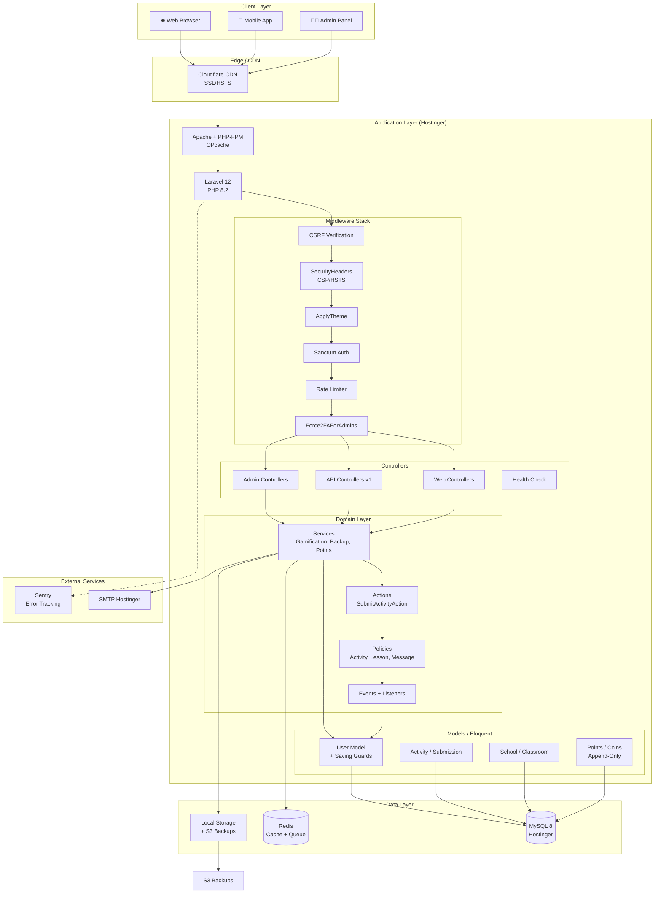
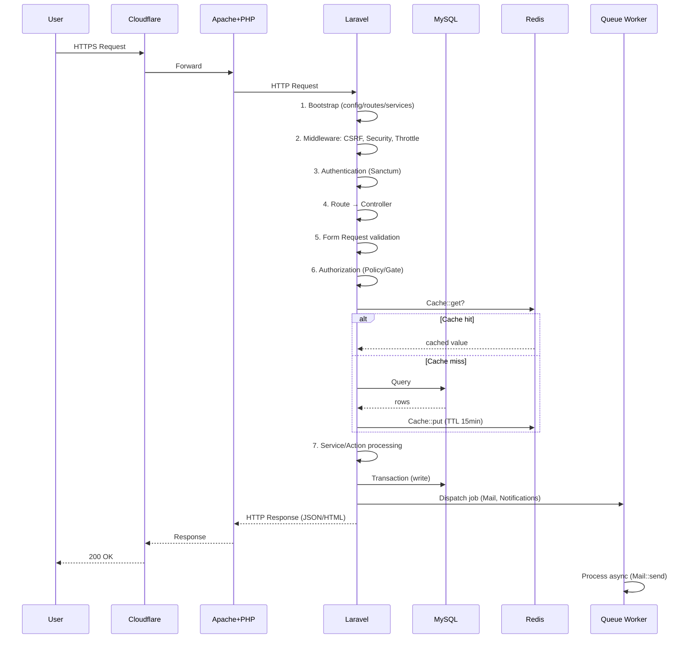
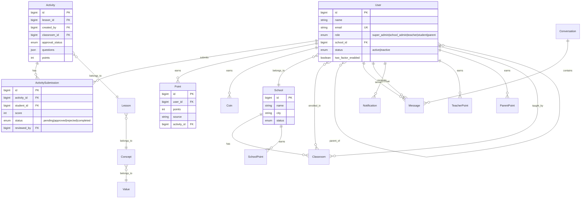
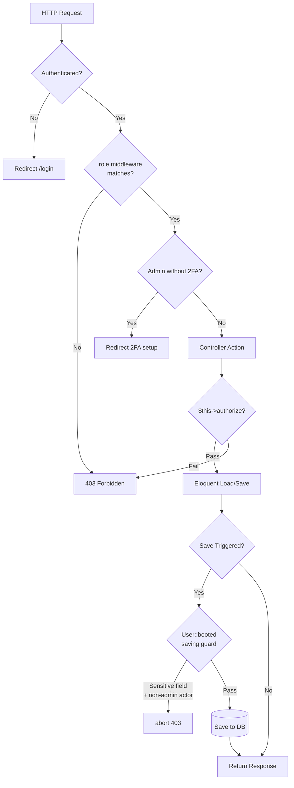
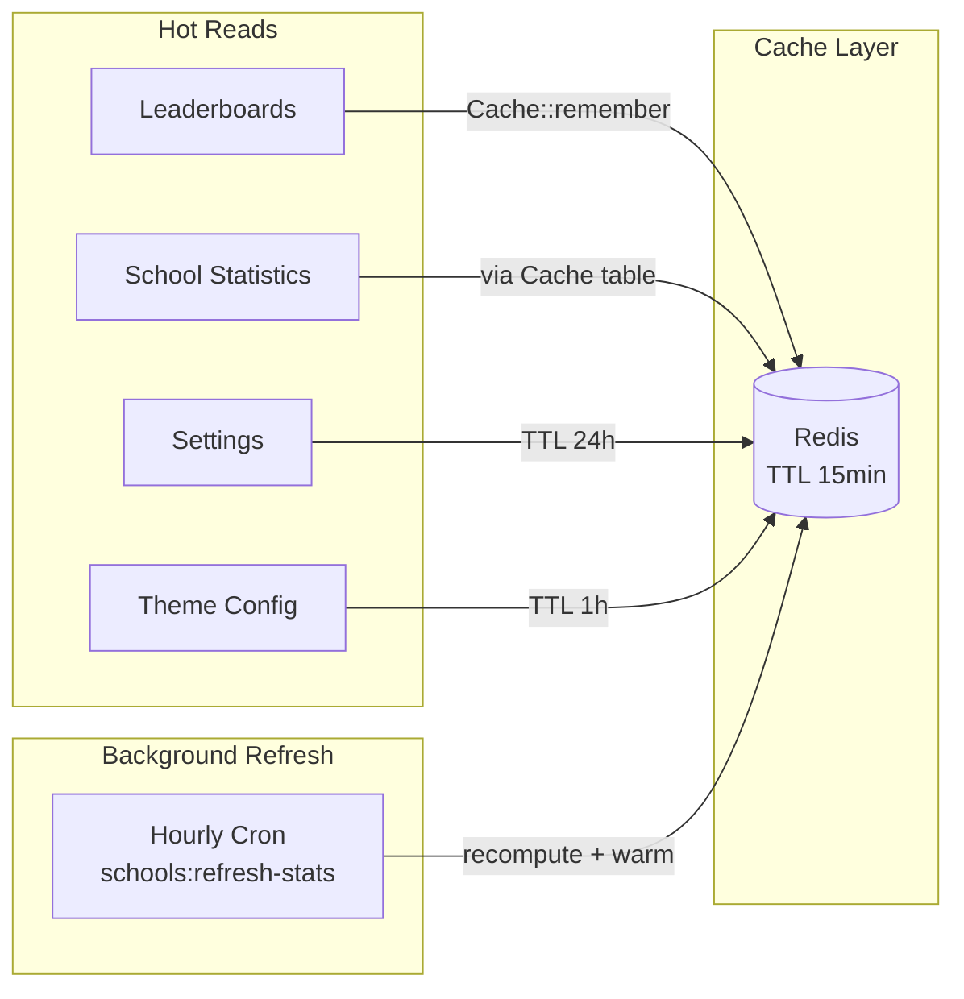
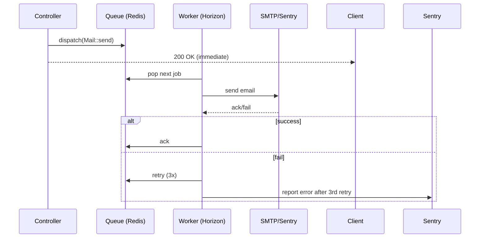
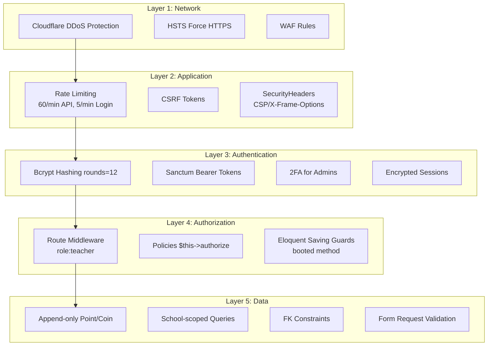

# 🏗️ نظرة عامة على البنية المعمارية — منصة قيمّ

## مكوّنات النظام

## التدفق العام (Request Lifecycle)

## Domain Model (Core Entities)

## Authorization Flow (Policies + Guards)

## Caching Strategy

## Queue Processing (when Redis available)

## Security Layers (Defense in Depth)

