# دستور بناء منصة «وحي / قيمّ» — المخطط الهندسي الشامل
### Master Build Blueprint — Wahy / Qiyam Educational Platform

> **الإصدار:** 1.0 — 30 يونيو 2026  ·  **الحالة:** **مُلزِمة (Binding)**  ·  **النطاق:** كل مَن يكتب أو يدمج أو يُولّد كوداً في هذا المستودع — بشراً كانوا أو وكلاء ذكاء اصطناعي.
>
> **الغرض:** هذه الوثيقة هي **المصدر الوحيد للحقيقة (Single Source of Truth)** اللازم لإعادة بناء منصة «وحي / قيمّ» **بالكامل، بكل خدماتها، وبدون أي مشاكل**. صُمّمت لتمكين الذكاء الاصطناعي من بناء المنصة **متطابقةً** مع الحالة النهائية المُصلَّحة (hardened end-state)، باحترافية وفخامة.
>
> **الأساس التأسيسي:** بُنيت قواعدها على أربع مراجعات تدقيق جنائية مستقلة على المنصة الفعلية (`PLATFORM_AUDIT_REPORT.md` · `ARCHITECTURE_AUDIT_REPORT.md` · `PASS4_CONSOLIDATED_AUDIT.md` · `docs/FUNCTIONAL_INTEGRATION_AUDIT.md`) — أي ما يزيد على **530 خطأً مؤكَّداً** عبر كامل الشيفرة. كل قاعدة هنا تُغلِق عائلة عطل حقيقية وقعت فعلاً.

---

## ⚖️ كيف تُقرأ هذه الوثيقة وتُستخدم

- **القواعد ليست توصيات.** كل بند موسوم بـ«يجب / يُمنع / إلزامي» هو **قابل للقفل والإنفاذ الآلي**؛ أي مخالفة تُرفض في المراجعة.
- **منهجية البناء المُلزَمة:** ابنِ بالترتيب الوارد في «الجزء 13 — خطة البناء وترتيب التكامل». لا تبدأ بميزة قبل اكتمال أساسها.
- **مرجع التقنية:** Laravel 12 · PHP ^8.2 · العربية (RTL) لغةً افتراضية · خمسة أدوار · تعدد مدارس بعزل صارم · اقتصاد نقاط/كوينز عبر بدائيَّي `AwardService`/`SpendService` فوق `award_ledger`.
- **عند أي تعارض** بين جزءٍ تفصيلي وقاعدة في «الجزء 1 — الدستور»، **الدستور هو الفيصل**.

---

## 📜 فهرس المحتويات

0. [0. مقدمة الدستور والهوية والرؤية ونطاق المنصة](#0-مقدمة-الدستور-والهوية-والرؤية-ونطاق-المنصة)
1. [1. الدستور الهندسي الصارم (القواعد المُلزِمة)](#1-الدستور-الهندسي-الصارم-القواعد-الملزمة)
2. [2. حزمة التقنية وهيكل المشروع والإعداد](#2-حزمة-التقنية-وهيكل-المشروع-والإعداد)
3. [3. نموذج البيانات الكامل (المخطط القانوني)](#3-نموذج-البيانات-الكامل-المخطط-القانوني)
4. [4. الأدوار والمصادقة والصلاحيات وعزل المدارس](#4-الأدوار-والمصادقة-والصلاحيات-وعزل-المدارس)
5. [5. خدمات النطاق الأساسية: الاقتصاد والتلعيب والإشعارات](#5-خدمات-النطاق-الأساسية-الاقتصاد-والتلعيب-والإشعارات)
6. [6. خدمات الطالب (تطبيق الطالب كاملاً)](#6-خدمات-الطالب-تطبيق-الطالب-كاملا)
7. [7. خدمات المعلم](#7-خدمات-المعلم)
8. [8. خدمات ولي الأمر](#8-خدمات-ولي-الأمر)
9. [9. خدمات مدير المدرسة والسوبر أدمن ولوحة الإدارة](#9-خدمات-مدير-المدرسة-والسوبر-أدمن-ولوحة-الإدارة)
10. [10. إدارة المحتوى (CMS/Page Builder) والإعدادات وSEO](#10-إدارة-المحتوى-cmspage-builder-والإعدادات-وseo)
11. [11. نظام التصميم والواجهات الفاخرة (RTL)](#11-نظام-التصميم-والواجهات-الفاخرة-rtl)
12. [12. التكاملات والبنية التحتية والوسائط والنسخ الاحتياطي](#12-التكاملات-والبنية-التحتية-والوسائط-والنسخ-الاحتياطي)
13. [13. خطة البناء وترتيب التكامل وبوابات الجودة ومعايير القبول](#13-خطة-البناء-وترتيب-التكامل-وبوابات-الجودة-ومعايير-القبول)
14. [14. المتحكّمات والمسارات المشتركة عبر الأدوار (الطبقة المُكمِّلة)](#14-المتحكمات-والمسارات-المشتركة-عبر-الأدوار-الطبقة-المكملة)

---

## 0. مقدمة الدستور والهوية والرؤية ونطاق المنصة

### 🗺️ المخططات المعمارية (Architecture Diagrams)

#### 🗺️ خريطة الأدوار × مجموعات المسارات × المتحكّمات

يربط المخطط الأدوار الخمسة + طبقة المشتركة + الجوال ببادئات مساراتها الفعلية في `routes/web.php`/`routes/api.php` ومتحكّماتها الأساسية، مع وسيطات الحماية (role + school.access).

```mermaid
flowchart TD
  subgraph SUP["super_admin"]
    SUP_R["/super-admin · /admin<br/>role:super_admin · can:access-admin"]
    SUP_C["SuperAdminController + DashboardController"]
    SUP_A["Admin/* (21 ctrls)<br/>MessagesLog · Reports · Shop · PvP ..."]
    SUP_R --> SUP_C
    SUP_R --> SUP_A
  end
  subgraph SCH["school_admin"]
    SCH_R["/school-admin<br/>role:school_admin · school.access"]
    SCH_C["SchoolAdminController"]
    SCH_R --> SCH_C
  end
  subgraph TEA["teacher"]
    TEA_R["/teacher<br/>role:teacher · school.access"]
    TEA_C["TeacherController"]
    TEA_R --> TEA_C
  end
  subgraph PAR["parent"]
    PAR_R["/parent<br/>role:parent · school.access"]
    PAR_C["ParentController + ParentDashboardController"]
    PAR_R --> PAR_C
  end
  subgraph STU["student"]
    STU_R["/student<br/>role:student · school.access"]
    STU_C["StudentController"]
    STU_R --> STU_C
  end
  subgraph SHR["SHARED · auth"]
    SHR_R["/leaderboard · /messages<br/>/notifications · /profile"]
    SHR_C["Leaderboard · Messages<br/>Notification · ProfileController"]
    SHR_R --> SHR_C
  end
  subgraph MOB["mobile · /api/v1"]
    MOB_R["/api/v1<br/>auth:sanctum · role:student"]
    MOB_C["Api/AuthApiController<br/>Api/StudentApiController"]
    MOB_R --> MOB_C
  end
```

> **للبانِي (AI):** ابنِ كل مجموعة مسارات داخل `Route::prefix(...)->middleware([...])` بنفس وسائط الحماية الظاهرة (role + school.access) — فهي بوابة العزل بين المستأجرين؛ ابدأ بطبقة SHARED (تتطلّب `auth` فقط) ثم الأدوار، وأخيرًا `/api/v1` عبر حارس `auth:sanctum` منفصلًا عن جلسات الويب.

### 0.1 ديباجة الدستور — مصدر الحقيقة الوحيد المُلزِم

هذه الوثيقة هي **المخطط الرئيسي المُلزِم لإعادة بناء منصة «وحي / Wahy»** (الاسم التجاري المعروض للمستخدم: **«قِيَمّ»**) بالكامل — منصة تعليمية عربية (RTL) قائمة على القيم وعلى التلعيب (Gamification)، مبنية على **Laravel 12 / PHP 8.2**.

> **الحالة (Binding Status):** هذه الوثيقة هي **مصدر الحقيقة الوحيد (Single Source of Truth)** لإعادة بناء المنصة. كل قاعدة فيها **مُلزِمة وقابلة للإنفاذ (enforceable)**. أي وكيل ذكاء اصطناعي يبني أو يدمج كوداً من هذه الوثيقة **مُلزَم بها تماماً كما يُلزَم البشر** — لا اجتهاد يكسر ثابتاً، ولا «رؤية جزئية» تخالف نطاق الجزء.

المبادئ الحاكمة للديباجة:

1. **القواعد ليست توصيات.** كل بند مكتوب بصيغة «**يجب (MUST)**» / «**يُمنع (MUST NOT)**» / «**إلزامي**» هو قيد هندسي قابل للقفل، لا اقتراح. أي PR يكسر قاعدة يُرفض في المراجعة.
2. **البناء من جزء واحد قائم بذاته.** كل جزء من هذا الدستور مكتوب ليكون **شاملاً ومكتفياً ذاتياً**؛ يجب أن يستطيع وكيل البناء تنفيذ القسم من نصّه وحده دون افتراضات خارجية. ما لم يُذكر صراحةً ضمن هذا الدستور **يُمنع اختراعه**.
3. **هذه الوثيقة استباقية ومبنية على دروس حوادث حقيقية.** قواعدها مُستخلَصة من **أربع مراجعات تدقيق فعلية** على الكود (معماري / منصّي / أمن-Pass4 / تكامل وظيفي) كشفت: **75 خطأ منصّي مؤكَّد** (6 حرجة)، **88 بند دَيْن معماري** في ~6 جذور، **368 خطأ أمن/صحّة** في 13 عنقوداً، و**3 كاسرات وظيفية + ~19 خللاً جوهرياً** عبر 422 مساراً. الهدف: **منع تكرار كل جذر عطل** عند إعادة البناء.
4. **«قيمّ» هو الاسم المعروض؛ «وحي / Wahy» هو اسم المنصة/المستودع.** كلاهما يشير إلى المنصة نفسها. يُمنع الخلط بينها وبين أي منصة أخرى.

> **تنبيه نطاق صارم:** أي وثيقة مرجعية بُنيت لمنصة أخرى (مثل «وريد / Wareed» — منصة متاجر إلكترونية مختلفة تماماً) تُستخدم **للنبرة فقط**. **يُمنع منعاً باتاً** نقل خدماتها أو جداولها أو نطاقها (متاجر، Leads/CRM، اشتراكات، SEO تجاري) إلى «وحي». «وحي» منصة **تعليمية قِيَمية** حصراً.

---

### 0.2 الهوية والرؤية — ما هي «وحي / قِيَمّ»

**«قِيَمّ»** منصة تعليمية عربية الأولوية (Arabic-first، RTL كامل) ذات طابع إسلامي/تربوي، غايتها **غرس القيم لدى الطلاب عبر رحلة تعلّم مُلعَّبة (Gamified)**. تُحوِّل اكتساب القيم إلى رحلة تقدّم محفّزة قائمة على نقاط (XP) وعملات (Coins) وسلاسل التزام (Streaks) وأوسمة (Badges) وتيجان قِيَم (Crowns) ومنافسات (Leaderboard / Teams / PvP).

#### الهوية البصرية والثوابت العربية (مُلزِمة)

| العنصر | القيمة الافتراضية المُلزِمة | المصدر |
|---|---|---|
| الاسم المعروض الافتراضي | `قيمّ` | `setting('site_name')` |
| اللون الأساسي | `#667eea` | `primary_color` |
| اللون الثانوي | `#764ba2` | `secondary_color` |
| لون النص | `#1e293b` | `text_color` |
| لون الخلفية | `#ffffff` | `background_color` |
| الخط | `IBM Plex Sans Arabic` | `font_family` |
| الثيم الافتراضي | `light` | `site_theme` |
| اللغة | `ar` (locale + fallback) | `config/app.php` |
| المنطقة الزمنية | `Asia/Riyadh` | `config/app.php` |
| Faker locale | `ar_SA` | `config/app.php` |

> **يجب** ضبط `App::setLocale('ar')` و`Carbon::setLocale('ar')` عالمياً في `AppServiceProvider::boot` لتُعرَض `diffForHumans`/أسماء الأيام/الشهور بالعربية في كل مكان. **يُمنع** ترميز («hardcode») الاسم أو اللون أو الخط أو الشعار في أي تخطيط (Layout)؛ كلها تُقرأ من `settings` عبر مصدر واحد (`branding` المُشارَك عالمياً + Partial الهوية).

#### الرؤية المُلزِمة للمخرَج

كل واجهة تُسلَّم **يجب** أن تكون **عربية RTL سليمة، فاخرة (Glassmorphism / تدرّجات / حركة ناعمة)، متجاوبة على الموبايل بالكامل، خالية من الأعطال**. الفخامة وصحّة التكامل **شرط قبول لا تحسين لاحق**. الفيصل هو المخرَج النهائي للمستخدم — لا تكتمل مهمة بمجرد الحفظ في الجداول.

---

### 0.3 الأدوار الخمسة (The Five Roles) — تعريف مُلزِم

النظام يحوي **خمسة أدوار حصراً**. الدور عمود نصّي (`string`) على جدول `users` (يُقارَن مباشرةً، وعبر `App\Enums\UserRole` في الـ middleware)، ويدعم تبديل الأدوار للمستخدمين متعددي الأدوار عبر `session('active_role_'.$id)` ثم `active_role` ثم `role`.

| الدور (key) | البوابة (URL prefix) | الوصف ونطاق المسؤولية |
|---|---|---|
| **`super_admin`** | `/admin` (عبر Gate `access-admin`) | الصلاحية المطلقة على المنصة. `Gate::before` يمنحه **كل** القدرات. يدير: كل الكيانات (مستخدمون/مدارس/معلّمون/طلاب/أولياء أمور/قيم/مفاهيم/دروس/أنشطة/استبيانات/متجر/صفحات Page Builder/مستويات تعليمية)، طابور اعتماد الأنشطة وبنك الأسئلة، التقارير والتحليلات (Excel/PDF)، سجل رسائل كل المستخدمين، الثيم والإعدادات والـ Landing/Page Builder، وأدوات النظام (نسخ احتياطي، سجل التدقيق، المستخدمون المتصلون، استيراد/تصدير Excel). **غير مُقيَّد بمدرسة.** |
| **`school_admin`** | `/school-admin` | مدير المدرسة. كل قراءة/كتابة **مُقيَّدة بمدرسته** (`Auth::user()->school_id`). يدير: CRUD للمعلّمين/الطلاب/أولياء الأمور، CRUD للفصول مع ربط الطلاب والمعلّمين، اعتماد/رفض طلبات التسجيل، روابط التسجيل العام + رموز QR، استيراد/تصدير Excel، صفحة إحصاءات وترتيب متعددة النطاقات، تحليلات مشاركة أولياء الأمور، مقارنات استبيانات قبلي/بعدي، وإعدادات المدرسة. **لا يدخل لوحة `/admin`.** |
| **`teacher`** | `/teacher` | المعلّم داخل مدرسته (`role:teacher` + `school.access`). يدير: لوحة بإحصاءات مشاركة، مراجعة/تصحيح تسليمات الطلاب (الاعتماد ⇒ منح XP+Coins عبر `AwardService`، idempotent)، بنك أنشطة وبنك أسئلة، إدارة الفصول والطلاب وتقاريرهم (PDF/HTML)، الفِرق (CRUD) وتعيين/تصحيح أنشطة الفريق، رسائل ولي الأمر↔المعلّم (XSS-safe)، لوحات الترتيب، التقييمات المُستلَمة، مقارنات الاستبيانات، تمارين الممارسة، وإعدادات سلسلة المكافآت. كل مساراته **مُقيَّدة بمدرسته/فصوله/طلابه**. |
| **`parent`** | `/parent` | ولي الأمر (`role:parent` + `school.access`). يراقب تقدّم كل طفل مرتبط (نقاط/دروس/سلسلة/أوسمة/ترتيب/رسوم بيانية 30 يوماً/أداء قيمة-بقيمة)، يقارن مدرسة طفله بكل المدارس، يراجع/يعتمد أنشطة الأسرة (منح نقاط idempotent عند الاعتماد؛ الرفض لا يمنح شيئاً)، يرسل مديحاً وهدايا تُضاف لاقتصاد الطفل **مرّة واحدة بالضبط** ضمن سقوف يومية، يراسل معلّمي الطفل، ويرى مقارنات الاستبيانات لأطفاله. كل إجراء طفل-المحور **يُعيد التحقق من ملكية pivot `parent_student`** قبل أي تنفيذ. |
| **`student`** | `/student` (+ API موبايل) | الطالب — المتعلّم المُلعَّب. تطبيق ويب «student-app» موحّد بشريط حالة دائم (Avatar/المستوى/شريط XP/السلسلة/العملات/الإشعارات) وشريط سفلي (تعلّم/المسار/تمارين/رسائل/الملف). يستهلك منهج القيم (Value → Concept → Lesson → Activity) داخل اقتصاد (XP + Coins) وتقدّم (سلاسل/أوسمة/تيجان) ومنافسة (Leaderboard/Teams/PvP/تمارين). كل المحتوى **مُقيَّد بمدرسة الطالب** عبر `Value::visibleForSchool`. مرآة REST مُصدَّقة بـ Sanctum تخدم تطبيقاً أصلياً (Native App). |

> **قاعدة الأدوار المُلزِمة:** `CheckRole` **يجب** أولاً أن يتحقق من `user->status === 'active'` (المستخدم غير النشط يُسجَّل خروجه وتُبطَل جلسته). الـ middleware يبوّب الطالب فقط؛ **يجب** على كل Action يستهدف كائناً أن **يُعيد التحقق من ملكية الكائن** لمدرسة/فصل/أطفال الفاعل. `exists:users,id` يتحقق من الوجود لا الملكية، و**يُمنع** استخدامه كفحص تفويض.

---

### 0.4 ركائز المنتج (Product Pillars) — مُلزِمة

| # | الركيزة | الوصف المُلزِم |
|---|---|---|
| 1 | **تعدّد المدارس (Multi-School Tenancy)** | عزل صارم لكل مدرسة عبر `school_id`. `super_admin` غير مُقيَّد؛ بقية الأدوار محصورة بمدرستها. **يجب** أن يُفلتر كل id أجنبي مُرسَل (member_ids، leader_id، classroom ids، teacher_id) ضد نطاق مدرسة الفاعل **قبل** الإدراج/الربط — لا إدراج لـ ids خام من الطلب. منع IDOR عبر المدارس قاعدة أمنية قصوى. |
| 2 | **اقتصاد النقاط والعملات (Gamified Points/Coins)** | دفترَا قيد (Ledger) **يُلحَق إليهما فقط**: نقاط `points` (XP) وعملات `coins`. الرصيد **دائماً** = `SUM` على الدفتر (لا عمود رصيد مُجمَّد حيّ). المستوى `level = intdiv(SUM(points)/100)+1`. كل **منح** يمرّ عبر `AwardService::award` (ذرّي + idempotent عبر `award_ledger` UNIQUE(user_id, source_type, source_id))، وكل **خصم** عبر `SpendService::spend` (قفل صف + تسعير من الخادم + لا سحب على المكشوف + idempotent). توزيع نسب ثابتة على المعلّم/ولي الأمر/المدرسة داخل **نفس** المعاملة. |
| 3 | **هرم المحتوى (Concepts → Lessons → Activities)** | شجرة المحتوى: **Value → Concept → Lesson → Activity**. الطالب يسير في مسار تعلّم، يفتح دروساً، ويسلّم أنشطة بأنواع متعددة (`quiz, exercise, project, creative, image_order, homework, practice`). الاكتمال يُقاس بـ `whereIn('status', ActivitySubmission::DONE_STATUSES)` متّسقاً في كل لوحة/تقرير/تصدير. |
| 4 | **الاستبيانات وتقييم القيم (Surveys & Values Assessment)** | استبيانات قبلي/بعدي (Pre/Post) مع تحليلات مقارنة، وتقييم قيمة-بقيمة. مفاتيح أسئلة ما-بعد **يجب** أن تُقارَن بإجابات ما-بعد (لا اختلاط بمفاتيح قبلي). |
| 5 | **الرسائل والفِرق والمنافسة (Messaging / Teams / PvP)** | مراسلة 1:1 (محادثة واحدة لكل زوج)، رسائل جَماعية مُقيَّدة بالصلاحية والمدرسة، فِرق، ومنازلات PvP. كل HTML من المستخدم **يُنقّى بقائمة سماح (Allowlist purifier)** على الإدخال، ويُعرَض عبر `textContent`/`DOMPurify` لا `innerHTML`. فاصل تعادل فائز PvP من الخادم لا من إدخال العميل. |
| 6 | **لوحة إدارة محتوى كاملة (Full Admin CMS)** | مخزن إعدادات key/value (هوية/ألوان/خطوط/تواصل/روابط اجتماعية/أعلام ميزات/وضع صيانة)، Page Builder (مخطط JSON يرسم صفحات عامة بالـ slug)، محرّر Landing مع لقطات نسخية، ونموذج تواصل عام. **يجب** أن تُستهلَك فعلياً كل إعداد مُحفَّظ (لا إعدادات ميتة يحرّرها الأدمن بلا أثر). |
| 7 | **API موبايل (Mobile API)** | `/api/v1/*` مُصدَّق بـ Sanctum، يعكس مجموعة فرعية للطالب (لوحة، شجرة قيم، أنشطة، أوسمة، ترتيب) + مصادقة (دخول/2FA/خروج/ملف/تغيير كلمة مرور). **يجب** أن يلتزم بنفس المعرّفات الحقيقية للأعمدة/العلاقات وأن يلفّ كل Action بـ try/catch يُرجع JSON عاماً (لا تسريب استثناءات خام). |

---

### 0.5 نظرة معمارية عُليا (High-Level Architecture)

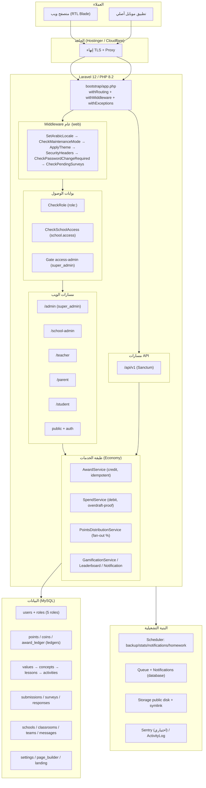

**ملخص طبقي مُلزِم:** التوجيه يُسجَّل في `bootstrap/app.php` عبر `withRouting(web, api, apiPrefix:'api', commands, health:'/up')`. `bootstrap/providers.php` يسجّل **مزوّدين اثنين فقط**: `AppServiceProvider` و`AuthServiceProvider`. الدوال المساعدة العامة تُحمَّل عبر `composer autoload.files` لا عبر مزوّد. الاقتصاد **دفتري فقط** والرصيد دائماً `SUM`.

---

### 0.6 مسرد المصطلحات (Glossary)

| المصطلح | التعريف المُلزِم |
|---|---|
| **Value (قيمة)** | جذر شجرة المحتوى. حقولها الصحيحة: `name` (لا `title`)، `icon` (لا `emoji`). تُفعَّل لكل مدرسة عبر `Value::visibleForSchool`. |
| **Concept (مفهوم)** | ابن القيمة (`concept->value`، لا `concept->meaning->value`؛ علاقة meanings **مُزالة**). |
| **Lesson (درس)** | ابن المفهوم؛ يحوي محتوى/وسائط. سلاسل العلاقات فوق FK قابلة لـ null **يجب** أن تستخدم `?->`. |
| **Activity (نشاط)** | ابن الدرس؛ أنواعه: `quiz, exercise, project, creative, image_order, homework, practice`. |
| **ActivitySubmission (تسليم)** | سجل تسليم الطالب. الاكتمال = `whereIn('status', DONE_STATUSES)`. إعادة التصحيح/التسليم لما اعتُمد **لا تُعيد المنح**. |
| **points / XP (نقاط)** | دفتر قيد يُلحَق إليه فقط. الرصيد = `SUM(points)`. |
| **coins (عملات)** | دفتر قيد يُلحَق إليه فقط. الرصيد = `SUM(coins)`. تُنفَق في المتجر. |
| **award_ledger** | جدول idempotency للمنح: `UNIQUE(user_id, source_type, source_id)` يجعل المنح المزدوج مستحيلاً بنيوياً (`insertOrIgnore`). |
| **level (مستوى)** | `intdiv(SUM(points)/100)+1`. **مصدر واحد** عبر accessor؛ يُمنع نسخه في 8 أماكن. |
| **Streak (سلسلة)** | سلسلة التزام يومية/درسية/نشاطية مع مطالبات مكافأة. علاقة المفرد `streak()`. |
| **Badge (وسام)** | يُمنح بأهلية محسوبة عبر مستمعي الأحداث (`CheckBadgeEligibility`). |
| **Crown (تاج قيمة)** | تتويج إتقان قيمة. |
| **Coin Shop (المتجر)** | يُنفَق فيه العملات؛ التسعير **من الخادم** (يُمنع الوثوق بـ `cost` من العميل)؛ التوافر/المخزون يُعاد فحصه داخل المعاملة المقفولة. |
| **PvP** | منازلة طالب-طالب؛ الفائز والتعادل من الخادم؛ `time_taken` من العميل **لا يُوثَق به**. |
| **Survey (استبيان)** | قبلي/بعدي مع مقارنة. `survey_responses.user_id` يقبل null للضيوف. |
| **Tenancy (تعدّد المدارس)** | عزل عبر `school_id`. `CheckSchoolAccess`: super_admin يتجاوز؛ بلا `school_id` ⇒ 403؛ `{school}`/input مخالف ⇒ 403. |
| **branding** | مصفوفة هوية مُشارَكة عبر `View::share('branding', ...)` في **كل** طلب ويب؛ تحوي اسم/شعار/ألوان/خط/روابط اجتماعية. |
| **setting() / set_setting() / social_links()** | دوال مساعدة عامة (composer `autoload.files`)؛ مخزن `Setting` key/value مع `Cache::remember` 86400s. |
| **AwardService / SpendService** | بدائية الاقتصاد الذرّية: منح (credit) idempotent، وخصم (debit) ضد السحب على المكشوف. |
| **PointsDistributionService** | يوزّع نسباً ثابتة من نقاط الطالب على المعلّم/ولي الأمر/المدرسة (مثل PARENT_PERCENTAGE 5%) داخل نفس المعاملة. |
| **NotificationService** | إنشاء إشعارات؛ **يجب** تمرير رابط الإجراء في معامل `action_url` لا في مصفوفة `$data`. |
| **media_url** | محوّل URL **واحد** للوسائط: المسار النسبي P يُخدَم بـ `asset('storage/data/'.P)` (القرص العام جذره `storage/app/public/data` مع symlink `public/storage`). البدائل خاطئة وممنوعة. |
| **DONE_STATUSES** | مفردات الحالات «منجَز/معتمَد» الموحّدة على `ActivitySubmission`. |
| **safe_html() / Allowlist Purifier** | منقّي XSS بقائمة سماح (HTMLPurifier/mews/purifier)؛ يُمنع المنقّي بقائمة حظر (Blocklist) القابل للتجاوز. |
| **CSV/Excel Injection guard** | كل خلية تبدأ بـ `= + - @` تُحيَّد (إضافة `'`/tab) في كل تصدير. |

---

### معايير القبول (Acceptance Criteria)

- [ ] الوثيقة تُعلن نفسها صراحةً مصدر الحقيقة الوحيد المُلزِم، وتربط الإلزام البشري بإلزام وكلاء الذكاء الاصطناعي بصيغة «يجب/يُمنع».
- [ ] الهوية مُعرَّفة (الاسم `قيمّ`، عربية RTL، locale `ar`، timezone `Asia/Riyadh`) مع جدول القيم الافتراضية للهوية/الثيم.
- [ ] الأدوار الخمسة (`super_admin, school_admin, teacher, parent, student`) مُعرَّفة بدقّة مع بوابة كل دور ونطاق مسؤوليته وقيد العزل.
- [ ] الركائز السبع موثّقة، وكل ركيزة تحمل قاعدتها المُلزِمة الجوهرية (دفتر/idempotency للاقتصاد، عزل tenancy، اتّساق DONE_STATUSES، Allowlist للـ XSS).
- [ ] يوجد مخطط معماري عُلوي (mermaid) يُظهر: الحافة → bootstrap → middleware → بوابات → مسارات الأدوار + API → طبقة الخدمات → البيانات → البنية التشغيلية.
- [ ] مسرد المصطلحات يغطّي كل مصطلح نطاقي مفتاحي بمعرّفاته الإنجليزية الصحيحة (value→name، concept→value، award_ledger، level، media_url، DONE_STATUSES…).
- [ ] لا يُنقَل أي مصطلح/خدمة من منصة «وريد» أو أي منصة أخرى؛ النطاق تعليمي-قِيَمي حصراً.
- [ ] كل المعرّفات التقنية بالإنجليزية كما في الكود، والقواعد بصيغة مُلزِمة عربية رسمية، وينتهي القسم بمعايير قبول قابلة للاختبار.

---

## 1. الدستور الهندسي الصارم (القواعد المُلزِمة)

> **الحالة:** هذه الوثيقة **مُلزِمة** لكل مَن يكتب أو يدمج أو يُولّد كوداً في مستودع منصة **«وحي / قيمّ» (Wahy)** — بشراً كانوا أو وكلاء ذكاء اصطناعي. القواعد ليست توصيات؛ كل قاعدة **قابلة للقفل والإنفاذ الآلي (enforceable)**، وأي `PR` يكسر قاعدة منها **يُرفض في المراجعة**.
>
> **المصدر التأسيسي:** بُنيت هذه القواعد استباقياً على دروس مستفادة من **أربع مراجعات تدقيق جنائية مستقلة** على المنصة: `PLATFORM_AUDIT_REPORT.md` (75 خطأً مؤكَّداً، 6 حرجة)، `ARCHITECTURE_AUDIT_REPORT.md` (88 مشكلة دَيْن معماري في ~6 جذور)، `PASS4_CONSOLIDATED_AUDIT.md` (368 ثغرة في 13 عنقوداً جذرياً)، و`docs/FUNCTIONAL_INTEGRATION_AUDIT.md` (تتبّع 422/422 مساراً)، إضافةً إلى عمود المعالجة `docs/REPAIR_PLAN.md`. كل قاعدة هنا تُغلِق عائلة عطل حقيقية تسبّبت بحادثة Critical/Blocker فعلية. الهدف: أن يُعيد وكيل الذكاء الاصطناعي بناء أي منظومة فرعية فيصل إلى **الحالة النهائية المُصلَّحة (hardened end-state)** دون إعادة إدخال أيٍّ من تلك العائلات.

> **المنصة بإيجاز مُلزِم:** Laravel 12 على الهيكل النحيف (slim skeleton: لا `app/Http/Kernel.php`)، PHP `^8.2`، لغة مثبّتة على العربية (`ar`)، توقيت `Asia/Riyadh`، خمسة أدوار فقط (`super_admin, school_admin, teacher, student, parent`)، تعدد مدارس (Multi-school tenancy) جذره `schools` ومفتاحه `users.school_id`، واقتصاد نقاط/كوينز/مستويات يمرّ حصراً عبر `AwardService`/`SpendService` فوق دفتر `award_ledger`. **حالة مجمّدة (Frozen):** إصلاحات الاقتصاد (Batch 2)، عزل المستأجرين/الفِرق (Batch 3)، وتصلّب المصادقة (Batch 4, cluster 06) **مُجمّدة** — يجب إعادة إنتاج حالتها المُصلَّحة لا حالة ما قبل الإصلاح.

---

### §0 الهوية والنطاق — ما هي وحي / قيمّ

«وحي / قيمّ» منصة تعليمية تربوية احترافية لغرس **القيم** عبر مسارات تعلّم مُلعّبة (Gamified) متعددة الأدوار والمدارس. ركائزها المُلزِمة:

| # | الركيزة | المخرج |
|---|---------|--------|
| 1 | منظومة أدوار خماسية بعزل مدرسي صارم | كل غير-`super_admin` ينتمي لمدرسة واحدة عبر `school_id` |
| 2 | اقتصاد نقاط/كوينز/مستويات بدائيّ أحادي المصدر | كل حركة مالية تمرّ عبر `AwardService`/`SpendService` فوق `award_ledger` |
| 3 | لوحات تحكّم لكل دور + CMS/Page Builder + SEO ديناميكي | تعديل المحتوى والثيم والهوية من اللوحة دون لمس الكود |
| 4 | منظومة اجتماعية: رسائل، فِرق، PvP، استبيانات، أنشطة عائلية | بعزل مدرسي وملكية كائنات في كل مسار |
| 5 | API محمول (Sanctum) تحت `/api/v1` | مرآة سلوكية دقيقة لمسارات الويب (2FA، اقتصاد، صلاحيات) |
| 6 | واجهات فاخرة (RTL-first، عربية، متجاوبة) | الفخامة شرط قبول لا تحسين لاحق |

---

### §1 نطاق «المسارات الحسّاسة» (تعريف مُلزِم)

القواعد المشدّدة في هذا الدستور تنطبق على أي كود يقرأ أو يكتب الجداول/المجالات التالية:

| المجال | الجداول / المكوّنات |
|--------|----------------------|
| **الاقتصاد (Economy)** | `points`, `coins`, `award_ledger`, `teacher_points`, `parent_points`, `school_points`, `shop_items`, `user_purchases`, `user_items`, `badges`, `user_badges`, `crowns`, `streaks`, `activity_user_streaks`, `lesson_user_streaks` |
| **عزل المدارس (Tenancy)** | `schools`, `users.school_id`, `classrooms`, `classroom_student`, `teams`, `team_members`, `bulk_messages`, `school_active_values` — عزل بيانات المدارس **مسؤولية أمنية قصوى** |
| **الهوية والصلاحيات (Auth/Authz)** | `users`, `registration_requests`, `password_reset_tokens`, جداول `spatie`, جلسات الأدمن، 2FA |
| **نشر المحتوى والـ SEO (Content/CMS)** | `settings`, `landing_content`, `landing_content_versions`, `page_builder`, `contact_messages` |
| **الوسائط الخاصّة (Private Media)** | ملفات تسليمات الطلاب، صور الدردشة، صور الأنشطة العائلية |

> **مبدأ مُلزِم:** **العزل بين المدارس أخطر من الاقتصاد.** تسريب بيانات طالب/معلّم/فصل من مدرسة لأخرى **حادثة أمنية حرجة**. كل استعلام على بيانات مستأجر يجب أن يُعاد فلترته إلى نطاق الفاعل قبل أي `attach/sync/insert`. **يُمنع** الاعتماد على `exists:users,id` كإثبات ملكية — فهو يثبت وجود الصف لا انتماءه.

---

### §2 قانون الحُرّاس الآلية (Automated Guardrails / CI Gates)

| القاعدة | الإجراء الصارم |
|---------|----------------|
| **التنسيق** | **يجب** أن يجتاز كل كود `composer lint` (`pint --test`) عبر `pint.json`. التنسيق غير قابل للتفاوض. |
| **التحليل الساكن** | **يجب** أن يجتاز كل كود **جديد** `composer analyse` (Larastan/PHPStan **المستوى 5** عبر `phpstan.neon`). `phpstan-baseline.neon` يُجمّد الدَّيْن القديم (391 خطأ)؛ **يُمنع** إضافة أخطاء جديدة للـ baseline. `app/Livewire` مُستثنى (الحزمة غير مثبّتة). |
| **الاختبارات** | **يجب** أن يجتاز كل كود `composer test` (PHPUnit/Pest). أي مسار حسّاس (§1) **لا يُدمج دون اختبار** على قاعدة حقيقية يُثبت صحة العملية وتعامُلها مع الحالات الشاذة (Feature/Integration). |
| **الإصلاح الموجَّه بالاختبار** | أي bug إنتاجي → **يُكتب أولاً اختبار يفشل بسببه**، ثم كود الإصلاح ليجتازه. لا إصلاح بدون حارس يمنع تكراره. |
| **حُرّاس التراجع المُلزَمة** | بعد أي تعديل على `TeacherController.php` أو مسار اقتصاد/عزل **يجب** تشغيل `EconomyIdempotencyTest` (إعادة تصحيح ⟶ لا منح مزدوج) و`CrossTenantTest` (كائن أجنبي ⟶ 403). `routes/web.php` و`TeacherController.php` ملفّا تصادم عالٍ (MUTEX). |
| **الرفض الآلي** | **يُمنع** `--no-verify` أو تجاوز أي فحص أو hook بأي شكل. `PR` يفشل في CI لا يُدمج ولا يُراجع حتى يخضرّ كاملاً. |

> **مبدأ تأسيسي:** ثلاث ثغرات 500 قاتلة شُحِنت في الـ Mobile API من **صفر تغطية اختبارية**. لذلك: **يجب** تغطية كل نقطة نهاية API باختبار 200+schema. خطأ معرّف (identifier) واحد يُشحَن كـ fatal بلا اختبار يحرسه.

---

### §3 سلامة الاقتصاد (Economy Integrity)

البدائيّ الوحيد المسموح لتحريك أي نقطة/كوين/XP. هذه أخطر منظومة في المنصة لأنها مُلِئت يدوياً وغير idempotent في الماضي.

#### §3.1 البدائيّان الوحيدان

```php
// CREDIT — البدائيّ الوحيد للإيداع (نقاط/كوينز). يملك معاملته بنفسه.
AwardService::award(
    int $userId, string $sourceType, string $sourceId,
    int $points = 0, int $coins = 0, ?string $description = null, bool $distribute = false
): bool;  // true = منح جديد ، false = لا-عملية (مكرّر) — لا يكتب شيئاً

// DEBIT — البدائيّ الوحيد للخصم (كوينز). آمن ضد السحب على المكشوف.
SpendService::spend(
    int $userId, string $sourceType, string $sourceId,
    int $cost, ?string $description = null
): array;  // {success, reason, balance, duplicate}
```

| القاعدة | الإلزام |
|---------|---------|
| **القناة الوحيدة** | **يجب** أن تمرّ **كل** حركة نقاط/XP/كوينز عبر `AwardService::award` (إيداع) أو `SpendService::spend` (خصم). **يُمنع** أي `Point::create`/`Coin::create` مباشر خارجهما في كود الإنتاج. |
| **مفتاح Idempotency** | **إلزامي**: `(user_id, source_type, source_id)`، يُطالَب عبر `insertOrIgnore` ضد فهرس `UNIQUE` على `award_ledger`. منح مكرّر **يجب** أن يكون لا-عملية صامتة تُرجِع `false`. `source_id` **يجب** أن يكون المفتاح الأساسي المستقر للنطاق (مثل `(string)$submission->id`)، **لا** `child_id+date`. |
| **ضمان قاعدة البيانات** | **يجب** وجود `UNIQUE(user_id, source_type, source_id)` باسم `award_ledger_event_unique` على `award_ledger`، و`UNIQUE(student_id, activity_id)` على تسليمات الأنشطة. الأقفال التطبيقية **وحدها غير كافية**. |
| **تسعير من الخادم** | تكلفة `shop redeem/purchase/gift` **يجب** أن تُقرأ من قاعدة البيانات عبر `id` (`ShopItem::findOrFail->price`). **يُمنع** الوثوق بأي قيمة/تكلفة من العميل. |
| **أرضية الرصيد** | **يجب** التحقّق `SUM(coins) >= cost` **داخل** نفس القسم الحرج المقفول قبل أي خصم. الخصم **يُمنع** أن يدفع الرصيد للسالب — يفشل مغلقاً (`insufficient_balance`) دون كتابة. |
| **القفل الصحيح** | `SpendService` **يجب** أن يقفل **صف `users`** (`SELECT ... FOR UPDATE`) كـ mutex لكل مستخدم، **لا** `Coin::...->lockForUpdate()` فوق `SUM` (يقفل مجموعة فارغة على محفظة جديدة — خطأ حقيقي أُصلِح). |
| **الأرصدة محسوبة لا مخزّنة** | رصيد النقاط = `SUM(points.points)`؛ رصيد الكوينز = `SUM(coins.coins)`. `users.total_points/weekly_points/monthly_points` أعمدة **ميتة (DEAD)** — **يُمنع** قراءتها كمصدر للرصيد أو المستوى. (`schools.total_points` استثناء: عدّاد حيّ مُصان.) |
| **المستوى أحادي المصدر** | `level = intdiv(SUM(points), 100) + 1` عبر `User::getLevelAttribute` (يفضّل alias `points_sum_points`). **يُمنع** نسخ الصيغة بمتغيّرات مختلفة عبر 6+ مواضع. |
| **توجيه جداول النقاط** | نقاط المعلّم/ولي الأمر **يجب** أن تُقرأ/تُكتب في `teacher_points(teacher_id)` و`parent_points(parent_id)` — **لا** جدول نقاط الطالب. خلاف ذلك تظهر نتائجهم = 0. |
| **سجلّات إضافة فقط** | `Point` و`Coin` **يجب** أن تُجهِض `abort(403)` على `update/delete` خارج `runningInConsole`. التصحيحات تتم بإضافة صفوف معاوِضة، لا بتعديل التاريخ. |
| **منع الابتلاع الصامت** | **يُمنع** ابتلاع فشل إدراج `Point/Coin` داخل معاملة. فشل المنح **يجب** أن يُرجِع الوحدة كاملة (`rollback`). استخدم `updateOrCreate` مع `DB::raw('points + n')` حيث قد يرمي `UNIQUE`. |
| **توزيع الفان-أوت** | عند منح طالب: معلّم 10% / ولي أمر 5% / مدرسة 2% (كلٌّ `max(1, floor(...))`). داخل معاملة المنح استخدم `distributeWithin()` (يرمي ⟶ rollback)؛ في مسارات ما بعد الـ commit استخدم `distribute()` (lenient). |

> **الجذر المُلزَم تفاديه:** `submitReview`، `submitExercise`، `PointsDistributionService.distribute()`، دفع PvP (`Cache::has/put`)، و`gradeTeamActivity` كانت كلّها تمنح مجدداً على كل نداء. **يُمنع** إعادة إدخال أي مسار منح بلا مطالبة `(user_id, source_type, source_id)` + قفل + فهرس `UNIQUE`.

---

### §4 عزل المدارس وملكية الكائنات (School Isolation & Object Ownership)

| القاعدة | الإلزام |
|---------|---------|
| **`exists:` ليس ملكية** | **يُمنع** اعتبار `exists:users,id` إثبات ملكية. قبل أي `attach/sync/insert` **يجب** إعادة فلترة المعرّفات إلى مدرسة الفاعل ودوره: `User::where('school_id',$school->id)->where('role','student')->whereIn('id',$ids)->pluck('id')` — أَدرِج المُفلتَر فقط، لا الخام. |
| **الفِرق (Teams)** | `storeTeam`/`updateTeam` **يجب** أن يحصرا `leader_id` و`member_ids` على مدرسة المعلّم + `role=student` (+ الفصل مثالياً) قبل إدراج `team_members`، لأن `gradeTeamActivity` يسكّ اقتصاداً في تلك الحسابات. المعرّف الأجنبي **يُرفض (422)** لا يُدرَج. |
| **ملكية الكائن في كل قراءة/كتابة** | `lesson/{id}`, exercise start/submit, `joinPvpMatch`, survey submit, تعيين نشاط, `updateClassroom` **يجب** أن تتحقّق من انتماء الهدف لمدرسة/فصل/أبناء الفاعل. الكشف أو التعديل العابر للمدارس **يجب** أن يردّ 403/404. استخدم Finder مُنطّق قابل لإعادة الاستخدام (`studentsInMySchool(id)`, classroom owned-by-teacher `firstOrFail`). |
| **ملكية الطفل عبر pivot** | ملكية ولي الأمر للطفل **دائماً** عبر `parent_student` (`Auth::user()->children()->where('users.id',$id)`). **لا يوجد** عمود `users.parent_id` — استخدامه يُسبّب 500. |
| **البثّ المُصرَّح به فقط** | نقاط البثّ (Bulk-messaging) **يجب** أن تُبوَّب بـ `role:super_admin,school_admin` middleware **و** تُقصَر في الـ controller: `school_admin` يُجبَر مستلموه على `school_id` الخاص به وأنواع `school_*` فقط؛ أي `school_id` مُمرَّر **يجب** أن يطابق مدرسة المُرسِل ما لم يكن `super_admin`. الطالب/ولي الأمر المسجّل **يُمنع** أن يبثّ على مستوى المنصة. |
| **طبقات العزل الثلاث** | (1) `CheckSchoolAccess` middleware (super_admin يتجاوز؛ يتطلّب `school_id`؛ يحجب تعارض `route('school')`/`input('school_id')`). (2) `ScopedToSchool` trait لبناء الاستعلامات. (3) Policies (`Activity/ActivitySubmission/Lesson/Message`) تقارن `$user->school_id` بسلسلة مدرسة المورد. `Gate::before` يمنح `super_admin` كل شيء. |
| **اختبار العزل إلزامي** | كل ميزة تمسّ بيانات المدارس يصاحبها اختبار يُثبت أن مستأجراً لا يرى/يعدّل بيانات مستأجر آخر (`CrossTenantTest`). |

---

### §5 منع الابتلاع الصامت (No Silent Swallowing)

```php
// ❌ يُمنع — الخطأ يضيع، لا أحد يعلم في الإنتاج
try { $this->award(...); } catch (\Throwable $e) { Log::error($e->getMessage()); }
// ❌ يُمنع — أسوأ: ابتلاع كامل
} catch (\Throwable $e) {}

// ✅ صحيح — report() لنظام التتبّع + إعادة الرمي أو استجابة خطأ صريحة
try { $this->award(...); } catch (\Throwable $e) { report($e); throw $e; }
```

- **يجب** أن يصل أي فشل في عملية حرجة نظام التتبّع: `throw` أو `report($e)`. **يُمنع** `Log::error()` ثم مواصلة التنفيذ كأن شيئاً لم يكن. `try/catch` فارغ **ممنوع** إلا بتعليق يبرّر لماذا الفشل مقبول (مثل cleanup idempotent).
- **معالجة مركزية:** الأخطاء تُعالَج في `bootstrap/app.php ->withExceptions`. الطلبات `json/api/*` تُرجِع `{success:false, message:'حدث خطأ غير متوقع...'}` بـ 500 لأي throwable غير معروف **بصرف النظر عن `APP_DEBUG`**. **يُمنع** إرجاع `$e->getMessage()` الخام للمستخدم النهائي (تسريب معلومات عبر ~20 controller).
- `Sentry` اختياري ومحروس: `report()` يُطلَق فقط إذا كان التطبيق مربوطاً بـ `sentry`؛ `beforeSend` يُرشّح `password/token/api_key/secret/access_token` ⟶ `[FILTERED]`. **يُمنع** نقل أي closure إلى `config/sentry.php` (يكسر `config:cache`).

---

### §6 المزامنة والاستعادة غير المدمّرة (Non-Destructive Sync/Restore)

| القاعدة | الإلزام |
|---------|---------|
| **الفارغ ≠ احذف الكل** | **يُمنع** نمط «احذف الكل ثم أدرج» الذي يقبل مصفوفة فارغة لمحو بيانات. المصفوفة الفارغة/غير المُرسَلة من الواجهة تعني **«لا تغيير»** — لا «احذف الكل» أبداً. |
| **استعادة آمنة** | استعادة `landing restoreVersion` و`MySQL backup restore` **يجب** أن تتم داخل معاملة مع التحقّق من سلامة اللقطة ومسار قابل للتراجع. **يُمنع** `explode(';')` على SQL أو تنفيذ statements خارج ترتيب آمن. استخدم أداة `mysql` حقيقية (`proc_open` + `escapeshellarg`) أو `spatie/db-dumper`، و`PDO::quote` للهروب. |
| **منع RCE في الاستعادة** | استعادة النسخ **يجب** أن تتحقّق من محتويات الأرشيف، **يُمنع** نسخ ملفات تعسّفية إلى مسار `public` المُقدَّم عبر الويب (webshell)، و**يُمنع** تنفيذ SQL من zip مرفوع. |
| **أرضية اللقطة** | `landing_content::createSnapshot()` يأخذ لقطة كاملة قبل أي `bulkUpdate`/`restoreVersion`؛ يرفض اللقطة على جدول فارغ (يُرجِع `false`). |

> **الجذر:** `restoreBackup` كان ينسخ ملفات zip تعسّفية إلى `public/uploads` وينفّذ SQL بلا معاملة عبر `explode(';')`؛ و`landing restoreVersion` كان يحذف كل المحتوى ثم يُعيد إنشاءه بلا معاملة (استعادة فاسدة تمحو المحتوى نهائياً).

---

### §7 سلامة اللقطة التاريخية (Snapshot Integrity)

- أي سجلّ تاريخي مرتبط بمرجع قابل للتغيير/الحذف **يجب** أن يخزّن **لقطة** للقيمة وقت العملية كمرجع نهائي. أمثلة مُلزِمة: `user_purchases.price_paid` (سعر الشراء لحظة الشراء)، `family_activity_submissions.parent_praise`/`rejection_reason`، `award_ledger.points/coins` (المبلغ المُدقَّق).
- المفاتيح الأجنبية القابلة للحذف **يجب** أن تستخدم `nullOnDelete()` حيث يلزم الإبقاء على السجل (مثل `users.school_id` ⟶ `fk_users_school_id` ON DELETE SET NULL).
- **يُمنع** أن تقرأ التقارير/الـ PDF من `JOIN` حيّ ما كان يجب أن يكون لقطة محاسبية ثابتة.

---

### §8 بوابة الهجرات (Smart Migration Gate)

- أي تغيير في مخطط قاعدة البيانات يتم **حصراً** عبر ملف Migration يمرّ عبر CI ثم النشر — **يُمنع** SQL يدوي على الإنتاج لتغيير المخطط.
- **نوعان:** **آمنة** (`create table`, `add column`, `create index`) تُؤتمت؛ **خطِرة** (`drop table/column`, `truncate`, تغيير نوع عمود, `set not null`, `enum ALTER`, إضافة `UNIQUE`) **تُوقَف لمراجعة بشرية صريحة**.
- كل Migration **يجب** أن تملك `down()` صحيحة قابلة للتراجع، تُجرَّب (dry-run) على نسخة قاعدة بيانات.
- **فحوص الوجود في الهجرات يجب أن تعمل على MySQL الحقيقي** — **يُمنع** افتراض `sqlite_master`، وإلا أُنشئت **صفر فهارس صامتة**.
- إصلاحات البيانات على الإنتاج **يجب** أن تكون idempotent (`updateOrInsert`, `upsert`)، معروضة على طرف ثانٍ، بموافقة صريحة وتحقّق بعد التنفيذ.

**بوابات القرار المُلزَمة (Decision Gates):** G1 رابط `public/storage` (تأكيد قبل توحيد روابط الوسائط)، G2 قرص خاص لوسائط PII، G3 `lesson_id` required/nullable، G4 إسقاط `'suspended'` من enum، G5 إزالة خيار تسجيل `school_admin`، G6 إصلاح XSS قبل إزالة التظليل (de-shadow).

---

### §9 بروتوكول دائرة التأثير (Impact-Circle Protocol)

- قبل حذف أو تعديل سلوك أي **دالة مشتركة / Service / Component / Route / Migration**: **يجب** بحث شامل في كامل المشروع عن كل المستدعين والشاشات المرتبطة، وتوثيق النتيجة في وصف الـ PR.
- **قاعدة الأداء مقابل الأمان:** عند تحسين الأداء (تقليص حمولة، Pagination، Lazy loading)، **يجب** التأكد أن كود الحفظ يفهم أن «البيانات غير المُرسَلة من الواجهة» **لا تعني** «بيانات تُمسح من القاعدة» (انظر §6).
- بعد أي تغيير schema/relation **يجب** `grep` لشجرة الـ views كلها لتطهير أي عضو شبح (column/relation محذوف).

> **الدرس المؤسِّس:** القنابل الدفينة تنفجر بتغيّرات بعيدة عنها. التغيير الجزئي بلا فحص دائرة التأثير هو السبب الجذري الأول للحوادث.

---

### §10 البصيرة المعمارية (Architectural Insight — 5 عدسات)

أداة مرحلة التصميم **إلزامية** قبل كتابة أي سطر لميزة جوهرية جديدة أو تعديل مسار حسّاس (§1). يوثّق المهندس **العدسات الخمس** قبل عرض التصميم (تناسبية: لمحة خفيفة تكفي للتغييرات البسيطة):

1. **محامي الشيطان:** أسوأ السيناريوهات (تسريب عابر للمدارس، منح/خصم مزدوج، فهرسة جوجل لصفحة خاطئة، فتح طالب للوحة أدمن).
2. **التفكير العكسي (الأثر البشري):** كيف يؤثّر الحل على الطالب/المعلّم/ولي الأمر/الأدمن وكيف يغيّر دورة عمل كل دور.
3. **محاكاة النهايات المغلقة:** تتبّع رحلة «النقطة الواحدة» من التسليم حتى رصيد المتصدّرين، و«التسليم الواحد» حتى التصحيح، تحت أسوأ التزامن (نقر مزدوج / Race).
4. **الاحتكام للدستور:** مطابقة صارمة لثوابت العزل والصلاحيات والاقتصاد المعتمدة.
5. **الانعكاسية (Reversibility):** توثيق مسار التراجع / مفتاح الإيقاف مسبقاً (Feature Flag، `git revert`، هجرة عكسية).

البصيرة أداة استباقية (فرضيات وقت التصميم)؛ والمراجعة العدائية على الكود هي التحقّق التجريبي اللاحق — معاً حلقة تصميم ⟶ تحقّق.

---

### §11 قانون اكتمال الميزة (Feature Completeness)

- **يُمنع** بناء مسار خلفي (Backend) يتطلّب «إجراءً صريحاً من المستخدم» (إعادة رفع، موافقة، رفض، إرسال هدية) ويُترك المستخدم **أعمى** بلا واجهة (الزر) للتعامل معه.
- أي ميزة لا تُعتبر مكتملة إلا إذا شملت واجهتها في نفس مسار العمل. المهندس مسؤول عن استنتاج حاجة الإجراء وبناء واجهته ضمن خطّته.

> **الجذر:** `POST /parent/children/{id}/gift` مُنفَّذ وصحيح لكن **لا blade يَنشُره** — ميزة ميتة من جانب ولي الأمر. عند البناء **يجب** وصل نموذج الهدية في `parent.child-detail`. **يُمنع** إحياء دوال controller ميتة غير مُوجَّهة (`ParentController::dashboard/childDetail`) أو views يتيمة (`child-details` الجمع).

---

### §12 الأساس الأمني (Security Baseline)

| القاعدة | الإلزام |
|---------|---------|
| **حماية المدخلات** | `Validation` على كل فورم، `$fillable` صريح (حماية Mass Assignment)، CSRF مفعّل (validateCsrfTokens بلا استثناءات)، `throttle:` على فورمات التسجيل/الدخول/الاتصال. |
| **تطابق الحقول (Form↔Backend Parity)** | كل حقل ترسله الواجهة **يجب** أن يكون مُتحقَّقاً منه + `fillable` + له عمود، وإلا تُسقَط البيانات صامتةً. مفتاح boolean على `<select>` **يجب** أن يستخدم `$request->boolean()` لا `$request->has()` (دائماً true). |
| **XSS — التعقيم على الإدخال والإخراج** | المحتوى المؤلَّف من المستخدمين (رسائل، دروس، أنشطة، landing) **يجب** تعقيمه بمُعقِّم allowlist (HTMLPurifier / `mews/purifier`) على الإدخال **والإخراج**. **يُمنع** `safe_html()` regex/blocklist (قابل للتجاوز عبر `javascript:` المُرمَّز). الوسوم المسموحة قائمة بيضاء ثابتة، ومخططات URI محصورة بـ `http/https/mailto`. |
| **XSS على جانب العميل** | عند حقن بيانات الخادم في الـ DOM عبر JS **يجب** استخدام `textContent` / `DOMParser` / `DOMPurify`، **لا** `innerHTML` لنصوص المستخدمين. والمعرّفات النصّية في handlers مضمّنة **يجب** أن تُقتبَس. |
| **تصلّب الرفع (Upload)** | رفع الملفات **يجب** أن يفرض allowlist صارماً (mime+extension) بأسماء عشوائية. **يجب** رفض `SVG` وأنواع المحتوى النشط لصور المحرّر/الشعار/الأيقونة/النشاط/القيمة (stored-XSS عبر URL مباشر). |
| **حقن CSV/الصيغ** | كل تصدير Excel/CSV **يجب** أن يُحيّد `=`,`+`,`-`,`@` في بداية الخلايا التي يتحكّم بها المستخدم. |
| **الوسائط الخاصّة** | ملفات التسليمات/صور الدردشة/الأنشطة العائلية **يُمنع** أن تكون قابلة للجلب عبر `/storage/data/<path>` قابل للتخمين؛ **يجب** أن تعيش على قرص خاص خلف مسارات تنزيل محروسة بالملكية. |
| **تصلّب المصادقة** | خنق الدخول **يجب** أن يُفتَّح على `IP + sha256(email)`، **لا** على `user_id` (DoS قفل مُستهدَف). `forgot/reset` **يجب** أن يُرجِع استجابة محايدة (بلا `exists`) لمنع تعداد المستخدمين. تسجيلات الـ POST العامة وAPI login **يجب** خنقها. المستخدمون المستوردون **يجب** أن يحصلوا على كلمات مرور عشوائية (لا `'123456'`) ويُجبَروا على التغيير. مسار `password.change.update` **يجب** أن يكون قابلاً للوصول ضمن allowlist الـ middleware. |
| **مبدأ أقل صلاحية** | الصلاحيات تُمنح بأضيق نطاق. القرار التفويضي يُقرأ من **`users.role` (string column)** مباشرةً؛ `spatie` متوازٍ لا مرجعي. |
| **WONTFIX مُلزَم** | `Force2FAForAdmins` (alias `force-2fa`) مُسجَّل لكن **يُمنع** ربطه بمسارات `/admin` (سلامة قفل-الأدمن على الاستضافة المشتركة، revert e05a8c9). **يُمنع** «إصلاحه» بإعادته دون مسار تسجيل ذاتي للـ 2FA. 2FA الاختياري يعمل. |

---

### §13 قبول الواجهة والفخامة (UI/Luxury Acceptance) والثيم الموحَّد

- **الفيصل هو المخرج النهائي:** المهمة لا تكتمل بمجرد التأكد من الحفظ في الجداول — **يجب** فتح الواجهة الفعلية والتأكد من ظهور البيانات سليمة للمستخدم النهائي.
- **معيار الفخامة:** كل صفحة تُسلَّم **يجب** أن تطابق نظام التصميم (RTL سليم، تباعد، حركة ناعمة، تجاوب كامل على الموبايل — بما فيه الـ hamburger nav). الفخامة **شرط قبول** لا تحسين لاحق.
- **رأس مشترك واحد:** **يجب** وجود `partials/head-meta` واحد (charset, viewport, **csrf-token meta**, favicon, manifest, theme-color) يُضمَّن في كل layout — وإلا 419 على AJAX/رفع الأفاتار وفقدان الـ favicon.
- **مصدر ثيم/هوية واحد:** ألوان الثيم/الخط و`site_name/site_logo/site_favicon/footer_text` والروابط الاجتماعية **يجب** أن تُقرأ من `settings` عبر partial مركزي واحد (`theme-vars`/`brand`) أو `View::composer`/`View::share`، مُضمَّناً في **كل** layout. **يُمنع** أي layout يُصلِّب نصّ هوية أو شعاراً أو لوناً أو خطاً. إعداد محفوظ لا يُقرأ أبداً = **عطل**.
- **مساحة مفاتيح إعدادات واحدة:** لكل مفهوم (مثل الروابط الاجتماعية) مساحة مفاتيح واحدة عبر الكاتب/القارئ/الـ seeder/قالب البريد (اختر `social_*`). مصدر افتراضات واحد يُغذّي seeder/controllers/middleware/layouts.
- **خرائط الدور⟶Layout:** الـ views المشتركة (leaderboard, notifications) **يجب** أن تحلّ الـ layout من دور الفاعل، **لا** `@extends('layouts.admin')` مُصلَّب.
- **روابط وسائط Canonical:** **يجب** وجود مساعد وسائط واحد ووحدة `url` واحدة على القرص العام؛ كل رابط أفاتار/شعار/درس/نشاط/متجر/دردشة/تسليم يمرّ عبره. الاتفاقيات القديمة الثلاث (`asset('storage/'.p)`, `asset('storage/data/'.p)`, الخام) **تُلغى**. الاتفاقية المنشورة الحالية: `asset('storage/app/public/data/'.$path)` — **يجب** الحفاظ عليها بدقّة وإلا 404.

---

### §14 سلامة المسارات والـ Schema-Blade (Route & Schema Parity)

| القاعدة | الإلزام |
|---------|---------|
| **سلامة المسار** | `Route::resource` **يجب** أن يستخدم `->except(['show'])` (أو يُنفّذ method+view) عند غياب `show()`، حتى يردّ GET `{id}` المباشر 404 لا 500 (مواقع: `admin.users/teachers/students/parents`). أي اسم route مُشار إليه في blade **يجب** أن يكون معرّفاً. مسارات dev/test (`test-notifications`) أو controllers يتيمة/مظلّلة **تُزال أو تُحرَس بالبيئة** — لا تُترك تـ500 أو ترِث. **استثناء مُجمّد:** view `test-notifications` موجود الآن — **يُمنع** حذفه (يُعيد 500). |
| **تطابق Schema-Blade** | الـ blade والـ controllers **يجب** أن تقرأ أعمدة/علاقات موجودة فقط. الأسماء الحقيقية: تسمية القيمة/المفهوم `name` (لا `title`)، الأيقونة `icon` (لا `emoji`)، **لا توجد** علاقة `meaning/meanings` على `Lesson`/`Concept` (استخدم `concept->value`). |
| **سلاسل العلاقات الآمنة من null** | أي blade يتنقّل في سلسلة علاقة قابلة لـ null (`activity->lesson->concept->value`، breadcrumbs، dashboards) **يجب** أن يستخدم `?->` أو `@if`. درس null واحد **يُمنع** أن يـ500 الصفحة كلها. |
| **محاذاة enum** | قوائم `in:` في المتحقّق و`<select>` وعمود enum في DB **يجب** أن تكون مجموعات متطابقة. `classrooms.status ∈ ('active','archived')` (لا `'inactive'`)؛ `users.status ∈ ('active','inactive')` (`'suspended'` ممنوع ما لم يُضَف بهجرة). نوع النشاط **يجب** أن يشمل كل نوع تتفرّع عليه الـ controllers/views. |
| **اتّساق الحالة المُعتمَدة** | كل استعلام analytics/report/leaderboard/export يَعُدّ عملاً منجزاً **يجب** أن يستخدم `whereIn('status', ActivitySubmission::DONE_STATUSES)` (يشمل `'approved'`)، **لا** `where('status','completed')`. **يُمنع** المساس بفحوص `'pending'` المشروعة. |
| **فروع الرفض الصريحة** | فعل approve/reject **يجب** أن يتفرّع على علم `reject` **قبل** أي أثر جانبي للموافقة. رفض نشاط عائلي **يجب** أن يأخذ مسار رفض مبكّراً يمنح **صفر** نقاط، ويُثبِت عمود `status`/`rejection_reason` حقيقي (مُضافاً بهجرة وإلى `$fillable`)، وإلا يبقى السجل `pending` للأبد. |
| **الموافقة Idempotent** | approve/reject (نشاط عائلي، طلب تسجيل، بنك أسئلة) **يجب** أن تُقفِل الصف (`lockForUpdate`) داخل معاملة وتُرجِع مبكراً إن كانت بالفعل في الحالة الهدف **قبل** أي تحديث أو منح. |
| **ترتيب وسائط الإشعارات** | `NotificationService::create` **يجب** أن يستقبل رابط الإجراء في معامل `action_url`، **لا** في `data` (يُسقِط الرابط ويُفسِد عمود JSON). الـ listeners **يجب** أن تحلّ أولياء الأمور عبر العلاقة الحقيقية (`User` لا يملك علاقة `parent` عامة). |
| **N+1** | الـ dashboards/analytics/exports ونقاط الـ polling الساخنة (`checkAllNewMessages` كل 5 ثوانٍ) **يجب** أن تستخدم `with()` وتجميعات DB مُجمَّعة، وتُصفِّح/تُقصِّر الحدود، وتتجنّب `->get()` غير المحدود عبر كل المدارس. أي LIMIT من المستخدم **يجب** أن يُقصَّر. |
| **منع الكود/العمود الميت** | عمود denormalized لا يُصان (`users.total_points`) **يجب** صيانته باتّساق أو إزالته — **يُمنع** قراءته كمصدر للحقيقة. الـ orphans (blades/layouts/controllers/seeders) **تُزال** بعد تأكيد عدم الإشارة، لا تُترك كفخاخ. |

---

### §15 صحّة الـ Mobile API (Mobile API Correctness)

- استعلامات API **يجب** أن تستخدم الأعمدة/العلاقات الحقيقية: النقاط/الكوينز تُجمَع على عمودَي `points`/`coins` (لا `amount`)؛ علاقة السلسلة `streak()` (مفرد)؛ `Concept` بلا علاقة `meanings`؛ عمود النشاط `attachment` (مفرد) ولا عمود `instructions`؛ و`submitActivity` **يجب** أن يكتب العمود `fillable` الصحيح `answer` (لا `answers`).
- الـ Mobile API **يجب** أن تكون مغطّاة باختبارات (200+schema لكل نقطة نهاية) — ثلاث ثغرات 500 شُحِنت من صفر تغطية.
- API و2FA الويب **يجب** أن يبقيا متكافئين سلوكياً: التوكن/الجلسة يُصدَر **فقط** بعد التحقّق من OTP؛ `changePassword` (API) يُبطِل كل التوكنات الأخرى.

---

### خريطة القاعدة → الحارس الآلي (Rule → Automated Guard)

| القاعدة | الحارس الآلي |
|---------|--------------|
| §2 الاختبارات على المسارات الحسّاسة | CI job: PHPUnit/Pest + `EconomyIdempotencyTest` + `CrossTenantTest` |
| §2 جودة الكود | `composer lint` (Pint) + `composer analyse` (Larastan/PHPStan L5 + baseline) في CI |
| §3 idempotency الاقتصاد | فهرس `UNIQUE award_ledger_event_unique` + `EconomyIdempotencyTest` (re-grade ⟶ لا منح ثانٍ) |
| §3 التسعير من الخادم / أرضية الرصيد | اختبار `SpendService` (قيمة عميل مزيّفة + رصيد غير كافٍ ⟶ fail-closed) |
| §4 عزل المدارس / IDOR | `CrossTenantTest` (كائن أجنبي ⟶ 403) + اختبار attach مُفلتَر |
| §4 تفويض البثّ | اختبار: طالب/ولي أمر يبثّ ⟶ 403 |
| §5 منع الابتلاع الصامت | مراجعة + فحص ساكن على `catch` بلا `report()`/`throw` |
| §6 المزامنة غير المدمّرة | اختبار يحرس «الفارغ ≠ احذف» + اختبار استعادة معامَلاتية |
| §8 بوابة الهجرات | ماسح أمان الهجرات + workflow النشر + إلزام `down()` |
| §9 دائرة التأثير | قالب الـ PR الإلزامي + `grep` شجرة الـ views |
| §10 البصيرة المعمارية | وثيقة التصميم (العدسات الخمس) قبل الكود |
| §11 اكتمال الميزة | مراجعة الـ PR: لا backend يتطلّب إجراء مستخدم بلا واجهته |
| §12 XSS/Upload | اختبار حقن allowlist purifier + رفض SVG + escaping CSV |
| §13 الثيم/الهوية الموحَّدة | اختبار وجود csrf-meta + theme-vars في كل layout |
| §14 سلامة المسارات | `RouteIntegrityTest` (يمنع resource بلا `show`) + اختبار `?->` على سلاسل null |
| §15 Mobile API | اختبار 200+schema لكل نقطة نهاية API |
| إلزام وكلاء الذكاء | `CLAUDE.md` في الجذر (يُحمَّل كل جلسة) |

---

### معايير القبول (Acceptance Criteria)

- [ ] **الاقتصاد:** إعادة تصحيح/إعادة تسليم/إعادة دفع PvP لا تُنتج منحاً ثانياً (`EconomyIdempotencyTest` أخضر)؛ خصم بقيمة عميل مزيّفة أو رصيد غير كافٍ يفشل مغلقاً دون كتابة؛ كل الأرصدة = `SUM` على السجلّات، والمستوى = `intdiv(SUM(points),100)+1` من مصدر واحد.
- [ ] **العزل:** أي محاولة وصول/تعديل عابرة للمدارس تردّ 403/404 (`CrossTenantTest` أخضر)؛ كل `attach/sync/team-insert` يُدرِج معرّفات مُفلتَرة لمدرسة+دور الفاعل فقط؛ البثّ مقصور على `super_admin/school_admin` ومحصور بالمدرسة.
- [ ] **CI:** `composer lint` و`composer analyse` و`composer test` خضراء على آخر SHA؛ لا أخطاء PHPStan جديدة في الـ baseline؛ لا `--no-verify`.
- [ ] **الأمان:** كل محتوى مستخدم مُعقَّم بـ allowlist على الإدخال والإخراج ويُرسَّم بـ `textContent` على العميل؛ رفع SVG مرفوض؛ تصدير CSV محيّد البادئات؛ خنق الدخول على `IP+sha256(email)` واستجابة reset محايدة.
- [ ] **سلامة الواجهة:** كل layout يتضمّن `head-meta` (csrf/favicon) و`theme-vars`؛ لا هوية/لون مُصلَّب؛ كل `Route::resource` بلا `show()` يستخدم `->except(['show'])` (`RouteIntegrityTest` أخضر)؛ كل سلسلة علاقة قابلة لـ null تستخدم `?->`.
- [ ] **الهجرات:** كل هجرة لها `down()` قابلة للتراجع، مُجرَّبة على MySQL، والخطِرة منها مُعتمَدة بشرياً؛ لا `explode(';')` ولا «truncate-then-insert» في أي استعادة.
- [ ] **اكتمال الميزة:** لا مسار خلفي يتطلّب إجراء مستخدم بلا واجهته (نموذج الهدية موصول في `parent.child-detail`)؛ لا controllers/views يتيمة.
- [ ] **الحالة المجمّدة:** يُعاد إنتاج الحالة المُصلَّحة لـ Batch 2/3/4؛ `force-2fa` غير مربوط بـ `/admin`؛ view `test-notifications` باقٍ.

---

## 2. حزمة التقنية وهيكل المشروع والإعداد

هذا الجزء يُعرّف الأساس التقني الملزِم لمنصة «وحي / Wahy» (العلامة `قيمّ`): بيئة التشغيل، حِزَم Composer و npm بإصداراتها الدقيقة، هيكل المجلدات الكامل، مفاتيح البيئة، مزوّدو الخدمة (Service Providers) وما يسجّلونه، ملف الـ Helpers المُحمَّل تلقائياً، أوامر التشغيل والبناء، وأعراف الكود (Pint/PHPStan). تطبيق هذا الجزء وحده يجب أن يُنتج هيكلاً مطابقاً للنهاية المُصلَّبة (hardened end-state) دون انحراف.

> **قاعدة عُليا (إلزامية):** المنصة مبنية على **هيكل Laravel 12 النحيف (slim skeleton)**. يُمنع منعاً باتاً إنشاء `app/Http/Kernel.php` أو `app/Console/Kernel.php` أو `app/Exceptions/Handler.php`. كل تهيئة الـ routing والـ middleware والاستثناءات تتم حصراً عبر `bootstrap/app.php` بالأسلوب الانسيابي (fluent). مزوّدو الخدمة يُسجَّلون في `bootstrap/providers.php` لا في `config/app.php`.

---

### 2.1 جدول حزمة التقنية (Tech Stack)

| الطبقة | التقنية | الإصدار / القيد | ملاحظة إلزامية |
|---|---|---|---|
| لغة الخادم | PHP | `^8.2` | يُطوَّر ويُشغَّل على PHP 8.2؛ `platform-check=false` |
| الإطار | Laravel Framework | `^12.0` | هيكل نحيف، `bootstrap/app.php` انسيابي |
| واجهة الأوامر | Laravel Tinker | `^2.10.1` | REPL |
| مصادقة API | Laravel Sanctum | `^4.2` | توكنات API للتطبيق المحمول (`config/sanctum.php`) |
| الصلاحيات | spatie/laravel-permission | `*` | أدوار/صلاحيات؛ `User` يستخدم `HasRoles` |
| سجل النشاط | spatie/laravel-activitylog | `^4.10` | تدقيق (audit) |
| النسخ الاحتياطي | spatie/laravel-backup | `^9.3` | أوامر `backup:run/clean/monitor` مجدوَلة |
| PDF | barryvdh/laravel-dompdf | `^3.1` | تقارير PDF (`config/dompdf.php`) |
| Excel | maatwebsite/excel | `^3.1` | استيراد/تصدير (`config/excel.php`) |
| QR | simplesoftwareio/simple-qrcode | `^4.2` | facade `QrCode` مُسجَّل في `config/app.php` |
| أداة البناء | Vite | `^5.4.0` | + `laravel-vite-plugin` `^1.0.0` |
| CSS | Tailwind CSS v4 | `^4.0.0` | عبر `@tailwindcss/vite` `^4.0.0` (لا ملف `tailwind.config.js` تقليدي) |
| تفاعلية | Alpine.js | `^3.14.0` | في dependencies الإنتاج |
| HTTP عميل | axios | `^1.7.4` | vendor chunk منفصل |

**أدوات التطوير (require-dev) — قيود دقيقة:**

| الحزمة | القيد | الغرض |
|---|---|---|
| fakerphp/faker | `^1.23` | بيانات وهمية للـ factories/seeders |
| larastan/larastan | `^3.0` | إضافة PHPStan لـ Laravel |
| laravel/pail | `^1.2.2` | عرض السجلات الحيّ في `composer dev` |
| laravel/pint | `^1.24` | مُنسّق الكود (الالتزام بـ `pint.json`) |
| laravel/sail | `^1.41` | بيئة Docker (اختيارية) |
| mockery/mockery | `^1.6` | mocking في الاختبارات |
| nunomaduro/collision | `^8.6` | عرض الأخطاء في CLI |
| phpunit/phpunit | `^11.5.3` | **مُشغّل الاختبارات الفعلي** (PHPUnit 11) |

> **مأزق (إلزامي الانتباه):** رغم وجود `pestphp/pest-plugin` ضمن `allow-plugins`، فإن مُشغّل الاختبارات الفعلي هو **PHPUnit 11** (`phpunit.xml`، مجموعتا Unit و Feature). يُمنع افتراض وجود Pest.

> **مأزق:** الحزم الاختيارية `sentry/sentry-laravel` و Livewire و Horizon و Telescope و Scribe **ليست مثبّتة بالضرورة** رغم وجود ملفات `config/*.php` لها. كل كود يستهلكها يجب أن يحرسه `class_exists(...)`/`function_exists(...)`. تحديداً: حزمة `livewire/livewire` غير مثبّتة (المجلد `app/Livewire` مُستثنى من PHPStan كـ dead code).

---

### 2.2 ملف `composer.json` الكامل (المرجع الملزم)

```json
{
    "$schema": "https://getcomposer.org/schema.json",
    "name": "laravel/laravel",
    "type": "project",
    "license": "MIT",
    "require": {
        "php": "^8.2",
        "barryvdh/laravel-dompdf": "^3.1",
        "laravel/framework": "^12.0",
        "laravel/sanctum": "^4.2",
        "laravel/tinker": "^2.10.1",
        "maatwebsite/excel": "^3.1",
        "simplesoftwareio/simple-qrcode": "^4.2",
        "spatie/laravel-activitylog": "^4.10",
        "spatie/laravel-backup": "^9.3",
        "spatie/laravel-permission": "*"
    },
    "require-dev": {
        "fakerphp/faker": "^1.23",
        "larastan/larastan": "^3.0",
        "laravel/pail": "^1.2.2",
        "laravel/pint": "^1.24",
        "laravel/sail": "^1.41",
        "mockery/mockery": "^1.6",
        "nunomaduro/collision": "^8.6",
        "phpunit/phpunit": "^11.5.3"
    },
    "autoload": {
        "psr-4": {
            "App\\": "app/",
            "Database\\Factories\\": "database/factories/",
            "Database\\Seeders\\": "database/seeders/"
        },
        "files": [
            "app/Helpers/SettingsHelper.php"
        ]
    },
    "autoload-dev": {
        "psr-4": { "Tests\\": "tests/" }
    },
    "scripts": {
        "setup": [
            "composer install",
            "@php -r \"file_exists('.env') || copy('.env.example', '.env');\"",
            "@php artisan key:generate",
            "@php artisan migrate --force",
            "npm install",
            "npm run build"
        ],
        "dev": [
            "Composer\\Config::disableProcessTimeout",
            "npx concurrently -c \"#93c5fd,#c4b5fd,#fb7185,#fdba74\" \"php artisan serve\" \"php artisan queue:listen --tries=1\" \"php artisan pail --timeout=0\" \"npm run dev\" --names=server,queue,logs,vite --kill-others"
        ],
        "test": [ "@php artisan config:clear --ansi", "@php artisan test" ],
        "test:unit": "@php artisan test --testsuite=Unit",
        "test:feature": "@php artisan test --testsuite=Feature",
        "test:coverage": "@php artisan test --coverage --min=40",
        "lint": "vendor/bin/pint --test",
        "lint:fix": "vendor/bin/pint",
        "analyse": "vendor/bin/phpstan analyse --memory-limit=2G",
        "ci": [ "@lint", "@analyse", "@test" ],
        "post-autoload-dump": [
            "Illuminate\\Foundation\\ComposerScripts::postAutoloadDump",
            "@php artisan package:discover --ansi"
        ]
    },
    "extra": { "laravel": { "dont-discover": [] } },
    "config": {
        "optimize-autoloader": true,
        "preferred-install": "dist",
        "sort-packages": true,
        "platform-check": false,
        "allow-plugins": {
            "pestphp/pest-plugin": true,
            "php-http/discovery": true
        }
    },
    "minimum-stability": "stable",
    "prefer-stable": true
}
```

> **قاعدة Autoload الحرجة (إلزامية):** المدخل `"files": ["app/Helpers/SettingsHelper.php"]` يجب أن يبقى. الدوال العامة `setting()`، `set_setting()`، `social_links()`، `safe_html()`، `safe_mail_subject()`، `html_excerpt()`، `hexToRgba()`، `hexToRgb()`، `adjustBrightness()` **لا يسجّلها أي Service Provider** — تُحمَّل حصراً عبر Composer `files`. حذف هذا المدخل يكسر كل قوالب Blade. بعد أي تعديل عليه: `composer dump-autoload`.

---

### 2.3 ملفّا الواجهة الأمامية: `package.json` و `vite.config.js`

```json
{
    "private": true,
    "type": "module",
    "scripts": {
        "dev": "vite",
        "build": "vite build",
        "preview": "vite preview"
    },
    "devDependencies": {
        "@tailwindcss/vite": "^4.0.0",
        "axios": "^1.7.4",
        "laravel-vite-plugin": "^1.0.0",
        "tailwindcss": "^4.0.0",
        "vite": "^5.4.0"
    },
    "dependencies": {
        "alpinejs": "^3.14.0"
    }
}
```

> **إلزامي:** `package.json` بصيغة ESM (`"type": "module"`). Tailwind v4 يُهيَّأ عبر إضافة Vite لا عبر `tailwind.config.js`.

`vite.config.js` (المرجع الملزم — مدخلان فقط `app.css` + `app.js`، تقسيم vendor يدوي، تجزئة hash للـ cache-busting):

```js
import { defineConfig } from 'vite';
import laravel from 'laravel-vite-plugin';
import tailwindcss from '@tailwindcss/vite';

export default defineConfig({
    plugins: [
        laravel({
            input: ['resources/css/app.css', 'resources/js/app.js'],
            refresh: [
                'resources/views/**',
                'app/Http/Controllers/**',
                'app/View/Composers/**',
                'routes/**',
            ],
        }),
        tailwindcss(),
    ],
    build: {
        target: 'es2020',
        sourcemap: process.env.NODE_ENV !== 'production',
        minify: 'esbuild',
        cssCodeSplit: true,
        esbuild: {
            drop: process.env.NODE_ENV === 'production' ? ['console', 'debugger'] : [],
        },
        rollupOptions: {
            output: {
                entryFileNames: 'assets/[name]-[hash].js',
                chunkFileNames: 'assets/[name]-[hash].js',
                assetFileNames: 'assets/[name]-[hash][extname]',
                manualChunks: {
                    'vendor-http': ['axios'],
                    'vendor-alpine': ['alpinejs'],
                },
            },
        },
        chunkSizeWarningLimit: 800,
    },
    server: { watch: { usePolling: false } },
    optimizeDeps: { include: ['axios'] },
});
```

**أصول الواجهة المطلوبة (entries):** `resources/css/{app,auth,landing}.css` و `resources/js/{app,bootstrap,celebration,landing}.js`. (مدخلا Vite الرئيسيان هما `app.css` و `app.js`؛ البقية تُدرَج عند الحاجة في القوالب عبر `@vite([...])`.)

---

### 2.4 هيكل المجلدات الكامل (Directory Layout)

يجب على المُنفِّذ إنشاء الهيكل التالي بالضبط (الطبقة النحيفة لـ Laravel 12 — لاحظ غياب `app/Http/Kernel.php` و `app/Console/Kernel.php` و `app/Exceptions/Handler.php`):

```text
wahy/
├── app/
│   ├── Console/
│   │   └── Commands/                # homework:check-due-dates, schools:refresh-stats,
│   │                                # notifications:cleanup, ...
│   ├── Enums/
│   │   └── UserRole.php             # enum للأدوار (super_admin/school_admin/teacher/student/parent)
│   ├── Events/                      # ActivityCompleted, LevelUp, StreakUpdated,
│   │                                # ActivityGraded, BadgeEarned, StudentRegistered
│   ├── Exports/                     # maatwebsite/excel exporters
│   ├── Helpers/
│   │   └── SettingsHelper.php       # ← مُحمَّل عبر composer autoload.files (إلزامي)
│   ├── Http/
│   │   ├── Controllers/             # متحكمات الأدوار الخمسة + العامة + API
│   │   ├── Middleware/              # SetArabicLocale, CheckMaintenanceMode, ApplyTheme,
│   │   │                            # SecurityHeaders, CheckPasswordChangeRequired,
│   │   │                            # CheckPendingSurveys, CheckRole, CheckSchoolAccess,
│   │   │                            # Force2FAForAdmins, VerifyCsrfToken
│   │   └── Requests/                # FormRequest classes
│   ├── Imports/                     # maatwebsite/excel importers
│   ├── Listeners/                   # CheckBadgeEligibility, UpdateStreak,
│   │                                # SendActivityGradedNotification, SendBadgeEarnedNotification,
│   │                                # SendWelcomeNotification
│   ├── Mail/                        # Mailables (مُستثنى من تغطية PHPUnit)
│   ├── Models/                      # Eloquent (User, Setting, Value, Concept, Lesson, Activity, ...)
│   ├── Notifications/               # إشعارات قاعدة البيانات (مُستثناة من التغطية)
│   ├── Policies/                    # ActivityPolicy, ActivitySubmissionPolicy,
│   │                                # LessonPolicy, MessagePolicy
│   ├── Providers/
│   │   ├── AppServiceProvider.php
│   │   └── AuthServiceProvider.php
│   ├── Services/                    # AwardService, SpendService, PointsDistributionService, ...
│   ├── View/
│   │   └── Composers/
│   │       └── HeaderDataComposer.php
│   └── Livewire/                    # ميّت (الحزمة غير مثبّتة) — مُستثنى من PHPStan
├── bootstrap/
│   ├── app.php                      # تهيئة انسيابية: routing/middleware/exceptions
│   ├── providers.php                # [AppServiceProvider, AuthServiceProvider] فقط
│   └── cache/                       # (.gitignore باستثناء .gitignore)
├── config/                          # app, auth, session, cache, queue, database, logging,
│                                    # services, sentry, permission, sanctum, backup,
│                                    # activitylog, dompdf, excel, scribe, horizon,
│                                    # telescope, livewire, mail, filesystems
├── database/
│   ├── factories/                   # Database\Factories\
│   ├── migrations/
│   ├── seeders/                     # Database\Seeders\
│   └── database.sqlite              # (للتطوير/الاختبار المحلي)
├── public/
│   ├── build/                       # مخرجات Vite + manifest.json
│   └── index.php
├── resources/
│   ├── css/                         # app.css, auth.css, landing.css
│   ├── js/                          # app.js, bootstrap.js, celebration.js, landing.js
│   └── views/                       # layouts/* + partials + قوالب الأدوار
├── routes/
│   ├── web.php
│   ├── api.php
│   └── console.php
├── storage/
│   ├── app/
│   ├── framework/
│   └── logs/                        # homework-checks.log, backups.log, backup-cleanup.log,
│                                    # backup-monitor.log, schools-stats.log,
│                                    # notifications-cleanup.log
├── tests/
│   ├── Unit/
│   └── Feature/
├── .env.example
├── artisan
├── composer.json
├── package.json
├── vite.config.js
├── phpunit.xml
├── pint.json
├── phpstan.neon
└── phpstan-baseline.neon            # دَيْن مُورّث (~391 خطأ) — generated 2026-06-24
```

---

### 2.5 مفاتيح البيئة (`.env` — أسماء فقط، لا أسرار)

> **قاعدة أمنية إلزامية:** يُمنع وضع أي قيمة سرّية حقيقية في الوثيقة أو في `.env.example`. يُسرَد اسم المفتاح فقط.

| المجموعة | المفاتيح |
|---|---|
| التطبيق | `APP_NAME`, `APP_ENV`, `APP_KEY`, `APP_DEBUG`, `APP_URL`, `APP_LOCALE`, `APP_FALLBACK_LOCALE`, `APP_FAKER_LOCALE`, `APP_TIMEZONE`, `APP_MAINTENANCE_DRIVER` |
| قاعدة البيانات | `DB_CONNECTION`, `DB_HOST`, `DB_PORT`, `DB_DATABASE`, `DB_USERNAME`, `DB_PASSWORD` |
| الجلسة | `SESSION_DRIVER`, `SESSION_LIFETIME`, `SESSION_ENCRYPT`, `SESSION_DOMAIN`, `SESSION_SECURE_COOKIE` |
| الكاش/الطابور | `CACHE_STORE`, `QUEUE_CONNECTION` |
| التسجيل | `LOG_CHANNEL`, `LOG_STACK`, `LOG_LEVEL` |
| البريد | `MAIL_MAILER`, `MAIL_HOST`, `MAIL_PORT`, `MAIL_USERNAME`, `MAIL_PASSWORD`, `MAIL_ENCRYPTION`, `MAIL_FROM_ADDRESS`, `MAIL_FROM_NAME` |
| التخزين | `FILESYSTEM_DISK` |
| Sanctum | `SANCTUM_STATEFUL_DOMAINS` |
| Sentry (اختياري) | `SENTRY_LARAVEL_DSN`, `SENTRY_TRACES_SAMPLE_RATE` |
| Telescope (اختياري) | `TELESCOPE_ENABLED` |
| Bcrypt | `BCRYPT_ROUNDS` |
| Vite | `VITE_APP_NAME` |

**الافتراضات المُهمّة (من `config/*.php`، قابلة للتجاوز بـ env):**
- `APP_ENV` افتراضياً `production`؛ `APP_DEBUG` افتراضياً `false`.
- `timezone = 'Asia/Riyadh'`؛ `locale = 'ar'`، `fallback_locale = 'ar'`، `faker_locale = 'ar_SA'`؛ `cipher = AES-256-CBC`.
- `DB_CONNECTION` افتراضياً `sqlite` (الإنتاج عادةً MySQL عبر env).
- `SESSION_DRIVER` افتراضياً `database` (lifetime 120، encrypt false)؛ `CACHE_STORE` افتراضياً `database`؛ `QUEUE_CONNECTION` افتراضياً `database`؛ `LOG_CHANNEL` افتراضياً `stack`.
- إعادة تعيين كلمة المرور: انتهاء 60 دقيقة، throttle 60 ثانية، `password_timeout = 10800`.

---

### 2.6 `bootstrap/app.php` — التهيئة الانسيابية الملزِمة

هذا هو القلب التهيئي للهيكل النحيف. يُنفَّذ حرفياً (routing + middleware + exceptions):

```php
<?php

use Illuminate\Foundation\Application;
use Illuminate\Foundation\Configuration\Exceptions;
use Illuminate\Foundation\Configuration\Middleware;

return Application::configure(basePath: dirname(__DIR__))
    ->withRouting(
        web: __DIR__ . '/../routes/web.php',
        api: __DIR__ . '/../routes/api.php',
        apiPrefix: 'api',
        commands: __DIR__ . '/../routes/console.php',
        health: '/up',
    )
    ->withMiddleware(function (Middleware $middleware): void {
        // الثقة بكل البروكسيات — Hostinger/Cloudflare يفصلان HTTPS عند الـ edge
        $middleware->trustProxies(
            at: '*',
            headers: \Illuminate\Http\Request::HEADER_X_FORWARDED_FOR
            | \Illuminate\Http\Request::HEADER_X_FORWARDED_HOST
            | \Illuminate\Http\Request::HEADER_X_FORWARDED_PORT
            | \Illuminate\Http\Request::HEADER_X_FORWARDED_PROTO
            | \Illuminate\Http\Request::HEADER_X_FORWARDED_AWS_ELB,
        );

        $middleware->validateCsrfTokens(except: [
            // لا استثناءات (قائمة فارغة)
        ]);

        // Web stack — الترتيب مهم
        $middleware->web(append: [
            \App\Http\Middleware\SetArabicLocale::class,
            \App\Http\Middleware\CheckMaintenanceMode::class,
            \App\Http\Middleware\ApplyTheme::class,
            \App\Http\Middleware\SecurityHeaders::class,
            \App\Http\Middleware\CheckPasswordChangeRequired::class,
            \App\Http\Middleware\CheckPendingSurveys::class,
        ]);

        // API stack — throttle:api أولاً
        $middleware->api(prepend: [
            'throttle:api',
            \App\Http\Middleware\SetArabicLocale::class,
            \App\Http\Middleware\SecurityHeaders::class,
        ]);

        $middleware->alias([
            'role' => \App\Http\Middleware\CheckRole::class,
            'school.access' => \App\Http\Middleware\CheckSchoolAccess::class,
            'force-2fa' => \App\Http\Middleware\Force2FAForAdmins::class,
        ]);
    })
    ->withExceptions(function (Exceptions $exceptions): void {
        $exceptions->report(function (\Throwable $e) {
            if (app()->bound('sentry') && function_exists('\\Sentry\\captureException')) {
                \Sentry\captureException($e);
            }
        });

        $exceptions->dontReport([
            \Illuminate\Validation\ValidationException::class,
            \Illuminate\Auth\AuthenticationException::class,
            \Illuminate\Database\Eloquent\ModelNotFoundException::class,
        ]);

        // لا تسريب لأي تفاصيل داخلية لعملاء JSON/API مهما كان APP_DEBUG
        $exceptions->render(function (\Throwable $e, $request) {
            if (! ($request->expectsJson() || $request->is('api/*'))) {
                return null;
            }
            if ($e instanceof \Illuminate\Validation\ValidationException
                || $e instanceof \Illuminate\Auth\AuthenticationException
                || $e instanceof \Symfony\Component\HttpKernel\Exception\HttpExceptionInterface) {
                return null;
            }

            return response()->json([
                'success' => false,
                'message' => 'حدث خطأ غير متوقع. يرجى المحاولة لاحقاً.',
            ], 500);
        });
    })->create();
```

**قواعد ملزِمة على هذا الملف:**
- نقطة الصحة `GET /up` مُسجَّلة عبر `withRouting(health: '/up')`.
- `trustProxies(at: '*')` تثق بكل البروكسيات — صحيح فقط ضمن نموذج Hostinger/Cloudflare؛ **يُمنع** النشر خلف بروكسي غير موثوق دون تقييد القائمة.
- ترتيب الـ web middleware ثابت؛ تغييره قد يكسر اللغة/الصيانة/الثيم.
- alias `force-2fa` مُسجَّل و`Force2FAForAdmins.php` موجود، لكنه **متعمَّداً غير مربوط بأي مجموعة مسارات** (revert أمان لتفادي قفل الأدمن على الاستضافة المشتركة). **يُمنع** إعادة ربطه دون استعادة قائمة `EXEMPT_ROUTES` الآمنة.
- مُصيِّر JSON يُخفي كل تفصيل خطأ غير معروف خلف 500 عربي عام لطلبات `api/*` و JSON — عند تصحيح أخطاء API افحص السجلات لا جسم الاستجابة.

---

### 2.7 مزوّدو الخدمة (`bootstrap/providers.php` + ما يسجّلونه)

```php
<?php

return [
    App\Providers\AppServiceProvider::class,
    App\Providers\AuthServiceProvider::class,
];
```

> **إلزامي:** يُسجَّل **مزوّدان اثنان فقط**. لا غيرهما.

#### 2.7.1 `AppServiceProvider::boot()` — ما يُسجِّله بالضبط

| المسؤولية | السلوك الملزِم |
|---|---|
| اللغة العالمية | `App::setLocale('ar')` + `Carbon::setLocale('ar')` — يضمن `diffForHumans`/`dayName`/`monthName` بالعربية في كل المنصة |
| مشاركة الهوية (branding) | عند `! runningInConsole()`: تحميل `Setting::getMany([...])` ثم دمج `social_links()` ثم `View::share('branding', $branding)` لكل قالب Blade |
| حصانة ما قبل المايجريشن | `try/catch`: لو جدول `settings` غير موجود، fallback إلى `View::share('branding', ['site_name'=>'قيمّ','social_links'=>[]])` بدل الانهيار |
| فرض HTTPS | في `production`: `URL::forceScheme('https')` |
| Sentry beforeSend | `registerSentryBeforeSend()` محروس بـ `class_exists(\Sentry\State\Hub::class)` — يفلتر `password/password_confirmation/token/api_key/secret/access_token` إلى `[FILTERED]` |
| Rate limiters | `'api'` = 60/دقيقة بمفتاح user id أو IP؛ `'login'` = حدّان معاً: 5/دقيقة لكل `(email\|ip)` و 20/دقيقة لكل IP (الإيميل يُقرأ من `email` أو `login`) |
| Gates | `Gate::before` يمنح كل القدرات إذا `role === 'super_admin'`؛ `Gate::define('access-admin')` يسمح لـ super_admin فقط |
| View composer (أدمن) | يربط `HeaderDataComposer` بـ `layouts.admin` و `layouts.super-admin` |
| View composer (طالب) | يربط `['layouts.student-app','student.*']` ويحقن `stats` (مجموع `total_points`/`total_coins` + عدّ `total_badges`) مُخزَّن 60 ثانية تحت `student_stats_{id}` + `streak` + `badges` — فقط إذا المستخدم `student` |
| Event listeners (تلعيب) | `ActivityCompleted → [CheckBadgeEligibility, UpdateStreak]`؛ `LevelUp → CheckBadgeEligibility`؛ `StreakUpdated → CheckBadgeEligibility` |
| Event listeners (إشعارات) | `ActivityGraded → SendActivityGradedNotification`؛ `BadgeEarned → SendBadgeEarnedNotification`؛ `StudentRegistered → SendWelcomeNotification` |

> **مأزق `config:cache`:** فلتر Sentry beforeSend و Rate limiters و Gates تعيش في المزوّد **لا في config** لأن `config:cache` لا يستطيع تسلسل (serialize) الـ closures.

قِيَم branding الافتراضية الملزِمة: `site_name='قيمّ'`, `primary_color='#667eea'`, `secondary_color='#764ba2'`, `text_color='#1e293b'`, `background_color='#ffffff'`, `font_family='IBM Plex Sans Arabic'`, `site_theme='light'`. المفاتيح المُحمَّلة: `site_name, site_logo, site_favicon, site_tagline, site_description, footer_text, meta_title, meta_description, primary_color, secondary_color, text_color, background_color, font_family, site_theme`.

#### 2.7.2 `AuthServiceProvider`

```php
protected $policies = [
    \App\Models\Activity::class           => \App\Policies\ActivityPolicy::class,
    \App\Models\ActivitySubmission::class => \App\Policies\ActivitySubmissionPolicy::class,
    \App\Models\Lesson::class             => \App\Policies\LessonPolicy::class,
    \App\Models\Message::class            => \App\Policies\MessagePolicy::class,
];

public function boot(): void { $this->registerPolicies(); }
```

---

### 2.8 ملف `SettingsHelper.php` المُحمَّل تلقائياً + نموذج `Setting`

الدوال العامة (تواقيع ملزِمة):

| الدالة | التوقيع | الغرض |
|---|---|---|
| `setting` | `setting($key, $default = null): mixed` | قراءة إعداد عبر `Setting::get` (كاش 86400 ثانية) |
| `set_setting` | `set_setting($key, $value, $type='string', $description=null): Setting` | كتابة إعداد |
| `social_links` | `social_links(): array` | يدمج مفاتيح `social_{platform}` و `{platform}_url` لـ facebook/twitter/instagram/linkedin/youtube/whatsapp، ويُسقط الفارغ و `'#'` |
| `safe_mail_subject` | `safe_mail_subject($subject): string` | يزيل CRLF/التحكم ويقصّ إلى 200 لمنع حقن ترويسة البريد |
| `html_excerpt` | `html_excerpt(?string $html, int $limit=100): string` | فك ترميز كيانات مزدوج + `strip_tags` لمعاينة قصيرة |
| `safe_html` | `safe_html(?string $html): string` | مُعقِّم XSS: يزيل الوسوم الخطرة (`script/iframe/svg/...`) ومُعالِجات الأحداث (`on*`) ومخططات `javascript:`/`data:` — لإخراج `{!! !!}` |
| `hexToRgba` / `hexToRgb` / `adjustBrightness` | حساب ألوان الثيم | تحويل HEX↔RGB(A) وتعديل السطوع |

نموذج `Setting` (مخزن key/value مركزي):

```php
protected $fillable = ['key', 'value', 'type', 'description', 'user_id'];
// Setting::get($key,$default): Cache::remember("setting.{$key}", 86400, ...)
//   يحوّل القيمة حسب type: json|boolean|integer|float|(string)
// Setting::getMany(array $keys, array $defaults=[]): array — تحميل دفعي
// Setting::set($key,$value,$type='string',$description=null): updateOrCreate + forget + put
// Setting::clearCache(): يمرّ pluck('key') ويُفرغ كل مفتاح
```

> **مأزق الكاش:** `getMany` يستخدم `Cache::get(...) !== null` للكشف عن hit — إعداد قيمته `null` شرعاً يُعامَل دائماً كـ miss في الكاش لكل مفتاح.

---

### 2.9 المهام المجدولة (`routes/console.php`)

كل المهام مُسجَّلة في `routes/console.php` (الهيكل النحيف لا يستخدم `Console/Kernel.php`):

| الأمر | الجدولة | الخصائص | السجل |
|---|---|---|---|
| `homework:check-due-dates` | `everyFourHours()` | `withoutOverlapping`, `runInBackground` | `logs/homework-checks.log` |
| `backup:run` | `daily()->at('02:00')` | `withoutOverlapping`, `runInBackground`, `onSuccess(info)`, `onFailure(Log::error)` | `logs/backups.log` |
| `backup:clean` | `weekly()->sundays()->at('03:00')` | `withoutOverlapping`, `runInBackground` | `logs/backup-cleanup.log` |
| `backup:monitor` | `daily()->at('09:00')` | `withoutOverlapping`, `runInBackground` | `logs/backup-monitor.log` |
| `schools:refresh-stats` | `hourly()` | `withoutOverlapping(10)`, `runInBackground` | `logs/schools-stats.log` |
| `notifications:cleanup --days=90` | `weekly()->sundays()->at('04:00')` | `withoutOverlapping`, `runInBackground` | `logs/notifications-cleanup.log` |

بالإضافة إلى أمر العرض الافتراضي `Artisan::command('inspire')`.

```php
Schedule::command('backup:run')
    ->daily()->at('02:00')
    ->withoutOverlapping()->runInBackground()
    ->onSuccess(fn () => info('✅ النسخ الاحتياطي التلقائي اكتمل بنجاح'))
    ->onFailure(fn () => \Illuminate\Support\Facades\Log::error('❌ فشل النسخ الاحتياطي التلقائي'))
    ->appendOutputTo(storage_path('logs/backups.log'));
```

> ربط الجدولة بالخادم: `* * * * * cd /path && php artisan schedule:run >> /dev/null 2>&1`.

---

### 2.10 أعراف الكود وأدوات الجودة

#### 2.10.1 التسمية والـ Namespaces (إلزامي)
- جذر PSR-4: `App\ => app/`، `Database\Factories\ => database/factories/`، `Database\Seeders\ => database/seeders/`، `Tests\ => tests/`.
- المتحكمات بـ namespace `App\Http\Controllers`؛ الموديلات `App\Models`؛ الخدمات `App\Services`؛ السياسات `App\Policies`؛ المُلحِقات `App\Listeners`؛ الأحداث `App\Events`.
- تُسمّى المسارات بنطاقات منقّطة مسبوقة بالدور (مثل `admin.*`, `teacher.*`, `student.*`, `parent.*`).
- كل المعرّفات التقنية (أسماء الكلاسات/الدوال/المفاتيح) باللاتينية حصراً.

#### 2.10.2 `pint.json` (preset `laravel` + تجاوزات ملزِمة)

```json
{
    "preset": "laravel",
    "rules": {
        "concat_space": { "spacing": "one" },
        "method_argument_space": { "on_multiline": "ensure_fully_multiline" },
        "no_unused_imports": true,
        "ordered_imports": { "sort_algorithm": "alpha" },
        "single_quote": true,
        "trailing_comma_in_multiline": { "elements": ["arrays", "arguments", "parameters"] }
    },
    "exclude": ["bootstrap/cache", "storage", "vendor", "node_modules"]
}
```

> **إلزامي:** علامات اقتباس مفردة، استيراد مرتّب أبجدياً، وسائط دوال متعددة الأسطر بالكامل، فواصل لاحقة. `composer lint` (= `pint --test`) يفشل CI عند أي مخالفة.

#### 2.10.3 `phpstan.neon` (larastan، **المستوى 5**، baseline)

```neon
includes:
    - vendor/larastan/larastan/extension.neon
    - phpstan-baseline.neon

parameters:
    level: 5
    reportUnmatchedIgnoredErrors: false
    paths:
        - app
        - database
        - tests
    excludePaths:
        - vendor
        - node_modules
        - bootstrap/cache
        - storage
        - app/Livewire        # الحزمة غير مثبّتة — مكوّن ميّت
    ignoreErrors:
        - identifier: missingType.iterableValue
        - '#PHPDoc tag @param has invalid value#'
        - '#Call to an undefined method App\\Models\\User::assignRole\(\)#'
    universalObjectCratesClasses:
        - Illuminate\Http\Request
```

> **إلزامي:** المستوى 5. ملف `phpstan-baseline.neon` (مُولَّد 2026-06-24) يُجمِّد ~391 خطأً مُورّثاً فقط؛ **الكود الجديد يجب أن يكون نظيفاً تماماً**. `reportUnmatchedIgnoredErrors=false` يسمح بتقلّص الـ baseline عند إصلاح الدَّيْن.

#### 2.10.4 `phpunit.xml` (PHPUnit 11)
- `bootstrap=vendor/autoload.php`؛ مجموعتان: `Unit` (`tests/Unit`) و `Feature` (`tests/Feature`).
- التغطية: `include app`، استثناء `app/Console`, `app/Mail`, `app/Notifications`.
- بيئة الاختبار (force=true): `APP_ENV=testing`, `APP_KEY` ثابت, `APP_MAINTENANCE_DRIVER=file`, `BCRYPT_ROUNDS=4`, `CACHE_STORE=array`, `DB_CONNECTION=sqlite`, `DB_DATABASE=:memory:`, `MAIL_MAILER=array`, `QUEUE_CONNECTION=sync`, `SESSION_DRIVER=array`, `TELESCOPE_ENABLED=false`, `LOG_CHANNEL=null`.

> **مأزق:** الاختبارات تعمل على `sqlite :memory:` بـ `BCRYPT_ROUNDS=4` ومُحرّكات array — **يُمنع** توجيهها إلى قاعدة/كاش حقيقيين.

---

### 2.11 أوامر التشغيل والبناء (Run Commands)

```bash
# الإعداد الكامل من الصفر
composer setup
#   = composer install + نسخ .env + key:generate + migrate --force + npm install + npm run build

# بيئة التطوير (4 عمليات متوازية: server + queue + pail logs + vite)
composer dev

# الاختبارات
composer test            # config:clear ثم artisan test
composer test:unit       # مجموعة Unit
composer test:feature    # مجموعة Feature
composer test:coverage   # تغطية بحدّ أدنى 40% (--min=40)

# الجودة الثابتة والتنسيق
composer lint            # pint --test (يفشل عند مخالفة)
composer lint:fix        # pint (يُصلح)
composer analyse         # phpstan --memory-limit=2G
composer ci              # lint + analyse + test (بوابة CI الكاملة)

# الواجهة
npm run dev              # خادم Vite للتطوير
npm run build            # بناء إنتاجي (manifest في public/build)

# الكاش الإنتاجي (لا تستخدم config:cache أثناء التطوير لأن closures المزوّد)
php artisan migrate --force
php artisan schedule:run
```

> **post-autoload-dump:** يُشغّل `package:discover` تلقائياً بعد كل `dump-autoload`.

---

### معايير القبول (Acceptance Criteria)

- يُنشأ المشروع بـ Laravel `^12.0` / PHP `^8.2` **دون** أي من: `app/Http/Kernel.php`، `app/Console/Kernel.php`، `app/Exceptions/Handler.php`.
- `composer.json` يطابق القسم 2.2 حرفياً، بما فيه مدخل `autoload.files: ["app/Helpers/SettingsHelper.php"]`؛ وبعد `composer dump-autoload` تكون الدالة `setting('site_name')` متاحة عالمياً.
- `bootstrap/providers.php` يحتوي **حصراً** `AppServiceProvider` و `AuthServiceProvider`.
- بعد تشغيل خادم محلي، طلب `GET /up` يُرجع استجابة صحّة 200.
- في كل طلب web (لا console) يكون المتغيّر `$branding` متاحاً في Blade، وقبل المايجريشن لا ينهار الطلب (fallback يضمن `site_name` و `social_links`).
- `App::getLocale()` و `Carbon` يُرجعان `'ar'`؛ والمنطقة الزمنية `Asia/Riyadh`.
- محدّد `login` يطبّق حدّين معاً (5/دقيقة لكل email|ip و 20/دقيقة لكل ip)؛ ومحدّد `api` 60/دقيقة.
- `Gate::allows('access-admin')` يُرجع true لـ super_admin فقط، و`Gate::before` يمنح super_admin كل القدرات.
- alias `force-2fa` مُسجَّل لكن **غير مربوط** بأي مجموعة مسارات.
- طلب `api/*` يرمي استثناءً غير معروف يُرجع `{success:false, message:'حدث خطأ غير متوقع...'}` بكود 500 بصرف النظر عن `APP_DEBUG`.
- `composer lint` ينجح (Pint نظيف)؛ `composer analyse` ينجح عند المستوى 5 مع الـ baseline؛ الكود الجديد بلا أخطاء PHPStan جديدة.
- `composer test` يعمل على `sqlite :memory:` ويجتاز مجموعتَي Unit و Feature.
- `npm run build` يُنتج أصولاً مجزّأة بـ hash في `public/build` مع chunks منفصلة `vendor-http` و `vendor-alpine`.
- كل المهام الستّ المجدولة مُسجَّلة في `routes/console.php` بنفس التوقيتات وملفات السجلّ المذكورة في القسم 2.9.

---

## 3. نموذج البيانات الكامل (المخطط القانوني)

### 🗺️ المخططات المعمارية (Architecture Diagrams)

#### 🗺️ ERD — الهوية والاقتصاد والتلعيب

يُظهر هذا المخطط جداول الهوية (المستخدمون/المدارس/الفروع/الفصول) ومجال الاقتصاد الدفتري (points/coins) مع `award_ledger` نخاع المنع المزدوج، إضافةً إلى مرايا النقاط (معلّم/ولي/مدرسة) وعناصر التلعيب (المتجر/الشارات/التيجان/السلاسل). العلاقات والأعمدة مطابقة لـ Part 3 §3.1 وموديلات `app/Models/`.

```mermaid
erDiagram
    users ||--o{ points : "hasMany"
    users ||--o{ coins : "hasMany"
    users ||--o{ award_ledger : "hasMany_credits_debits"
    users }o--|| schools : "belongsTo"
    schools ||--o{ school_branches : "hasMany"
    schools ||--o{ classrooms : "hasMany"
    schools ||--o{ school_points : "hasMany"
    users }o--o{ classrooms : "classroom_student"
    users }o--o{ users : "parent_student"
    users }o--o{ shop_items : "user_items"
    users }o--o{ badges : "user_badges"
    users ||--o{ crowns : "hasMany"
    users ||--|| streaks : "hasOne"
    users ||--o{ teacher_points : "teacher_id_UK"
    users ||--o{ parent_points : "parent_id"

    users {
        bigint id PK
        string email UK
        string role
        bigint school_id FK
    }
    schools {
        bigint id PK
        string name
        int total_points
    }
    school_branches {
        bigint id PK
        bigint school_id FK
        string branch_name
    }
    classrooms {
        bigint id PK
        bigint school_id FK
        bigint teacher_id FK
    }
    classroom_student {
        bigint classroom_id FK
        bigint student_id FK
        date enrollment_date
    }
    parent_student {
        bigint parent_id FK
        bigint student_id FK
    }
    points {
        bigint id PK
        bigint user_id FK
        int points
        string source
    }
    coins {
        bigint id PK
        bigint user_id FK
        int coins
        string transaction_type
    }
    award_ledger {
        bigint id PK
        bigint user_id FK
        string source_type
        string source_id
        int points
        int coins
    }
    shop_items {
        bigint id PK
        string type
        int price
        int stock
    }
    user_items {
        bigint id PK
        bigint user_id FK
        string item_type
    }
    badges {
        bigint id PK
        string name
        string type
    }
    user_badges {
        bigint user_id FK
        bigint badge_id FK
        timestamp earned_at
    }
    crowns {
        bigint id PK
        bigint user_id FK
        bigint value_id FK
    }
    streaks {
        bigint id PK
        bigint user_id FK
        int current_streak
        int longest_streak
    }
    teacher_points {
        bigint id PK
        bigint teacher_id FK
        int points
    }
    parent_points {
        bigint id PK
        bigint parent_id FK
        int points
    }
    school_points {
        bigint id PK
        bigint school_id FK
        int points
        bigint user_id FK
    }
```

> **للبانِي (AI):** اتجاه كل FK نحو `users`/`schools`؛ ابنِ `users`+`schools` أولاً ثم الـpivots (`classroom_student`/`parent_student`/`user_badges`) قبل دفاتر الاقتصاد. مفتاح الـidempotency للاقتصاد هو `award_ledger UNIQUE(user_id, source_type, source_id)` (`award_ledger_event_unique`) — كل منح/خصم يمرّ عبر `AwardService::award`/`SpendService::spend` بـ`insertOrIgnore`، والأرصدة دائماً `SUM(points)`/`SUM(coins)` لا أعمدة حيّة على `users`. بوابة العزل: صفِّ كل استعلام بـ`school_id`.

#### 🗺️ ERD — المحتوى التعليمي

يُظهر المخطط هرم المحتوى التعليمي في «وحي»: القيمة ← المفهوم ← الدرس ← النشاط، مع تسليمات الطلاب، التدريبات ومحاولاتها، بنك الأسئلة، الاستبيانات وإجاباتها، وتقييمات القيم. الأعمدة المفتاحية والمفاتيح الأجنبية مستخرجة من نماذج `app/Models` الفعلية.

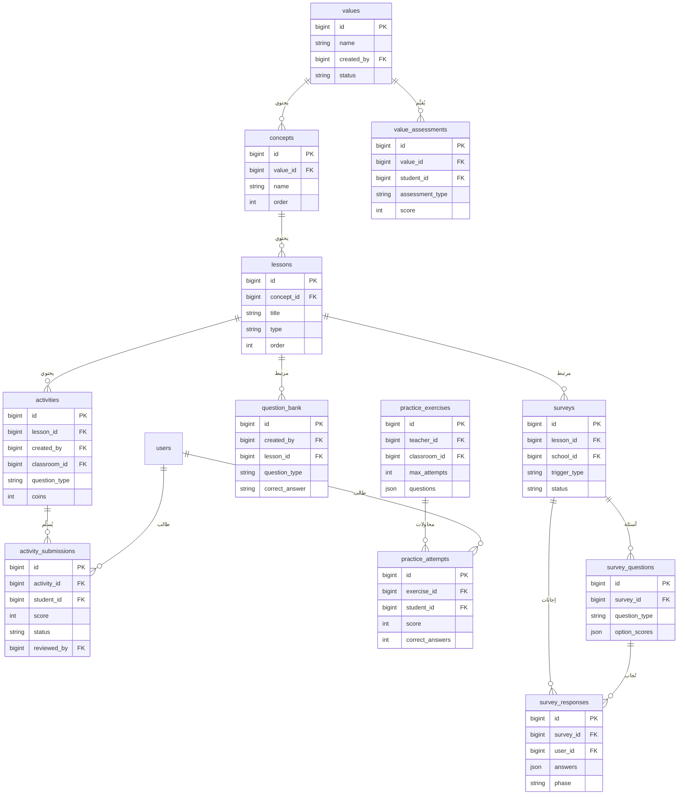

> **للبانِي (AI):** اتجاه الـFK من الأبناء إلى الآباء (concept_id→concepts، lesson_id→lessons)؛ ابنِ الجداول بترتيب الهرم values→concepts→lessons→activities قبل جداول التسليم لتجنّب كسر قيود FK. جدول `question_bank` اسمه مفرد صريح (`protected $table`) ويُستهلَك من الأنشطة وأسلوب pvp، فلا تُعِد تسميته بصيغة الجمع.

#### 🗺️ ERD — التنظيم والتواصل والمنافسة

يوضّح هذا المخطط بنية الفِرَق وعضويتها عبر جدول الوصل `team_members`، ومنظومة المراسلة (محادثات/رسائل، رسائل ولي↔معلّم، رسائل جماعية بمستقبليها)، والإشعارات متعددة الأشكال، ومنافسات PvP (تحدٍّ → مباريات). كل العلاقات والأعمدة مأخوذة حرفيًّا من النماذج والهجرات الفعلية.

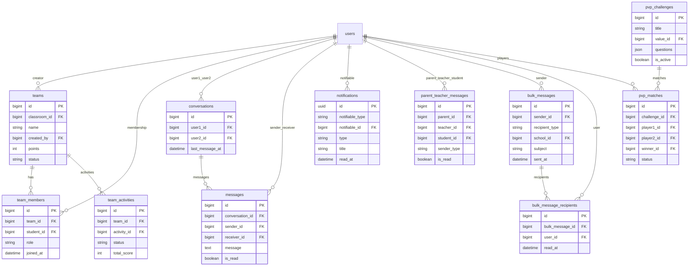

> **للبانِي (AI):** عضوية الفِرَق ليست `team_user` بل جدول الوصل `team_members(team_id, student_id, role, joined_at)` — اربط دائمًا الطالب عبر `student_id` لا `user_id`. `notifications` يستخدم مفتاح UUID وعلاقة polymorphic عبر `notifiable_type/notifiable_id` (لا عمود `user_id`)، ورسالة الإشعار للمستخدم تُحَلّ عبر `notifiable_id`. ابنِ `conversations` قبل `messages` و`bulk_messages` قبل `bulk_message_recipients` و`pvp_challenges` قبل `pvp_matches` احترامًا لاتجاه الـFK؛ ووحّد محادثة الطرفين عبر فرز الـIDs (`findOrCreate`) كمفتاح idempotency يمنع التكرار.

هذا القسم هو **الدستور القانوني الملزم** لطبقة البيانات في منصة «وحي / قيمّ» (Laravel 12 / PHP 8.2). كل جدول هنا **إلزامي** ببنيته الموصوفة بالضبط؛ **يُمنع** حذف عمود أو تغيير نوعه أو إسقاط قيد فريد ما لم يُنَصّ صراحةً على أنه «ميّت». المحرك المرجعي هو **MySQL 8 / InnoDB** بترميز `utf8mb4_unicode_ci` (دعم العربية RTL إلزامي)، مع توافق SQLite للاختبارات.

**قواعد عامة ملزمة (تسري على كل الجداول):**
- **يجب** إعادة بناء الحالة النهائية مباشرةً (لا تُعِد تنفيذ هجرات وسيطة ملغاة): جدول `meanings` **محذوف**، وأعمدة `type` في `activities`/`lessons` هي `string` لا `enum`.
- **يُمنع** إعادة إدخال رصيد مُجمَّع حيّ للمستخدم؛ رصيد النقاط = `SUM(points.points)` ورصيد القيمات = `SUM(coins.coins)`. الأعمدة `users.total_points/weekly_points/monthly_points` **ميّتة (DEAD)** — موجودة بقيمة افتراضية 0 ولا تُكتَب ولا تُقرأ أبداً. قراءتها لحساب رصيد = **خطأ حرج**.
- النقيض الوحيد: `schools.total_points/weekly_points/monthly_points` **عدّاد حيّ** يُزاد بالتزامن مع كل إدراج في `school_points`.
- ترتيب الهجرات حسب الطابع الزمني **إلزامي**؛ خاصةً `2026_05_04_000001_align_points_coins_columns` (يضيف `source`/`description`) و`2026_06_24_000001_create_award_ledger_table` (نخاع المنع المزدوج).

---

### 3.1 مجال الهوية والاقتصاد (Identity & Economy)

#### users

| العمود | النوع | Null | Default | ملاحظات |
|---|---|---|---|---|
| id | bigIncrements | لا | — | PK |
| name | string | لا | — | |
| email | string | لا | — | **UNIQUE** |
| email_verified_at | datetime | نعم | null | |
| password | string | لا | — | مُجزّأ (bcrypt/argon) |
| password_change_required | boolean | لا | false | بوابة إجبار تغيير كلمة المرور |
| two_factor_code | string(6) | نعم | null | **hidden** |
| two_factor_expires_at | datetime | نعم | null | |
| two_factor_enabled | boolean | لا | false | |
| role | enum(super_admin,school_admin,teacher,student,parent) | لا | student | الدور الأساسي |
| secondary_roles | json | نعم | null | أدوار إضافية (multi-role) |
| active_role | string | نعم | null | الدور النشط حالياً |
| qr_code | string | نعم | null | **UNIQUE** |
| avatar | string | نعم | null | |
| school_id | unsignedBigInteger | نعم | null | FK→schools `nullOnDelete`، فهرس `idx_users_school_id`، قيد `fk_users_school_id` |
| phone | string(20) | نعم | null | |
| birth_date | date | نعم | null | cast date؛ accessor `age` |
| status | enum(active,inactive) | لا | active | |
| remember_token | string | نعم | null | |
| total_points | integer | لا | 0 | **DEAD — لا تُكتَب/تُقرأ** |
| weekly_points | integer | لا | 0 | **DEAD** |
| monthly_points | integer | لا | 0 | **DEAD** |
| created_at / updated_at | timestamps | — | — | |

> ملاحظة بناء: عمود `school_id` و FK أُضيفا في هجرة لاحقة (`2026_05_11_153712`) بعد تصفير المستخدمين اليتامى؛ **يجب** أن يكون `nullable` و`nullOnDelete` (حذف المدرسة يفصل المستخدمين لا يحذفهم).

**العلاقات:**
- `belongsTo School`
- `children`: belongsToMany User عبر `parent_student` (parent_id→student_id)
- `parents`: belongsToMany User عبر `parent_student` (student_id→parent_id)
- `teachingClassrooms`: hasMany Classroom(teacher_id)
- `classrooms`: belongsToMany Classroom عبر `classroom_student` withPivot(enrollment_date,status)
- `points`: hasMany Point — `coins`: hasMany Coin
- `badges`: belongsToMany Badge عبر `user_badges` withPivot(earned_at)
- `crowns`: hasMany Crown — `streak`: hasOne Streak
- `parentPoints`: hasMany ParentPoint(parent_id)
- `giftsGiven/giftsReceived`: hasMany ParentGift(parent_id/student_id)
- `praisesGiven/praisesReceived`: hasMany ParentPraise(parent_id/student_id)
- `purchases`: belongsToMany ShopItem عبر `user_purchases` withPivot(price_paid,is_active,used_at)
- `lessonStreaks`: hasMany LessonUserStreak
- `teams`: belongsToMany Team عبر `team_members`(student_id) withPivot(role,joined_at)
- `givenRatings/receivedRatings`: hasMany TeacherRating(student_id/teacher_id)
- `activitySubmissions`: hasMany ActivitySubmission(student_id)

**حُرّاس إلزاميون على الموديل:**
- `level` هو **accessor محسوب** (`getLevelAttribute`) ولا يُخزَّن أبداً: `intdiv(totalPoints,100)+1` حيث `totalPoints = SUM(points)`.
- حارس `saving()` **يمنع (abort 403)** الإسناد الجماعي من غير الإدمن للحقول الحسّاسة: `role`, `school_id`, `status`, `secondary_roles`, `password_change_required`، ويتحقق أن `active_role` ضمن الأدوار المملوكة. يُستثنى `app()->runningInConsole()` (للـ seeders).

#### points (سجل XP — Append-only)

| العمود | النوع | Null | Default | ملاحظات |
|---|---|---|---|---|
| id | bigIncrements | لا | — | PK |
| user_id | unsignedBigInteger | لا | — | FK→users cascade، **indexed** |
| points | integer (signed) | لا | — | يمكن أن يكون سالباً؛ الأرصدة عادةً موجبة |
| reason | string | نعم | null | قديم (legacy) |
| source | string(100) | نعم | null | عائلة الحدث (أُضيف 2026_05_04) |
| description | string(500) | نعم | null | (أُضيف 2026_05_04) |
| activity_id | unsignedBigInteger | نعم | null | FK→activities `setNull` |
| lesson_id | unsignedBigInteger | نعم | null | FK→lessons `setNull` |
| created_at / updated_at | timestamps | — | — | |

**علاقات:** `belongsTo User`, `belongsTo Activity`, `belongsTo Lesson`.
**حارس Append-only إلزامي:** `booted()` يُجهض (abort 403) أي `UPDATE`/`DELETE` خارج الكونسول. `created()` يُبطل كاش لوحات الصدارة: `leaderboard:students:{all,week,month}`, `lb:rank:student:{id}`, `parent_dashboard:ranks:{id}`. **التصحيح يكون بصفّ تعويضي جديد، لا بتعديل/حذف.**

#### coins (محفظة القيمات — Append-only)

| العمود | النوع | Null | Default | ملاحظات |
|---|---|---|---|---|
| id | bigIncrements | لا | — | PK |
| user_id | unsignedBigInteger | لا | — | FK→users cascade، **indexed** |
| coins | integer (signed) | لا | — | موجب=earn / سالب=spend |
| reason | string | نعم | null | legacy |
| transaction_type | string | نعم | null | earn/spend/bonus |
| source | string(100) | نعم | null | (أُضيف 2026_05_04) |
| description | string(500) | نعم | null | (أُضيف 2026_05_04) |
| created_at / updated_at | timestamps | — | — | |

**علاقة:** `belongsTo User`. **حارس Append-only** نفسه (abort 403 على UPDATE/DELETE خارج الكونسول). الرصيد = `SUM(coins)`.

#### award_ledger (نخاع المنع المزدوج — بلا موديل)

> **القلب الأمني للاقتصاد كلّه.** صفّ واحد لكل حدث منطقي (منح/خصم). القيد الفريد `UNIQUE(user_id,source_type,source_id)` يجعل الازدواج **مستحيلاً بنيوياً على مستوى قاعدة البيانات** بصرف النظر عن أي حارس تطبيقي.

```php
Schema::create('award_ledger', function (Blueprint $table) {
    $table->id();
    $table->foreignId('user_id')->constrained()->cascadeOnDelete();
    $table->string('source_type', 64);
    $table->string('source_id', 64);
    $table->unsignedInteger('points')->default(0); // سجل تدقيقي للمبلغ
    $table->unsignedInteger('coins')->default(0);  // للخصم: يخزّن الكلفة المقتطعة
    $table->timestamps();
    $table->unique(['user_id', 'source_type', 'source_id'], 'award_ledger_event_unique');
    $table->index(['source_type', 'source_id']);
});
```

| العمود | النوع | Null | Default | ملاحظات |
|---|---|---|---|---|
| id | bigIncrements | لا | — | PK |
| user_id | unsignedBigInteger | لا | — | FK→users cascade |
| source_type | string(64) | لا | — | عائلة الحدث |
| source_id | string(64) | لا | — | PK الصفّ المصدري في المجال |
| points | unsignedInteger | لا | 0 | سجل تدقيق المبلغ |
| coins | unsignedInteger | لا | 0 | سجل تدقيق؛ كلفة الخصم |
| created_at / updated_at | timestamps | — | — | |

**قيود:** `UNIQUE(user_id,source_type,source_id)='award_ledger_event_unique'` + `INDEX(source_type,source_id)`.
**عائلات `source_type` المرصودة (إلزامية):** `activity_submission`, `pvp_match`, `parent_praise`, `parent_gift`, `family_activity`, `shop_purchase`, `reward_redemption`, `gamification_deduct`, `level_up`. و`source_id` دائماً هو PK صفّ المجال.

#### teacher_points (مرآة نقاط المعلّم المجمّعة)

| العمود | النوع | Null | Default | ملاحظات |
|---|---|---|---|---|
| id | bigIncrements | لا | — | PK |
| teacher_id | unsignedBigInteger | لا | — | FK→users cascade، **UNIQUE** (صفّ واحد لكل معلّم) |
| points | integer | لا | 0 | الإجمالي |
| students_total_points | integer | لا | 0 | |
| students_count | integer | لا | 0 | |
| activities_created | integer | لا | 0 | |
| questions_approved | integer | لا | 0 | |
| created_at / updated_at | timestamps | — | — | فهرس `(points,created_at)` |

**علاقة:** `belongsTo User(teacher_id)`. يتلقى 10% من كل منحة طالب عبر `firstOrCreate`+`increment`. لوحة صدارة المعلّمين = `SUM(points)`.

#### parent_points (سجل نقاط ولي الأمر)

| العمود | النوع | Null | Default | ملاحظات |
|---|---|---|---|---|
| id | bigIncrements | لا | — | PK |
| parent_id | unsignedBigInteger | لا | — | FK→users cascade |
| points | integer | لا | — | |
| reason | string | لا | — | |
| reference_type | string | نعم | null | مؤشر شبه-بوليمورفي |
| reference_id | unsignedBigInteger | نعم | null | |
| created_at / updated_at | timestamps | — | — | فهرس `(parent_id,created_at)` |

**علاقة:** `belongsTo User(parent_id)`. يتلقى 5% من كل منحة طفل. **تحذير:** لا يوجد قيد UNIQUE على `(reference_type,reference_id)` — التكرارية تطبيقية (firstOrCreate داخل معاملة مقفلة).

#### school_points (سجل نقاط المدرسة)

| العمود | النوع | Null | Default | ملاحظات |
|---|---|---|---|---|
| id | bigIncrements | لا | — | PK |
| school_id | unsignedBigInteger | لا | — | FK→schools cascade |
| points | integer | لا | 0 | |
| source | string | لا | — | student_activity/teacher_activity/... |
| description | string | نعم | null | |
| user_id | unsignedBigInteger | نعم | null | FK→users `setNull` |
| created_at / updated_at | timestamps | — | — | فهرس `(school_id,created_at)` |

**علاقات:** `belongsTo School`, `belongsTo User`. `addPoints()` يُدرج صفّاً **و** يزيد `schools.total_points` بنفس المقدار (تزامن إلزامي). `getTotalPoints()=SUM(points)`.

#### schools (أعمدة الاقتصاد فقط — انظر §3.4 للجدول الكامل)

| العمود | النوع | Null | Default | ملاحظات |
|---|---|---|---|---|
| total_points | integer | لا | 0 | **عدّاد حيّ** — يُزاد مع كل `school_points` |
| weekly_points | integer | لا | 0 | حيّ — يُحدّثه RefreshSchoolStatistics |
| monthly_points | integer | لا | 0 | حيّ |

#### streaks (سلسلة يومية متتالية عامّة)

```php
Schema::create('streaks', function (Blueprint $table) {
    $table->id();
    $table->foreignId('user_id')->unique()->constrained('users')->onDelete('cascade');
    $table->integer('current_streak')->default(0);
    $table->integer('longest_streak')->default(0);
    $table->date('last_activity_date')->nullable();
    $table->timestamps();
});
```

| العمود | النوع | Null | Default | ملاحظات |
|---|---|---|---|---|
| id | bigIncrements | لا | — | PK |
| user_id | unsignedBigInteger | لا | — | FK→users cascade، **UNIQUE** |
| current_streak | integer | لا | 0 | الأعمدة القانونية |
| longest_streak | integer | لا | 0 | |
| last_activity_date | date | نعم | null | |
| created_at / updated_at | timestamps | — | — | |

> **مصيدة (إلزامية المعرفة):** `GamificationService::getStudentStats` يقرأ خطأً `current_days`/`longest_days` (يؤول لـ0). الأعمدة القانونية هي `current_streak`/`longest_streak` — **القراءة الصحيحة يجب أن تستعمل هذين الاسمين.**

#### activity_user_streaks (سلسلة أيام نشاط غير متتالية + دورة مكافأة)

| العمود | النوع | Null | Default | ملاحظات |
|---|---|---|---|---|
| id | bigIncrements | لا | — | PK |
| user_id | unsignedBigInteger | لا | — | FK→users cascade، **UNIQUE** |
| completed_days | integer | لا | 0 | = count(activity_dates) |
| activity_dates | json | نعم | null | قائمة Y-m-d |
| bonus_claimed | boolean | لا | false | |
| last_activity_date | date | نعم | null | |
| total_bonus_earned | integer | لا | 0 | |
| created_at / updated_at | timestamps | — | — | |

`recordActivityDay()` ذرّي (DB::transaction+lockForUpdate، 3 محاولات). **`checkAndClaimBonus()` يضع `bonus_claimed` فقط ولا يُنشئ Point — المُستدعِي يمنح المكافأة مرة واحدة** (منع ازدواج).

#### lesson_user_streaks (سلسلة لكل (مستخدم، درس))

| العمود | النوع | Null | Default | ملاحظات |
|---|---|---|---|---|
| id | bigIncrements | لا | — | PK |
| user_id | unsignedBigInteger | لا | — | FK→users cascade |
| lesson_id | unsignedBigInteger | لا | — | FK→lessons cascade |
| completed_days | integer | لا | 0 | |
| activity_dates | json | نعم | null | |
| last_activity_date | date | نعم | null | |
| bonus_claimed | boolean | لا | false | |
| bonus_claimed_at | timestamp | نعم | null | |
| created_at / updated_at | timestamps | — | — | |

**قيود:** `UNIQUE(user_id,lesson_id)` + `INDEX(user_id)` + `INDEX(lesson_id)`. تقرأ إعدادات السلسلة من `lessons` (`streak_enabled`/`streak_min_days`/`streak_max_days`/`streak_bonus_points`). المُستدعِي يمنح `bonus_points`.

#### badges

| العمود | النوع | Null | Default | ملاحظات |
|---|---|---|---|---|
| id | bigIncrements | لا | — | PK |
| name | string | لا | — | |
| description | text | نعم | null | |
| icon | string | نعم | null | رابط أو إيموجي |
| criteria | json | نعم | null | شرط الفتح |
| type | enum(achievement,streak,special) | لا | achievement | |
| status | enum(active,inactive) | لا | active | |
| created_at / updated_at | timestamps | — | — | |

**علاقة:** `users`: belongsToMany عبر `user_badges` withPivot(earned_at).

#### user_badges (pivot)

| العمود | النوع | Null | Default | ملاحظات |
|---|---|---|---|---|
| id | bigIncrements | لا | — | PK |
| user_id | unsignedBigInteger | لا | — | FK→users cascade |
| badge_id | unsignedBigInteger | لا | — | FK→badges cascade |
| earned_at | timestamp | لا | useCurrent | |
| created_at / updated_at | timestamps | — | — | |

**قيد:** `UNIQUE(user_id,badge_id)` (شارة واحدة لكل مستخدم). اسم الجدول `user_badges` (لا `badge_user`).

#### crowns (تاج القيمة)

| العمود | النوع | Null | Default | ملاحظات |
|---|---|---|---|---|
| id | bigIncrements | لا | — | PK |
| user_id | unsignedBigInteger | لا | — | FK→users cascade |
| value_id | unsignedBigInteger | لا | — | FK→values cascade |
| earned_at | timestamp | لا | useCurrent | cast datetime |
| created_at / updated_at | timestamps | — | — | |

**قيد:** `UNIQUE(user_id,value_id)` (تاج واحد لكل قيمة). **علاقات:** `belongsTo User`, `belongsTo Value`.

#### shop_items

| العمود | النوع | Null | Default | ملاحظات |
|---|---|---|---|---|
| id | bigIncrements | لا | — | PK |
| name | string | لا | — | |
| description | text | نعم | null | |
| type | enum(avatar,theme,badge,power_up,special) | لا | avatar | |
| price | integer | لا | — | كلفة بالقيمات |
| image | string | نعم | null | |
| icon | string | لا | '🎁' | |
| stock | integer | نعم | null | null=غير محدود |
| is_limited | boolean | لا | false | |
| available_until | dateTime | نعم | null | |
| rarity | enum(common,rare,epic,legendary) | لا | common | |
| metadata | json | نعم | null | كود الثيم/الصورة |
| status | enum(active,inactive,sold_out) | لا | active | |
| order | integer | لا | 0 | |
| created_at / updated_at | timestamps | — | — | فهرس type,status,rarity |

**علاقة:** `purchasers`: belongsToMany User عبر `user_purchases`. `decrementStock()` تحديث شرطي ذرّي (`WHERE stock>0 SET stock=stock-1`)؛ يقلب الحالة لـ`sold_out` عند الصفر.

#### user_purchases (pivot)

| العمود | النوع | Null | Default | ملاحظات |
|---|---|---|---|---|
| id | bigIncrements | لا | — | PK |
| user_id | unsignedBigInteger | لا | — | FK→users cascade، indexed |
| shop_item_id | unsignedBigInteger | لا | — | FK→shop_items cascade، indexed |
| price_paid | integer | لا | — | سعر الخادم وقت الشراء |
| is_active | boolean | لا | true | هل العنصر مُجهَّز |
| used_at | dateTime | نعم | null | للعناصر أحادية الاستخدام |
| created_at / updated_at | timestamps | — | — | |

> **تحذير:** **لا UNIQUE** هنا. أحادية الشراء تُفرَض بمفتاح تكرارية SpendService (`shop_purchase`, itemId) + فحوص `hasPurchased()`. أي مسار شراء ثانٍ **يجب** أن يعيد استعمال نفس المفتاح وإلا حدث شراء مزدوج.

#### user_items (مخزن ملكية مواز/قديم)

| العمود | النوع | Null | Default | ملاحظات |
|---|---|---|---|---|
| id | bigIncrements | لا | — | PK |
| user_id | unsignedBigInteger | لا | — | FK→users cascade |
| item_type | string | لا | — | crown/streak_freeze/name_color/double_xp... |
| item_data | json | نعم | null | |
| is_active | boolean | لا | true | |
| expires_at | timestamp | نعم | null | |
| created_at / updated_at | timestamps | — | — | فهرس `(user_id,item_type,is_active)` |

#### parent_gifts

| العمود | النوع | Null | Default | ملاحظات |
|---|---|---|---|---|
| id | bigIncrements | لا | — | PK |
| parent_id | unsignedBigInteger | لا | — | FK→users cascade |
| student_id | unsignedBigInteger | لا | — | FK→users cascade |
| gift_type | string | لا | — | |
| gift_message | text | نعم | null | |
| points_cost | integer | لا | 10 | |
| created_at / updated_at | timestamps | — | — | |

**علاقات:** `belongsTo User(parent_id)`, `belongsTo User(student_id)`. سقف يومي 3 هدايا/(ولي، طفل) تحت `lockForUpdate`. المنح بمفتاح `(parent_gift, gift.id)`.

#### parent_praises

| العمود | النوع | Null | Default | ملاحظات |
|---|---|---|---|---|
| id | bigIncrements | لا | — | PK |
| parent_id | unsignedBigInteger | لا | — | FK→users cascade |
| student_id | unsignedBigInteger | لا | — | FK→users cascade |
| praise_message | text | لا | — | |
| praise_type | enum(encouragement,achievement,behavior,custom) | لا | — | |
| points_awarded | integer | لا | 5 | |
| created_at / updated_at | timestamps | — | — | فهرس `(student_id,created_at)` |

سقف يومي 5/(ولي، طفل). المنح بمفتاح `(parent_praise, praise.id)`.

**التوقيعات الاقتصادية المرجعية (للتنفيذ verbatim):**

```php
AwardService::award(int $userId, string $sourceType, string $sourceId, int $points=0, int $coins=0, ?string $description=null, bool $distribute=false): bool
// CREDIT الذرّي التكراري الوحيد. false فوراً إذا points<=0 && coins<=0.
// insertOrIgnore في award_ledger؛ 0 صفوف => false (no-op). لا يأخذ قفلاً (append-only).
// distribute=true => PointsDistributionService::distributeWithin داخل نفس المعاملة (يرمي => rollback كامل).

SpendService::spend(int $userId, string $sourceType, string $sourceId, int $cost, ?string $description=null): array
// DEBIT ذرّي تكراري مانع للسحب على المكشوف. cost<=0 => invalid_cost.
// SELECT users FOR UPDATE (mutex لكل مستخدم). تكرار => {duplicate:true}. balance=SUM(coins)؛
// balance<cost => insufficient_balance (fail closed). وإلا: award_ledger + Coin(-cost). cost من الخادم حصراً.
```

**قواعد ملزمة (الاقتصاد):**
- **يجب** أن يمرّ كل CREDIT عبر `AwardService::award` وكل DEBIT للقيمات عبر `SpendService::spend`. **يُمنع** الإدراج المباشر في Point/Coin لأحداث لمرّة واحدة.
- Level = `floor(SUM(points)/100)+1` — الصيغة القانونية الوحيدة (User + GamificationService). XP للمستوى التالي = `currentLevel*100 - totalXP`.
- مكافأة الترقية = `newLevel*10` قيمات، داخل نفس معاملة XP المُحدِثة للمستوى.
- نسب التوزيع لكل منحة طالب: معلّم 10%، ولي 5%، مدرسة 2% — كل ساق `floor` ثم `max(1,...)` عند وجود المستلِم.
- XP تسليم النشاط = `round((score/100)*activity.points)`؛ القيمات = `max(1, floor(xp/2))`؛ مع `distribute:true` (ذرّية مع التوزيع).
- **يُمنع** استبدال `distributeWithin` (يرمي) بـ`distribute` (يبتلع) داخل معاملة تتطلب الذرّية.

---

### 3.2 مجال المحتوى التعليمي (Learning Content)

> الشجرة القانونية: **Value → Concept → Lesson → Activity** (تسلسل `ON DELETE CASCADE` نزولاً). **جدول `meanings` محذوف نهائياً؛ يُمنع إعادة إنشائه.**

#### values

| العمود | النوع | Null | Default | ملاحظات |
|---|---|---|---|---|
| id | bigIncrements | لا | — | PK |
| name | string | لا | — | |
| description | text | نعم | null | |
| icon | string | نعم | null | إيموجي/أيقونة |
| image | string | نعم | null | (أُضيف لاحقاً) |
| order | integer | لا | 0 | |
| created_by | unsignedBigInteger | نعم | null | FK→users `setNull` |
| status | enum(active,inactive) | لا | active | |
| pre_assessment_required | boolean | لا | true | |
| post_assessment_required | boolean | لا | true | |
| created_at / updated_at | timestamps | — | — | |

**علاقات:** `hasMany Concept` (order)، `belongsTo User(created_by)`، `hasMany Crown`، `activeSchools`: belongsToMany School عبر `school_active_values` withPivot(activated_by,activated_at).
**`scopeVisibleForSchool($q,?schoolId)`:** لا schoolId أو لا صفوف pivot للمدرسة → كل `status=active`؛ وإلا `status=active AND id IN (school_active_values)`. **الغياب يعني «الكل» لا «لا شيء».**

#### concepts

| العمود | النوع | Null | Default | ملاحظات |
|---|---|---|---|---|
| id | bigIncrements | لا | — | PK |
| value_id | unsignedBigInteger | لا | — | FK→values **cascade** |
| name | string | لا | — | |
| description | text | نعم | null | |
| order | integer | لا | 0 | |
| created_at / updated_at | timestamps | — | — | |

**علاقات:** `belongsTo Value`, `hasMany Lesson` (order).

#### lessons

| العمود | النوع | Null | Default | ملاحظات |
|---|---|---|---|---|
| id | bigIncrements | لا | — | PK |
| concept_id | unsignedBigInteger | نعم* | — | FK→concepts **cascade** (*مطلوب دلالياً) |
| title | string | لا | — | |
| content | longText | نعم | null | |
| images | json | نعم | null | |
| type | string(20) | لا | text | **string لا enum** (text/video/interactive/mixed/audio) |
| video_url | string | نعم | null | |
| audio_url | string | نعم | null | |
| video_file | string | نعم | null | |
| audio_file | string | نعم | null | |
| duration | integer | لا | 5 | دقائق |
| points | integer | لا | 10 | عند إتمام الدرس |
| streak_min_days | integer | نعم | null | |
| streak_max_days | integer | نعم | null | |
| streak_bonus_points | integer | لا | 0 | |
| streak_enabled | boolean | لا | false | |
| order | integer | لا | 0 | |
| status | enum(active,draft,archived) | لا | active | |
| created_at / updated_at | timestamps | — | — | |

> **مصيدة:** الهجرة الأساس تُعرّف `meaning_id`؛ الحالة النهائية `concept_id` (بعد backfill وإسقاط `meaning_id` وجدول `meanings`). **ابْنِ `concept_id` مباشرةً.**

**علاقات:** `belongsTo Concept`, `hasMany Activity` (order), `hasMany LessonUserStreak`, `hasMany Survey`.

#### activities

| العمود | النوع | Null | Default | ملاحظات |
|---|---|---|---|---|
| id | bigIncrements | لا | — | PK |
| lesson_id | unsignedBigInteger | نعم | null | FK→lessons **cascade** |
| created_by | unsignedBigInteger | نعم | null | FK→users `setNull` (المعلّم المؤلف) |
| classroom_id | unsignedBigInteger | نعم | null | FK→classrooms cascade |
| title | string | لا | — | |
| description | text | نعم | null | |
| type | string(30) | لا | quiz | **string لا enum** (quiz/upload/practical/discussion/exercise/project/creative/image_order/homework/practice) |
| question_type | enum(...) | لا | multiple_choice | multiple_choice/true_false/short_answer/essay/letter_choice/word_ordering/sentence_ordering/image_ordering |
| difficulty | string(20) | نعم | null | (أُضيف 2026_06_03) |
| coins | integer | لا | 0 | (أُضيف 2026_06_03) |
| is_homework | boolean | لا | false | |
| is_team_activity | boolean | لا | false | |
| is_family_activity | boolean | لا | false | |
| is_creative | boolean | لا | false | |
| is_activity_bank | boolean | لا | false | |
| is_featured | boolean | لا | false | |
| featured_by | unsignedBigInteger | نعم | null | FK→users `setNull` |
| featured_at | timestamp | نعم | null | |
| featured_reason | text | نعم | null | |
| bonus_points | integer | لا | 0 | |
| min_team_size | integer | نعم | null | |
| max_team_size | integer | نعم | null | |
| allow_team_formation | boolean | لا | true | |
| due_date | dateTime | نعم | null | |
| questions | json | نعم | null | |
| attachment | string | نعم | null | |
| points | integer | لا | 20 | |
| passing_score | integer | نعم | null | |
| duration_minutes | integer | نعم | null | |
| quiz_duration | integer | نعم | null | |
| max_attempts | integer | نعم | null | |
| allowed_file_types | json | نعم | null | document/image/video/audio |
| max_file_size | integer | نعم | null | MB |
| order | integer | لا | 0 | |
| status | enum(active,inactive,draft) | لا | active | |
| approval_status | enum(pending,approved,rejected) | لا | approved | المتحكمات تفرض pending للمعلّم |
| approved_by | unsignedBigInteger | نعم | null | FK→users `setNull` |
| approved_at | timestamp | نعم | null | |
| rejection_reason | text | نعم | null | |
| created_at / updated_at | timestamps | — | — | |

**حارس `booted()` updating إلزامي:** فقط school_admin/super_admin (أو الكونسول) يعدّل `approval_status/approved_by/approved_at/is_featured/featured_by/featured_at/rejection_reason` — وإلا abort(403). بدون هذا الحارس يستطيع المعلّم اعتماد/إبراز نشاطه ذاتياً.
**علاقات:** `belongsTo Lesson/creator/approver/featuredBy/Classroom`; `hasMany submissions/teamActivities/familySubmissions`. أساليب: `isApproved()`, `isPendingApproval()`, `isTeamActivity()`.

#### activity_submissions

| العمود | النوع | Null | Default | ملاحظات |
|---|---|---|---|---|
| id | bigIncrements | لا | — | PK |
| activity_id | unsignedBigInteger | لا | — | FK→activities cascade |
| student_id | unsignedBigInteger | لا | — | FK→users cascade |
| answer | text | نعم | null | نص أو JSON |
| file_path | string | نعم | null | |
| score | integer | نعم | null | |
| status | enum(pending,approved,rejected,needs_review,completed) | لا | pending | MySQL وسّعها لـ`completed`؛ SQLite string حرّ |
| reviewed_by | unsignedBigInteger | نعم | null | FK→users `setNull` |
| feedback | text | نعم | null | |
| submitted_at | timestamp | لا | useCurrent | |
| reviewed_at | timestamp | نعم | null | |
| created_at / updated_at | timestamps | — | — | |

**ثوابت إلزامية:** `DONE_STATUSES=['completed','approved']` (الإنجاز النهائي للتقارير)؛ `SUBMITTED_STATUSES=['completed','approved','pending','needs_review']` (ما أرسله الطالب). `scopeDone`/`scopeSubmitted`. **يُمنع الخلط:** `pending`/`needs_review` ليست إنجازاً.
**حارس grade-integrity:** فقط teacher/school_admin/super_admin (أو الكونسول) يعدّل `score/reviewed_by/feedback/reviewed_at/status` بعد الإنشاء؛ الطلاب يُجهَضون 403. الإنشاء الأولي موثوق (الخادم يحسب score).

#### question_bank (اسم الجدول `question_bank`)

| العمود | النوع | Null | Default | ملاحظات |
|---|---|---|---|---|
| id | bigIncrements | لا | — | PK |
| created_by | unsignedBigInteger | لا | — | FK→users cascade |
| lesson_id | unsignedBigInteger | نعم | null | FK→lessons `setNull` |
| title | string | لا | — | |
| question_text | text | لا | — | |
| question_type | enum(multiple_choice,true_false,short_answer,essay) | لا | multiple_choice | |
| options | json | نعم | null | `[{text,is_correct}]` |
| correct_answer | string | نعم | null | |
| explanation | text | نعم | null | |
| points | integer | لا | 10 | |
| difficulty | enum(easy,medium,hard) | لا | medium | |
| status | enum(pending,approved,rejected) | لا | pending | |
| approved_by | unsignedBigInteger | نعم | null | FK→users `setNull` |
| approved_at | timestamp | نعم | null | |
| rejection_reason | text | نعم | null | |
| usage_count | integer | لا | 0 | |
| created_at / updated_at | timestamps | — | — | فهارس `(status,created_at)`,`(lesson_id)`,`(created_by)` |

يُشار إليه بالـID داخل مصفوفات JSON في `practice_exercises.questions` و`pvp_challenges.questions` (**لا FK — السلامة تطبيقية**). `approve()`/`reject()`.

#### practice_exercises

| العمود | النوع | Null | Default | ملاحظات |
|---|---|---|---|---|
| id | bigIncrements | لا | — | PK |
| teacher_id | unsignedBigInteger | لا | — | FK→users cascade |
| classroom_id | unsignedBigInteger | نعم | null | FK→classrooms `setNull` |
| title | string | لا | — | |
| description | text | نعم | null | |
| type | enum(quiz,review,challenge) | لا | quiz | |
| difficulty | enum(easy,medium,hard) | لا | medium | |
| time_limit | integer | نعم | null | دقائق |
| max_attempts | integer | لا | 3 | |
| is_active | boolean | لا | true | |
| questions | json | لا | — | مصفوفة QuestionBank IDs |
| starts_at | timestamp | نعم | null | |
| ends_at | timestamp | نعم | null | |
| created_at / updated_at | timestamps | — | — | فهارس `(teacher_id,is_active)`,`(classroom_id)` |

#### practice_attempts

| العمود | النوع | Null | Default | ملاحظات |
|---|---|---|---|---|
| id | bigIncrements | لا | — | PK |
| student_id | unsignedBigInteger | لا | — | FK→users cascade |
| exercise_id | unsignedBigInteger | لا | — | FK→practice_exercises cascade |
| answers | json | نعم | null | |
| score | integer | لا | 0 | |
| total_questions | integer | لا | 0 | |
| correct_answers | integer | لا | 0 | |
| time_taken | integer | نعم | null | ثوانٍ |
| completed_at | timestamp | نعم | null | |
| created_at / updated_at | timestamps | — | — | فهرس `(student_id,exercise_id)` |

#### surveys

| العمود | النوع | Null | Default | ملاحظات |
|---|---|---|---|---|
| id | bigIncrements | لا | — | PK |
| title | string | لا | — | |
| description | text | نعم | null | |
| survey_type | string | لا | 'general' | `pre_post_assessment` يفعّل وضع التقييم (لا cast) |
| lesson_id | unsignedBigInteger | نعم | null | FK→lessons `setNull` |
| linked_survey_id | unsignedBigInteger | نعم | null | FK→surveys (self) `nullOnDelete` |
| assessment_phase | string | نعم | null | pre/post (لا cast) |
| target_roles | json | لا | — | schools/teachers/students/parents أو أدوار خام |
| school_id | unsignedBigInteger | نعم | null | FK→schools `nullOnDelete`؛ null=كل المدارس |
| status | enum(draft,active,closed) | لا | draft | |
| trigger_type | string | لا | 'manual' | on_platform_open/on_login/on_first_login/on_lesson_start/on_lesson_complete/on_activity_complete/manual (لا cast) |
| requires_login | boolean | لا | true | |
| is_mandatory | boolean | لا | true | |
| is_popup | boolean | لا | true | |
| start_date | timestamp | نعم | null | |
| end_date | timestamp | نعم | null | |
| created_by | unsignedBigInteger | لا | — | FK→users cascade |
| created_at / updated_at | timestamps | — | — | |

**علاقات/أساليب:** `questions` (order), `responses`, `creator`, `school`, `lesson`, `linkedSurvey`; `isActive()`, `hasUserResponded()`, `getPendingSurveysForUser()`, `getComparisonData()`.

#### survey_questions

| العمود | النوع | Null | Default | ملاحظات |
|---|---|---|---|---|
| id | bigIncrements | لا | — | PK |
| survey_id | unsignedBigInteger | لا | — | FK→surveys cascade |
| question_text | text | لا | — | |
| question_type | enum(text,textarea,radio,checkbox,select,rating,scale) | لا | — | |
| options | json | نعم | null | |
| option_scores | json | نعم | null | درجة لكل option index (موازٍ لـoptions) |
| is_required | boolean | لا | true | |
| order | integer | لا | 0 | |
| created_at / updated_at | timestamps | — | — | |

#### survey_responses

| العمود | النوع | Null | Default | ملاحظات |
|---|---|---|---|---|
| id | bigIncrements | لا | — | PK |
| survey_id | unsignedBigInteger | لا | — | FK→surveys cascade |
| user_id | unsignedBigInteger | **نعم** | null | nullable للضيوف (requires_login=false) |
| answers | json | لا | — | خريطة questionId⇒answer |
| phase | string | نعم | null | pre/post |
| completed_at | timestamp | نعم | null | |
| created_at / updated_at | timestamps | — | — | |

**قيد:** `UNIQUE(survey_id,user_id)` — يسمح بصفوف ضيوف متعددة (NULLs غير متعارضة على InnoDB).

#### value_assessments

| العمود | النوع | Null | Default | ملاحظات |
|---|---|---|---|---|
| id | bigIncrements | لا | — | PK |
| value_id | unsignedBigInteger | لا | — | FK→values cascade |
| student_id | unsignedBigInteger | لا | — | FK→users cascade |
| assessment_type | enum(pre,post) | لا | — | |
| score | integer | لا | 0 | |
| answers | json | نعم | null | |
| completed_at | timestamp | نعم | null | |
| created_at / updated_at | timestamps | — | — | فهرس `(value_id,student_id,assessment_type)` |

#### content_suggestions

| العمود | النوع | Null | Default | ملاحظات |
|---|---|---|---|---|
| id | bigIncrements | لا | — | PK |
| suggested_by | unsignedBigInteger | لا | — | FK→users cascade |
| type | enum(value,concept,meaning,activity,lesson) | لا | — | `meaning` بقية مفردات ميّتة |
| title | string | لا | — | |
| description | text | لا | — | |
| metadata | json | نعم | null | |
| status | enum(pending,approved,rejected) | لا | pending | |
| reviewed_by | unsignedBigInteger | نعم | null | FK→users `setNull` |
| review_notes | text | نعم | null | |
| reviewed_at | timestamp | نعم | null | |
| created_at / updated_at | timestamps | — | — | |

**قواعد ملزمة (المحتوى):**
- `getComparisonData` يطابق أسئلة pre/post **بالترتيب/الفهرس لا بالـid**. الكسر بمطابقة الـid يُصفّر الدرجات صامتاً.
- `getPendingSurveysForUser`: يستبعد `trigger_type ∈ {on_lesson_start,on_lesson_complete,manual}`؛ يُظهر إذا `(is_mandatory OR is_popup)`؛ يطابق `target_roles` عبر `whereJsonContains` للصيغتين (`teachers` و`teacher`)؛ يحترم نافذة التواريخ و`school_id`؛ يستبعد من أجاب.
- التقييم القبلي/البعدي **آليتان منفصلتان**: Survey `pre_post_assessment` (مرتبط بدرس، يدعم الضيوف) مقابل `ValueAssessment` (مرتبط بقيمة، بوّابة `pre/post_assessment_required`). **يُمنع الخلط.**

---

### 3.3 مجال التنظيم والاجتماع (Org & Social)

#### schools (الجدول الكامل)

| العمود | النوع | Null | Default | ملاحظات |
|---|---|---|---|---|
| id | bigIncrements | لا | — | PK |
| name | string | لا | — | |
| logo | string | نعم | null | |
| description | text | نعم | null | |
| address / city | string | نعم | null | |
| country | string | لا | 'Saudi Arabia' | |
| contact_email | string | نعم | null | |
| contact_phone | string(20) | نعم | null | |
| qr_code | string | نعم | null | **UNIQUE** |
| created_by | unsignedBigInteger | نعم | null | FK→users |
| status | enum(active,inactive) | لا | active | |
| teacher_token / student_token / parent_token | string | نعم | null | **UNIQUE** (Str::random 32) |
| teacher_qr / student_qr / parent_qr | text | لا | — | صور QR |
| enable_teacher_registration / enable_student_registration / enable_parent_registration | boolean | لا | true | |
| total_points / weekly_points / monthly_points | integer | لا | 0 | **عدّاد حيّ** (انظر §3.1) |
| created_at / updated_at | timestamps | — | — | |

**علاقات:** `branches`, `users`, `students`, `teachers`, `classrooms`, `admin(created_by)`, `registrationRequests`, `educationLevels` (عبر `school_education_level`), `activeValues` (عبر `school_active_values`). أساليب: `generateRegistrationTokens()`, `hasCustomActiveValues()`, `visibleValueIds()`.

#### school_branches

| العمود | النوع | Null | Default | ملاحظات |
|---|---|---|---|---|
| id | bigIncrements | لا | — | PK |
| school_id | unsignedBigInteger | لا | — | FK→schools cascade |
| branch_name | string | لا | — | |
| address / city | string | نعم | null | |
| contact_phone | string(20) | نعم | null | |
| manager_name | string | نعم | null | |
| created_at / updated_at | timestamps | — | — | |

> **تحذير:** `classrooms` لا يملك `branch_id`؛ لذا `SchoolBranch::classrooms()` تُرجع **كل** فصول المدرسة الأمّ (hasMany(Classroom,'school_id','school_id')) لا فصول الفرع. لا تفترض عزلاً لكل فرع.

#### classrooms

| العمود | النوع | Null | Default | ملاحظات |
|---|---|---|---|---|
| id | bigIncrements | لا | — | PK |
| school_id | unsignedBigInteger | لا | — | FK→schools cascade |
| teacher_id | unsignedBigInteger | نعم | null | FK→users `setNull` |
| name | string | لا | — | |
| grade_level | string | نعم | null | نص حرّ (ليس FK) |
| academic_year | string | لا | '2025-2026' | نص حرّ (ليس FK) |
| capacity | integer | لا | 30 | |
| description | text | نعم | null | |
| status | enum(active,archived) | لا | active | |
| created_at / updated_at | timestamps | — | — | |

**علاقات:** `school`, `teacher`, `students` (belongsToMany عبر `classroom_student` withPivot(enrollment_date,status)).

#### classroom_student (pivot)

| العمود | النوع | Null | Default | ملاحظات |
|---|---|---|---|---|
| id | bigIncrements | لا | — | PK |
| classroom_id | unsignedBigInteger | لا | — | FK→classrooms cascade |
| student_id | unsignedBigInteger | لا | — | FK→users cascade |
| enrollment_date | date | لا | now() | |
| status | enum(active,transferred,graduated) | لا | active | |
| created_at / updated_at | timestamps | — | — | **UNIQUE(classroom_id,student_id)** |

#### education_levels

| العمود | النوع | Null | Default | ملاحظات |
|---|---|---|---|---|
| id | bigIncrements | لا | — | PK |
| name | string | لا | — | ابتدائي/متوسط/ثانوي |
| sort_order | integer | لا | 0 | |
| status | boolean | لا | true | |
| created_at / updated_at | timestamps | — | — | |

**علاقات:** `academicYears` (order sort_order), `schools` (عبر `school_education_level`).

#### academic_years

| العمود | النوع | Null | Default | ملاحظات |
|---|---|---|---|---|
| id | bigIncrements | لا | — | PK |
| education_level_id | unsignedBigInteger | لا | — | FK→education_levels cascade |
| name | string | لا | — | |
| sort_order | integer | لا | 0 | |
| status | boolean | لا | true | |
| created_at / updated_at | timestamps | — | — | كتالوج مرجعي فقط |

#### school_education_level (pivot)

| العمود | النوع | Null | Default | ملاحظات |
|---|---|---|---|---|
| id | bigIncrements | لا | — | PK |
| school_id | unsignedBigInteger | لا | — | FK cascade |
| education_level_id | unsignedBigInteger | لا | — | FK cascade |
| created_at / updated_at | timestamps | — | — | **UNIQUE(school_id,education_level_id)** |

#### school_active_values (pivot)

| العمود | النوع | Null | Default | ملاحظات |
|---|---|---|---|---|
| id | bigIncrements | لا | — | PK |
| school_id | unsignedBigInteger | لا | — | FK→schools cascade |
| value_id | unsignedBigInteger | لا | — | FK→values cascade |
| activated_by | unsignedBigInteger | نعم | null | FK→users `nullOnDelete` |
| activated_at | timestamp | لا | useCurrent | |
| created_at / updated_at | timestamps | — | — | **UNIQUE 'school_active_values_unique'** + INDEX 'idx_school_active_values' |

> صفوف موجودة = مجموعة مخصّصة؛ **صفر صفوف = كل القيم النشطة افتراضياً**.

#### teams

| العمود | النوع | Null | Default | ملاحظات |
|---|---|---|---|---|
| id | bigIncrements | لا | — | PK |
| classroom_id | unsignedBigInteger | لا | — | FK→classrooms cascade |
| name | string | لا | — | |
| description | text | نعم | null | |
| created_by | unsignedBigInteger | لا | — | FK→users cascade |
| points | integer | لا | 0 | نقاط جماعية |
| status | enum(active,archived) | لا | active | |
| created_at / updated_at | timestamps | — | — | |

**علاقات:** `classroom`, `creator`, `members` (عبر `team_members` withPivot(role,joined_at)), `leader` (wherePivot role=leader), `activities` (hasMany TeamActivity).

#### team_members (pivot)

| العمود | النوع | Null | Default | ملاحظات |
|---|---|---|---|---|
| id | bigIncrements | لا | — | PK |
| team_id | unsignedBigInteger | لا | — | FK→teams cascade |
| student_id | unsignedBigInteger | لا | — | FK→users cascade |
| role | enum(leader,member) | لا | member | |
| joined_at | timestamp | لا | useCurrent | |
| created_at / updated_at | timestamps | — | — | **UNIQUE(team_id,student_id)** |

#### team_activities

| العمود | النوع | Null | Default | ملاحظات |
|---|---|---|---|---|
| id | bigIncrements | لا | — | PK |
| team_id | unsignedBigInteger | لا | — | FK→teams cascade |
| activity_id | unsignedBigInteger | لا | — | FK→activities cascade |
| assigned_by | unsignedBigInteger | لا | — | FK→users cascade |
| due_date | date | نعم | null | |
| status | enum(assigned,in_progress,completed,overdue) | لا | assigned | |
| score | integer | نعم | null | **legacy/مهجور** |
| feedback | text | نعم | null | **legacy/مهجور** |
| total_score | integer | نعم | null | (أُضيف 2026_06_03_140000) |
| team_submission | text | نعم | null | (أُضيف) |
| team_file | string | نعم | null | (أُضيف) |
| submitted_at | timestamp | نعم | null | (أُضيف) |
| teacher_feedback | text | نعم | null | (أُضيف) |
| created_at / updated_at | timestamps | — | — | |

> **إلزامي:** الكود يقرأ/يكتب `total_score/team_submission/team_file/submitted_at/teacher_feedback`؛ `score/feedback` ميّتان. **يجب تضمين المجموعة المُضافة.**

#### family_activity_submissions

| العمود | النوع | Null | Default | ملاحظات |
|---|---|---|---|---|
| id | bigIncrements | لا | — | PK |
| activity_id | unsignedBigInteger | لا | — | FK→activities cascade |
| student_id | unsignedBigInteger | لا | — | FK→users cascade |
| parent_id | unsignedBigInteger | لا | — | FK→users cascade |
| submission_data | json | نعم | null | |
| photos | json | نعم | null | |
| parent_approved | boolean | لا | false | |
| parent_approved_at | timestamp | نعم | null | |
| parent_praise | text | نعم | null | |
| status | string(20) | لا | 'pending' | (أُضيف 2026_06_03_130000) — pending/approved/rejected |
| rejection_reason | text | نعم | null | (أُضيف) |
| created_at / updated_at | timestamps | — | — | فهرس `(student_id,parent_approved)` |

> **إلزامي:** `status` هو مصدر الحقيقة للموافقة؛ النقاط تُمنح **فقط** عند `status=approved`. الرفض **لا يمنح شيئاً**. `parent_approved` وحده عاجز عن تمثيل الرفض.

#### conversations

| العمود | النوع | Null | Default | ملاحظات |
|---|---|---|---|---|
| id | bigIncrements | لا | — | PK |
| user1_id | unsignedBigInteger | لا | — | FK→users cascade (user1≤user2) |
| user2_id | unsignedBigInteger | لا | — | FK→users cascade |
| last_message_at | timestamp | نعم | null | |
| created_at / updated_at | timestamps | — | — | INDEX + **UNIQUE(user1_id,user2_id)** |

> **إلزامي:** الإنشاء عبر `Conversation::findOrCreate()` (يرتّب الـids). الإنشاء المباشر دون ترتيب يكسر/يكرّر القيد.

#### messages

| العمود | النوع | Null | Default | ملاحظات |
|---|---|---|---|---|
| id | bigIncrements | لا | — | PK |
| conversation_id | unsignedBigInteger | لا | — | FK→conversations cascade، indexed |
| sender_id | unsignedBigInteger | لا | — | FK→users cascade، indexed |
| receiver_id | unsignedBigInteger | لا | — | FK→users cascade، indexed |
| message | text | لا | — | |
| is_read | boolean | لا | false | |
| read_at | timestamp | نعم | null | |
| created_at / updated_at | timestamps | — | — | |

#### notifications (PK = UUID؛ بوليمورفي)

| العمود | النوع | Null | Default | ملاحظات |
|---|---|---|---|---|
| id | uuid (string) | لا | — | **PK غير متزايد**، يُضبط في boot `creating` |
| type | string | لا | — | |
| title | string | نعم | null | (أُضيف 2026_02_26) |
| message | text | نعم | null | (أُضيف) |
| notifiable_type | string | لا | — | morphs |
| notifiable_id | unsignedBigInteger | لا | — | morphs |
| data | text | لا | — | cast array |
| action_url | string | نعم | null | |
| read_at | timestamp | نعم | null | |
| created_at / updated_at | timestamps | — | — | INDEX 'idx_notifications_morph' + INDEX 'idx_notif_morph_read'(notifiable_id,read_at,created_at) |

> **إلزامي:** لا عمود `user_id`. الاستعلام عبر `notifiable_id` (morphs). `->user()` مجرد alias توافقي. PK نصّي UUID. `scopeUnread/scopeRead/scopeByType`, `markAsRead()`.

#### parent_teacher_messages

| العمود | النوع | Null | Default | ملاحظات |
|---|---|---|---|---|
| id | bigIncrements | لا | — | PK |
| parent_id | unsignedBigInteger | لا | — | FK→users cascade |
| teacher_id | unsignedBigInteger | لا | — | FK→users cascade |
| student_id | unsignedBigInteger | نعم | — | FK→users cascade |
| message | text | لا | — | |
| sender_type | enum(parent,teacher) | لا | — | |
| is_read | boolean | لا | false | |
| read_at | timestamp | نعم | null | |
| created_at / updated_at | timestamps | — | — | فهارس `(parent_id,teacher_id)`,`(is_read)` |

> نظام مراسلة **منفصل** عن Conversation/Message. لا تخلط بينهما.

#### bulk_messages

| العمود | النوع | Null | Default | ملاحظات |
|---|---|---|---|---|
| id | bigIncrements | لا | — | PK |
| sender_id | unsignedBigInteger | لا | — | FK→users cascade |
| recipient_type | varchar(50) | لا | 'all' | **string لا enum**: teacher/parent/student/school_admin/all/school_teachers/school_parents/school_students/school_all |
| recipient_id | unsignedBigInteger | نعم | null | FK→users cascade |
| school_id | unsignedBigInteger | نعم | null | FK→schools `setNull` |
| subject | string | لا | — | |
| message | text | لا | — | |
| sent_at | timestamp | نعم | null | |
| created_at / updated_at | timestamps | — | — | فهارس `(recipient_type,sent_at)`,`(school_id)` |

#### bulk_message_recipients

| العمود | النوع | Null | Default | ملاحظات |
|---|---|---|---|---|
| id | bigIncrements | لا | — | PK |
| bulk_message_id | unsignedBigInteger | لا | — | FK→bulk_messages cascade |
| user_id | unsignedBigInteger | لا | — | FK→users cascade |
| read_at | timestamp | نعم | null | |
| created_at / updated_at | timestamps | — | — | فهرس `(user_id,read_at)` |

#### pvp_challenges

| العمود | النوع | Null | Default | ملاحظات |
|---|---|---|---|---|
| id | bigIncrements | لا | — | PK |
| value_id | unsignedBigInteger | نعم | null | FK→values `nullOnDelete` (null=عام) |
| title | string | لا | — | |
| questions | json | نعم | null | QuestionBank IDs |
| time_limit | integer | لا | 30 | |
| difficulty | varchar(20) | لا | 'medium' | |
| is_active | boolean | لا | true | |
| created_by | unsignedBigInteger | نعم | null | FK→users `nullOnDelete` |
| created_at / updated_at | timestamps | — | — | فهرس `(value_id,is_active)` |

> **إلزامي (تسلسل هجرتين — لا هجرة واحدة):** يُنشأ `pvp_challenges`/`pvp_matches` **أولاً مجرَّدَين** في `2026_02_26_200000_create_practice_system_tables.php` (بلا `value_id`/`difficulty`؛ `time_limit` افتراضي 30 «ثانية لكل سؤال»)، ثم تُضاف `value_id` و`difficulty` و`created_by` (`nullOnDelete`) في `2026_06_03_100000_create_pvp_tables.php`. الهجرة الثانية **يجب** أن تكون idempotent (تحرس بـ`Schema::hasTable`/`hasColumn`)، لأن `migrate:fresh` يشغّل الاثنتين بالتتابع. الجدول أعلاه هو **المخطط النهائي المُدمَج** بعد الهجرتين. الكائن: `scopeAvailableForSchool`, `getFullQuestionsAttribute`.

#### pvp_matches

| العمود | النوع | Null | Default | ملاحظات |
|---|---|---|---|---|
| id | bigIncrements | لا | — | PK |
| challenge_id | unsignedBigInteger | لا | — | FK→pvp_challenges cascade |
| player1_id | unsignedBigInteger | لا | — | FK→users cascade |
| player2_id | unsignedBigInteger | نعم | null | FK→users `nullOnDelete` |
| player1_answers / player2_answers | json | نعم | null | |
| player1_score / player2_score | integer | لا | 0 | |
| player1_time / player2_time | integer | نعم | null | |
| winner_id | unsignedBigInteger | نعم | null | FK→users `nullOnDelete` |
| status | varchar(20) | لا | 'waiting' | waiting/playing/completed |
| started_at / completed_at | timestamp | نعم | null | |
| created_at / updated_at | timestamps | — | — | فهرس `(challenge_id,status)` |

> `determineWinner()` ذرّي (transaction+lockForUpdate+idempotent). الفائز = الأعلى نقاطاً، الكسر بالوقت الأقل. الدفع عبر `AwardService::award(winnerId,'pvp_match',(string)match.id,...)`.

#### teacher_ratings

| العمود | النوع | Null | Default | ملاحظات |
|---|---|---|---|---|
| id | bigIncrements | لا | — | PK |
| teacher_id | unsignedBigInteger | لا | — | FK→users cascade |
| student_id | unsignedBigInteger | لا | — | FK→users cascade |
| rating | unsignedTinyInteger | لا | — | 1–5 |
| comment | text | نعم | null | |
| created_at / updated_at | timestamps | — | — | **UNIQUE(teacher_id,student_id)** |

---

### 3.4 مجال النظام والإعدادات (System & Settings)

#### registration_requests

| العمود | النوع | Null | Default | ملاحظات |
|---|---|---|---|---|
| id | bigIncrements | لا | — | PK |
| user_id | unsignedBigInteger | نعم | null | FK→users cascade |
| school_id | unsignedBigInteger | لا | — | FK→schools cascade |
| name | string | لا | — | |
| email / phone | string | نعم | null | |
| password | string | لا | — | مُجزّأ |
| role | enum(teacher,student,parent) | لا | — | |
| status | enum(pending,approved,rejected) | لا | pending | |
| data | json | نعم | null | حقول إضافية |
| approved_by | unsignedBigInteger | نعم | null | FK→users `setNull` |
| rejected_reason | text | نعم | null | |
| approved_at | timestamp | نعم | null | |
| created_at / updated_at | timestamps | — | — | فهرس `(school_id,status)` |

#### contact_messages

| العمود | النوع | Null | Default | ملاحظات |
|---|---|---|---|---|
| id | bigIncrements | لا | — | PK |
| full_name | string | لا | — | |
| email | string | لا | — | indexed |
| user_type | enum(school,teacher,parent,student,institution) | لا | — | |
| message | text | لا | — | |
| ip_address | string | نعم | null | |
| user_agent | text | نعم | null | |
| status | enum(unread,read,replied) | لا | unread | indexed |
| replied_at | timestamp | نعم | null | |
| created_at / updated_at | timestamps | — | — | فهارس email,status,created_at |

#### settings

| العمود | النوع | Null | Default | ملاحظات |
|---|---|---|---|---|
| id | bigIncrements | لا | — | PK |
| user_id | unsignedBigInteger | نعم | null | FK→users `nullOnDelete` (null=عام) |
| key | string | لا | — | |
| value | text | نعم | null | |
| type | string | لا | 'string' | string/json/boolean/integer/float/image |
| description | text | نعم | null | |
| created_at / updated_at | timestamps | — | — | **UNIQUE(key,user_id)='settings_key_user_unique'** |

> API ساكن: `get/getMany/set/clearCache` بكاش 24h (`setting.{key}`). **تحذير:** الـhelpers تُفتِح على `key` فقط (تتجاهل user_id) — السلوك المقصود إعدادات منصّة عامّة.

#### landing_content

| العمود | النوع | Null | Default | ملاحظات |
|---|---|---|---|---|
| id | bigIncrements | لا | — | PK |
| key | string | لا | — | **UNIQUE** |
| value | text | نعم | null | |
| type | string | لا | 'text' | text/image/html/json |
| section | string | نعم | null | |
| order | integer | لا | 0 | |
| metadata | json | نعم | null | |
| version | integer | لا | 1 | |
| updated_by | unsignedBigInteger | نعم | null | FK→users `nullOnDelete` |
| created_at / updated_at | timestamps | — | — | فهرس `(section,order)` |

#### landing_content_versions (بلا موديل)

| العمود | النوع | Null | Default | ملاحظات |
|---|---|---|---|---|
| id | bigIncrements | لا | — | PK |
| content_snapshot | json | لا | — | لقطة كاملة |
| created_by | unsignedBigInteger | نعم | null | FK→users `nullOnDelete` |
| created_at | timestamp | لا | — | **لا updated_at** (append-only) |

#### page_builder

| العمود | النوع | Null | Default | ملاحظات |
|---|---|---|---|---|
| id | bigIncrements | لا | — | PK |
| page_name | string | لا | — | **UNIQUE** |
| slug | string | لا | — | **UNIQUE** |
| json_data | json | لا | — | |
| meta_title | string | نعم | null | |
| meta_description | text | نعم | null | |
| og_image | string | نعم | null | |
| is_active | boolean | لا | true | |
| created_at / updated_at | timestamps | — | — | فهرس 'page_builder_slug_active_idx' |

> `getBySlug` يخدم النشطة فقط؛ `slug='home'` يتجاوز landing.blade الساكنة.

#### school_statistics_cache (نموذج قراءة مُحسوب مسبقاً)

| العمود | النوع | Null | Default | ملاحظات |
|---|---|---|---|---|
| id | bigIncrements | لا | — | PK |
| entity_type | string | لا | — | school/teacher/student |
| entity_id | unsignedBigInteger | لا | — | |
| school_id | unsignedBigInteger | نعم | null | |
| total_points / previous_points / points_change / monthly_points | bigInteger | لا | 0 | |
| platform_rank / country_rank / city_rank / grade_rank | integer | نعم | null | |
| platform_total / country_total / city_total / grade_total | integer | لا | 0 | |
| trend | varchar(10) | لا | 'same' | up/down/same |
| rank_change | integer | لا | 0 | |
| country / city / grade_level | string | نعم | null | |
| badges | json | نعم | null | |
| calculated_at | timestamp | نعم | null | |
| created_at / updated_at | timestamps | — | — | فهارس `(entity_type,entity_id)`,`(school_id,entity_type)`,`(country,entity_type)`,`(city,entity_type)` |

> `entity()` يحلّ إلى School (entity_type=school) وإلا User. `getPercentile($scope)=round((1-rank/total)*100,1)`، 0 عند نقص البيانات.

#### parent_student (pivot — الأبوة)

| العمود | النوع | Null | Default | ملاحظات |
|---|---|---|---|---|
| id | bigIncrements | لا | — | PK |
| parent_id | unsignedBigInteger | لا | — | FK→users cascade |
| student_id | unsignedBigInteger | لا | — | FK→users cascade |
| relationship | string | لا | `'ولي أمر'` | صلة القرابة — تُحمَّل عبر `->withPivot('relationship')` في `User::children()` و`User::parents()` |
| created_at / updated_at | timestamps | — | — | |

---

### 3.5 ترتيب البناء الإلزامي + المصائد المركزية

**ترتيب الهجرات (تبعية FK) — إلزامي:**

```text
schools → users(school_id nullable, FK nullOnDelete)
→ school_branches, classrooms(teacher_id setNull), classroom_student(UNIQUE)
→ education_levels → academic_years → school_education_level(UNIQUE)
→ values → school_active_values(UNIQUE) → concepts → lessons(concept_id cascade) → activities
→ points / coins (ثم align_points_coins: +source,+description) → award_ledger(UNIQUE event)
→ teacher_points(UNIQUE teacher_id) / parent_points / school_points
→ streaks(UNIQUE user_id) / activity_user_streaks / lesson_user_streaks(UNIQUE user,lesson)
→ badges / user_badges(UNIQUE) / crowns(UNIQUE) / shop_items / user_purchases / user_items
→ activity_submissions → question_bank → practice_exercises / practice_attempts
→ surveys / survey_questions / survey_responses(user_id NULLABLE) / value_assessments / content_suggestions
→ teams → team_members(UNIQUE) → team_activities(+ total_score/team_submission/team_file/submitted_at/teacher_feedback)
→ family_activity_submissions(+status,+rejection_reason)
→ conversations(UNIQUE sorted) / messages → notifications(UUID pk + morphs + title/message/action_url)
→ parent_student → parent_teacher_messages → parent_praises / parent_gifts
→ bulk_messages(recipient_type varchar50 + school_id) / bulk_message_recipients
→ pvp_challenges(مخطط كامل) / pvp_matches → teacher_ratings(UNIQUE)
→ registration_requests → contact_messages
→ settings(user_id + UNIQUE(key,user_id)) → landing_content / landing_content_versions → page_builder
→ school_statistics_cache
```

**المصائد القاتلة (يُمنع إعادة إدخالها):**

1. **`users.total_points/weekly_points/monthly_points` ميّتة** — أي قراءة لها لحساب رصيد = خطأ حرج. الرصيد = `SUM`. (النقيض: `schools.total_points` حيّ.)
2. **`award_ledger UNIQUE(user_id,source_type,source_id)` هو الضمان الوحيد** ضد الازدواج — لا تتجاوز AwardService/SpendService بإدراج مباشر.
3. **Point/Coin append-only** — `booted()` يجهض 403 على UPDATE/DELETE خارج الكونسول. التصحيح بصفّ تعويضي.
4. **`streaks` أعمدتها `current_streak`/`longest_streak`** لا `current_days`/`longest_days`.
5. **`meanings` محذوف؛ `lessons.concept_id` هو الحالة النهائية** — لا تُعِد إنشاء meanings.
6. **`activities.type`/`lessons.type` نصوص (string) لا enum**؛ التحقق في طبقة الفاليديشن فقط.
7. **`activities.approval_status` افتراضه `approved`** — الأمن يعتمد على المتحكمات (force pending) + حارس `updating()`.
8. **`team_activities` يستعمل المجموعة المُضافة** (total_score/...) لا score/feedback القديمين.
9. **`family_activity_submissions.status` مصدر الموافقة**؛ الرفض لا يمنح نقاطاً.
10. **`survey_responses.user_id` nullable** (ضيوف)؛ المقارنة تتخطّى الصفوف بلا user_id.
11. **`notifications` بلا `user_id`** — morphs + UUID pk فقط.
12. **`user_purchases` بلا UNIQUE** — أحادية الشراء عبر مفتاح SpendService.
13. **`getComparisonData` يطابق pre/post بالفهرس لا بالـid.**

---

### معايير القبول (Acceptance Criteria)

- [ ] `php artisan migrate:fresh` ينجح بالترتيب أعلاه على MySQL وSQLite دون أخطاء قيود/فهارس مكرّرة.
- [ ] `award_ledger` يحوي `UNIQUE(user_id,source_type,source_id)='award_ledger_event_unique'`؛ ومحاولة منح مكرّرة لا تُنشئ صفّ Point/Coin ثانياً (تُرجع `award()` القيمة false).
- [ ] `SpendService::spend` يرفض الخصم عند `SUM(coins)<cost` (insufficient_balance) ولا يُنشئ صفّاً سالباً، ويُرجع `duplicate:true` للمفتاح المكرّر.
- [ ] جدول `streaks` يملك `current_streak`/`longest_streak` (لا `*_days`)؛ و`UNIQUE(user_id)`.
- [ ] لا وجود لجدول `meanings`؛ و`lessons.concept_id` FK→concepts cascade موجود.
- [ ] `activities.type` و`lessons.type` من نوع `string` (30/20) لا `enum`؛ و`activities.approval_status` افتراضه `approved`.
- [ ] `team_activities` يحوي `total_score, team_submission, team_file, submitted_at, teacher_feedback`.
- [ ] `family_activity_submissions` يحوي `status (default pending)` و`rejection_reason`.
- [ ] `survey_responses.user_id` قابل لـNULL مع `UNIQUE(survey_id,user_id)` يسمح بـNULLs متعددة.
- [ ] `notifications` PK نصّي UUID + أعمدة morphs (`notifiable_type/notifiable_id`) دون عمود `user_id`.
- [ ] القيود الفريدة قائمة وفاعلة: `user_badges(user_id,badge_id)`, `crowns(user_id,value_id)`, `teacher_points(teacher_id)`, `teacher_ratings(teacher_id,student_id)`, `classroom_student(classroom_id,student_id)`, `team_members(team_id,student_id)`, `conversations(user1_id,user2_id)`, `school_active_values(school_id,value_id)`, `school_education_level(school_id,education_level_id)`.
- [ ] `schools.total_points` يُزاد بالتزامن مع كل إدراج `school_points`؛ ولا يُقرأ `users.total_points` في أي مسار رصيد.

---

## 4. الأدوار والمصادقة والصلاحيات وعزل المدارس

### 🗺️ المخططات المعمارية (Architecture Diagrams)

#### 🗺️ تدفّق المصادقة والتفويض وعزل المدارس (منع IDOR)

يُظهر المخطط مسار قرار الطلب الموثَّق عبر بوابات `CheckRole` ثم `CheckSchoolAccess` ثم إعادة الفلترة على مستوى الكائن داخل المتحكم؛ القاعدة المُلزِمة: كل استعلام مستأجِر يُعاد حصره بمدرسة الفاعل، و`exists:users,id` ليس إثباتَ ملكية.

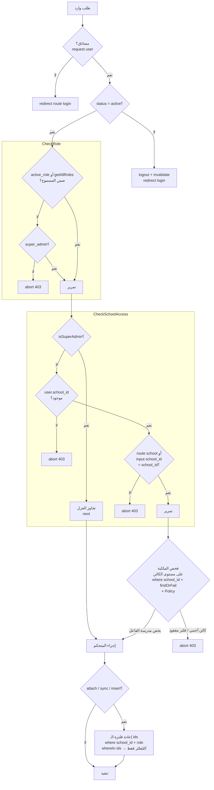

> **للبانِي (AI):** بوابة العزل ثلاثية الطبقات بترتيب مُلزِم: `CheckRole` (دور+حالة) ← `CheckSchoolAccess` (مستأجِر) ← فحص كائن صريح داخل المتحكم؛ الـ middleware وحده لا يكفي لأنه يقارن `route('school')`/`input('school_id')` فقط، فالمسارات ذات `{id}` تعتمد كلياً على فلتر المتحكم. عند أي `attach/sync/insert` أعِد فلترة المعرّفات إلى `school_id`+`role` للفاعل (لا تثق بـ`exists:users,id`)، وأَدرِج المُفلتَر فقط.

هذا القسم هو **الدستور الأمني المُلزِم** لنظام الهوية والمصادقة (Authentication) والتفويض (Authorization) وعزل المدارس متعدد المستأجرين (Multi-Tenancy) في منصة «وحي / قيمّ». كل قاعدة هنا **إلزامية** ويُمنع الانحراف عنها عند إعادة البناء. المصادقة في هذه المنصة **مكتوبة يدوياً (custom)** — لا يُستخدم Laravel Breeze ولا Fortify ولا أي scaffolding جاهز؛ تتولى المتحكمات (`AuthController`, `AuthApiController`) منطق تسجيل الدخول و2FA وإعادة تعيين كلمة المرور بنفسها.

> **القاعدة الجذرية (المصدر الوحيد للحقيقة في الأدوار):** مصدر الحقيقة الوحيد للتفويض هو **عمود نصّي** `users.role` (مع `users.secondary_roles` كـ JSON). حزمة `spatie/permission` مُثبَّتة وموصولة (trait `HasRoles`، جدول `model_has_roles`، استدعاء `assignRole()`)، **لكن لا قرار تفويض واحد يقرأ جداول spatie**. **يُمنع منعاً باتاً** أي policy أو middleware أو gate من قراءة pivot الخاص بـ spatie. **يجب** أن تبقى كل فحوص الأدوار على `users.role` النصّي، وإلا تباعد النظام بصمت.

---

### 4.1 نموذج الأدوار الخمسة (Roles Model)

توجد **خمسة أدوار ثابتة فقط**، مُمثَّلة كـ MySQL `ENUM` على `users.role` (الافتراضي `'student'`)، ويعكسها بدقّة الـ PHP enum في `app/Enums/UserRole.php`.

| القيمة (DB string) | UserRole case | التسمية (ar) | النطاق | الامتيازات |
|---|---|---|---|---|
| `super_admin` | `SuperAdmin` | مدير عام | غير مقيّد (Unscoped) | كل شيء — يتجاوز كل البوابات والـ policies |
| `school_admin` | `SchoolAdmin` | مدير مدرسة | مقيّد بـ `school_id` | إدارة مدرسته فقط |
| `teacher` | `Teacher` | معلم | مقيّد بـ `school_id` | فصوله/طلابه داخل مدرسته |
| `student` | `Student` | طالب | مقيّد بـ `school_id` | بياناته الخاصة داخل مدرسته |
| `parent` | `Parent` | ولي أمر | مقيّد بـ `school_id` | أبناؤه المرتبطون به |

```php
// app/Enums/UserRole.php — القيم الخمس هي عقد ثابت
enum UserRole: string
{
    case SuperAdmin = 'super_admin';
    case SchoolAdmin = 'school_admin';
    case Teacher = 'teacher';
    case Student = 'student';
    case Parent = 'parent';

    public function isAdmin(): bool          // SuperAdmin | SchoolAdmin
    { return in_array($this, [self::SuperAdmin, self::SchoolAdmin], true); }

    public function isScopedToSchool(): bool  // أي شيء عدا super_admin
    { return $this !== self::SuperAdmin; }

    public static function values(): array { /* القيم الخمس */ }
}
```

#### قواعد الأدوار المُلزِمة

- **يجب** أن يساوي `UserRole::values()` بدقّة قيم الـ ENUM في جدول `users` (خمس قيم: `super_admin`,`school_admin`,`teacher`,`student`,`parent`).
- **يُمنع** تفعيل الـ cast `$casts['role'] => UserRole::class` على `users.role` قبل تدقيق **كل** مقارنة `string-literal` (`$user->role === 'student'`) في الكود. العمود يبقى **نصّياً** للتوافق الخلفي؛ هذا قرار مقصود وموثّق داخل ملف الـ enum.
- الدور الأساسي في `users.role`. الأدوار الإضافية في `users.secondary_roles` (JSON array، nullable، `cast => array`). الدور النشط حالياً لمتعددي الأدوار في `users.active_role` (string، nullable) و/أو مفتاح الجلسة `active_role_{userId}`.
- **ENUM طلبات التسجيل أضيق:** `registration_requests.role` يحوي **ثلاث قيم فقط** (`teacher|student|parent`) — لا يُسمح بتسجيل عام لـ `school_admin` ولا `super_admin`.

#### دالة حسم الدور النشط (Active-Role Resolution) — ثابت مُلزَم

ترتيب الأسبقية لحسم الدور النشط هو **حرفياً متطابق** في ثلاثة مواضع، **يجب** أن تبقى متطابقة عند إعادة البناء:

```php
// 1) CheckRole::handle()
$activeRole = session('active_role_' . $user->id, $user->active_role ?? $user->role);
// 2) User::getActiveRoleAttribute()
// 3) AuthController::dashboard()
// المنطق الموحَّد: session('active_role_{id}') ?? users.active_role ?? users.role
```

---

### 4.2 جدول `users` و`schools` و`registration_requests` (DDL)

```sql
-- users (مبدأ المصادقة المركزي)
CREATE TABLE users (
  id                        BIGINT UNSIGNED PRIMARY KEY AUTO_INCREMENT,
  name                      VARCHAR(255) NOT NULL,
  email                     VARCHAR(255) NOT NULL UNIQUE,
  email_verified_at         TIMESTAMP NULL,
  password                  VARCHAR(255) NOT NULL,            -- cast 'hashed'
  password_change_required  BOOLEAN NOT NULL DEFAULT 0,        -- إجبار تغيير كلمة المرور المؤقتة
  two_factor_code           VARCHAR(6) NULL,                   -- hidden
  two_factor_expires_at     DATETIME NULL,
  two_factor_enabled        BOOLEAN NOT NULL DEFAULT 0,
  role                      ENUM('super_admin','school_admin','teacher','student','parent') NOT NULL DEFAULT 'student',
  secondary_roles           JSON NULL,                         -- cast array
  active_role               VARCHAR(255) NULL,
  qr_code                   VARCHAR(255) NULL UNIQUE,
  avatar                    VARCHAR(255) NULL,
  school_id                 BIGINT UNSIGNED NULL,              -- FK fk_users_school_id
  phone                     VARCHAR(20) NULL,
  birth_date                DATE NULL,
  status                    ENUM('active','inactive') NOT NULL DEFAULT 'active',
  remember_token            VARCHAR(100) NULL,
  total_points              INT NOT NULL DEFAULT 0,             -- DEAD: يُضاف في هجرة school_points؛ لا يُكتب إليه أبداً (الرصيد = SUM من points)
  weekly_points             INT NOT NULL DEFAULT 0,             -- DEAD (انظر §3.1)
  monthly_points            INT NOT NULL DEFAULT 0,             -- DEAD (انظر §3.1)
  created_at TIMESTAMP NULL, updated_at TIMESTAMP NULL,
  INDEX idx_users_school_id (school_id),
  CONSTRAINT fk_users_school_id FOREIGN KEY (school_id)
    REFERENCES schools(id) ON DELETE SET NULL
);

-- schools (المستأجر / Tenant)
CREATE TABLE schools (
  id            BIGINT UNSIGNED PRIMARY KEY AUTO_INCREMENT,
  name          VARCHAR(255) NOT NULL,
  logo VARCHAR(255) NULL, description TEXT NULL, address VARCHAR(255) NULL,
  city VARCHAR(255) NULL, country VARCHAR(255) NULL DEFAULT 'Saudi Arabia',
  contact_email VARCHAR(255) NULL, contact_phone VARCHAR(255) NULL,
  qr_code       VARCHAR(255) NULL UNIQUE,
  created_by    BIGINT UNSIGNED NULL,
  status        ENUM('active','inactive') NOT NULL DEFAULT 'active',
  teacher_token VARCHAR(255) NULL UNIQUE,   -- 32-char random
  student_token VARCHAR(255) NULL UNIQUE,
  parent_token  VARCHAR(255) NULL UNIQUE,
  teacher_qr TEXT NULL, student_qr TEXT NULL, parent_qr TEXT NULL,
  enable_teacher_registration BOOLEAN NOT NULL DEFAULT 1,
  enable_student_registration BOOLEAN NOT NULL DEFAULT 1,
  enable_parent_registration  BOOLEAN NOT NULL DEFAULT 1,
  created_at TIMESTAMP NULL, updated_at TIMESTAMP NULL
);

-- registration_requests (طلب تسجيل معلّق بانتظار موافقة مدير المدرسة)
CREATE TABLE registration_requests (
  id              BIGINT UNSIGNED PRIMARY KEY AUTO_INCREMENT,
  user_id         BIGINT UNSIGNED NULL,   -- FK users ON DELETE CASCADE (يُملأ عند الموافقة)
  school_id       BIGINT UNSIGNED NOT NULL,-- FK schools ON DELETE CASCADE
  name            VARCHAR(255) NOT NULL,
  email           VARCHAR(255) NULL,
  phone           VARCHAR(255) NULL,
  password        VARCHAR(255) NOT NULL,  -- bcrypt hashed
  role            ENUM('teacher','student','parent') NOT NULL,
  status          ENUM('pending','approved','rejected') NOT NULL DEFAULT 'pending',
  data            JSON NULL,              -- حقول إضافية خاصة بالدور
  approved_by     BIGINT UNSIGNED NULL,   -- FK users ON DELETE SET NULL
  rejected_reason TEXT NULL,
  approved_at     TIMESTAMP NULL,
  created_at TIMESTAMP NULL, updated_at TIMESTAMP NULL
);

-- password_reset_tokens (لا model مخصص — يُقرأ عبر DB facade)
CREATE TABLE password_reset_tokens (
  email      VARCHAR(255) PRIMARY KEY,
  token      VARCHAR(255) NOT NULL,   -- Hash::make(bin2hex random_bytes(32))
  created_at TIMESTAMP NULL           -- صلاحية 60 دقيقة مفروضة في الكود لا في الـ schema
);

-- sessions (database session driver — تُحذف جماعياً عند reset/تغيير كلمة المرور)
CREATE TABLE sessions (
  id            VARCHAR(255) PRIMARY KEY,
  user_id       BIGINT UNSIGNED NULL, INDEX (user_id),
  ip_address    VARCHAR(45) NULL,
  user_agent    TEXT NULL,
  payload       LONGTEXT NOT NULL,
  last_activity INT NOT NULL, INDEX (last_activity)
);
```

> **ثابت ENUM مُلزَم:** `users.role` يحوي 5 قيم بافتراضي `'student'`؛ `registration_requests.role` يحوي 3 قيم. **يجب** إبقاء كلا الـ ENUM متزامناً مع الكود.

---

### 4.3 تدفّقات التسجيل (Registration Flows)

#### (أ) التسجيل العام الذاتي — `POST /register`

```php
// AuthController::register — يُنشئ User مباشرةً بحالة inactive
// مُفعَّل فقط إذا setting('enable_registration', true) (الافتراضي true)
// الدور محصور في teacher|student|parent — لا تسجيل ذاتي لـ school_admin
// password: min:8 confirmed
// status = 'inactive'  -> لا يستطيع الدخول حتى يُفعّله admin
$user->assignRole(...); // spatie (موصول لكنه غير مُستخدَم في القرارات)
```

- **إلزامي:** بوّابة `setting('enable_registration', true)`؛ إن كانت `false` يُرفض المسار.
- **إلزامي:** الحساب يُنشأ بـ `status='inactive'` ولا يستطيع الدخول حتى يقلبه admin إلى `active`.
- **يُمنع** السماح بدور `super_admin` أو `school_admin` في هذا المسار. **لا يوجد تسجيل ذاتي لـ school_admin إطلاقاً** — يُنشأ حصراً عبر `admin.users` (super_admin).
- معدّل: `throttle:5,1`.

#### (ب) التسجيل العام المُرمَّز لكل مدرسة — `GET|POST /register/{role}/{token}`

```php
// PublicRegistrationController — لا يُنشئ User؛ يُنشئ RegistrationRequest بحالة pending
// يُحلّ المدرسة بـ: where('{role}_token', $token)
//                  ->where('enable_{role}_registration', true)->firstOrFail();  // 404 وإلا
$req = RegistrationRequest::create([
    'school_id' => $school->id,
    'role'      => $role,                  // teacher|student|parent
    'password'  => Hash::make($validated['password']), // bcrypt
    'status'    => 'pending',
    'data'      => $extraFields,           // JSON
]);
// إشعار school_admin للمدرسة عبر mail + database notification
```

- **إلزامي:** كل نموذج يعمل فقط عندما يطابق الـ token **و** يكون `enable_{role}_registration = true` (`firstOrFail` → 404 خلاف ذلك).
- **إلزامي:** البريد يجب أن يكون **فريداً عبر `users` وعبر `registration_requests`** معاً.
- **إلزامي:** كلمة المرور تُخزَّن مُشفَّرة (bcrypt) على الطلب — لا تُخزَّن نصاً مطلقاً.
- معدّل: `throttle:6,1`.

#### (ج) موافقة مدير المدرسة (School-Scoped Approval) — `POST /school-admin/requests/{id}/approve`

```php
// نطاق إلزامي: المدير يوافق فقط على طلبات مدرسته
$req = RegistrationRequest::where('school_id', Auth::user()->school_id)->findOrFail($id);

DB::transaction(function () use ($req) {
    $temp = 'Temp-' . Str::upper(Str::random(8));      // كلمة مرور مؤقتة
    $user = User::create([
        'school_id'                => $req->school_id,
        'role'                     => $req->role,
        'status'                   => 'active',
        'password'                 => Hash::make($temp),
        'password_change_required' => true,             // إجبار تغيير عند أول دخول
        'qr_code'                  => /* مُولَّد */,
    ]);
    $req->update(['status'=>'approved','approved_by'=>auth()->id(),'approved_at'=>now(),'user_id'=>$user->id]);
    // يُرسَل temp عبر البريد؛ إن فشل البريد يُعرَض نصاً في رسالة flash للتسليم اليدوي
});
```

- **إلزامي:** نطاق `where('school_id', $myschool)->findOrFail($id)` — يُمنع الموافقة على طلب مدرسة أخرى (IDOR).
- **إلزامي:** العملية كاملة داخل `DB::transaction`.
- **إلزامي:** كلمة مرور مؤقتة `Temp-` + 8 أحرف كبيرة عشوائية، مع `password_change_required = true`.

---

### 4.4 تسجيل الدخول والـ Throttle (Login + Brute-Force Protection)

```php
// AuthController::login — مفتاح الـ throttle لكل هوية:
$id = $request->ip() . '|' . hash('sha256', strtolower($request->email));
//   ^ يمنع قفل الضحية: مهاجم يضرب بريد الضحية من IP المهاجم يقفل (attackerIP|victimHash) فقط
```

| البند | القاعدة المُلزِمة |
|---|---|
| مفتاح الهوية | `ip + '|' + sha256(strtolower(email))` — **يُمنع** استخدام البريد وحده (يقفل الضحية) |
| عدّاد الفشل | cache `login_attempts_{id}` يزيد عند كل فشل، TTL **2h** |
| القفل التصاعدي | من الفشل **الرابع**: دقائق القفل = `30 * (attempts - 3)` (4=30د، 5=60د، 6=90د…) في `login_lockout_{id}` |
| النجاح | يمسح المفتاحين معاً |
| رسالة الخطأ | **واحدة عامة** `'بيانات الدخول غير صحيحة.'` لبريد مجهول **وكلمة مرور خاطئة** (لا user-enumeration، لا تسريب محاولات متبقية) |
| الحالة | بعد التحقق من كلمة المرور، يُرفض `status==='inactive'` برسالة مميزة |
| النجاح الكامل | `Auth::login()` + `session()->regenerate()` (دفاع تثبيت الجلسة) + احترام `remember` |
| validation | `password: min:6` عند الدخول |
| طبقات إضافية | route `throttle:20,1` + RateLimiter مسمّى `'login'` (5/min لكل `email|ip` + 20/min لكل `ip`) في `AppServiceProvider` |

> **ثابت بنيوي:** متجر الـ cache **يجب** أن يكون مشتركاً ودائماً (file/redis/db) — **يُمنع** سائق `array` وإلا تصبح الحماية من القوة الغاشمة بلا أثر (no-op).

---

### 4.5 المصادقة الثنائية 2FA (Email OTP)

تُفعَّل عبر **بوّابتين مستقلتين معاً**: `users.two_factor_enabled = true` **و** `setting('enable_2fa', true)` عالمياً.

```php
// عند وجوب 2FA: لا يُسجَّل الدخول؛ يُولَّد كود ويُرسَل
$code = random_int(100000, 999999);                  // 6 أرقام
$user->update(['two_factor_code'=>$code, 'two_factor_expires_at'=>now()->addMinutes(10)]);
Mail::to($user)->queue(new TwoFactorCodeMail($code)); // مُصطفّ — يلزم queue worker في الإنتاج
session(['two_factor_user_id'=>$user->id, 'two_factor_remember'=>$remember]);
return redirect()->route('two-factor.verify');
```

```php
// AuthController::verifyTwoFactor — التحقق بمقارنة زمن-ثابت
if (! hash_equals((string)$user->two_factor_code, (string)$request->code)) { /* فشل + backoff */ }
// نافذة نشاط جلسة 15 دقيقة (two_factor_last_activity) + انتهاء الكود 10 دقائق
// backoff خاص: two_factor_attempts_{userId} / two_factor_lockout_{userId} بنفس صيغة 30*(n-3) من الرابعة، TTL 1h
// عند النجاح: مسح الكود + Auth::login (احترام remember) + session regenerate
```

| المسار | القاعدة |
|---|---|
| `GET /two-factor/verify` | يتطلب `session('two_factor_user_id')`؛ يُجدّد رمز CSRF؛ يضبط `two_factor_last_activity`؛ **خارج** middleware `guest` للحفاظ على الجلسة؛ `throttle:10,1` |
| `POST /two-factor/verify` | `digits:6`؛ `hash_equals` + نافذة 15د + انتهاء 10د + backoff لكل مستخدم |
| `POST /two-factor/resend` | محدود **5 لكل 15 دقيقة لكل مستخدم** (مفتاح `2fa_resend:user:{id}`) فوق `throttle:5,1` |

#### قرار admin-force-2FA — **WONTFIX (مُلزَم)**

```
middleware Force2FAForAdmins (alias 'force-2fa') موجود ومُنفَّذ بالكامل،
لكنه ▸ غير مربوط ◂ بأي مجموعة مسارات (admin أو school-admin). — revert commit e05a8c9
```

- **يُمنع** ربط `force-2fa` بمجموعتي `admin` أو `school-admin`.
- **السبب الموثّق:** على الاستضافة المشتركة، super_admin غير المُسجَّل في 2FA قد يُحتجَز بإعادة توجيه خارج لوحته (admin lockout)؛ و`school_admin` ليس له صفحة تسجيل-ذاتي لـ 2FA (الكاتب الوحيد لـ `two_factor_enabled` هو نموذج `admin.users.edit` الخاص بـ super_admin فقط) فيصطدم بطريق 403 مسدود.
- 2FA يبقى **اختيارياً (opt-in)**: مستخدم مُفعِّل لـ `two_factor_enabled` ما زال يُتحدّى على الويب والـ API. المُعطَّل فقط هو **الإلزام (mandatory enrollment)**.
- لإعادة تفعيله مستقبلاً: لا تضف `force-2fa` للمجموعات **إلا** بعد تأكيد وجود صفحة تسجيل-ذاتي تعمل في الإنتاج.

---

### 4.6 إعادة تعيين كلمة المرور (Anti-Enumeration) والتغيير الإجباري

#### إعادة التعيين — `POST /forgot-password` ثم `POST /reset-password`

```php
// sendResetLink — محايد ضد التعداد وضد توقيت-التسريب
$token = bin2hex(random_bytes(32));
$hash  = Hash::make($token);          // يُحسب دائماً (كلفة ثابتة) حتى لو البريد غير موجود
if ($userExists) { DB::table('password_reset_tokens')->updateOrInsert(...); Mail::...; }
return back()->with('status', 'إن وُجد البريد، أُرسل رابط إعادة التعيين'); // رسالة واحدة دائماً

// resetPassword — يتحقق بدون exists:users
// validation: token + email + password(min:8 confirmed)  — لا exists:users (منع التعداد)
if (! Hash::check($token, $row->token)) { abort/back; }   // + TTL 60 دقيقة عبر created_at
$user->update(['password'=>Hash::make($pw), 'password_change_required'=>false, 'remember_token'=>Str::random(60)]);
DB::table('password_reset_tokens')->where('email',$email)->delete();
DB::table('sessions')->where('user_id',$user->id)->delete(); // قتل أي جلسة مُختطفة
```

- **إلزامي (anti-enumeration):** `forgot-password` يُرجع **نفس** الحالة المحايدة دائماً، ويُحسب `Hash::make` دائماً (كلفة ثابتة لهزم أوراكل التوقيت)، ولا يُدرج/يُرسل إلا إن وُجد البريد فعلاً.
- **إلزامي:** `reset-password` **بلا** `exists:users`.
- **إلزامي:** TTL = **60 دقيقة** عبر `created_at` (الجدول بلا عمود TTL — يُفرض في الكود؛ الرموز المنتهية تُحذف بكسل lazy).
- **إلزامي:** بعد إعادة التعيين: تدوير `remember_token` + **حذف كل صفوف `sessions`** للمستخدم.

#### التغيير الإجباري للكلمة المؤقتة (Forced Password Change)

```php
// CheckPasswordChangeRequired (global web) — يُشغَّل على كل طلب ويب
if (Auth::user()?->password_change_required) {
    // يُسمح فقط بـ: password.change, password.change.update, password.update, logout
    // كل ما عداها يُعاد توجيهه إلى password.change
}
// updatePassword: يتحقق من الحالية، يشترط new != current، يضبط الهاش الجديد،
//   يمسح الفلاغ، يُدوّر remember_token، يُعيد توليد الجلسة، Auth::logoutOtherDevices()
```

- **إلزامي:** أي مستخدم مصادَق عليه بـ `password_change_required=true` يُحتجَز على `password.change` ولا يصل لأي شيء آخر سوى المسارات الأربعة المسموحة.
- **إلزامي:** `updatePassword` يستدعي `Auth::logoutOtherDevices()` (يعتمد على database session driver).

---

### 4.7 حارس User::saving() — خط الدفاع الأخير ضد التصعيد بـ Mass-Assignment

```php
protected static function booted(): void
{
    static::saving(function (self $user) {
        if (! $user->exists) return;            // الإنشاء يتولاه المتحكمون — يُسمح
        if (app()->runningInConsole()) return;  // seeders/queue/artisan — يُتجاوز

        $actor = auth()->user();
        $isPrivileged = $actor && in_array($actor->role, ['super_admin','school_admin'], true);

        // active_role: اختيار ذاتي بين أدوار يملكها المستخدم (تبديل الدور)
        if ($user->isDirty('active_role') && ! $isPrivileged) {
            if (filled($user->active_role) && ! in_array($user->active_role, $user->getAllRoles(), true)) {
                abort(403, 'لا يمكن تفعيل دور غير مُسنَد للحساب');
            }
        }

        // الحقول المانحة للامتياز: admin فقط
        $sensitive = ['role','school_id','status','secondary_roles','password_change_required'];
        if (collect($sensitive)->filter(fn($f) => $user->isDirty($f))->isEmpty()) return;
        if ($isPrivileged) return;

        abort(403, 'غير مصرح بتعديل حقول حساسة في حساب المستخدم');
    });
}
```

- **إلزامي:** لمستخدم **موجود** يُعدَّل بواسطة فاعل **غير** `super_admin|school_admin`، يُجهَض (403) عند تَوسُّخ أيٍّ من `role, school_id, status, secondary_roles, password_change_required`.
- **إلزامي:** `active_role` مسموح **فقط** إن كانت القيمة الجديدة دوراً يملكه المستخدم أصلاً (`getAllRoles()`) — وهو خارج قائمة `$sensitive` كي لا يُرفض تبديل مشروع بـ 403.
- **يُتجاوز** الحارس لـ `runningInConsole()` (seeders/queue) وللسجلات الجديدة.
- **إلزامي:** إبقاء `$fillable` متزامناً مع الحارس؛ `password_change_required` ضمن `$fillable` لكنه **محروس**.

---

### 4.8 نموذج عزل المدارس (School Isolation / Multi-Tenancy) — قاعدة صلبة

> **القاعدة الصلبة:** عزل المدارس **ليس** مفروضاً عبر Global Query Scope. هو مفروض **لكل استعلام** عبر `->where('school_id', $school->id)` صريح قبل `findOrFail` في **كل** دالة متحكم لـ school_admin/teacher، **بالإضافة إلى** middleware `school.access`، **بالإضافة إلى** الـ Policies. **أي متحكم جديد ينسى فلتر `school_id` يُعيد فتح ثغرة IDOR عبر المدارس.**

#### الطبقات الخمس للعزل (Defense-in-Depth)

```
1) CheckRole (alias 'role')            — يبوّب مجموعة مسارات كل دور + يتحقق status==='active'
2) CheckSchoolAccess (alias 'school.access') — 403 إن لم يكن للمستخدم school_id، أو إن لم يطابق
3) فلتر صريح في كل متحكم               — Auth::user()->school_id قبل findOrFail (ScopedToSchool trait)
4) Policies                            — تعيد فحص ملكية school_id / created_by / sender-receiver
5) User::saving() guard                — يمنع التصعيد عبر mass-assignment
```

```php
// app/Http/Middleware/CheckSchoolAccess.php — الفحص الفعلي
public function handle(Request $request, Closure $next): Response
{
    $user = $request->user();
    if ($user && $user->isSuperAdmin()) return $next($request);          // super_admin يتجاوز
    if ($user && ! $user->school_id) abort(403, '...');                  // بلا مدرسة → 403
    $schoolId = $request->route('school') ?? $request->input('school_id');
    if ($schoolId && $user->school_id != $schoolId) abort(403, '...');   // عدم تطابق → 403
    return $next($request);
}
```

```php
// app/Http/Controllers/Concerns/ScopedToSchool.php — مسار إعادة الاستخدام المقصود
protected function currentSchool()        { return Auth::user()->school; }
protected function studentsInMySchool()   { return User::where('school_id', Auth::user()->school_id)->where('role','student'); }
protected function teachersInMySchool()   { return User::where('school_id', Auth::user()->school_id)->where('role','teacher'); }
protected function parentsInMySchool()    { return User::where('school_id', Auth::user()->school_id)->where('role','parent'); }
```

```php
// النمط الإلزامي في كل متحكم school-scoped — لا استثناء
$student = User::where('school_id', $school->id)->where('role','student')->findOrFail($id);
// عند ربط فصول: يُعاد التحقق من أن classroom.school_id == student.school_id (storeStudent/updateStudent)
```

#### مزالق العزل (Pitfalls — مُلزَمة)

- **`CheckSchoolAccess` لا يكفي وحده:** يقارن فقط بـ `route('school')` أو `input('school_id')`. المسارات التي تحمل مُعرِّف المستأجر تحت اسم آخر (مثل `{id}`) **ليست** مُغطّاة به وتعتمد **كلياً** على فلتر المتحكم الصريح. **يُمنع** افتراض أن الـ middleware وحده يمنع IDOR.
- **مجموعات teacher/student/parent تستخدم `{id}` لا `{school}`** — لذا `school.access` يفرض فقط 403 لغياب `school_id`، لا مطابقة-السجل؛ الفحوص على مستوى الكائن تعيش في المتحكمات.
- **يجب** أن يُعيد كل ربط many-to-many (student↔classroom، parent↔child، classroom↔teacher) التحقق من أن المُعرَّفات المرتبطة تنتمي لنفس المدرسة قبل `attach/sync`.
- **الثابت المُختبَر (Tested Invariant):** *لمستخدم غير-super_admin بـ `school_id = A`، أي طلب يستهدف سجلاً (user/classroom/activity/...) بـ `school_id = B ≠ A` يجب أن يُرجع 403 أو 404 — أبداً 200 ببيانات المدرسة B.*

---

### 4.9 تبديل الأدوار (Role Switching)

```php
// POST /switch-role/{role} — RoleSwitchController (POST فقط لحماية CSRF؛ غُيِّر من GET)
if (! in_array($role, $user->getAllRoles(), true)) abort(403);  // فقط دور يملكه المستخدم
$user->update(['active_role' => $role]);                        // + persist في DB
session(['active_role_' . $user->id => $role]);                 // + persist في الجلسة
return redirect()->to($user->getRoleDashboardRoute($role));     // لوحة الدور المُحوَّل إليه
```

- **إلزامي:** التبديل مسموح فقط إن كان الدور الهدف ضمن `$user->getAllRoles()` (الأساسي + secondary)؛ و`User::saving()` يحرس بشكل مستقل ضبط `active_role` لدور غير مملوك لغير-admin.
- ملاحظة: `getRoleDashboardRoute($role)` و`getRoleNameAr($role)` معلنتان **static** على `User` (يعملان عبر `->` لأن PHP يسمح بذلك)؛ **يجب** إبقاؤهما static بثبات.

---

### 4.10 مصادقة الـ API (Mobile — Sanctum)

```php
// POST /api/v1/login — Api\AuthApiController::login
// throttle: RateLimiter 5/min لكل ip|sha256(email)
if ($user->status !== 'active') return response()->json([...], 403);
if (/* 2FA مطلوب */) return response()->json(['code'=>'2fa_required', 'user_id'=>$user->id]);
$token = $user->createToken('mobile-app')->plainTextToken;  // Bearer
```

| المسار | القاعدة |
|---|---|
| `POST /api/v1/login` | يُرجع Bearer إلا إن لزم 2FA → `code='2fa_required' + user_id`؛ يرفض `status!=='active'` بـ 403 |
| `POST /api/v1/two-factor/verify` | `hash_equals` + انتهاء + RateLimiter لكل `ip|user_id`، ثم يُصدر Bearer |
| `POST /api/v1/logout` | يحذف **الرمز الحالي فقط** |
| `POST /api/v1/change-password` | يتحقق من الحالية ثم يحذف **كل الرموز الأخرى** |
| المحمية | `auth:sanctum` + نفس alias `role` (مثل `role:student`) |

- **إلزامي:** الويب والـ API ينفّذان **نفس** تدفّق 2FA ذي الخطوتين ويجب أن يبقيا متّسقين.

---

### 4.11 البوابات والـ Policies (Gates & Policies)

```php
// AppServiceProvider::boot
Gate::before(fn (User $user) => $user->role === 'super_admin' ? true : null); // super_admin = كل شيء
Gate::define('access-admin', fn (User $user) => $user->role === 'super_admin'); // يحرس /admin

// AuthServiceProvider — أربع policies مُسجَّلة فقط
Activity::class           => ActivityPolicy::class,
ActivitySubmission::class => ActivitySubmissionPolicy::class,
Lesson::class             => LessonPolicy::class,
Message::class            => MessagePolicy::class,
```

| Policy | القاعدة المُلزِمة |
|---|---|
| `LessonPolicy` | `update`/`delete` = **super_admin فقط** (المحتوى مركزي؛ المعلم لا يُعدّل)؛ `create` = teacher/school_admin/super_admin |
| `MessagePolicy` | `view` = المرسِل أو المستقبِل أو super_admin فقط |
| `ActivitySubmissionPolicy` | `view` يسمح أيضاً لـ parent عبر عضوية `$user->children()` |
| `ActivityPolicy` | يعيد فحص ملكية `school_id` / `created_by` قبل view/update/delete |

- **إلزامي:** `Gate::before` يُرجع `true` لـ super_admin على **كل** ability — كل الـ policies تسمح له بقصر-الدارة (short-circuit).
- **إلزامي:** `/admin` بأكمله محروس بـ `middleware('can:access-admin')` (super_admin فقط) — **يُمنع** «تبسيطه» إلى `role:super_admin` دون الحفاظ على دلالات `Gate::before`.
- كثير من النماذج **بلا policy** وتعتمد كلياً على نطاق `school_id` في المتحكم.

---

### 4.12 جدول طبقة الـ Middleware الكامل (Stack)

| Alias / الاسم | الصنف | الغرض | أين يُطبَّق |
|---|---|---|---|
| `role` | `CheckRole` | يتحقق `status==='active'` (يُخرج المعطَّل)، يحسم الدور النشط، يبوّب الدور؛ super_admin يمر دائماً | مجموعات school-admin/teacher/student/parent + API |
| `school.access` | `CheckSchoolAccess` | super_admin يتجاوز؛ بلا `school_id`→403؛ عدم تطابق `route('school')`/`input` →403 | مجموعات school-admin/teacher/student/parent |
| `can:access-admin` | Gate | يحرس مجموعة `/admin` كاملة (super_admin فقط) | مجموعة admin |
| `force-2fa` | `Force2FAForAdmins` | **موجود لكن غير مربوط** (WONTFIX) — كان يُلزم admins بـ 2FA | **لا شيء** (مقصود) |
| `CheckPasswordChangeRequired` | global web | يحتجز ذوي `password_change_required` على `password.change` | كل طلب ويب |
| `CheckPendingSurveys` | global web | يحمّل الاستبيانات الإلزامية المعلّقة للـ popup؛ يستثني super_admin/admin و`api/*` | كل GET غير-AJAX |
| `SetArabicLocale` | global web/api | يضبط اللغة العربية (RTL) | كل طلب |
| `CheckMaintenanceMode` | global web | وضع الصيانة عبر `setting('maintenance_mode')`؛ يستثني super_admin | كل طلب ويب |
| `ApplyTheme` | global web | يحقن متغيرات الثيم | كل طلب ويب |
| `SecurityHeaders` | global web/api | رؤوس الأمان (أدناه) | كل طلب |
| `VerifyCsrfToken` | web | مقارنة `hash_equals` + تجديد رمز CSRF على `GET /two-factor/verify`؛ `$except` فارغة | مجموعة web |
| `auth:sanctum` | API | حماية رموز الـ API | مسارات API المحمية |

**ترتيب الـ global web middleware (مُلزَم، يُضاف في `bootstrap/app.php`):**

```
SetArabicLocale → CheckMaintenanceMode → ApplyTheme → SecurityHeaders → CheckPasswordChangeRequired → CheckPendingSurveys
```
**الـ API يُسبق بـ:** `throttle:api` + `SetArabicLocale` + `SecurityHeaders`.

```php
// bootstrap/app.php — التسجيل الإلزامي
->withMiddleware(function (Middleware $middleware) {
    $middleware->alias([
        'role'          => CheckRole::class,
        'school.access' => CheckSchoolAccess::class,
        'force-2fa'     => Force2FAForAdmins::class, // مُعرَّف لكن غير مُطبَّق
    ]);
    $middleware->trustProxies(at: '*');   // إلزامي لـ isSecure()/HSTS خلف Cloudflare/Hostinger
    $middleware->web(append: [SetArabicLocale::class, CheckMaintenanceMode::class, ApplyTheme::class,
        SecurityHeaders::class, CheckPasswordChangeRequired::class, CheckPendingSurveys::class]);
})
```

#### رؤوس الأمان (SecurityHeaders)

- `X-Frame-Options: SAMEORIGIN`, `X-Content-Type-Options: nosniff`, `X-XSS-Protection`, `Referrer-Policy: strict-origin-when-cross-origin`, `Permissions-Policy`.
- `HSTS` فقط في الإنتاج عبر HTTPS.
- `CSP` يُشحَن كـ **`Content-Security-Policy-Report-Only`** (غير مفروض) مع السماح بـ `'unsafe-inline'/'unsafe-eval'` للـ inline Blade scripts. **هذا مقصود**: CSP للمراقبة لا الإنفاذ حتى تُرحَّل السكربتات إلى nonces. **يُمنع** ترقيته إلى مفروض دون ترحيل السكربتات.

---

### 4.13 مصفوفة الدور ← مجموعة المسار ← الـ Middleware

| الدور | البادئة (prefix) | بادئة الاسم | الـ Middleware المُطبَّق |
|---|---|---|---|
| `super_admin` | `/admin/*` | `admin.` | `auth` + `can:access-admin` *(force-2fa غير مُطبَّق — WONTFIX)* |
| `school_admin` | `/school-admin/*` | `school-admin.` | `auth` + `role:school_admin` + `school.access` *(force-2fa غير مُطبَّق)* |
| `teacher` | `/teacher/*` | `teacher.` | `auth` + `role:teacher` + `school.access` |
| `student` | `/student/*` | `student.` | `auth` + `role:student` + `school.access` |
| `parent` | `/parent/*` | `parent.` | `auth` + `role:parent` + `school.access` |
| guest | `/login`, `/register`, `/forgot-password`, `/reset-password/{token}` | — | `guest` + `throttle:20,1` (login) / `throttle:5,1` (register/email) |
| pending-2FA | `/two-factor/verify`, `/two-factor/resend` | `two-factor.` | `throttle:10,1` / `throttle:5,1` — **خارج `guest`** للحفاظ على الجلسة |
| API guest | `/api/v1/login`, `/api/v1/two-factor/verify` | — | `throttle:api` |
| API auth | `/api/v1/{logout,profile,change-password}` | — | `auth:sanctum` |
| API student | `/api/v1/student/*` | — | `auth:sanctum` + `role:student` |

```php
// routes/web.php — أنماط المجموعات الإلزامية
Route::prefix('admin')->name('admin.')->middleware(['auth','can:access-admin'])->group(...);
Route::prefix('school-admin')->name('school-admin.')->middleware(['role:school_admin','school.access'])->group(...);
Route::prefix('teacher')->name('teacher.')->middleware(['role:teacher','school.access'])->group(...);
Route::prefix('student')->name('student.')->middleware(['role:student','school.access'])->group(...);
Route::prefix('parent')->name('parent.')->middleware(['role:parent','school.access'])->group(...);
```

```php
// app/Providers/AppServiceProvider.php — RateLimiters المسمّاة (إلزامية)
RateLimiter::for('api',   fn ($r) => Limit::perMinute(60)->by($r->user()?->id ?: $r->ip()));
RateLimiter::for('login', fn ($r) => [
    Limit::perMinute(5)->by(strtolower($r->input('email')) . '|' . $r->ip()),
    Limit::perMinute(20)->by($r->ip()),
]);
```

---

### 4.14 ثوابت ومزالق مُلزَمة (تلخيص حاسم)

1. **مصدر التفويض هو `users.role` النصّي (+`secondary_roles`)** — لا spatie pivot. أبقِ الفحوص على العمود.
2. **`CheckRole` يتطلب `status==='active'`** (يُخرج المستخدم غير-النشط في منتصف الجلسة). super_admin يتجاوز فحص الدور بالكامل.
3. **حسم الدور النشط** = `session('active_role_{id}') ?? active_role ?? role` — **متطابق حرفياً** في `CheckRole` و`getActiveRoleAttribute` و`getCurrentRole` و`dashboard`.
4. **العزل ليس Global Scope** — هو `where('school_id',...)` صريح + `school.access` + Policies. أي متحكم ينسى الفلتر = IDOR.
5. **`User::saving()`** هو خط الدفاع الأخير ضد التصعيد بـ mass-assignment؛ أبقِ `$fillable` متزامناً معه.
6. **2FA ببوّابتين** (`two_factor_enabled` للمستخدم + `enable_2fa` عالمياً)؛ ويب و API متطابقان.
7. **`force-2fa` غير مربوط عمداً** (revert e05a8c9) — إعادته تقفل مديري المدارس خارج لوحاتهم.
8. **مفتاح throttle الدخول = `ip|sha256(email)`** لمنع قفل الضحية؛ متجر cache دائم إلزامي وإلا الحماية no-op.
9. **منع التعداد مقصود** — رسالة دخول عامة واحدة، forgot-password محايد دائماً مع hash ثابت الكلفة، reset بلا `exists:users`. أي رسالة «مفيدة» محددة تُعيد التعداد.
10. **التدفّقات تُدوّر `remember_token` وتُدمّر الجلسات الأخرى** — reset يحذف صفوف `sessions`، تغيير الكلمة يستدعي `logoutOtherDevices()`؛ يعتمدان على database session driver.
11. **CSP يُشحَن Report-Only** مع unsafe-inline/eval — مراقبة لا إنفاذ. `trustProxies('*')` إلزامي لـ HSTS/isSecure خلف Cloudflare/Hostinger.
12. **2FA codes مُصطفّة** — يلزم queue worker في الإنتاج لوصول رمز OTP.

---

### معايير القبول (Acceptance Criteria)

- [ ] عمود `users.role` هو ENUM بخمس قيم وافتراضي `student`؛ `registration_requests.role` بثلاث قيم؛ و`UserRole::values()` يطابق عمود `users` بالضبط.
- [ ] لا يقرأ أي middleware/policy/gate جداول spatie؛ كل فحص دور يقرأ `users.role` (+`secondary_roles`).
- [ ] تسجيل دخول بخمس محاولات فاشلة من نفس `ip|sha256(email)` يقفل من الرابعة بـ `30*(n-3)` دقيقة؛ والنجاح يمسح العدّاد والقفل.
- [ ] رسالة خطأ الدخول **واحدة عامة** لبريد مجهول وكلمة مرور خاطئة؛ ومستخدم `inactive` يُرفض برسالة مميزة بعد التحقق من الكلمة.
- [ ] عند `two_factor_enabled=true` و`enable_2fa=true`: لا يُسجَّل الدخول؛ يُولَّد كود 6 أرقام صالح 10 دقائق؛ والتحقق بـ `hash_equals` + نافذة 15 دقيقة + backoff خاص؛ والـ resend محدود 5/15دقيقة.
- [ ] `force-2fa` معرّف كـ alias لكنه **غير مربوط** بأي مجموعة مسارات.
- [ ] `forgot-password` يُرجع نفس الرسالة المحايدة ويحسب `Hash::make` دائماً حتى لبريد غير موجود؛ و`reset-password` بلا `exists:users` ويحذف كل صفوف `sessions` للمستخدم وفق TTL 60 دقيقة.
- [ ] مستخدم بـ `password_change_required=true` يُعاد توجيهه إلى `password.change` من أي مسار عدا (`password.change`, `password.change.update`, `password.update`, `logout`).
- [ ] `User::saving()` يُجهِض بـ 403 عند تعديل غير-admin لأيٍّ من `role/school_id/status/secondary_roles/password_change_required` على مستخدم موجود؛ ويُتجاوز في `runningInConsole` وللسجلات الجديدة.
- [ ] طلب من مستخدم غير-super_admin بـ `school_id=A` على سجل بـ `school_id=B` يُرجع 403/404 — لا 200 ببيانات B (الثابت المُختبَر للعزل).
- [ ] `/admin/*` محروس بـ `can:access-admin` (super_admin فقط)؛ ومجموعات school-admin/teacher/student/parent محروسة بـ `role:{role}` + `school.access`.
- [ ] ترتيب الـ global web middleware: `SetArabicLocale → CheckMaintenanceMode → ApplyTheme → SecurityHeaders → CheckPasswordChangeRequired → CheckPendingSurveys`؛ و`trustProxies('*')` مضبوط.
- [ ] `Gate::before` يُرجع `true` لـ super_admin على كل ability؛ و`LessonPolicy::update/delete` لـ super_admin فقط؛ و`MessagePolicy::view` للمرسِل/المستقبِل/super_admin.
- [ ] `POST /api/v1/login` يُرجع `2fa_required + user_id` عند لزوم 2FA ويرفض `inactive` بـ 403؛ والـ logout يحذف الرمز الحالي فقط؛ وchange-password يحذف كل الرموز الأخرى.
- [ ] `switch-role` هو POST فقط ويرفض (403) أي دور خارج `getAllRoles()`.

---

## 5. خدمات النطاق الأساسية: الاقتصاد والتلعيب والإشعارات

### 🗺️ المخططات المعمارية (Architecture Diagrams)

#### 🗺️ تتابُع الإيداع الذرّي — AwardService::award (idempotent)

يُظهر المخطط كيف يُطالِب `award()` بمفتاح الـidempotency أولاً عبر `insertOrIgnore` في `award_ledger`، فإن أُدرِج صفّ جديد يكتب نقاطاً/كوينز (واختياريّاً يوزّع) ويُرجِع true داخل معاملة واحدة، وإن كان المفتاح موجوداً يقصّر الدائرة قبل أي كتابة ويُرجِع false. الأرصدة دائماً `SUM` فقط (لا كتابة في `users.total_points`)، ولا يُؤخَذ أي قفل صفّ لأن الإيداع إلحاقيّ (append-only).

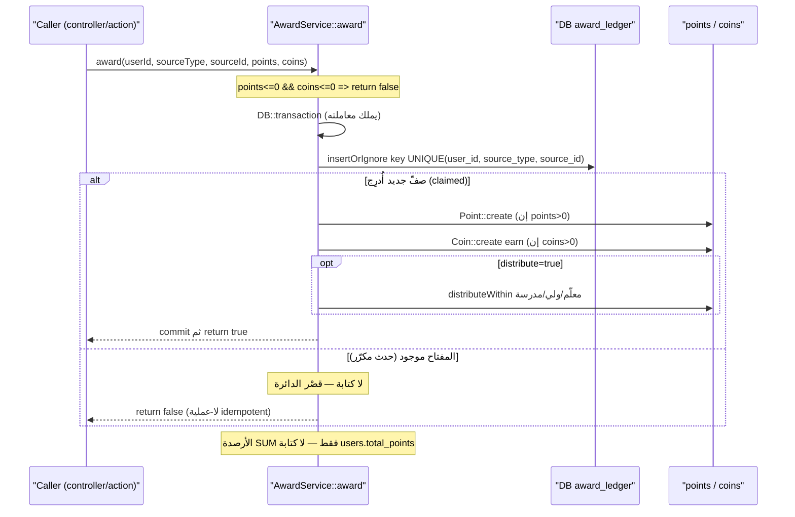

> **للبانِي (AI):** مفتاح الـidempotency هو `UNIQUE(user_id, source_type, source_id)='award_ledger_event_unique'`، والمطالبة به بـ`insertOrIgnore` تسبق أي كتابة Point/Coin؛ النتيجة 0 صفوف = قصْر الدائرة وإرجاع false. هذا بدائيّ CREDIT إلحاقيّ لا يأخذ قفل صفّ (الأقفال `lockForUpdate`/`SELECT FOR UPDATE` تخصّ مسار DEBIT في `SpendService` فقط)؛ والرصيد يُحسَب دائماً `SUM(points)`/`SUM(coins)` ولا يُكتَب أبداً في `users.total_points`.

#### 🗺️ تتابُع الخصم الآمن — SpendService::spend (لا سحب على المكشوف)

يُظهر المخطط مسار الخصم الذرّي داخل معاملة واحدة: قفل صف المستخدم (mutex)، فحص idempotency على award_ledger، حساب الرصيد من SUM(coins)، ثم الفشل المغلق عند نقص الرصيد أو الخصم (صف coin سالب + صف ledger) عند الكفاية — والتكلفة تُقرأ من الخادم لا من العميل.

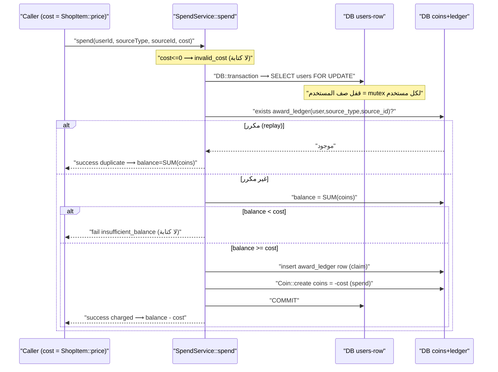

> **للبانِي (AI):** القفل على صف `users` (لا على `Coin` SUM) هو نقطة التسلسل الحقيقية لكل مستخدم؛ ابنِ الفحص والخصم داخل **نفس** القسم الحرج المقفول (لا check-then-act gap). مفتاح الـidempotency = `(user_id, source_type, source_id)` على `award_ledger`، والمسار يفشل مغلقاً عند نقص الرصيد دون أي كتابة. `$cost` **يجب** أن يُشتق من الخادم (`ShopItem::price`) ولا يُقرأ من العميل أبداً.

هذا القسم يُعرّف **منظومة النطاق المركزية** التي تتدفّق عبرها كل قيمة في منصة «وحي / قيمّ»: منح النقاط والعملات، صرف العملات، توزيع النقاط على المعلم/ولي الأمر/المدرسة، التصحيح الآلي، محرّك المستويات، لوحات الصدارة، والإشعارات. المنظومة مبنية على مبدأ صارم واحد: **الأرصدة دفترية فقط (ledger-only)** ولا يوجد عمود رصيد مُحدَّث حيّ لكل مستخدم. هذا القسم **مُلزِم**: يجب إعادة بناء `AwardService` و`SpendService` و`PointsDistributionService` بدلالاتها الذرّية وأقفالها **حرفيًّا** كما هو موصوف هنا.

---

### 5.0 المبادئ التأسيسية (Constitution)

| المبدأ | القاعدة المُلزِمة |
|---|---|
| **الأرصدة دفترية** | رصيد نقاط الطالب = `SUM(points)` على جدول `points`. رصيد العملات = `SUM(coins)` على جدول `coins`. **يُمنع** قراءة/كتابة عمود رصيد حيّ لكل مستخدم. |
| **الأعمدة الميتة** | `users.total_points / weekly_points / monthly_points` موجودة في الـ schema لكنها **ميتة** (دائمًا 0). **يُمنع** قراءتها أو الكتابة فيها مطلقًا. |
| **العداد الحيّ الوحيد** | `schools.total_points` هو العدّاد الحيّ الوحيد المسموح به، و**يجب** زيادته في كل منح نقاط مدرسة. |
| **صيغة المستوى الواحدة** | `level = intdiv(SUM(points)/100) + 1` (أي `floor(XP/100)+1`). مصدر واحد للحقيقة: `User::getLevelAttribute` و`GamificationService`. |
| **بوابة المنح الوحيدة** | كل **CREDIT** للنقاط/العملات **يجب** أن يمرّ عبر `AwardService::award`. |
| **بوابة الصرف الوحيدة** | كل **DEBIT** للعملات **يجب** أن يمرّ عبر `SpendService::spend`. |
| **التسعير من الخادم** | تكلفة أي صرف **إلزامي** أن تُشتقّ من الخادم (`ShopItem::price`)؛ **يُمنع** قبول قيمة `cost` من العميل. |
| **لا أرصدة سالبة** | الصرف **يفشل مغلقًا** (fail closed) عند نقص الرصيد: لا claim، لا debit، لا صف سالب. |
| **السجلّات غير قابلة للتعديل** | صفوف `points` و`coins` **يُمنع** تعديلها/حذفها خارج الـ console (الموديل يُطلق `abort(403)`). التصحيح يكون بصفوف تعويضية جديدة. |

---

### 5.1 جدول `award_ledger` — العمود الفقري للـ Idempotency

هذا الجدول هو **الضمان الوحيد** ضد المنح/الصرف المزدوج على مستوى قاعدة البيانات. صف واحد لكل حدث منطقي (منح أو صرف)، والقيد `UNIQUE(user_id, source_type, source_id)` يجعل التكرار **مستحيلًا بنيويًّا**.

```php
// database/migrations/2026_06_24_000001_create_award_ledger_table.php
Schema::create('award_ledger', function (Blueprint $table) {
    $table->id();
    $table->foreignId('user_id')->constrained('users')->cascadeOnDelete();
    $table->string('source_type', 64);
    $table->string('source_id', 64);
    $table->unsignedInteger('points')->default(0); // تدقيق: مبلغ النقاط الممنوحة
    $table->unsignedInteger('coins')->default(0);  // تدقيق: على صف الصرف = المبلغ المخصوم (موجَب)
    $table->timestamps();
    $table->unique(['user_id', 'source_type', 'source_id'], 'award_ledger_event_unique');
    $table->index(['source_type', 'source_id']);
});
```

> **TRAP مُلزِم:** على صف **صرف**، عمود `award_ledger.coins` يخزّن المبلغ المخصوم كقيمة **موجبة** (تدقيق فقط)، بينما الصف المقابل في جدول `coins` يكون **سالبًا**. **يُمنع** جمع `award_ledger.coins` كرصيد؛ الرصيد دائمًا `SUM` على جدول `coins`.

عائلات `source_type` المرصودة (varchar(64) — أبقِ المفاتيح قصيرة ومستقرّة = PK الصف الميداني):

```
activity_submission · pvp_match · parent_praise · parent_gift · family_activity
shop_purchase · reward_redemption · gamification_deduct · level_up
```

---

### 5.2 `AwardService` — بدائيّة المنح الذرّية المُمَيَّزة (CREDIT)

كلاس `final`، أساليب `static` فقط. يملك معاملته الخاصّة (`DB::transaction`). يُطالب بصف `award_ledger` أولًا عبر `insertOrIgnore`؛ نتيجة 0 صفوف تُقصِّر الدائرة **قبل** أي كتابة `Point`/`Coin`، فالنداء المكرّر (إعادة تصحيح، POST مُعاد، retry) **عمليّة لا-تأثير حقيقية**.

#### التوقيع الدقيق

```php
namespace App\Services;

final class AwardService
{
    /**
     * @return bool true عند المنح لأول مرة؛ false إذا سبق المنح (no-op) أو المبلغ غير موجب
     */
    public static function award(
        int $userId,
        string $sourceType,
        string $sourceId,
        int $points = 0,
        int $coins = 0,
        ?string $description = null,
        bool $distribute = false,
    ): bool;
}
```

#### التنفيذ المُلزِم (يُعاد بناؤه حرفيًّا)

```php
public static function award(int $userId, string $sourceType, string $sourceId,
    int $points = 0, int $coins = 0, ?string $description = null, bool $distribute = false): bool
{
    // مبلغ غير موجب → لا شيء يُكتب (المنح موجب فقط؛ السالب صرفٌ يُرفض هنا).
    if ($points <= 0 && $coins <= 0) {
        return false;
    }

    return DB::transaction(function () use ($userId, $sourceType, $sourceId, $points, $coins, $description, $distribute) {
        // (1) المطالبة بمفتاح الـ idempotency أولًا. 0 صفوف ⇒ سبق المنح.
        $claimed = DB::table('award_ledger')->insertOrIgnore([
            'user_id'    => $userId,
            'source_type'=> $sourceType,
            'source_id'  => $sourceId,
            'points'     => max(0, $points),
            'coins'      => max(0, $coins),
            'created_at' => now(),
            'updated_at' => now(),
        ]);

        if (! $claimed) {
            return false; // SHORT-CIRCUIT قبل أي Point/Coin/توزيع.
        }

        if ($points > 0) {
            Point::create([
                'user_id' => $userId, 'points' => $points,
                'source'  => $sourceType, 'description' => $description,
            ]);
        }

        if ($coins > 0) {
            Coin::create([
                'user_id' => $userId, 'coins' => $coins,
                'source'  => $sourceType, 'transaction_type' => 'earn',
                'description' => $description,
            ]);
        }

        if ($distribute) {
            app(PointsDistributionService::class)->distributeWithin(
                User::findOrFail($userId), $points, $sourceType, (string) ($description ?? ''),
            );
        }

        return true;
    });
}
```

#### دلالات مُلزِمة

- **لا قفل صفّ بالتصميم:** المنح **append-only** (لا read-modify-write لأن الرصيد = `SUM`)، فلا توجد سباق read-modify-write ولا يُؤخذ أي row lock. القيد `UNIQUE(user_id, source_type, source_id)` هو **آليّة الـ idempotency الوحيدة**.
  > **TRAP:** **يُمنع** «إصلاح» هذا بإضافة قفل، و**يُمنع** الاعتماد عليه لتسلسل عمليات الصرف. سلامة التزامن للـ credits = القيد الفريد فقط، لا غير.
- **حدود المعاملة:** `award()` يملك معاملته؛ **يُمنع** على المستدعي فتح معاملة لمجرّد لفّ المنح. عندما يجب أن تكون كتابات أخرى ذرّية مع المنح (مثل تعليم submission كمُصحَّح + المنح)، ينفّذ المستدعي تلك الكتابات **ثم** يستدعي `award()` أخيرًا.
- **الذرّية مع التوزيع:** `distribute:true` يستدعي `distributeWithin` (الصارم، يرمي) داخل نفس المعاملة؛ فشل أي طرف يُرجِع الاستثناء فتتراجع المعاملة كاملةً (بما فيها منح الطالب) — **لا توزيع جزئي، لا نافذة مُعلَّمة-غير-ممنوحة**.
- **القيمة المُرجَعة:** `false` تعني «لا منح جديد» سواءً لمبلغ غير موجب أو لتكرار. المستدعي الذي يحتاج التمييز (مثل PvP لتفادي تكرار الإشعار) **يجب** أن يعامل `false` كـ «لا ائتمان جديد».

---

### 5.3 `SpendService` — بدائيّة الصرف الذرّية المضمونة ضد العجز (DEBIT)

كلاس `final`، أساليب `static` فقط. داخل معاملة واحدة: (1) `SELECT` صف `users` `FOR UPDATE` كـ **mutex لكل مستخدم**؛ (2) فحص idempotency على `award_ledger`؛ (3) فحص القدرة (`SUM(coins) >= cost`) والإدراج السالب في **نفس المقطع الحرج**. التكلفة `int` مُشتقّة من الخادم حصرًا.

#### التوقيع الدقيق

```php
namespace App\Services;

final class SpendService
{
    /**
     * @param int $cost سعر مشتقّ من الخادم (لا قيمة عميل أبدًا)
     * @return array{success: bool, reason: string, balance: int, duplicate: bool}
     *         reason ∈ {invalid_cost, duplicate, insufficient_balance, charged}
     */
    public static function spend(
        int $userId,
        string $sourceType,
        string $sourceId,
        int $cost,
        ?string $description = null,
    ): array;
}
```

#### التنفيذ المُلزِم (يُعاد بناؤه حرفيًّا)

```php
public static function spend(int $userId, string $sourceType, string $sourceId, int $cost, ?string $description = null): array
{
    if ($cost <= 0) {
        return ['success' => false, 'reason' => 'invalid_cost', 'balance' => 0, 'duplicate' => false];
    }

    return DB::transaction(function () use ($userId, $sourceType, $sourceId, $cost, $description) {
        // (1) تسلسل عمليات صرف هذا المستخدم على صف users الموجود دائمًا.
        DB::table('users')->where('id', $userId)->lockForUpdate()->first();

        // (2) idempotency: تحت القفل، إعادة الحدث نفسه = لا-تأثير (مخصوم مرة واحدة).
        $alreadyDone = DB::table('award_ledger')
            ->where(['user_id' => $userId, 'source_type' => $sourceType, 'source_id' => $sourceId])
            ->exists();
        if ($alreadyDone) {
            return [
                'success'   => true, 'reason' => 'duplicate',
                'balance'   => (int) Coin::where('user_id', $userId)->sum('coins'),
                'duplicate' => true,
            ];
        }

        // (3) القدرة + الخصم في نفس المقطع الحرج (تحت القفل) — لا فجوة check-then-act.
        $balance = (int) Coin::where('user_id', $userId)->sum('coins');
        if ($balance < $cost) {
            return ['success' => false, 'reason' => 'insufficient_balance', 'balance' => $balance, 'duplicate' => false];
        }

        // (4) المطالبة بالحدث (تدقيق + حارس إعادة) ثم كتابة الصف السالب.
        DB::table('award_ledger')->insert([
            'user_id' => $userId, 'source_type' => $sourceType, 'source_id' => $sourceId,
            'points'  => 0, 'coins' => $cost, // تدقيق: المبلغ المخصوم (موجَب)
            'created_at' => now(), 'updated_at' => now(),
        ]);

        Coin::create([
            'user_id' => $userId, 'coins' => -$cost,
            'transaction_type' => 'spend', 'source' => $sourceType, 'description' => $description,
        ]);

        return ['success' => true, 'reason' => 'charged', 'balance' => $balance - $cost, 'duplicate' => false];
    });
}
```

#### دلالات مُلزِمة

- **TRAP حرج:** القفل **يجب** أن يكون على صف `users` (الموجود دائمًا والمشترك بين كل عمليات صرف المستخدم) — **وليس** على `Coin::...->lockForUpdate()` فوق `SUM(coins)`، لأن قفل مجموعة فارغة/منفصلة على محفظة جديدة **لا يُسلسِل شيئًا** ويسمح بالعجز (وهو الخلل الحيّ السابق).
- **INVARIANT:** فحص القدرة `SUM(coins)` والإدراج السالب **يجب** أن يبقيا داخل نفس المقطع الحرج تحت القفل؛ فصلهما يُعيد سباق العجز check-then-act.
- **قفل صفّ واحد فقط** ⇒ لا تعدّد أقفال ⇒ **لا deadlock** من هذا المسار.
- **TRAP للمستدعي:** نتيجة `duplicate` تُرجِع `success=true`. المستدعون (`purchaseItem`, `redeemReward`) **يجب** أن يفحصوا علامة `duplicate` لتفادي إعادة ربط الملكية أو إنقاص المخزون مرّة ثانية.
- **اصطلاحات مفتاح الـ idempotency للصرف:** `shop_purchase` يستخدم `item id` (شراء واحد لكل عنصر)؛ `reward_redemption` يستخدم رمز عميل لكل نية (استبدالات متكرّرة)؛ `gamification_deduct` يستخدم مفتاح المستدعي أو UUID عشوائي.

---

### 5.4 الجداول الدفترية: `points` و`coins`

كلاهما **append-only**؛ الموديل يُطلق `abort(403)` على UPDATE/DELETE خارج الـ console (دفاع في العمق)، ويُبطِل كاش لوحات الصدارة عند الإدراج.

```php
// points
$table->id();
$table->foreignId('user_id')->constrained('users')->cascadeOnDelete();
$table->integer('points'); // موقَّع (يمكن أن يكون سالبًا)
$table->string('reason')->nullable();             // legacy
$table->string('source', 100)->nullable();        // عائلة الحدث
$table->string('description', 500)->nullable();
$table->foreignId('activity_id')->nullable()->constrained()->nullOnDelete();
$table->foreignId('lesson_id')->nullable()->constrained()->nullOnDelete();
$table->timestamps();
$table->index('user_id');

// coins
$table->integer('coins'); // موقَّع: + كسب / - صرف
$table->string('transaction_type')->nullable(); // earn|spend|bonus
// + reason/source/description/timestamps/index(user_id) كأعلاه
```

> **ملاحظة ترتيب الـ migrations:** الهجرة `2026_05_04_000001_align_points_coins_columns` تضيف `source/description` للجدولين اللذين كانا يملكان `reason` فقط؛ خدمات الاقتصاد تعتمد عليها. `award_ledger` (2026_06_24) هي الأحدث وهي العمود الفقري.

---

### 5.5 `PointsDistributionService` — التوزيع على المعلم/ولي الأمر/المدرسة

`namespace App\Services\Activity`. يوزّع نسبة ثابتة من نقاط الطالب: **معلم 10% · ولي أمر 5% · مدرسة 2%**، وكل مبلغ `max(1, floor(points * pct))` (فأيّ منح صغير يمنح ≥1 لكل مستلِم موجود).

| الثابت | القيمة |
|---|---|
| `TEACHER_PERCENTAGE` | `0.10` |
| `PARENT_PERCENTAGE` | `0.05` |
| `SCHOOL_PERCENTAGE` | `0.02` |

#### وضعا التشغيل (الفرق المُلزِم)

```php
// لينِن/legacy: كل طرف في try/catch مستقل — فشل طرف لا يُفشل البقية ولا يرمي.
// يُستخدم في مسارات ما بعد commit حيث لا معاملة محيطة.
public function distribute(User $student, int $points, string $source, string $description): void;

// صارم/atomic: لا try/catch — أي فشل يرمي فتتراجع معاملة AwardService كاملةً.
// يُستخدم من داخل معاملة AwardService (distribute:true).
public function distributeWithin(User $student, int $points, string $source, string $description): void;
```

> **TRAP:** **يُمنع** استبدال `distributeWithin` بـ `distribute` داخل معاملة (يبتلع الأخطاء فيكسر الذرّية)، و**يُمنع** استدعاء `distribute` حيث تلزم الذرّية. اختيار الخطأ إمّا يفقد التوزيع صامتًا أو يكسر الذرّية.

#### قواعد المستلِمين

- **المعلم:** `TeacherPoint::firstOrCreate(['teacher_id' => $teacher->id], ...)` (قيد `UNIQUE(teacher_id)` ⇒ **صف واحد مجمّع لكل معلم**) ثم `increment` على `points` و`students_total_points` (بكامل نقاط الطالب) و`students_count` (بـ 1). المعلم يُستخرج عبر `student->classrooms()->with('teacher:id')->first()`.
  > **CONFLICT مُلزِم:** **يُمنع** نمط `PointsService::calculateTeacherPoints` (insertGetId لصف جديد لكل حدث) لأنه يخالف `UNIQUE(teacher_id)`. استخدم نمط increment-aggregate حصرًا.
- **ولي الأمر:** `ParentPoint::create([...])` صفّ لكل حدث (`reference_type = source`, `reference_id = student->id`). ولي الأمر يُستخرج من جدول `parent_student`.
- **المدرسة:** `SchoolPoint::create([...])` **و** `School::where('id', ...)->increment('total_points', $schoolPoints)`.
  > **TRAP:** إن كُتبت نقاط مدرسة دون زيادة `schools.total_points` انحرفت لوحة صدارة المدارس صامتًا (تقرأ العداد الحيّ المُنَقَّح).

---

### 5.6 المصادر الشاملة التي تَسُكّ/تَصرِف — كلّها يجب أن تُوجَّه عبر البدائيّات

الحالة المُتصلَّبة (hardened end-state) **تُلزِم** توجيه كل سَكّ عبر `AwardService::award` وكل صرف عبر `SpendService::spend`. الجدول التالي هو الخريطة الكاملة:

| المصدر | الموقع | البدائيّة المُلزِمة | `source_type` | `source_id` |
|---|---|---|---|---|
| **submitReview** (تصحيح معلم) | `TeacherController::review` | `AwardService::award(distribute:true)` | `activity_submission` | `submission.id` |
| **submitExercise** (تمرين) | `TeacherController`/Practice | `AwardService::award` | `practice_attempt` | `attempt.id` |
| **SubmitActivity** (تقديم نشاط) | `SubmitActivityAction` | `AwardService::award(distribute:true)` | `activity_submission` | `submission.id` |
| **gradeTeamActivity** (نشاط فريق) | `TeacherController` | `AwardService::award` لكل عضو | `team_activity` | `assignment.id:member.id` |
| **PvP** (دفع الفائز) | `StudentController` | `AwardService::award(winnerId, ...)` | `pvp_match` | `match.id` |
| **sendGift** (هدية ولي أمر) | `ParentController::sendGift` | `AwardService::award(child, ...)` | `parent_gift` | `gift.id` |
| **praiseChild** (مديح) | `ParentController::praiseChild` | `AwardService::award(child, ...)` | `parent_praise` | `praise.id` |
| **approveFamilyActivity** | `ParentController` | `AwardService::award(...)` | `family_activity` | `submission.id` |
| **redeemReward** (استبدال مكافأة) | `StudentController::redeemReward` | `SpendService::spend` | `reward_redemption` | client redemption token |
| **purchaseItem** (شراء متجر) | `StudentController::purchaseItem` | `SpendService::spend((int)$item->price)` | `shop_purchase` | `item.id` |
| **deductCoins** (خصم تلعيب) | `GamificationService::deductCoins` | `SpendService::spend` | `gamification_deduct` | مفتاح مستقر أو UUID |

#### قواعد سَكّ/صرف مُلزِمة

- **منح تقديم النشاط:** `xp = round((score/100) * activity.points)`. عند `score === null` (مراجعة يدوية): `xp = 0`. عملات النشاط: `coins = max(1, floor(xp/2))`. يُمنح بـ `distribute:true` ليكون توزيع المعلم/ولي الأمر/المدرسة ذرّيًّا مع منح الطالب.
- **إعادة التصحيح = لا-تأثير اقتصادي:** كلٌّ من التصحيح اليدوي والآلي يُمَيِّز المنح على `(activity_submission, submission.id)`، فالـ XP/العملات/التوزيع تُمنح **مرّة واحدة بالضبط**.
- **التسعير من الخادم:** `redeemReward` و`purchaseItem` **يجب** أن يرفضا أي حقل `cost` من العميل ويمرّرا `(int) $item->price`.
- **المتجر:** شراء واحد لكل عنصر لكل مستخدم، يُفرَض بمفتاح الصرف `(shop_purchase, itemId)` + `hasPurchased()`؛ المخزون يُنقَص بـ UPDATE شرطي ذرّي (`WHERE stock>0 SET stock=stock-1`)؛ العنصر يُقلَب `sold_out` عند 0؛ `price_paid` يُسجَّل من `ShopItem::price`.

> **PITFALL مُلزِم (ديون قائمة يجب معالجتها عند إعادة البناء):** مسارات سَكّ تتجاوز `AwardService` حاليًّا وليست idempotent — **يجب** ترحيلها كلّها إلى البدائيّات:
> 1. مسار الويب النشط `StudentController::submitActivity` (مسار inline قديم: `Point::create` + `Coin::create` + `distributePoints` لينِن) — **يجب** وصله بـ `SubmitActivityAction` المُمَيَّز.
> 2. `Admin\DashboardController::saveReview` يَسُكّ عبر `PointsService::awardStudentPoints` (إدراج خام، بلا `award_ledger`).
> 3. مكافأة سلسلة النشاط في `StudentController` (سطر `Point::create` ~991) ومنطق سلسلة الدروس.
> 4. `GamificationService::addXP` و`addCoins` (إدراجات خام) — فقط `deductCoins` رُحِّل إلى `SpendService`.

---

### 5.7 `GamificationService` — محرّك XP/المستوى/العملات (instance)

#### التوقيعات

```php
class GamificationService
{
    // ترانزاكشنال + lockForUpdate + 3 محاولات deadlock
    public function addXP($studentId, $points, $source, $description): array; // {old_level, new_level, level_up}
    public function addCoins($studentId, $coins, $source, $description): bool;  // wrapper ترانزاكشنال
    public function deductCoins($studentId, $coins, $description, ?string $idempotencyKey = null): array; // {success, remaining, message}
    public function getStudentStats($studentId): array;
    protected function addCoinsRaw($studentId, $coins, $source, $description): bool; // إدراج خام للاستخدام داخل معاملات أخرى
}
```

#### دلالات `addXP` المُلزِمة

```php
$result = DB::transaction(function () use (...) {
    // قفل صفوف نقاط الطالب لمنع Level Up مزدوج عند تقديمين متزامنين
    $currentXP = (int) DB::table('points')->where('user_id', $studentId)->lockForUpdate()->sum('points');
    $oldLevel  = (int) floor($currentXP / 100) + 1;

    DB::table('points')->insert([...]);

    $newXP    = $currentXP + (int) $points;
    $newLevel = (int) floor($newXP / 100) + 1;
    $leveledUp = $newLevel > $oldLevel;

    if ($leveledUp) {
        // مكافأة Level Up داخل نفس المعاملة (ذرّية مع XP)
        $this->addCoinsRaw($studentId, $newLevel * 10, 'level_up', "...");
    }
    return ['old_level' => $oldLevel, 'new_level' => $newLevel, 'level_up' => $leveledUp];
}, 3);

// الأحداث/الإشعارات بعد commit (تجنّب الإطلاق ثم Rollback) — مغلّفة بـ try/catch
if ($result['level_up']) {
    event(new LevelUp($student, $result['new_level'], $result['old_level']));
    NotificationService::levelUp($studentId, $result['new_level']);
}
```

- **مكافأة الترقية:** عند عبور حدّ 100-نقطة، تُمنح `coins = newLevel * 10` ذرّيًّا مع إدراج XP؛ ويُطلق `LevelUp` event + إشعار `levelUp` **فقط بعد** commit.
- **`deductCoins`:** يفوّض إلى `SpendService::spend` بـ `sourceType = 'gamification_deduct'`، ومفتاح = `$idempotencyKey ?? (string) Str::uuid()`.
  > **PITFALL:** بدون مفتاح مستقر، `deductCoins` **ليست** replay-safe (UUID عشوائي لكل نداء). على المستدعين الذين يحتاجون أمان الإعادة تمرير مفتاح مستقر.
  > **PITFALL:** `addXP`/`addCoins` مساران مُوازيان (إدراجات خام، بلا idempotency دفترية)؛ retry لمستدعي `addXP` قد يمنح مرّتين.

#### `getStudentStats` المُلزِم

```php
$totalXP    = (int) DB::table('points')->where('user_id', $studentId)->sum('points');
$totalCoins = (int) DB::table('coins')->where('user_id', $studentId)->sum('coins');
$currentLevel    = (int) floor($totalXP / 100) + 1;
$xpForNextLevel  = ($currentLevel * 100) - $totalXP;
$badges          = DB::table('user_badges')->where('user_id', $studentId)->count(); // الجدول user_badges (لا badge_user)
```

> **TRAP — فخّ أسماء أعمدة السلسلة:** الكود الحاليّ يقرأ `$streak->current_days / longest_days` بينما الأعمدة الفعلية في جدول `streaks` هي `current_streak / longest_streak` (فيُرجِع 0 صامتًا). الـ schema القانوني هو `current_streak / longest_streak`، والقراءة الصحيحة **يجب** أن تستخدمهما.

---

### 5.8 التلعيب: الأوسمة (Badges) والتيجان (Crowns) والسلاسل (Streaks)

| الكيان | قاعدة التفرّد المُلزِمة |
|---|---|
| **Badge** ⇄ `user_badges` | `UNIQUE(user_id, badge_id)` — كل وسام مرّة واحدة لكل مستخدم. `earned_at` على الـ pivot. الجدول اسمه **`user_badges`** (لا `badge_user` الافتراضي). |
| **Crown** | `UNIQUE(user_id, value_id)` — تاج واحد لكل قيمة لكل مستخدم. |
| **Streak** (عالمي) | `UNIQUE(user_id)` — أيام متتالية: `current_streak / longest_streak / last_activity_date`. |
| **ActivityUserStreak** | `UNIQUE(user_id)` — أيام **غير متتالية** كمصفوفة `activity_dates` JSON؛ `completed_days = count(dates)`. تسجيل يوم ذرّي تحت `lockForUpdate` (3 محاولات)؛ تاريخ موجود = لا-تأثير. |
| **LessonUserStreak** | `UNIQUE(user_id, lesson_id)` — مثل أعلاه لكل (مستخدم، درس)؛ يقرأ إعدادات `lessons.streak_*`. |

> **INVARIANT حرج:** `checkAndClaimBonus` في `ActivityUserStreak`/`LessonUserStreak` **يُعَلِّم** `bonus_claimed` لكنه **يُمنع** أن يُنشئ صف `Point` للمكافأة بنفسه — **المستدعي** (controller/action) هو من يمنح المكافأة مرّة واحدة بالضبط (خلل سابق كان يمنح مرّتين عندما أنشأ الموديل النقطة أيضًا).

---

### 5.9 `ActivityGradingService` — المُصحِّح الآلي الموحّد (static, pure)

دالّة واحدة: `grade(Activity $activity, mixed $rawAnswer): ?int` تُرجِع `0..100` أو **`null` = مراجعة يدوية**. لا كتابات DB، لا أثر اقتصادي.

```php
public static function grade(Activity $activity, $rawAnswer): ?int;
public static function passingScoreFor(Activity $activity): int; // افتراضي 50
```

#### قواعد فشل-آمن مُلزِمة

- أنواع النشاط **اليدوية دائمًا:** `essay, upload, creative, project, practical, discussion` (وعلى مستوى السؤال: `file_upload`) ⇒ `null`.
- عند **غياب مفتاح إجابة صالح** ⇒ يُرجِع `null` (مراجعة يدوية) بدل صفر زائف أو تطابق كاذب.
- **الكويز متعدّد الأسئلة:** أي سؤال غير مُمفتَح أو يدوي يجعل الكويز كلّه يُرجِع `null` (يمنع تضخيم النسبة بالقسمة على الأسئلة المُصحَّحة فقط).
- **`image_order`:** **يجب** التحقق أن التبديلة المختارة تساوي `{1..n}` فريدة بلا تكرار قبل التسجيل، وإلا تتضخّم الدرجة.
- **`resolveKey`** يوحّد صِيَغ المفتاح المتعددة: `correct_index`، `correct` (كفهرس رقمي)، `options[].is_correct`، `correct_answer`، `answer`، `correct` (كنص)، و(لـ letter_choice) `word/target_word`. **يُمنع** ترميز شكل واحد فقط (يُخطئ تصحيح محتوى البذرة/القديم).
- **`toBool`** يُرجِع `null` للقيم الغامضة (مثل `2, 3, ''`) لتفادي التطابق الكاذب في true/false.
- **تطبيع النص العربي:** lowercase + إزالة التشكيل/التطويل + توحيد الألف/الياء/التاء المربوطة + ضغط المسافات.

الأنواع المدعومة آليًّا: `multiple_choice, true_false, short_answer, letter_choice, word_ordering, sentence_ordering, image_ordering, image_order`، وكويز متعدّد الأسئلة (نسب جزئية).

---

### 5.10 `NotificationService` — مصنع الإشعارات (static)

موديل `Notification` متعدّد الأشكال، PK **UUID نصّي** يُضبط عند `creating`؛ `notifiable_type` مُرمَّز ثابتًا `'App\Models\User'`.

#### التوقيعات وترتيب الوسائط المُلزِم

```php
// النواة: التحقق من وجود المستخدم (وإلا log + null، لا orphan) + dedup خلال 5 دقائق
public static function create($userId, $type, $title, $message, $data = [], $actionUrl = null): ?Notification;

// wrapper متوافق-قديمًا — انتبه لترتيب الوسائط المختلف (title قبل message، type رابعًا):
public static function send($userId, $title, $message, $type = 'general', $actionUrl = null, $data = []);

// قُرّاء
public static function getUserNotifications($userId, $limit = 10, $unreadOnly = false);
public static function getUnreadCount($userId);
public static function markAllAsRead($userId);
```

المساعدات المُكتَّبة (كلّها تستدعي `create`): `activityCompleted, levelUp, badgeEarned, streakMilestone, activityGraded, parentNotification, teacherMessage, newActivity, homeworkReminder, homeworkOverdue, schoolAdminNotification, newRegistrationRequest`.

#### حُرّاس مُلزِمون

- **منع الـ orphan:** إن لم يوجد المستخدم ⇒ تُسجَّل تحذيرة وتُرجَع `null` (لا إشعار).
- **منع الـ spam:** إشعار مطابق `(notifiable_id + type + title)` خلال آخر 5 دقائق يُمنَع (`return null`).
- **الـ PK نصّي:** عامِل الـ ids كـ strings.

---

### 5.11 `PointsService` — مسار قديم (static) [للتوافق فقط]

موجود للتوافق مع المسارات القديمة + قُرّاء لوحات الصدارة. الحالة المُتصلِّبة **تُفضِّل** `AwardService::award(distribute:true)`.

```php
public static function awardStudentPoints(int $studentId, int $points, string $source, ?string $description = null): array;
public static function getStudentLeaderboard(int $limit = 20, ?int $schoolId = null, ?int $classroomId = null): array;
public static function getTeacherLeaderboard(int $limit = 20, ?int $schoolId = null): array;
public static function getParentLeaderboard(int $limit = 20, ?int $schoolId = null): array;
public static function getSchoolLeaderboard(int $limit = 20): array;
```

- **قُرّاء لوحات الصدارة:** الطلاب/المعلمون/أولياء الأمور = مبنية على `SUM`؛ المدارس = العداد الحيّ `schools.total_points`.
  > **TRAP:** مصدران مختلفان للوحات — إن كُتبت نقاط مدرسة دون زيادة `total_points` انحرفت لوحة المدارس صامتًا.
  > **CONFLICT:** `awardStudentPoints` (legacy) يُدرِج صف `teacher_points` لكل حدث، بينما `PointsDistributionService` يُجمِّع صفًّا واحدًا. **يُمنع** خلط المسارين لنفس الحدث (تُضاعَف نقاط المعلم).

---

### 5.12 محرّك المستوى ولوحات الصدارة (مصدر الحقيقة)

```php
// User::getLevelAttribute(): int
// totalPoints = SUM(points): يُفضِّل alias المحمَّل مسبقًا points_sum_points (withSum) لتفادي N+1
return intdiv($totalPoints, 100) + 1;
```

> **INVARIANT:** هذه هي الصيغة القانونية الوحيدة، مُكرَّرة في `GamificationService` (`floor($xp/100)+1`) و`getStudentStats`. **يُمنع** قراءة `users.total_points` لاشتقاق رصيد — دائمًا `SUM` الدفتر.

---

### معايير القبول (Acceptance Criteria)

- [ ] **Idempotency المنح:** نداءان متتاليان لـ `award(u, 'activity_submission', s, 50, 25)` يُنتجان: صف `award_ledger` واحدًا، صف `points` واحدًا (+50)، صف `coins` واحدًا (+25)؛ الثاني يُرجِع `false` ولا يكتب شيئًا.
- [ ] **مبلغ غير موجب:** `award(u, t, s, 0, 0)` و`award(u, t, s, -5, 0)` يُرجِعان `false` بلا أي كتابة.
- [ ] **ذرّية التوزيع:** فشل `distributeWithin` داخل `award(distribute:true)` يُرجِع المعاملة كاملةً: لا صف `award_ledger`، لا `points`، لا توزيع جزئي.
- [ ] **منع العجز:** `spend(u, t, s, 100)` على رصيد 30 يُرجِع `{success:false, reason:'insufficient_balance', balance:30}` بلا صف `coins` سالب وبلا claim.
- [ ] **Idempotency الصرف:** صرفان بنفس `(u, t, s)` يخصمان مرّة واحدة؛ الثاني يُرجِع `{success:true, reason:'duplicate', duplicate:true}`.
- [ ] **mutex الصرف:** صرفان متزامنان متنافسان على رصيد لا يكفي إلّا لأحدهما لا يُنتجان أبدًا رصيدًا سالبًا (القفل على صف `users`).
- [ ] **تكلفة خادمية:** أي حقل `cost`/`price` من العميل يُتجاهَل؛ يُمرَّر `(int) $item->price` فقط.
- [ ] **التسعير الميت:** `users.total_points` يبقى 0 بعد آلاف عمليات المنح؛ المستوى والأرصدة مقروءة بـ `SUM` حصرًا.
- [ ] **العداد الحيّ:** كل منح نقاط مدرسة يزيد `schools.total_points` بنفس المبلغ المُدرَج في `school_points`.
- [ ] **صف المعلم المجمّع:** عدّة منح لطلاب نفس المعلم تُحدِّث صف `teacher_points` واحدًا (لا صفوف متعدّدة) بفضل `UNIQUE(teacher_id)`.
- [ ] **مكافأة الترقية:** عبور الطالب من 90→110 نقطة يمنح `newLevel*10` عملة ذرّيًّا، ويُطلق إشعار `levelUp` مرّة واحدة بعد commit.
- [ ] **فشل-آمن التصحيح:** نشاط بلا مفتاح إجابة صالح ⇒ `grade()` تُرجِع `null` (لا صفر، لا منح)، والحالة `pending`.
- [ ] **تبديلة الصور:** `image_order` بقيم `[1,1,1]` تُرجِع 0 (تبديلة غير صالحة)؛ `[2,1,3]` تُسجَّل بنسبة المطابقة.
- [ ] **عدم تكرار المكافأة:** سلسلة النشاط تُعَلِّم `bonus_claimed` دون إنشاء `Point`؛ المستدعي يمنح المكافأة مرّة واحدة بالضبط.
- [ ] **حُرّاس الإشعار:** إشعار لمستخدم غير موجود ⇒ `null`؛ تكرار `(id+type+title)` خلال 5 دقائق ⇒ `null`.
- [ ] **عدم قابلية تعديل الدفتر:** محاولة `UPDATE`/`DELETE` على `points`/`coins` في سياق الويب تُطلق `abort(403)`.

---

## 6. خدمات الطالب (تطبيق الطالب كاملاً)

### 🗺️ المخططات المعمارية (Architecture Diagrams)

#### 🗺️ رحلة النشاط: تسليم الطالب ← تصحيح المعلم ← الإيداع

يُظهر المخطط الرحلة عبر الأدوار: الطالب يسلّم نشاطاً فيُنشأ سجل في `activity_submissions` بحالة `pending`، ثم يظهر في طابور مراجعة المعلم؛ قرار المعلم يتفرّع: اعتماد يستدعي منحاً واحداً Idempotent (نقاط/عملات + سلسلة + إشعار)، أو رفض يثبّت السبب ويمنح صفراً. بوابة `DONE_STATUSES` وقاعدة «الرفض لا يمنح شيئاً» معلَّمتان صراحةً.

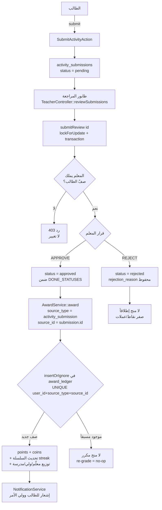

> **للبانِي (AI):** مفتاح الـidempotency هو الثلاثي `UNIQUE(user_id, source_type='activity_submission', source_id=submission.id)` في `award_ledger` عبر `insertOrIgnore` — هو ما يجعل إعادة التصحيح آمنة بنيوياً، فلا تَستبدله بفحص تطبيقي. ابنِ فرع `reject` (تثبيت `status`/`rejection_reason` بمنح صفر) **قبل** أي أثر جانبي للموافقة، واحرص أن كل استعلام «منجَز» يستخدم `whereIn('status', DONE_STATUSES)` = `['completed','approved']`، مع بوابة عزل تتحقق أن المعلم يملك صفّ الطالب داخل المعاملة المقفولة قبل أي تحديث.

#### 🗺️ هرم المحتوى ومسار تعلّم الطالب

يُظهر المخطط شجرة المحتوى (Value → Concept → Lesson → Activity) ومسار الطالب من تسليم النشاط إلى المنح، مع المسارات المتوازية (تمارين الممارسة، الاستبيانات، تقييم القيم) وكيف يصبّ كل ذلك في الاقتصاد (`award_ledger`) ولوحة الترتيب.

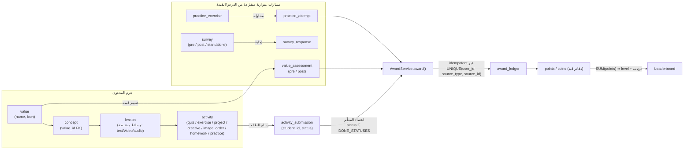

> **للبانِي (AI):** اتجاه الـFK تنازلي (value→concept→lesson→activity→submission)؛ كل منح **يجب** أن يمرّ عبر `AwardService::award` بمفتاح idempotency `(user_id, source_type, source_id)` المُطالَب عبر `insertOrIgnore` ضد فهرس `award_ledger_event_unique`، فالمنح المزدوج لا-عملية صامتة. لوحة الترتيب تُحسب من `SUM` على دفتر `points` لا من عمود رصيد مُجمّد. مسارا الممارسة والاستبيان والقيم يصبّان في نفس بوابة المنح الوحيدة.

### 6.0 المبادئ الحاكمة (Constitution) — إلزامية على كامل تطبيق الطالب

هذا القسم يصف **تطبيق الطالب كاملاً** (الويب + الـ REST API المخصّص للتطبيق الأصلي). يُمنع منعاً باتاً مخالفة أيٍّ من القواعد التالية عند إعادة البناء، فهي ضوابط أمنية واقتصادية حاملة (load‑bearing):

1. **الاقتصاد دفتر إضافة فقط (append-only ledger).** رصيد النقاط = `SUM(points.points)` ورصيد القيمات = `SUM(coins.coins)`. **يُمنع** قراءة `users.total_points` (عمود ميت). **يُمنع** أي عدّاد رصيد مُطبّع على المستخدم.
2. **كل إضافة (CREDIT) يجب أن تمرّ عبر `AwardService::award` المتساوي الإضافة (idempotent)** المُسنَد بمفتاح `award_ledger UNIQUE(user_id, source_type, source_id)`. **كل خصم (DEBIT) يجب أن يمرّ عبر `SpendService::spend`** (قفل صفّ `users`، سعر مشتق من الخادم، ومقاوم للسحب على المكشوف).
   * **استثناء واحد موثّق:** `StudentController::submitActivity` يكتب `Point` و`Coin` مباشرةً ثم يستدعي `distributePoints`، ويُؤمَّن ضد التكرار عبر `lockForUpdate` على التسليم السابق. **يجب** الحفاظ على منطق القفل هذا حرفياً (لا يوجد قيد `UNIQUE(student_id,activity_id)` على مستوى قاعدة البيانات).
3. **حصر المحتوى بالمدرسة (school scoping) إلزامي عند كل مدخل محتوى:** الدرس (`abort 404`)، النشاط (`abort 403`)، تمرين الممارسة (`abort 403`)، انضمام/تحدّي PvP (`abort 403`) — جميعها عبر `Value::visibleForSchool($user->school_id)`.
4. **تعريف الإكمال الموحّد:** `ActivitySubmission::DONE_STATUSES = ['completed','approved']` هو **مصدر الحقيقة الوحيد** للإحصائيات والإتقان والتيجان. الحالات `pending`/`needs_review` تُحسب «قيد المراجعة» ولا تُعدّ إنجازاً.
5. **كل دالة في `StudentController` يجب أن تُحمّل `$streak` وتحسب `$stats` (من `getStudentStats`) قبل الإرجاع**، لأن `layouts/student-app.blade.php` يتوقع `$stats` (مصفوفة) و`$streak` في كل عرض.
6. **`StudentApiController` يجب ألّا يُرجع 500 أبداً** — كل نقطة نهاية محصّنة بـ `try/catch` وقيم افتراضية آمنة، ومحصورة بمدرسة المستخدم حيث يلزم.

#### تثبيت التوجيه والوسائط (Middleware)

```php
// routes/web.php
Route::middleware(['auth', 'role:student', 'school.access'])
    ->prefix('student')->name('student.')->group(function () { /* ... */ });

// API (Sanctum Bearer)
Route::middleware(['auth:sanctum', 'role:student'])
    ->prefix('api/student')->group(function () { /* StudentApiController ... */ });
```

---

### 6.1 لوحة التحكم والإحصائيات (Dashboard)

| العنصر | القيمة |
|---|---|
| المسار | `GET /student/dashboard` |
| الاسم | `student.dashboard` |
| الدالة | `StudentController@dashboard` |
| العرض | `resources/views/student/dashboard.blade.php` |

**تدفّق الدالة (إلزامي بالترتيب):**

```php
$user = Auth::user()->load('streak');
$this->syncCrowns($user);            // (1) مزامنة التيجان أولاً ليكون العدّ محدّثاً (Issue 52)
$stats = $this->getStudentStats($user); // (2) إحصائيات مُخزّنة لكل طلب
$streak = $user->streak;             // (3) إلزامي للـ layout
```

**حقول `$stats` المُرجَعة من `getStudentStats` (مُخزّنة request-cached لكل user id؛ تُنشئ صف `Streak` المفقود ذاتياً):**

| المفتاح | المصدر |
|---|---|
| `total_points` | `SUM(points)` |
| `total_coins` | `SUM(coins)` |
| `total_badges` | عدد الشارات المكتسبة |
| `total_crowns` | عدد صفوف `crowns` للمستخدم (المصدر الوحيد) |
| `current_streak` | `streaks.current_streak` |
| `completed_activities` | تسليمات ضمن `DONE_STATUSES` |
| `pending_activities` | تسليمات `pending`/`needs_review` |
| `average_score` | متوسط `score` للتسليمات المُصحَّحة |
| `completed_today` | تسليمات اليوم ضمن `DONE_STATUSES` |

**البيانات المعروضة في الصفحة:**

- بطاقات إحصائية (نقاط/قيمات/شارات/تيجان/سلسلة).
- شريط آخر **6** شارات (`badges` مع `latest('earned_at')->take(6)`).
- آخر **5** تسليمات (`ActivitySubmission` مع `activity:id,title,lesson_id` و`activity.lesson:id,title`).
- حتى **3** واجبات قادمة: `is_homework=true` + `status='active'` + (`classroom_id` ضمن صفوف الطالب أو `NULL`) + **لم تُسلَّم بعد** (`whereDoesntHave('submissions', student)`) + `due_date > now()`، مرتبة تصاعدياً، ومُوسَمة بـ `urgency`:
  - `urgent` إذا `< 24h`
  - `soon` إذا `< 48h`
  - `normal` خلاف ذلك.
- **الدرس الحالي**: أول درس له تسليم نشاط غير `completed`، وإلا أول درس `active`؛ مع `progress` = `round(completed/total*100)` (يُحتسب أي تسليم — incl. pending — تقدماً في هذا الموضع).
- **كل القيم** عبر `Value::visibleForSchool($user->school_id)->with('concepts.lessons.activities')->orderBy('order')`، ولكل قيمة/مفهوم/درس/نشاط: `is_completed` (ضمن `DONE_STATUSES`) و`progress_percent`. **كل** القيم `is_unlocked=true` (لا قفل تسلسلي على القيم). ترتيب العرض: قيد التقدّم ← مكتملة ← مقفلة.

**معايير قبول جزئية:** يجب ألّا يفشل الـ dashboard لطالب جديد بلا تسليمات (كل القيم 0%، الإحصائيات أصفار، صف `Streak` يُنشأ تلقائياً).

---

### 6.2 خريطة المسار التعليمي (Path) و«تابع التعلّم» (Learn)

| المسار | الدالة | العرض |
|---|---|---|
| `GET /student/path` (`student.path`) | `learningPath` | `student/path.blade.php` |
| `GET /student/learn` (`student.learn`) | `learn` | `student/learn.blade.php` |
| `GET /student/values-tree` (`student.values-tree`) | `valuesTree` | `student/values-tree.blade.php` |

**`learningPath`:** يبني قائمة دروس خطّية عبر القيم/المفاهيم المرئية (دروس `active` فقط، مرتبة). أول درس غير مكتمل = `is_current`. القفل `is_locked` مُحرَّك بإعداد `sequential_lesson_lock` (عام، `user_id = null`، القيمة `'1'` تُفعّله) — **الافتراضي: OFF** (الكل مفتوح).

> **ملاحظة توحيد إلزامية عند البناء:** الكود الحالي يستخدم `status='completed'` فقط لـ `completedLessonIds` في `learningPath` (تباين طفيف مع `DONE_STATUSES`). **يجب** توحيدها على `DONE_STATUSES` في إعادة البناء.

**`learn`:** يعرض `currentLesson` (أول درس له تسليم غير مكتمل، وإلا أول درس `active`) مع نسبة تقدّمه.

**`valuesTree`:** يستدعي `syncCrowns`. لكل قيمة: نسبة التقدّم، `is_mastered` (كل أنشطة الدروس الفعّالة ضمن `DONE_STATUSES`)، و`is_unlocked=true`. `completedActivityIds` من `DONE_STATUSES`.

---

### 6.3 الدرس متعدّد الوسائط + قائمة الأنشطة (Lesson View)

| العنصر | القيمة |
|---|---|
| المسار | `GET /student/lesson/{id}` (`student.lesson`) |
| الدالة | `StudentController@lesson` |
| العرض | `student/lesson-view.blade.php` |

**حارس BOLA إلزامي:**

```php
// abort(404) إذا قيمة الدرس (lesson->concept->value) غير مرئية لمدرسة الطالب
$visibleValueIds = Value::visibleForSchool($student->school_id)->pluck('id');
abort_unless($visibleValueIds->contains($lesson->concept->value_id), 404);
```

**المحتوى المعروض:**

- `content` (HTML آمن عبر `safe_html`)، `video_url` (تضمين YouTube `nocookie`) أو `video_file`، `audio_url`/`audio_file` (مشغّلات)، و`images`.
- **استعلام واحد** لكل تسليمات الطالب في دروس النشاط (إصلاح N+1). لكل نشاط الحالة من تسليمه، وإلا `available` — ما لم يكن `sequential_activity_lock='1'` (الافتراضي OFF) فيُقفل بناءً على إكمال النشاط السابق بالترتيب.
- `completionPercent` و`nextActivity`.
- `lessonStreak` يُعرض إذا `lesson->hasStreakEnabled()` (أي `streak_enabled && streak_min_days > 0`).

---

### 6.4 عرض النشاط الواحد (Activity View)

| العنصر | القيمة |
|---|---|
| المسار | `GET /student/activity/{id}` (`student.activity`) |
| الدالة | `StudentController@activity` |
| العرض | `student/activity-view.blade.php` |

**حارس الوصول:** `abort(403)` عبر `isActivityAccessibleByStudent` — قيمة النشاط يجب أن تكون مرئية للمدرسة؛ الأنشطة بلا lesson/concept/value أو للمستخدم بلا مدرسة **مسموحة** (افتراضي آمن). تُحمَّل `submission` الموجودة و`nextActivity` (المعرّف التالي في نفس الدرس).

**عناصر الواجهة حسب `question_type`:** `multiple_choice` / `true_false` / `short_answer` / `letter_choice` / `word_ordering` / `sentence_ordering` / `image_ordering` / `essay` (رفع/إبداعي/مشروع/عملي/نقاش). رفع ملف اختياري. زر الإرسال ← استجابة JSON بـ `xp`/`score`/مكافأة السلسلة، وبطاقة تغذية راجعة.

---

### 6.5 إرسال النشاط والتصحيح الآلي والمنح (Submit Activity) — المسار الاقتصادي الحرج

| العنصر | القيمة |
|---|---|
| المسار | `POST /student/activity/{id}/submit` (`student.activity.submit`) |
| الدالة | `StudentController@submitActivity` |
| الاستجابة | JSON |

**التحقق (Validation):**

```php
$rules = ['answer' => 'required', 'xp' => 'nullable|integer'];
if ($request->hasFile('answer_file')) {
    $allowed = !empty($activity->allowed_file_types)
        ? implode(',', $activity->allowed_file_types)
        : 'pdf,jpg,jpeg,png,gif,docx,doc,mp3,mp4';
    $maxKb = max(1, (int) ($activity->max_file_size ?? 10)) * 1024;
    $rules['answer_file'] = "file|mimes:{$allowed}|max:{$maxKb}";
}
```

**التدفّق الإلزامي:**

1. حارس `isActivityAccessibleByStudent` (`403` خلاف ذلك).
2. رفع الملف (إن وُجد) خارج المعاملة إلى `activity-submissions/{student_id}` على قرص `public`.
3. **التصحيح:** `$score = ActivityGradingService::grade($activity, $rawAnswer)` ← `int 0..100` أو `null`.
4. الحالة: `status = $score !== null ? 'completed' : 'pending'`.
5. **معاملة ذرّية** مع `lockForUpdate` على التسليم السابق:
   - إذا وُجد تسليم سابق بحالة `needs_review`/`rejected` ← يُسمح بإعادة الإرسال (تحديث).
   - أي حالة أخرى موجودة ← `duplicate` (يُرفض، ويُحذف الملف المرفوع).
   - غير موجود ← إنشاء `ActivitySubmission`.
6. **الاقتصاد (ثانوي، مُغلَّف بـ try/catch — النجاح يُرجَع دائماً):**

```php
$xp = $score !== null ? (int) round(($score / 100) * $activityPoints) : 0;
Point::create([... 'points' => $xp, 'reason' => 'إكمال نشاط: '.$title, 'activity_id' => $id]);
$this->distributePoints($student, $xp, 'activity_completion', $title); // 10%/5%/2% للمعلم/الولي/المدرسة
Coin::create([... 'coins' => max(1, floor($xp / 2)), 'transaction_type' => 'earn']);
// سلسلة النشاط (عامة) + سلسلة الدرس (إن مُفعّلة) — انظر 6.6
// إشعارات (الطالب + الأولياء) + fires ActivityCompleted event
```

> **منع التكرار المزدوج للمكافأة (TRAP حامل):** مصدر المنح هنا هو `'activity_completion'` (عبر إنشاء `Point`/`Coin` مباشر، **لا** `AwardService`). الحاجز الوحيد ضد المنح المزدوج هو `lockForUpdate` على التسليم. **يُمنع** إنشاء صف `Point` لمكافأة السلسلة داخل النموذج — يجب إنشاؤه في **المتحكّم فقط** (`ActivityUserStreak::checkAndClaimBonus` يضع `bonus_claimed` فقط ولا يُنشئ `Point`).

**ملاحظات تصحيح إلزامية في `ActivityGradingService`:**

- `image_order`/`*_ordering`: يُتحقق أن التبديلة مجموعة `{1..n}` فريدة كاملة قبل التقييم (يمنع تضخيم الدرجة بوضع `1` للكل).
- أنواع المراجعة اليدوية وفقدان مفتاح الإجابة ← `null` (تصحيح يدوي)، **لا** صفر/مئة كاذب.
- `true_false`: يقبل صيغاً عربية/إنجليزية/رقمية (`صح/خطأ/true/false/1/0/نعم/لا`)؛ القيم الغامضة ← `null` (لا `false`).

---

### 6.6 السلاسل والمكافآت (Streaks)

| الجدول/النموذج | الوظيفة |
|---|---|
| `Streak` (`streaks`) | السلسلة اليومية العامة؛ `current_streak > 0` ← لهب في شريط الحالة. الأعمدة القانونية: `current_streak`/`longest_streak`. |
| `ActivityUserStreak` | سلسلة «الالتزام» عبر الدروس (أيام نشاط متمايزة)؛ مكافأة ثابتة لمرة واحدة عند `completed_days >= streak_min_days` ثم إعادة الدورة. |
| `LessonUserStreak` | سلسلة لكل درس عند `hasStreakEnabled`. |

**القاعدة الحاملة:** تسجيل اليوم (`recordActivityDay`) ذرّي تحت `lockForUpdate` (3 محاولات)، وتاريخ مكرّر = no-op. `checkAndClaimBonus` يضع `bonus_claimed` ويُرجع المبلغ، و**المتحكّم** يُنشئ صف `Point` للمكافأة (تماماً مرة واحدة).

---

### 6.7 لوحة الصدارة (Leaderboard)

| العنصر | القيمة |
|---|---|
| المسار | `GET /student/leaderboard?period=week\|month\|all` (`student.leaderboard`) |
| الدالة | `StudentController@leaderboard` |
| العرض | `student/leaderboard.blade.php` |

طلّاب **نفس المدرسة** النشطون، مرتّبون بـ `withSum('points','points')` (مُرشّحة بالفترة) تنازلياً، تكسير التعادل بـ `id`. الافتراضي `week`. أعلى 3 (Podium يظهر فقط إذا `>= 3` طلاب) + التالي 20. تُحسب `actual_rank` **قبل** التقطيع؛ `myRank` و`myPeriodXp` (متّسقان مع الفترة) ضمن بطاقة «ترتيبك».

---

### 6.8 الشارات والتيجان (Badges & Crowns)

| المسار | الدالة | العرض |
|---|---|---|
| `GET /student/badges` (`student.badges`) | `badges` | `student/badges.blade.php` |
| `GET /student/crowns` (`student.crowns`) | `crowns` | `student/crowns.blade.php` |

كلاهما يستدعي `syncCrowns` أولاً. **التيجان مشتقّة من الإتقان** ومُجسَّدة بـ `Crown::firstOrCreate(['user_id','value_id'])` داخل `syncCrowns` (idempotent)؛ **جدول `crowns` هو المصدر الوحيد** لعدّ التيجان في كل الشاشات.

- `badges`: كل الشارات المكتسبة (`orderByPivot earned_at desc`)، `totalBadges`، `rareBadges` (`rarity='rare'`)، `crowns count`، `recentBadges` (هذا الشهر)، `masteredValues` (من `crowns->value`).
- `crowns`: التيجان المكتسبة مع القيمة مرتّبة بـ `earned_at desc` + `availableCrowns` (القيم المرئية بلا تاج بعد).

**الإتقان = كل درس فعّال في القيمة كل أنشطته الفعّالة ضمن `DONE_STATUSES`.**

---

### 6.9 الملف الشخصي (Profile)

| المسار | الدالة | الاستجابة |
|---|---|---|
| `GET /student/profile` (`student.profile`) | `profile` | عرض `student/profile-view.blade.php` |
| `POST /student/profile/update` (`student.profile.update`) | `updateProfile` | JSON |

**`profile`:** `firstOrCreate` لـ `Streak`، `level = floor(total_points/100)+1`، كل الشارات. مُغلَّف بـ try/catch بقيم افتراضية آمنة.

**`updateProfile` (Validation):**

```php
'name' => 'required|string|max:255',
'email' => 'required|email|unique:users,email,'.$id,
'avatar' => 'nullable|image|max:2048',           // 2MB
'current_password' => 'required_with:new_password',
'new_password' => 'nullable|min:8|confirmed',
```

**يجب** التحقق من كلمة المرور الحالية عبر `Hash::check` قبل التغيير.

---

### 6.10 القيمات والمتجر (Coins / Shop) — مسار الخصم الحرج

| المسار | الدالة | الوصف |
|---|---|---|
| `GET /student/coins/history` (`student.coins.history`) | `coinsHistory` | JSON آخر 50 معاملة |
| `GET /student/shop` (`student.shop`) | `shop` | عرض المتجر |
| `POST /student/shop/purchase` (`student.shop.purchase`) | `purchaseItem` | شراء عنصر لمرة واحدة |
| `POST /student/shop/redeem` (`student.shop.redeem`) | `redeemReward` | استبدال مكافأة متكرّرة |

**`coinsHistory`:** يُرجع `amount(coins)`, `source(transaction_type)`, `description(reason)`, تاريخ بشري. يستهلكه modal القيمات في الـ layout.

**`shop`:** عناصر `ShopItem` النشطة بشرط (`available_until` `null` أو مستقبلية)، مرتّبة بـ `order` ثم `created_at desc`.

**`purchaseItem` (سعر مشتق من الخادم — `item->price` فقط، لا قيمة عميل):**

```php
// قبل المعاملة: isAvailable() + لم يُشترَ سابقاً
DB::transaction(function () { /* 3 retries */
    $r = SpendService::spend($userId, 'shop_purchase', (string)$itemId, $item->price, 'شراء '.$name);
    if (!$r['success']) return /* رسالة: insufficient_balance / duplicate */;
    if (!$item->decrementStock()) throw new DomainException('out_of_stock'); // rollback للخصم
    $user->purchases()->attach($itemId, ['price_paid' => $item->price, 'is_active' => true]);
});
```

> القيد على الشراء الواحد لكل عنصر مفروض بمفتاح idempotency `(shop_purchase, itemId)` + `hasPurchased()`. `out_of_stock` **يُرجِع (rollback)** الخصم. خصم المخزون ذرّي شرطي ومستقل عن خصم القيمات.

**`redeemReward`:**

```php
'reward_id' => 'required|exists:shop_items,id',
'idempotency_key' => 'nullable|string|max:64',
// السعر = item->price (خادمي)؛ token = idempotency_key أو uuid جديد
$r = SpendService::spend($userId, 'reward_redemption', $token, $item->price);
// يُرجع new_balance + duplicate flag
```

---

### 6.11 الفرق (Teams)

| العنصر | القيمة |
|---|---|
| المسار | `GET /student/teams` (`student.teams`) |
| الدالة | `teams` |
| العرض | `student/teams.blade.php` |

الفرق عبر pivot `team_members` (مع `role`, `joined_at`). لكل فريق: `total_points` (`SUM` نقاط الأعضاء) و`total_activities` (تسليمات الأعضاء ضمن `DONE_STATUSES`).

---

### 6.12 تمارين الممارسة (Practice Exercises)

| المسار | الدالة | الوصف |
|---|---|---|
| `GET /student/practice` (`student.practice`) | `practice` | المركز: تمارين + تحدّيات PvP + إحصائيات |
| `GET /student/practice/{id}/start` (`student.practice.start`) | `startExercise` | بدء تمرين |
| `POST /student/practice/{id}/submit` (`student.practice.submit`) | `submitExercise` | تصحيح وتسجيل محاولة |
| `GET /student/practice/result/{attemptId}` (`student.practice.result`) | `exerciseResult` | نتيجة المحاولة |

**`practice`:** تمارين `PracticeExercise` النشطة في صفوف الطالب **أو** عامّة (`classroom_id null`)، ضمن نافذة `starts_at`/`ends_at`، مع `teacher` و`attempts_count`. `myAttempts` مجمّعة حسب التمرين. يستدعي `ensureDefaultPvpChallenge()` ثم تحدّيات PvP النشطة. `practiceStats`: `completed`, `avg_score`, `pvp_wins`, `streak(0)`.

**`startExercise`:** `abort(403)` عبر `exerciseBelongsToStudent` (صف ضمن صفوف الطالب، أو تمرين عام مربوط بمدرسة منشئه). يُحجب إذا `completed attempts >= max_attempts`. يُحمّل أسئلة `QuestionBank` مخلوطة.

**`submitExercise` (إلزامي):**

```php
// يُعيد فحص exerciseBelongsToStudent (403) + max_attempts على الإرسال (anti-replay)
// تصحيح: multiple_choice / true_false(boolish) / short_answer
$attempt = PracticeAttempt::create([... answers, score, total, correct, time, completed_at]);
// المنح: نقاط = max(1, round(score/10)) عبر AwardService (idempotent)
AwardService::award($studentId, 'practice_attempt', (string)$attempt->id, max(1, round($score/10)));
// redirect → student.practice.result
```

> **TRAP حامل:** فرض `max_attempts` إلزامي على **كلٍّ من** `start` و`submit` (الفرض على الإرسال فقط كان ثغرة حصاد نقاط لانهائي).

**`exerciseResult`:** `findOrFail` محصور بـ `student_id` (آمن ضد IDOR). يعرض المحاولة + التمرين + الأسئلة.

---

### 6.13 المبارزات الفردية (PvP)

| المسار | الدالة | الوصف |
|---|---|---|
| `GET /student/pvp` (`student.pvp.lobby`) | `pvpLobby` | الردهة |
| `POST /student/pvp/{challengeId}/join` (`student.pvp.join`) | `joinPvpMatch` | انضمام/إنشاء مباراة |
| `GET /student/pvp/{matchId}/status` (`student.pvp.status`) | `pvpMatchStatus` | استطلاع الحالة |
| `GET /student/pvp/{matchId}/play` (`student.pvp.play`) | `pvpPlay` | شاشة اللعب |
| `POST /student/pvp/{matchId}/submit` (`student.pvp.submit`) | `submitPvpAnswers` | إرسال الإجابات وحسم الفائز |
| `GET /student/pvp/{matchId}/result` (`student.pvp.result`) | `pvpResult` | النتيجة |

**`pvpLobby`:** محصّن مخطّطياً (فارغ إن غابت جداول pvp). `ensureDefaultPvpChallenge`. `challenges = PvpChallenge::availableForSchool` (عام `value_id null` أو قيمة مرئية للمدرسة). `myMatches` (مكتملة، أنا player1/2) آخر 10. إحصائيات `total_matches` + `wins`.

**`joinPvpMatch`:** التحدّي يجب أن يكون `is_active` + `availableForSchool` (`403` BOLA). ينضم لمباراة `waiting` (ليست خاصته) كـ player2 ← `playing` + `started_at`؛ وإلا يُنشئ مباراة `waiting` كـ player1. JSON `match_id` + `status`.

**`pvpMatchStatus`/`pvpPlay`/`pvpResult`:** participants فقط (`403` IDOR). `pvpPlay` يُعيد التوجيه للردهة إذا `status != 'playing'`.

**`submitPvpAnswers` (إلزامي):**

```php
// participants فقط (403). تصحيح كالممارسة. حفظ playerN_answers/score/time.
// عند إرسال الطرفين: determineWinner() ذرّي (lockForUpdate، بالـ score ثم time، playing→completed مرة واحدة)
AwardService::award($winnerId, 'pvp_match', (string)$match->id, 20, 10); // 20 نقطة + 10 قيمات مرة واحدة
// + إشعار فوز لمرة واحدة (الـ bool من award يمنع إعادة الإشعار)
```

> التحدّي العام الافتراضي يُجهَّز تلقائياً (`ensureDefaultPvpChallenge`) عند توفّر `>= 3` عناصر `QuestionBank` معتمدة، فيكون PvP متاحاً جاهزاً. إعادة POST بعد الاكتمال = no-op (idempotent end-to-end).

---

### 6.14 الهدايا والمديح، تقييم المعلمين، التحليلات (Gifts / Rate-Teachers / Analytics)

| المسار | الدالة | الوصف |
|---|---|---|
| `GET /student/gifts` (`student.gifts`) | `gifts` | مديح (`ParentPraise`) وهدايا (`ParentGift`) من الولي، الأحدث أولاً |
| `GET /student/rate-teachers` (`student.rate.teachers`) | `rateTeachers` | معلّمو الطالب + تقييماتهم |
| `POST /student/rate-teacher` (`student.rate.submit`) | `submitRating` | تقييم معلّم 1‑5 + تعليق |
| `GET /student/analytics` (`student.analytics`) | `analytics` | مخططات Chart.js |

**`submitRating` (Validation):** `teacher_id` موجود، `rating` 1‑5، `comment <= 500`. **يُعيد التحقق** أن المعلّم يُدرّس الطالب (وإلا `403`). `TeacherRating::updateOrCreate(['teacher_id','student_id'])`. يُشعر المعلّم.

**`analytics`:** تقدّم 30 يوماً، توزيع حالات الأنشطة، نقاط مجمّعة حسب القيمة (join)، نشاط آخر 7 أيام، آخر 10 درجات مكتملة.

---

### 6.15 الإشعارات والرسائل (مشتركة — يصلها الطالب من الشريط السفلي)

**الإشعارات:**

```
GET    /notifications              (مؤشر؛ يختار layouts.student-app للطلاب)
GET    /notifications/fetch
POST   /notifications/{id}/read
POST   /notifications/read-all
DELETE /notifications/{id}
```

> الحصر: `notifiable_type = App\Models\User` + `notifiable_id = auth id`. شريط الحالة يعرض شارة `NotificationService::getUnreadCount`.

**الرسائل (`MessagesController` مشترك — ليست تحت بادئة student):**

```
GET  /messages
GET  /messages/conversation/{userId}
POST /messages/send
GET  /messages/unread/count
GET  /messages/check-new/{userId}
GET  /messages/check-all/new
POST /messages/upload
GET  /messages/{userId}
```

> شارة غير المقروء = `Message where receiver_id = auth AND is_read = false`. رابط «الرسائل» في الشريط السفلي ← `messages.index`.

---

### 6.16 الاستبيانات (قبلي/بعدي + مستقلة)

```
GET  /survey/{survey}          survey.show       (عبر PagesController showSurvey)
POST /survey/{survey}          survey.submit     (throttle:10,1)
POST /survey/{survey}/submit   survey.ajax-submit
GET  /api/pending-surveys      survey.pending
```

- **`show`:** يجب أن يكون الاستبيان `active`، والمستخدم مستهدفاً بالدور/`target_type`، ولم يُجِب سابقاً.
- **`submit`:** فحص `requires_login` + فحص `active` + فحص الأسئلة الإلزامية + **إدراج ذرّي مانع للتكرار** لـ `SurveyResponse(answers, completed_at)` + مسح `session pending_surveys`.
- الاستبيانات الإلزامية تظهر عبر `components/survey-popup.blade.php` كطبقة حاجبة (overlay) (من `session show_survey_popup` + `pending_surveys`)، وتتقدّم للاستبيان المعلّق التالي بعد الإرسال (AJAX).

---

### 6.17 واجهة الـ API للهاتف (StudentApiController) — يجب ألّا تُرجِع 500

كلها Bearer (Sanctum) + `role:student`، ومحصّنة بـ `try/catch`.

| نقطة النهاية | الدالة | البيانات |
|---|---|---|
| `GET /api/student/dashboard` | `dashboard` | `total_points`, `total_coins`, `badges_count`, `completed_activities` (`DONE_STATUSES`), `pending_activities` (pending فقط), `current_streak` + آخر 5 تسليمات |
| `GET /api/student/values-tree` | `valuesTree` | هرمية value→concept. **ملاحظة:** ليست محصورة بالمدرسة (تُرجع كل `Values`) — متباينة عن الويب |
| `GET /api/student/activities` | `activities` | مُصفّاة بـ `school_id` + `active` + صف الطالب؛ مرشّحات `type`/`difficulty` اختيارية؛ 20/صفحة مع ملخّص التسليم |
| `GET /api/student/activities/{id}` | `activityDetails` | `403` إذا `activity->school_id != user school`؛ أسئلة/تعليمات/مرفقات/درس/منشئ/تسليم |
| `POST /api/student/activities/{id}/submit` | `submitActivity` | `answers[]` + ملف اختياري `<=10MB`؛ `403` عبر المدارس؛ يُحجب إذا الحالة `completed`. ينشئ/يحدّث تسليماً بحالة `pending` |
| `GET /api/student/badges` | `badges` | `id,name,description,icon,earned_at` + `total_count` |
| `GET /api/student/leaderboard` | `leaderboard` | `withSum` نقاط، أعلى 50 + `user_rank` (all-time، بلا فترة) |

> **عدم تماثل مقصود (يجب الحفاظ عليه أو توحيده عمداً):**
> - `API submitActivity` **لا يُصحّح آلياً ولا يمنح** — يخزّن تسليماً `pending` فقط. مسار التصحيح/المنح هو **الويب** (`StudentController::submitActivity`).
> - `API valuesTree`/`leaderboard` ليسا محصورين كالويب (الويب يستخدم `visibleForSchool` وفترات).

---

### 6.18 قشرة التطبيق (student-app layout)

`resources/views/layouts/student-app.blade.php` — قشرة mobile‑first تلفّ كل صفحات الطالب، **تتوقّع `$stats` و`$streak` في كل عرض**.

**شريط الحالة:** الأفاتار (يفتح modal الملف) • الاسم • المستوى (⭐ `floor(points/100)+1`) • شريط XP مركزي (`points % 100` من 100) • شارة لهب السلسلة (إذا `current_streak > 0`) • شارة قيمات (تفتح modal السجل عبر `student.coins.history`) • جرس الإشعارات بعدّاد غير المقروء.

**الشريط السفلي:** Learn(dashboard) • Path • Practice • Messages (شارة غير مقروء) • Profile.

**عناصر إضافية:** مبدّل ثيم عائم (فاتح افتراضي/داكن، مُخزَّن في `localStorage 'wahy-theme'`) • modal تعديل الملف (اسم/إيميل/أفاتار/كلمة مرور) • modal سجل القيمات • تضمين `survey-popup` (الاستبيانات الإلزامية الحاجبة) • متغيّرات CSS للثيم من الإعدادات (لون أساسي/ثانوي، خط) مع مجموعتي رموز فاتح/داكن.

---

### معايير القبول (Acceptance Criteria)

- **يجب** أن تعمل كل مسارات `student.*` ضمن `['auth','role:student','school.access']`، وأن تُحمّل `$stats` و`$streak` قبل الإرجاع؛ طالب جديد بلا بيانات لا يُسبّب أي خطأ في الـ dashboard أو الملف الشخصي.
- **يجب** أن تُرجع كل نقاط `StudentApiController` 200 (أو 4xx مقصوداً) ولا تُرجع 500 أبداً، وأن تكون `activityDetails`/`submit` محصورة بمدرسة المستخدم (`403` عبر المدارس).
- **يجب** أن يُمنح إكمال نشاط مُصحَّح آلياً `XP = round(score/100 * points)` و`coins = max(1, floor(XP/2))`؛ والمراجعة اليدوية (`score null`) تمنح 0 حتى تصحيح المعلّم.
- **يجب** أن يكون double‑submit متزامن لنفس النشاط محجوباً عبر `lockForUpdate`، ولا يُنشَأ تسليم مكرّر ولا منح مزدوج.
- **يجب** أن يكون شراء عنصر المتجر بسعر مشتق من الخادم فقط، عبر `SpendService::spend(shop_purchase, itemId)`، مع تراجع كامل عند `out_of_stock` أو رصيد غير كافٍ، ودون أي رصيد سالب.
- **يجب** أن يكون `redeemReward` متساوي الإضافة بمفتاح `idempotency_key`: إعادة الإرسال بنفس المفتاح = لا خصم مزدوج.
- **يجب** فرض `max_attempts` على **كلٍّ من** `startExercise` و`submitExercise`؛ ومنح الممارسة `max(1, round(score/10))` مرة واحدة عبر `AwardService(practice_attempt, attempt.id)`.
- **يجب** أن يُحسم فائز PvP بـ score ثم time، وأن يُمنح 20 نقطة + 10 قيمات **مرة واحدة بالضبط** عبر `AwardService(pvp_match, match.id)`، وأن تكون إعادة POST بعد الاكتمال no-op.
- **يجب** أن يُمنع الوصول عبر المدارس: درس قيمته غير مرئية ← `404`؛ نشاط/تمرين/PvP ← `403`.
- **يجب** أن يكون عدّ التيجان من جدول `crowns` حصراً (بعد `syncCrowns`)، والإكمال من `DONE_STATUSES = ['completed','approved']` حصراً.
- **يجب** أن يعرض شريط الحالة المستوى `floor(points/100)+1`، وشريط XP `points % 100`، وأن تأتي القيمات/النقاط من `SUM` لا من عمود مُطبّع.
- **يجب** أن يحجب popup الاستبيان الإلزامي الواجهة حتى الإجابة، وأن يمنع `submit` التكرار ذرّياً.
- **يجب** أن تظل `Point`/`Coin` دفاتر إضافة فقط (يُمنع UPDATE/DELETE خارج الـ CLI)، وأن تظل حراسة `ActivitySubmission` للدرجة/الحالة فعّالة للطلاب.

---

## 7. خدمات المعلم

### 7.0 الإطار العام والثوابت الحاكمة (Authoritative Frame)

يُمثِّل نظام المعلم (TEACHER subsystem) مساحة عمل المعلم داخل منصّة «وحي / قيمّ». يتألّف من متحكّم واحد سمين `App\Http\Controllers\TeacherController` (~2225 سطرًا)، و34 واجهة Blade تحت `resources/views/teacher`، وتخطيط مخصّص `layouts/teacher.blade.php`. كل مسارات هذا النظام **يجب** أن تعيش داخل المجموعة التالية في `routes/web.php` (الأسطر 474–558):

```php
Route::prefix('teacher')->name('teacher.')->middleware(['role:teacher', 'school.access'])->group(function () {
    // ... جميع مسارات المعلم
});
```

#### 7.0.1 الثابت متعدّد المستأجِرين (Tenant Invariant) — إلزامي

- **يجب** أن تُحرَس المجموعة كاملةً بالوسيطين `role:teacher` و`school.access`.
  - `role:teacher`: يسمح أيضًا لـ `super_admin` ولأي مستخدم تتضمّن أدواره النشطة/الكاملة الدور `teacher`.
  - `school.access`: يُرجِع 403 إن لم يكن للمستخدم `school_id`، ويحجب أي تطابق خاطئ لـ `school_id` في معاملات المسار/المُدخل.
- **يُمنع** الاعتماد على الوسيط وحده. **يجب** أن تُقيَّد كل استعلامة داخل المتحكّم إضافيًّا عبر `teachingClassrooms()` أو `created_by` أو `teacher_id` أو `school_id`.
- التعريف القانوني لملكيّة المعلم:

```php
// علاقة الفصول التي يملكها المعلم
public function teachingClassrooms() { return $this->hasMany(Classroom::class, 'teacher_id'); }
// الطلاب يُبلَغ إليهم عبر pivot: classroom_student انضمامًا إلى فصول هذا المعلم فقط
$studentIds = DB::table('classroom_student')
    ->whereIn('classroom_id', $teacherClassroomIds)
    ->pluck('student_id');
```

**يجب** إعادة إنتاج سلسلة الملكية هذه بالضبط في كل فحص IDOR (مراجعة التسليم، تفاصيل الطالب، تصدير التقارير، عمليات الفِرق).

#### 7.0.2 الثوابت الاقتصاديّة (Economy Invariants) — إلزامي

- **يجب** أن يمرّ كل **إيداع** (نقاط/عملات) عبر `AwardService::award(...)` حصريًّا. **يُمنع** كتابة صفوف `Point`/`Coin` مباشرة لأغراض التصحيح/التقييم.
- التوقيع المُلزِم:

```php
AwardService::award(
    int $userId, string $sourceType, string $sourceId,
    int $points = 0, int $coins = 0, ?string $description = null, bool $distribute = false
): bool; // true = أُودِع لأول مرة، false = مُودَع سابقًا (no-op) أو مبلغ غير موجب
```

- الفطنة (idempotency) مضمونة هيكليًّا بفهرس `award_ledger` الفريد `UNIQUE(user_id, source_type, source_id)`.
- مفاتيح الفطنة المعتمَدة في هذا النظام (**يجب** الالتزام بها حرفيًّا):
  - تصحيح تسليم نشاط: `source_type='activity_submission'`, `source_id=(string)$submission->id`.
  - نشاط فريق: `source_type='team_activity'`, `source_id=$teamActivity->id.':'.$member->id`.
- عند `distribute:true` يتم تفريع 10% للمعلم و5% لوليّ الأمر و2% للمدرسة **داخل المعاملة نفسها** عبر `PointsDistributionService::distributeWithin` (صارم، يرمي استثناءً عند الفشل ⇒ يتراجع الإيداع كاملًا؛ لا تفريع جزئي).

#### 7.0.3 مفردات الحالة القانونيّة (Status Vocabulary) — إلزامي

```php
// ثابت على نموذج ActivitySubmission — حامل للحِمل (load-bearing) في كل مكان
const DONE_STATUSES = ['completed', 'approved']; // النشاط «منجَز»
// SUBMITTED_STATUSES تضيف pending/needs_review — تُستخدم فقط لـ«ما أرسله الطالب»
```

- **يجب** أن تستعمل كل عمليات العدّ المكتملة والمتوسّطات ونِسَب التفاعل (engagement) `DONE_STATUSES`.
- الحالة `'rejected'` موجودة في المخطّط لكنها **مُستثناة من كل المقاييس الإيجابيّة**.
- **يُمنع** اختراع مسار رفض (reject) يمنح أي مكافأة؛ الرفض يمنح **لا شيء** (انظر 7.2.4).

---

### 7.1 لوحة التحكّم والإحصاءات (Dashboard)

#### 7.1.1 المسار

| Verb | URI | Name | Method |
|---|---|---|---|
| GET | `/teacher/dashboard` | `teacher.dashboard` | `dashboard()` |

#### 7.1.2 التدفّق

1. تحميل `teachingClassrooms` (مُقيَّدة بالمدرسة) مع `withCount('students')`.
2. اشتقاق `$studentIds` من `classroom_student` المنضمّ إلى فصول هذا المعلم فقط.
3. **يجب** رفع `Activity::count()` خارج الحلقة (إصلاح N+1 مؤكَّد) — يُحسَب مرّة واحدة كـ `$totalActivities`.
4. لكل فصل:
   - `total_activities = $totalActivities`.
   - `pending_count` = عدد تسليمات طلابه بحالة `'pending'`.
   - `completed` = عدد التسليمات ضمن `DONE_STATUSES`.
   - `engagement_percent = min(100, completed / ($totalActivities * $studentCount) * 100)` (مع حماية القسمة على صفر).
5. عرض آخر 10 تسليمات `pending`، وإحصاءات سريعة: `total_classrooms`, `total_students`, `pending_submissions`, `reviewed_today` (بواسطة هذا المعلم).

#### 7.1.3 معايير القبول الجزئيّة

- لا توجد استعلامة `Activity::count()` داخل أي حلقة.
- `engagement_percent` لا يتجاوز 100 ولا يقسم على صفر.

---

### 7.2 مراجعة التسليمات والتصحيح (Submission Review & Grading)

#### 7.2.1 المسارات

| Verb | URI | Name | Method |
|---|---|---|---|
| GET | `/teacher/review` | `teacher.review` | `reviewSubmissions()` |
| GET | `/teacher/review/{id}` | `teacher.review.single` | `reviewSubmission($id)` |
| POST | `/teacher/review/{id}` | `teacher.review.submit` | `submitReview(Request,$id)` |

#### 7.2.2 قائمة الانتظار وعرض التسليم المفرد

- `reviewSubmissions()`: قائمة مُرقَّمة (20) من تسليمات بحالة `'pending'` يكون صاحبها ضمن فصول المعلم، مع تحميل مُسبَق لـ `student` و`activity.lesson.concept.value`، مرتّبة بـ `submitted_at desc`. التقييد عبر `classroom_student whereIn` معرّفات فصول المعلم.
- `reviewSubmission($id)`: `findOrFail` ثم فحص ملكيّة — **يجب** `abort(403)` ما لم يكن طالب التسليم في فصل تكون فيه `classrooms.teacher_id = current user` (حارس IDOR على مستوى الكائن).

#### 7.2.3 إرسال التصحيح والموافقة — `submitReview`

**التحقّق (Validation):**

```php
$request->validate([
    'score'         => 'required|integer|min:0|max:100',
    'feedback'      => 'nullable|string|max:1000',
    'xp_awarded'    => 'required|integer|min:0|max:50',
    'coins_awarded' => 'required|integer|min:0|max:20',
]);
```

**التدفّق (إلزامي بهذا الترتيب):**

```php
DB::transaction(function () use (...) {
    $submission = ActivitySubmission::lockForUpdate()->findOrFail($id); // قفل لمنع last-write-wins
    // إعادة فحص ملكيّة المعلم (الطالب في فصل يملكه المعلم) وإلا abort(403)
    $submission->update([
        'status'           => 'approved',
        'score'            => $score,
        'feedback'         => $feedback,
        'teacher_feedback' => $feedback,
        'reviewed_by'      => Auth::id(),
        'reviewed_at'      => now(),
    ]);
});
// بعد الـ commit، كل ما يلي ملفوف بـ try/catch منفصل:
AwardService::award(
    $submission->student_id, 'activity_submission', (string) $submission->id,
    $xpAwarded, $coinsAwarded, $description, distribute: true
);
// إطلاق NotificationService::activityGraded + إشعارات وليّ الأمر + ActivityGraded + ActivityCompleted
```

**الأثر الاقتصادي:**

- الموافقة تُودِع للطالب `xp_awarded` نقطة (0–50) + `coins_awarded` عملة (0–20) **مرّة واحدة بالضبط**، مفتاحها معرّف التسليم.
- إعادة التصحيح لنفس التسليم = **no-op** (لا إيداع مضاعف، لا إعادة تفريع).
- عند `distribute:true` يُفرَّع 10%/5%/2% من النقاط للمعلم/الوليّ/المدرسة داخل المعاملة؛ أي فشل في التفريع يُراجِع الإيداع كاملًا (لا تفريع جزئي).

**الثوابت:**

- `lockForUpdate` يمنع سباق المعلم مقابل المُصحِّح الآلي (last-write-wins).
- الإيداع والإشعارات **بعد** الـ commit وكلٌّ ملفوف في `try/catch`؛ فشل مُستمِع/إشعار **يجب** ألّا يكسر الدرجة المحفوظة (الدرجة هي مصدر الحقيقة).

#### 7.2.4 الرفض يمنح لا شيء — قاعدة قاطعة

- **يُمنع** وجود مسار reject في مسارات المعلم. فعل المراجعة الوحيد هو الموافقة (`status='approved'`).
- الرفض المفاهيمي يتحقّق بعدم الموافقة فقط؛ التحليلات/التفاعل تستثني الحالات غير `DONE`.
- **يُمنع** اختراع مسار رفض يُودِع أي شيء.

#### 7.2.5 دفاع في العمق على النموذج

- `ActivitySubmission::booted()` **يجب** أن يُجهِض `403` عند محاولة الطالب تعديل `score`/`reviewed_by`/`feedback`/`reviewed_at`/`status` بعد الإنشاء، ما لم يكن الفاعل `teacher`/`school_admin`/`super_admin` (أو console).

---

### 7.3 بنك الأنشطة وإدارة الأنشطة (Activity Bank & Management)

#### 7.3.1 المسارات

| Verb | URI | Name | Method |
|---|---|---|---|
| GET | `/teacher/activities` | `teacher.activities` | `activities()` |
| GET | `/teacher/activities/create` | `teacher.activities.create` / `teacher.activity-bank.create` | `createActivity()` |
| POST | `/teacher/activities` | `teacher.activities.store` | `storeActivity(Request)` |
| GET | `/teacher/activities/{id}/edit` | `teacher.activities.edit` | `editActivity($id)` |
| PUT | `/teacher/activities/{id}` | `teacher.activities.update` | `updateActivity(Request,$id)` |
| GET | `/teacher/activities/{id}/preview` | `teacher.activities.preview` | `previewActivity($id)` |
| DELETE | `/teacher/activities/{id}` | `teacher.activities.delete` | `deleteActivity($id)` |
| POST | `/teacher/activities/{id}/feature` | `teacher.activities.feature` | `featureActivity(Request,$id)` |
| POST | `/teacher/activities/{id}/unfeature` | `teacher.activities.unfeature` | `unfeatureActivity($id)` |
| POST | `/teacher/activity-bank` | `teacher.activity-bank.store` | `addActivityToBank(Request)` |
| GET | `/teacher/activity-bank` | `teacher.activity-bank.index` | `activityBank()` |

#### 7.3.2 إنشاء/تحديث نشاط — التحقّق المُلزِم

```php
$request->validate([
    'lesson_id'           => 'required|exists:lessons,id',
    'classroom_id'        => 'nullable|exists:classrooms,id',
    'title'               => 'required|string|max:255',
    'description'         => 'nullable|string',
    'type'               => 'required|in:quiz,exercise,project,creative,upload,practical,discussion,image_order',
    'question_type'       => 'nullable|string',
    'questions'           => 'nullable|string', // JSON string -> cast array
    'points'              => 'required|integer|min:1|max:100',
    'passing_score'       => 'nullable|integer|min:0|max:100',
    'status'              => 'required|in:active,inactive,draft',
    'order'               => 'nullable|integer',
    'quiz_duration'       => 'nullable|integer',
    'max_attempts'        => 'nullable|integer',
    'allowed_file_types'  => 'nullable|array',
    'allowed_file_types.*'=> 'in:document,image,video,audio',
    'max_file_size'       => 'nullable|integer|min:1|max:100',
    'is_homework'         => 'nullable|boolean',
    'due_date'            => 'nullable|date',
]);
```

**حارس IDOR إلزامي:** `abort_unless` أن `classroom_id` فصلٌ يُدرّسه المعلم. **يجب** فرض `created_by = Auth::id()`. عند النجاح يُشعَر طلاب الفصل.

**التحديث (`updateActivity`):** نفس التحقّق + نفس حارس الفصل؛ الملكيّة عبر `where('created_by', Auth::id())->firstOrFail()`. **يجب** ألّا يُكتَب `questions` فوق القديم إلا إذا جاء الحقل مملوءًا (وإلا يُحفَظ القديم). `allowed_file_types` يُرمَّز JSON.

- لا أثر اقتصاديًّا لإنشاء/تحديث/حذف نشاط.
- `deleteActivity`: يحذف ملف المرفق من قرص `public` ويُرجِع JSON نجاح؛ الملكيّة عبر `created_by`.
- `previewActivity`: يعرض النشاط كما يراه الطالب؛ مملوك فقط (`created_by`).

#### 7.3.3 التمييز (Feature/Unfeature)

- `featureActivity`: يتطلّب `reason` (max 500)؛ يضبط `is_featured=true`, `featured_by`, `featured_at`, `featured_reason`؛ يرفض إن لم يكن المنشئ.
- `unfeatureActivity`: يمسح حقول التمييز؛ للمنشئ فقط.
- **يجب** أن يحجب `Activity::booted()` غير المسؤولين من تغيير `is_featured`/`featured_*`/`approval_status`/`approved_by`/`approved_at`/`rejection_reason` بعد الإنشاء.

#### 7.3.4 الإضافة إلى البنك — `addActivityToBank`

```php
$request->validate([
    'type'         => 'required|in:quiz,exercise,project,creative,image_order,upload,practical,discussion',
    'points'       => 'required|integer|min:1|max:100',
    'bonus_points' => 'nullable|integer|min:0|max:50',
    'is_creative'  => 'nullable|boolean',
    'passing_score'=> 'nullable|integer|min:0|max:100',
    'status'       => 'required|in:active,inactive,draft',
]);
```

- **يجب** فرض `created_by`, `is_activity_bank=true`, `approval_status='pending'`.
- إن كان `is_creative`: **يجب** اشتراط `classroom_id` وضبط `bonus_points` افتراضيًّا إلى 10.
- يستدعي `TeacherPoint::updateTeacherPoints($teacher)` (يُعيد حساب نقاط المعلم).
- **الأثر الاقتصادي:** يُعيد حساب `teacher_points` فقط (لا إيداع طالب). محتوى البنك يحتاج موافقة المسؤول قبل المشاركة.

#### 7.3.5 صفحة البنك الموحّدة — `activityBank`

- يعرض الأنشطة حيث `is_activity_bank=true` و(`created_by=me` أو (`approval_status='approved'` و`created_by` غير فارغ) أو `created_by` فارغ)، مُرقّمة، مع إحصاءات (`total/pending/approved/rejected/shared`)، بالإضافة إلى صفوف `question_bank` الخاصّة بالمعلم وإحصاءاتها.

---

### 7.4 بنك الأسئلة (Question Bank)

#### 7.4.1 المسارات

| Verb | URI | Name | Method |
|---|---|---|---|
| GET | `/teacher/question-bank` | `teacher.question-bank.index` | `questionBank()` |
| GET | `/teacher/question-bank/create` | `teacher.question-bank.create` | `createQuestion()` |
| POST | `/teacher/question-bank` | `teacher.question-bank.store` | `addQuestionToBank(Request)` |

#### 7.4.2 التحقّق والتدفّق

```php
$request->validate([
    'title'         => 'required|string|max:255',
    'question_text' => 'required|string',
    'question_type' => 'required|in:multiple_choice,true_false,short_answer,essay',
    'options'       => 'nullable|array',
    'options.*.text'=> 'nullable|string',
    'options.*.is_correct' => 'nullable|boolean',
    'correct_answer'=> 'nullable|string',
    'explanation'   => 'nullable|string',
    'points'        => 'required|integer|min:1|max:50',
    'difficulty'    => 'required|in:easy,medium,hard',
]);
```

- **يجب** فرض `created_by` و`status='pending'`. **يجب** تصفية الخيارات الفارغة ثم ترميزها JSON.
- يحتاج موافقة المسؤول؛ لا أثر اقتصاديًّا عند الإنشاء.
- `questionBank()`: صفوف المعلم (مُرقّمة 20) مع `creator`/`lesson`/`approver` + إحصاءات `total/pending/approved/rejected`، مُقيَّدة بـ `created_by`.

---

### 7.5 الفصول والطلاب (Classrooms & Students)

#### 7.5.1 المسارات

| Verb | URI | Name | Method |
|---|---|---|---|
| GET | `/teacher/classrooms` | `teacher.classrooms` | `classrooms()` |
| GET | `/teacher/classrooms/{id}` | `teacher.classrooms.detail` | `classroomDetail($id)` |
| GET | `/teacher/students` | `teacher.students` | `studentReports()` |
| GET | `/teacher/students/{id}` | `teacher.students.detail` | `studentDetail($id)` |

#### 7.5.2 الفصول

- `classrooms()`: فصول المعلم (مُقيَّدة بالمدرسة) مع `withCount`+`with('students')`؛ `progress_percent` لكل فصل = الأنشطة المتميّزة المكتملة / (`Activity::count()` × `studentCount`). إحصاءات: `total_classrooms`, `total_students`, `active_classrooms`. **يجب** فرض مرشّح `school_id`.
- `classroomDetail($id)`: `Classroom::where('teacher_id', Auth::id())->where('id', $id)->firstOrFail()` (404 إن لم يُملَك). إحصاءات: `total_students`, `average_performance` (AVG على DONE), `completed_activities` (DONE), `pending_activities`.

#### 7.5.3 الطلاب

- `studentReports()`: كل الطلاب الفريدين عبر فصول المعلم مع تجميعات: `total_xp` (SUM points), `total_coins` (SUM coins), `completed_activities` (عدد DONE), `average_score` (AVG على DONE), `streak_days`. **يجب** استعمال 4 استعلامات مُجمَّعة بدل `N*5` (read-only).
- `studentDetail($id)`: ملف الطالب — إحصاءات (`total_xp`, `total_coins`, `current_level = floor(xp/100)+1`, `streak_days`, `badges_count`, `completed_activities` DONE, `pending_activities`, `average_score` DONE)، آخر 10 تسليمات، تقدّم XP الشهري (`whereMonth`+`whereYear`). **يجب** `abort(403)` إن لم يكن الطالب في فصول المعلم (حارس على مستوى الكائن).

---

### 7.6 الفِرَق وأنشطة الفِرَق (Teams & Team Activities)

#### 7.6.1 المسارات

| Verb | URI | Name | Method |
|---|---|---|---|
| GET | `/teacher/teams` | `teacher.teams` | `teams()` |
| GET | `/teacher/teams/create` | `teacher.teams.create` | `createTeam()` |
| POST | `/teacher/teams` | `teacher.teams.store` | `storeTeam(Request)` |
| GET | `/teacher/teams/{id}` | `teacher.teams.show` | `showTeam($id)` |
| GET | `/teacher/teams/{id}/edit` | `teacher.teams.edit` | `editTeam($id)` |
| POST | `/teacher/teams/{id}` | `teacher.teams.update` | `updateTeam(Request,$id)` |
| DELETE | `/teacher/teams/{id}` | `teacher.teams.destroy` | `destroyTeam($id)` |
| POST | `/teacher/teams/assign-activity` | `teacher.teams.assign` | `assignTeamActivity(Request)` |
| POST | `/teacher/teams/activities/{id}/grade` | `teacher.teams.grade` | `gradeTeamActivity(Request,$id)` |

#### 7.6.2 CRUD الفِرَق وحارس IDOR عبر المدارس

- `teams()`: فِرَق (مُرقّمة 15) يكون `classroom_id`-ها ضمن فصول المعلم، مع `withCount('members')` و`leader`/`classroom`.
- `createTeam()`: يوفّر فصول المعلم والطلاب المؤهَّلين (role=student، نفس المدرسة، مُسجَّلون في فصول المعلم، ليسوا أعضاء فريق بعد).
- `storeTeam(Request)` داخل `DB::transaction`:

```php
$request->validate([
    'name'        => 'required|string|max:255',
    'classroom_id'=> 'required|exists:classrooms,id',
    'leader_id'   => 'required',
    'member_ids'  => 'required|array|min:1',
    'description' => 'nullable|string',
]);
$classroom = Classroom::where('teacher_id', Auth::id())->where('id', $request->classroom_id)->firstOrFail();
// قائمة بيضاء صارمة: فقط طلاب نفس المدرسة
$allowed = User::where('role', 'student')->where('school_id', Auth::user()->school_id)
    ->whereIn('id', array_merge([$request->leader_id], $request->member_ids))->pluck('id');
abort_unless($allowed->contains($request->leader_id), 422);
// إدراج team_members فقط من تقاطع $allowed (لا تُؤخَذ المعرّفات الخام أبدًا)
```

- **حارس IDOR عبر المدارس (إلزامي):** المعرّفات الخام للأعضاء **يُمنع** الوثوق بها؛ يُدرَج فقط طلاب نفس المدرسة. تُطبَّق نفس القاعدة في `updateTeam` (حذف ثم إعادة بناء من `$allowed` ∩ + القائد؛ `status` ∈ `active,inactive`).
- `destroyTeam($id)`: مُقيَّد بفصول المعلم + فحص إضافي `classroom.teacher_id = Auth::id()`؛ JSON نجاح. **ملاحظة بنيوية:** في الكود الأصلي `destroyTeam` مجرّد **اسم بديل (alias)** يفوّض إلى `deleteTeam($id)` حيث يقع منطق الحذف الفعلي — كِلا الدالتين موجود، والمسار يشير إلى `destroyTeam`.

#### 7.6.3 إسناد نشاط فريق — `assignTeamActivity`

- التحقّق: `team_id`, `activity_id`.
- **يجب** أن يكون النشاط `created_by` المعلم و`is_team_activity=true` (`firstOrFail`). الفريق مُقيَّد بفصول المعلم.
- **يجب** رفض التكرار `(team_id+activity_id)` بـ 400.
- ينشئ `TeamActivity{ assigned_by = Auth::id(), status = 'assigned' }` ويُشعِر الأعضاء.
- **ملاحظة حرجة:** `assigned_by` **هو NOT NULL** و`'assigned'` هي القيمة الأوليّة الصحيحة للـ enum.

#### 7.6.4 تصحيح نشاط فريق — `gradeTeamActivity` (تفريع المكافأة مرّة واحدة لكل عضو)

```php
$request->validate([
    'total_score'      => 'required|integer|min:0|max:100',
    'teacher_feedback' => 'nullable|string|max:1000',
]);
// 403 ما لم يكن النشاط created_by المعلم
// 409 إن كان status == 'completed' بالفعل (حارس فطنة)
$teamActivity->update([
    'status'           => 'completed',
    'total_score'      => $totalScore,
    'teacher_feedback' => $feedback,
    'submitted_at'     => now(),
]);
foreach ($members as $member) {
    try {
        AwardService::award(
            $member->id, 'team_activity', $teamActivity->id.':'.$member->id,
            intdiv($totalScore, 2), intdiv($totalScore, 4), $description
        );
        // إشعار العضو
    } catch (\Throwable $e) { /* لا يكسر بقيّة الأعضاء */ }
}
```

- **الأثر الاقتصادي:** كل عضو يحصل على `floor(total_score/2)` XP + `floor(total_score/4)` عملة، **مرّة واحدة بالضبط** لكل `(team_activity, member)`.
- إعادة التصحيح لنشاط `'completed'` تُرجِع **409** ولا تدفع شيئًا.
- كل إيداع عضو ملفوف في `try/catch` كي لا يكسر فشلٌ واحد البقيّة.

#### 7.6.5 ملاحظة مخطّط `team_activities`

- شُحِنت أصلًا بأعمدة `score`/`feedback` لكن الكود يستعمل `total_score`/`teacher_feedback`/`team_submission`/`team_file`/`submitted_at` (مُضافة بترحيل لاحق). الإسناد دون `assigned_by`، أو التصحيح دون حارس 409، أخطاءٌ حقيقيّة أُصلِحت في التدقيق.

---

### 7.7 المراسلة بين المعلم ووليّ الأمر (XSS-Safe Messaging)

#### 7.7.1 المسارات

| Verb | URI | Name | Method |
|---|---|---|---|
| GET | `/teacher/messages` | `teacher.messages` | `messages()` |
| GET | `/teacher/messages/conversation` | `teacher.messages.conversation` | `getConversation(Request)` |
| POST | `/teacher/messages/send` | `teacher.messages.send` | `sendMessage(Request)` |

#### 7.7.2 تجميع المحادثات والتدفّق

- `messages()`: يحمّل أولياء الأمور (role=parent، نفس المدرسة) ممّن لديهم طفل في فصول المعلم، مع أطفالهم فقط. المحادثات = أحدث رسالة لكل `(parent_id, student_id)` عبر `MAX(id)` group-by، مُرقّمة 20. **قاعدة التجميع:** محادثة واحدة لكل `(parent, student)`. مُستأجِريًّا: فقط أولياء أمور طلاب المعلم.
- `getConversation(Request)`: JSON بكل رسائل `(teacher, parent_id[, student_id])` مرتّبة تصاعديًّا؛ **يجب** وسم رسائل الوليّ غير المقروءة كمقروءة (`is_read=true`, `read_at=now`). يُرجِع نصّ الرسالة الخام؛ العميل **يُمنع** أن يحقنه كـ HTML.
- `sendMessage(Request)`:

```php
$request->validate([
    'parent_id'  => 'required|exists:users,id',
    'student_id' => 'nullable',
    'message'    => 'required|string|max:1000',
]);
// 403 ما لم يكن parent دوره parent، نفس المدرسة، وله طفل في فصول المعلم
ParentTeacherMessage::create([... 'sender_type' => 'teacher']);
NotificationService::create($parentId, ..., actionUrl: route('parent.messages'));
```

#### 7.7.3 مصيدة XSS المخزَّن — إلزامي

- الرسائل تُخزَّن **نصًّا عاديًّا**؛ الأمان يُفرَض عند العرض.
- **يجب** أن يعرض العميل أجسام الرسائل بأمان:

```blade
body.textContent = new DOMParser()
    .parseFromString(msg.message, 'text/html').body.textContent;
```

- الوقت يُعرَض عبر `textContent`. خيارات قائمة الطلاب تُبنى بـ `document.createElement` + `textContent`.
- **يُمنع** قطعيًّا استعمال `innerHTML` على محتوى الرسالة — أي إعادة بناء بـ `innerHTML` تُعيد إدخال ثغرة XSS المخزَّن.

---

### 7.8 تقييمات المعلم (Teacher Ratings)

| Verb | URI | Name | Method |
|---|---|---|---|
| GET | `/teacher/ratings` | `teacher.ratings` | `ratings()` |

- `ratings()`: تقييمات المعلم المستلَمة (`TeacherRating where teacher_id = me`) مُرقّمة 20 مع اسم الطالب، بالإضافة إلى `averageRating` و`ratingDistribution` لكل نجمة.
- **قاعدة:** التقييمات **يُرسِلها الطلاب** عبر `student.rate.submit` (في `StudentController`)، فريدة لكل `(teacher_id, student_id)`. صفحة المعلم **read-only**.

```sql
-- teacher_ratings: UNIQUE(teacher_id, student_id), rating TINYINT 1..5
```

---

### 7.9 التقارير والتصدير (Reports & Exports)

| Verb | URI | Name | Method |
|---|---|---|---|
| GET | `/teacher/reports/student/{studentId}` | `teacher.reports.student` | `exportStudentReport($studentId)` |
| GET | `/teacher/reports/classroom/{classroomId}` | `teacher.reports.classroom` | `exportClassroomReport($classroomId)` |

- `exportStudentReport`: تنزيل PDF (`reports.student-progress`) لمستوى الطالب/نقاطه/عملاته/أوسمته، آخر 10 تسليمات، الأوسمة، إحصاءات لكل قيمة. **يجب** `abort(403)` إن لم يكن الطالب في فصول المعلم. PDF عبر واجهة `\PDF` (barryvdh/laravel-dompdf).
  - **ملاحظة اتّساق:** `valueStats` ما زالت ترشّح `status='completed'` حرفيًّا (لا `DONE_STATUSES`) — تناقض طفيف يُحاكى أو يُوحَّد عمدًا عند إعادة البناء.
- `exportClassroomReport`: تقرير HTML (`teacher.classroom-report`). **يجب** أن يكون الفصل مملوكًا للمعلم (`firstOrFail` على `teacher_id`). يحسب إحصاءات الصف (AVG على DONE، completed DONE، pending، `completion_rate`)، تجميعات لكل طالب مرتّبة بالنقاط، متوسّط لكل نشاط على DONE.

---

### 7.10 التحليلات وتفاعل أولياء الأمور (Analytics & Parent Engagement)

| Verb | URI | Name | Method |
|---|---|---|---|
| GET | `/teacher/analytics` | `teacher.analytics` | `analytics()` |
| GET | `/teacher/parent-engagement` | `teacher.parent-engagement` | `parentEngagement()` |

- `analytics()`: لطلاب المعلم — `activityStats` (total/completed/pending/avg_score)، عدّ تسليمات 30 يومًا، أعلى 10 طلاب بالنقاط، توزيع الدرجات بدِلاء (≥90، 80–89، 70–79، 60–69، <60)، أعلى 5 أنشطة (متوسّط على DONE غير الفارغ)، تفاعل 8 أسابيع (عدّ DONE). **يجب** تقييد كل ذلك بـ `studentIds` في فصول المعلم؛ المتوسّط يستثني rejected/null.
- `parentEngagement()`: تحليل تفاعل أولياء أمور طلاب المعلم النشطين — لكل وليّ: `parent_praises`، `parent_gifts` (مع مجموع `points_cost`)، `parent_teacher_messages`، `last_engagement`، `engagement_score = praises*2 + gifts*3 + messages`؛ صفّ إجماليّات. read-only، استعلامات مُجمَّعة، الأولياء عبر pivot `parent_student`.

---

### 7.11 لوحات الصدارة (Leaderboards)

| Verb | URI | Name | Method |
|---|---|---|---|
| GET | `/teacher/leaderboard/teachers` | `teacher.leaderboard.teachers` | `teacherLeaderboard(Request)` |
| GET | `/teacher/leaderboard/students` | `teacher.leaderboard.students` | `studentLeaderboard(Request)` |

- `teacherLeaderboard`: `?scope=local` (نفس المدرسة) أو `global`؛ يرتّب `TeacherPoint` بـ `points desc` paginate 50؛ يحسب رتبة المعلم الحالي. يقرأ `teacher_points` (denormalized).
- `studentLeaderboard`: `?scope=classroom|school|city|country` (افتراضي classroom). يرشّح الطلاب النشطين حسب النطاق ويرتّب بـ `withSum points desc`, paginate 50, `withQueryString`.
  - **ثابت:** عند `scope != classroom` يُستعلَم من قاعدة النطاق نفسه (school/city/country)، **لا** من فصول المعلم فقط (توسيع مقصود). **يجب** الحفاظ على مرشّح الحالة النشطة وكسر التعادل `orderBy(total_points desc, id)` و`withQueryString` لترقيم مستقرّ.

#### 7.11.1 معادلة نقاط المعلم (teacher_points)

```php
// TeacherPoint::updateTeacherPoints
points = floor(students_total_points * 0.10) + activities_created * 10 + questions_approved * 5;
// teacher_points: UNIQUE(teacher_id) => دائمًا updateOrCreate/firstOrCreate، يُمنع insert أعمى
```

---

### 7.12 إعدادات السلاسل والملف الشخصي (Streak & Profile Settings)

| Verb | URI | Name | Method |
|---|---|---|---|
| GET | `/teacher/settings` | `teacher.settings` | `settings()` |
| POST | `/teacher/settings/update` | `teacher.settings.update` | `updateSettings(Request)` |
| GET | `/teacher/streak-settings` | `teacher.streak.settings` | `streakSettings()` |
| PUT | `/teacher/streak-settings` | `teacher.streak.update` | `updateStreakSettings(Request)` |

- `updateSettings`: تعديل الملف الذاتي — `name`، `email` (فريد عدا الذات)، `phone`، `avatar` (image ≤2048، يُحذَف القديم، يُخزَّن إلى `avatars` على قرص public)، `bio`، `notifications_enabled`. **يجب** التقييد إلى `Auth::user()`.
- `streakSettings`/`updateStreakSettings`: يقرأ مفاتيح `streak_*` من جدول `settings` (enabled/min_days/max_days/bonus_points) بافتراضيّات؛ يعرض `streakBonusCount`/`activeStreakCount` لطلاب المعلم. التحقّق: `min_days` (1–30)، `max_days` (1–60)، `bonus_points` (0–500)؛ `updateOrCreate` لصفوف `Setting` العالميّة (يُترجَم checkbox الـ`enabled` إلى `'1'`/`'0'`).
- **تحذير إلزامي:** إعدادات السلسلة هي مفاتيح `Setting` **عالميّة** (ليست لكل معلم)، مشترَكة عبر المنصّة كلّها. **يُمنع** افتراض عزل لكل معلم.

---

### 7.13 تمارين الممارسة (Practice Exercises)

| Verb | URI | Name | Method |
|---|---|---|---|
| GET | `/teacher/exercises` | `teacher.exercises` | `practiceExercises()` |
| GET | `/teacher/exercises/create` | `teacher.exercises.create` | `createExercise()` |
| POST | `/teacher/exercises` | `teacher.exercises.store` | `storeExercise(Request)` |
| GET | `/teacher/exercises/{id}/edit` | `teacher.exercises.edit` | `editExercise($id)` |
| PUT | `/teacher/exercises/{id}` | `teacher.exercises.update` | `updateExercise(Request,$id)` |
| DELETE | `/teacher/exercises/{id}` | `teacher.exercises.delete` | `deleteExercise($id)` |
| GET | `/teacher/exercises/{id}/results` | `teacher.exercises.results` | `exerciseResults($id)` |

- `practiceExercises()`: `PracticeExercise where teacher_id = me` (paginate 15) مع `withCount('attempts')` + `classroom`؛ إحصاءات total/active/total_attempts.
- `storeExercise`/`updateExercise`:

```php
$request->validate([
    'title'        => 'required|string|max:255',
    'type'         => 'required|in:quiz,review,challenge',
    'difficulty'   => 'required|in:easy,medium,hard',
    'classroom_id' => 'nullable|exists:classrooms,id',
    'time_limit'   => 'required|integer|min:1|max:120',
    'max_attempts' => 'required|integer|min:1|max:10',
    'question_ids' => 'required|array',
    'question_ids.*' => 'exists:question_bank,id',
    'starts_at'    => 'nullable|date',
    'ends_at'      => 'nullable|date|after:starts_at',
]);
// يخزّن teacher_id، questions = question_ids array، is_active = true
```

- **مجمع الأسئلة** = أسئلة المعلم الخاصّة أو الأسئلة المعتمَدة (approved).
- `exerciseResults($id)`: لتمرين مملوك — محاولات `PracticeAttempt` المكتملة مرتّبة بـ `score desc` مع الطالب؛ إحصاءات `total_attempts`, `avg_score`, `avg_time`, `highest_score`, `pass_rate` (score≥60).
- الملكيّة في كل المسارات عبر `where('teacher_id', Auth::id())->firstOrFail()`.

---

### 7.14 تقارير مقارنة الاستبيانات قبل/بعد (Pre/Post Survey Comparison)

| Verb | URI | Name | Method |
|---|---|---|---|
| GET | `/teacher/surveys/comparisons` | `teacher.surveys.comparisons` | `surveyComparisonsList()` |
| GET | `/teacher/surveys/{surveyId}/comparison` | `teacher.surveys.comparison` | `surveyComparison($surveyId)` |

- `surveyComparisonsList()`: قائمة استبيانات pre/post (`survey_type='pre_post_assessment'`, `assessment_phase='post'`) المرئيّة للمعلم (`school_id` null أو = مدرسة المعلم)، paginate 20.
- `surveyComparison($surveyId)`: تقرير مقارنة قبل/بعد. **يجب** أن يكون `survey->isAssessment()`؛ **يجب** `abort(403)` إن كان `survey->school_id` مضبوطًا و≠ مدرسة المعلم. يستدعي `survey->getComparisonData(null, $studentIds)` مُرشَّحًا إلى طلاب المعلم النشطين.
- **حارس مستأجِريّ على المدرسة + ترشيح إلى طلاب المعلم.**

---

### 7.15 مخطّطات الكيانات (Entity Schemas — DDL مرجعي)

```sql
-- activities (table 'activities')
-- type string(30) default 'quiz' (كان enum)؛ القائمة البيضاء تُفرَض بالتحقّق in: فقط
-- difficulty string(20) nullable، coins int default 0 (أُضيفا لاحقًا)
-- questions JSON cast array، approval_status enum default 'approved'

CREATE TABLE activity_submissions (
  id BIGINT PRIMARY KEY,
  activity_id BIGINT REFERENCES activities ON DELETE CASCADE,
  student_id  BIGINT REFERENCES users ON DELETE CASCADE,
  answer TEXT, file_path VARCHAR, score INT NULL,
  status ENUM('pending','approved','rejected','needs_review') DEFAULT 'pending',
  reviewed_by BIGINT NULL REFERENCES users ON DELETE SET NULL,
  feedback TEXT, teacher_feedback TEXT,
  submitted_at TIMESTAMP DEFAULT now(), reviewed_at TIMESTAMP NULL
);

CREATE TABLE team_members (
  id BIGINT PRIMARY KEY,
  team_id BIGINT REFERENCES teams ON DELETE CASCADE,
  student_id BIGINT REFERENCES users ON DELETE CASCADE,
  role ENUM('leader','member') DEFAULT 'member',
  joined_at TIMESTAMP,
  UNIQUE(team_id, student_id)
);

CREATE TABLE team_activities (
  id BIGINT PRIMARY KEY,
  team_id BIGINT REFERENCES teams ON DELETE CASCADE,
  activity_id BIGINT REFERENCES activities ON DELETE CASCADE,
  assigned_by BIGINT NOT NULL REFERENCES users, -- NOT NULL إلزامي
  due_date DATE,
  status ENUM('assigned','in_progress','completed','overdue') DEFAULT 'assigned',
  total_score INT NULL, team_submission TEXT, team_file VARCHAR,
  submitted_at TIMESTAMP, teacher_feedback TEXT
  -- legacy unused: score, feedback
);

CREATE TABLE teacher_points (
  id BIGINT PRIMARY KEY,
  teacher_id BIGINT UNIQUE REFERENCES users ON DELETE CASCADE, -- صفّ واحد لكل معلم
  points INT DEFAULT 0, students_total_points INT DEFAULT 0,
  students_count INT DEFAULT 0, activities_created INT DEFAULT 0,
  questions_approved INT DEFAULT 0
);

CREATE TABLE teacher_ratings (
  id BIGINT PRIMARY KEY,
  teacher_id BIGINT REFERENCES users ON DELETE CASCADE,
  student_id BIGINT REFERENCES users ON DELETE CASCADE,
  rating TINYINT, -- 1..5
  comment TEXT,
  UNIQUE(teacher_id, student_id)
);

CREATE TABLE parent_teacher_messages (
  id BIGINT PRIMARY KEY,
  parent_id  BIGINT REFERENCES users ON DELETE CASCADE,
  teacher_id BIGINT REFERENCES users ON DELETE CASCADE,
  student_id BIGINT NULL REFERENCES users ON DELETE CASCADE,
  message TEXT, sender_type ENUM('parent','teacher'),
  is_read BOOLEAN DEFAULT 0, read_at TIMESTAMP NULL,
  INDEX(parent_id, teacher_id), INDEX(is_read)
);

-- award_ledger: العمود الفقري للفطنة
CREATE TABLE award_ledger (
  id BIGINT PRIMARY KEY,
  user_id BIGINT REFERENCES users ON DELETE CASCADE,
  source_type VARCHAR(64), source_id VARCHAR(64),
  points INT UNSIGNED DEFAULT 0, coins INT UNSIGNED DEFAULT 0,
  CONSTRAINT award_ledger_event_unique UNIQUE(user_id, source_type, source_id),
  INDEX(source_type, source_id)
);
```

---

### 7.16 طبقة الواجهة (UI Layer) — العناصر الحاملة للحِمل

- `layouts/teacher.blade.php`: قشرة RTL/glassmorphism مشترَكة — شريط جانبي ثابت، قائمة منسدلة للصورة الرمزيّة مع رفع inline (`POST profile.update-avatar`)، مبدّل أدوار، تسجيل خروج؛ الثيم/الخط من `settings()`؛ شارات غير المقروء للرسائل؛ تحميل `glass-notifications` و`messages-realtime` JS و`survey-popup`. روابط الشريط: dashboard, messages, bulk messages, review, students, classrooms, streak settings, teams, parent messages, parent-engagement, survey comparisons, ratings, analytics, activity-bank, settings.
- `review-single.blade.php`: حقول `name=score` (+ منزلق 0–100)، `name=feedback`، `name=xp_awarded` (0–50، افتراضي 10)، `name=coins_awarded` (0–20، افتراضي 5)؛ POST إلى `teacher.review.submit`.
- `create-activity.blade.php`/`edit-activity.blade.php`: بطاقات `type` تشمل `creative` و`image_order`؛ `name=bonus_points`؛ checkbox `is_creative`؛ قسم `imageBuilderSection` يظهر عند `type=image_order`.
- `messages.blade.php`: قائمة محادثات (واحدة لكل parent+student)، نافذة محادثة، نافذة رسالة جديدة؛ يعرض الرسائل الواردة عبر `textContent`+`DOMParser` (آمن من XSS)؛ يملأ قائمة الطلاب من `data-children` JSON لأطفال الوليّ.

---

### 7.17 المزالق الحرجة (Critical Pitfalls) — يُمنع إعادة إدخالها

1. **يُمنع** الاعتماد على الوسيط فقط؛ كل استعلام يُقيَّد إضافيًّا بـ `teachingClassrooms()`/`created_by`/`teacher_id`/`school_id`.
2. **يُمنع** الوثوق بمعرّفات أعضاء الفريق الخام؛ يُدرَج فقط `$allowed` ∩ (طلاب نفس المدرسة).
3. **يُمنع** كتابة `Point`/`Coin` مباشرة للتصحيح؛ كل إيداع عبر `AwardService::award` بمفتاح فريد صحيح.
4. **يُمنع** اختراع مسار reject يمنح أي مكافأة.
5. **يُمنع** `innerHTML` على محتوى الرسائل؛ إلزاميًّا `textContent` + `DOMParser`.
6. **يُمنع** insert أعمى في `teacher_points` (UNIQUE teacher_id)؛ استعمل `updateOrCreate`/`firstOrCreate`+increment.
7. **يجب** حارس 409 في `gradeTeamActivity` و`assigned_by` NOT NULL في `assignTeamActivity`.
8. **يجب** أن يبقى منطق `submitReview`: قفل داخل المعاملة، الإيداع/الإشعار بعد الـ commit ملفوفًا في `try/catch`.

---

### معايير القبول (Acceptance Criteria)

- كل مسارات `teacher.*` تعيش داخل `Route::prefix('teacher')->name('teacher.')->middleware(['role:teacher','school.access'])` بالأسماء الحرفيّة أعلاه.
- مراجعة/تفاصيل طالب/تصدير تقرير/عمليات فريق: محاولة الوصول إلى كائن خارج فصول المعلم تُرجِع `403` (أو `404` للفصل عبر `firstOrFail`).
- موافقة تسليم تُودِع `xp_awarded`+`coins_awarded` مرّة واحدة بمفتاح `activity_submission:{id}`؛ إعادة الإرسال لا تُودِع شيئًا إضافيًّا (فحص `award_ledger` يُظهِر صفًّا واحدًا).
- تصحيح نشاط فريق يدفع لكل عضو `floor(total/2)` XP + `floor(total/4)` عملة مرّة واحدة بمفتاح `team_activity:{id}:{member_id}`؛ التصحيح الثاني يُرجِع `409` ولا يدفع.
- إسناد نشاط فريق مكرَّر `(team,activity)` يُرجِع `400`؛ الإسناد يكتب `assigned_by` ويضبط `status='assigned'`.
- إضافة نشاط/سؤال للبنك تُجبِر `approval_status`/`status='pending'`؛ لا يستطيع المعلم اعتماد محتواه ذاتيًّا.
- `is_creative` يتطلّب `classroom_id` ويضبط `bonus_points=10` افتراضيًّا.
- محتوى رسائل العميل يُعرَض حصريًّا عبر `textContent` + `DOMParser`؛ لا وجود لأي `innerHTML` على نصّ الرسالة.
- المتوسّطات/التفاعل/العدّ المكتمل تستعمل `DONE_STATUSES=['completed','approved']` وتستثني `rejected`/`null`.
- `teacher_points` يبقى صفًّا واحدًا لكل معلم (`UNIQUE(teacher_id)`)؛ النقاط = `floor(students_total*0.1)+activities_created*10+questions_approved*5`.
- إعدادات السلسلة تُكتَب كصفوف `Setting` عالميّة (`streak_*`) بالحدود `min_days 1-30`, `max_days 1-60`, `bonus_points 0-500`.
- لا يوجد مسار reject للمعلم؛ فعل المراجعة الوحيد هو الموافقة.

---

## 8. خدمات ولي الأمر

هذا القسم يُعرّف الحصّة الوظيفية الكاملة لدور **ولي الأمر (parent)** في منصّة «وحي / قيمّ» (Laravel 12 / PHP 8.2). يُمنح وليّ الأمر القدرة على: مراقبة كل ابن مرتبط به (نقاط، دروس مكتملة، سلسلة، شارات، رُتب متعدّدة النطاق، رسوم بيانية، أداء قيمة-بقيمة)، مقارنة مدرسة الابن بباقي المدارس، مراجعة الأنشطة العائلية واعتمادها/رفضها، إرسال المدح والهدايا التي تُضيف إلى اقتصاد الابن **مرّة واحدة بالضبط** ضمن حدود يومية، مراسلة معلّمي الابن بأمان من XSS، واستعراض مقارنات الاستبيانات القبلية/البعدية.

> **مبدأ حاكم (إلزامي):** كل **إضافة (CREDIT)** لنقاط الطالب تمرّ حصراً عبر `AwardService::award` (ذرّية + idempotent عبر `award_ledger` بمفتاح فريد). نقاط ولي الأمر الإضافية تُسجَّل في `parent_points` بمفتاح `(reference_type, reference_id)`. النطاق بأكمله محميّ بـ `role:parent` + `school.access`، وكل فعل خاص بابنٍ **يجب** أن يُعيد التحقق من ملكية pivot `parent_student` قبل أي عمل.

---

### 8.1 المعمارية والتوجيه (Routing & Controllers)

تعيش جميع المسارات تحت مجموعة واحدة في `routes/web.php`:

```php
Route::prefix('parent')->name('parent.')
    ->middleware(['role:parent', 'school.access'])
    ->group(function () { /* ... */ });
```

يخدم النطاق **متحكّمان** اثنان فقط — **يُمنع** إنشاء غيرهما:

| المتحكّم | المسؤولية |
|---|---|
| `ParentDashboardController` | اللوحة الحيّة، تفاصيل الابن، مقارنات الاستبيانات (قراءة فقط، لا اقتصاد) |
| `ParentController` | المراسلة + الاقتصاد النشِط: المدح / الهدايا / الأنشطة العائلية |

#### جدول المسارات (السلطة المرجعية)

| Method | URI | Name | Action | الوصف |
|---|---|---|---|---|
| GET | `/parent/dashboard` | `parent.dashboard` | `ParentDashboardController@index` | اللوحة الرئيسية (`$childrenData` + `$schoolComparison`) |
| GET | `/parent/child/{id}` | `parent.child.details` | `ParentDashboardController@childDetails` | صفحة تفاصيل ابن واحد |
| GET | `/parent/surveys/comparisons` | `parent.surveys.comparisons` | `ParentDashboardController@surveyComparisonsList` | قائمة الاستبيانات المتاحة للمقارنة (مفلترة على الأبناء) |
| GET | `/parent/surveys/{surveyId}/comparison` | `parent.surveys.comparison` | `ParentDashboardController@surveyComparison` | مقارنة قبلي/بعدي لاستبيان |
| GET | `/parent/messages` | `parent.messages` | `ParentController@messages` | قائمة المحادثات مع المعلّمين |
| GET | `/parent/messages/conversation` | `parent.messages.conversation` | `ParentController@getConversation` | JSON: محادثة محدّدة (تُعلَّم مقروءة) |
| POST | `/parent/messages/send` | `parent.messages.send` | `ParentController@sendMessage` | إرسال رسالة لمعلّم |
| POST | `/parent/children/{id}/praise` | `parent.child.praise` | `ParentController@praiseChild` | إرسال مدح (JSON) |
| POST | `/parent/children/{id}/gift` | `parent.child.gift` | `ParentController@sendGift` | إرسال هدية (redirect back) |
| GET | `/parent/family-activities/pending` | `parent.family-activities.pending` | `ParentController@pendingFamilyActivities` | قائمة الأنشطة العائلية المعلّقة |
| POST | `/parent/family-activities/{id}/approve` | `parent.family-activities.approve` | `ParentController@approveFamilyActivity` | اعتماد **أو** رفض نشاط عائلي |

#### كود ميّت — يُمنع إعادة بنائه (إلزامي)

> **يُمنع** بناء الآتي عند إعادة الإنشاء؛ فهو غير موصول بأي مسار ويتعارض شكله مع البليد الحيّة:
> - `ParentController::dashboard()` و `ParentController::childDetail()` — **موجودتان فعلاً في الكود الأصلي** لكنهما **غير مُوجَّهتين (unrouted)**: لا مسار يشير إليهما، ويُنتجان شكل `($children, $stats)` مختلف عمّا تستهلكه البليد الحيّة. عند الإعادة: **يُمنع** إعادة بنائهما — المسارات الحيّة تُحَلّ عبر `ParentDashboardController`.
> - القوالب اليتيمة `resources/views/parent/child-details.blade.php` و `resources/views/parent/children-reports.blade.php` — لا يَعرضهما أي متحكّم. البليد الحيّة الوحيدة للتفاصيل هي `parent.child-detail`.
>
> **يجب** بناء المسارات الموصولة فقط (الجدول أعلاه).

---

### 8.2 نموذج الملكية والعزل (Ownership & Tenancy)

علاقة ولي الأمر بأبنائه عبر pivot **`parent_student`** (وليس عمود `parent_id` على `users`). الوصول يتم عبر `Auth::user()->children()`.

```php
// التحقق المعياري من الملكية — إلزامي قبل أي فعل خاص بابن:
$child = Auth::user()->children()->where('users.id', $childId)->first();
if (! $child) {
    return response()->json(['success' => false, 'error' => 'غير مصرح لك'], 403);
}
```

قواعد العزل (إلزامية):
- **يجب** على كل فعل خاص بابن إعادة التحقق من pivot `parent_student` خادم-جانبياً؛ **يُمنع** الثقة بأي `child_id`/`student_id` قادم من العميل دون تحقق.
- **يجب** أن يكون المعلّم المُراسَل من **نفس مدرسة** ولي الأمر (`school_id`) ومن دور `teacher`.
- **يجب** عند ربط رسالة بطالب التأكّد أنّ الطالب من أبناء ولي الأمر (`$user->children()->where('users.id', $request->student_id)->exists()`)، وإلا 403.
- `middleware('school.access')` يضمن أنّ ولي الأمر ضمن مدرسته؛ `role:parent` يحصر النطاق على الدور.

---

### 8.3 مراقبة الأبناء والإحصائيات (Dashboard)

`ParentDashboardController@index` يُعيد `view('parent.dashboard')` ومعها `$childrenData` (مجموعة من المصفوفات الترابطية) + `$schoolComparison` (قد تكون `null` بسقوط آمن).

#### تدفّق `index`
1. جلب الأبناء `$parent->children()` مع `withSum('points', 'points')` (لتفادي N+1 في حساب المستوى/الرُّتب).
2. ربط كل ابن بمصفوفة بيانات عبر `->map(...)` ضمن `try/catch` فردي — **يجب** أن يُرجِع خطأ ابنٍ واحد بيانات افتراضية (`'error' => true`) **دون** كسر بقية الصفحة.
3. حساب `$schoolComparison` ضمن `try/catch` شامل؛ أي فشل ⇒ `null` (سقوط صامت، تُعرَض الصفحة بلا قسم المقارنة).

#### شكل عنصر `$childrenData` (عقد البليد — إلزامي الالتزام بالمفاتيح)

| المفتاح | المصدر/الحساب |
|---|---|
| `id`, `name`, `email` | حقول المستخدم |
| `avatar` | المسار الخام (للحفظ) |
| `avatar_url` | URL كامل صحيح (للعرض) |
| `school` | `child->school->name` أو `'غير محدد'` |
| `classroom`, `grade` | الفصل النشِط (`pivot.status = active`) أو أول فصل |
| `total_points` | `(int)($child->total_points ?? 0)` من `withSum` (= `SUM(points)`) |
| `completed_lessons` | `COUNT(DISTINCT activities.lesson_id)` عبر `activity_submissions` ضمن `ActivitySubmission::DONE_STATUSES` |
| `streak_days` | `child->streak->current_streak` أو 0 |
| `total_coins`, `badges_count` | (حالياً 0؛ خانات محجوزة) |
| `class_rank`, `school_rank`, `city_rank`, `country_rank` | رُتب متعدّدة النطاق (تحت Cache) |
| `recent_activities` | آخر 5 submissions ناجحة مع `activity` |
| `relationship` | `child->pivot->relationship ?? 'ولي أمر'` |

#### حساب الرُّتب والتخزين المؤقّت (إلزامي)
الرُّتب تُحسب عبر مقارنة `SUM(points)` للأقران، وتُخزَّن:

```php
$rankCacheKey = "parent_dashboard:ranks:{$child->id}"; // لا لاحقة totalPoints
$ranks = Cache::remember($rankCacheKey, 1800, function () use (...) { /* class/school/city/country */ });
```

> **يجب** أن يكون مفتاح الكاش **بلا** لاحقة `totalPoints`، ليتطابق مع مستمع `Point::created` الذي يُبطِله (`Cache::forget`). مفتاح يحوي النقاط الحالية **لن** يُبطَل أبداً ⇒ رُتب قديمة.

الرُّتبة لكل نطاق = `COUNT(students with SUM(points) > childPoints) + 1`، مع شرط `role = student` و(حسب النطاق) `classroom_id` نشِط / `school_id` / `schools.city` / المنصّة كاملة.

#### تفاصيل الابن `childDetails($childId)`
- 403 إن لم يكن الابن تابعاً (`abort(403, ...)`).
- يحمّل `school, classrooms, badges, streak`.
- إحصائيات: `total_points = SUM(points)`, `total_coins = SUM(coins)`, عدّ `completed`/`pending`، متوسّط `score`.
- المستوى = `floor(totalPoints / 100) + 1`، التقدّم = `totalPoints % 100` (تطابق الصيغة الموحّدة للمستوى).
- يَعرض البليد `parent.child-detail` (وليس القوالب اليتيمة).

---

### 8.4 الأنشطة العائلية (Family Activities)

أخطر سطح اقتصاد في النطاق. القاعدة المركزية: **الموافقة تمنح نقاطاً (مرّة واحدة)، والرفض لا يمنح شيئاً مطلقاً.**

#### مخطّط الجدول `family_activity_submissions` (إلزامي — مع الأعمدة المضافة)

```sql
CREATE TABLE family_activity_submissions (
    id                  BIGINT UNSIGNED PRIMARY KEY AUTO_INCREMENT,
    activity_id         BIGINT UNSIGNED NOT NULL,        -- FK activities cascade
    student_id          BIGINT UNSIGNED NOT NULL,        -- FK users cascade
    parent_id           BIGINT UNSIGNED NOT NULL,        -- FK users cascade
    submission_data     JSON NULL,
    photos              JSON NULL,
    parent_approved     BOOLEAN NOT NULL DEFAULT 0,
    status              VARCHAR(20) NOT NULL DEFAULT 'pending', -- pending|approved|rejected
    parent_approved_at  TIMESTAMP NULL,
    parent_praise       TEXT NULL,
    rejection_reason    TEXT NULL,
    created_at          TIMESTAMP NULL,
    updated_at          TIMESTAMP NULL,
    INDEX (student_id, parent_approved)
);
```

> **حرج — السبب الجذري لعطل سابق:** قبل إضافة العمودين كان النموذج يحوي `parent_approved` (boolean) فقط، فلا يمكن التمييز بين «معلّق» و«مرفوض» ⇒ الرفض كان يؤدّي للموافقة ومنح النقاط. **يجب** وجود العمودين `status` و `rejection_reason` إلزامياً. ترحيل المواءمة **يجب** أن يضبط `status='approved'` للصفوف التي `parent_approved = true` سابقاً.

#### `pendingFamilyActivities()`
```php
FamilyActivitySubmission::where('parent_id', Auth::id())
    ->where('status', 'pending')
    ->with(['activity', 'student'])->latest()->paginate(20);
```
يَعرض `parent.family-activities.pending`.

#### `approveFamilyActivity($submissionId)` — التدفّق الكامل

التحقق:
```php
$request->validate([
    'praise'           => 'nullable|string',
    'custom_praise'    => 'nullable|string|max:1000',
    'reject'           => 'nullable|boolean',
    'rejection_reason' => 'nullable|string|max:1000',
]);
```

كامل المنطق ضمن `DB::transaction(..., 3)` (3 محاولات على deadlock):

```php
return DB::transaction(function () use ($validated, $submissionId) {
    // قفل صفّي يمنع السباق ومنح النقاط المتعدّد:
    $submission = FamilyActivitySubmission::lockForUpdate()->findOrFail($submissionId);

    if ($submission->parent_id !== Auth::id()) {
        return back()->with('error', 'غير مصرح لك بمعالجة هذا النشاط');
    }

    // حماية ضد التكرار: إن عولج مسبقاً (اعتُمد أو رُفض) لا منح ثانٍ
    if (($submission->status ?? 'pending') !== 'pending') {
        return back()->with('info', 'تمت معالجة هذا النشاط مسبقاً');
    }

    // ===== فرع الرفض: لا نقاط إطلاقاً =====
    if (! empty($validated['reject'])) {
        $submission->update([
            'status'           => 'rejected',
            'parent_approved'  => false,
            'rejection_reason' => $validated['rejection_reason'] ?? null,
        ]);
        return back()->with('success', 'تم رفض النشاط. يمكن للطالب إعادة المحاولة.');
    }

    // ===== فرع الموافقة =====
    $praiseValue = ($validated['praise'] ?? null) === 'custom'
        ? ($validated['custom_praise'] ?? null)
        : ($validated['custom_praise'] ?? ($validated['praise'] ?? null));

    $submission->update([
        'parent_approved'    => true,
        'status'             => 'approved',
        'parent_approved_at' => now(),
        'parent_praise'      => $praiseValue,
    ]);

    // منح الطالب 20 نقطة — المفتاح = FamilyActivitySubmission.id (داخل المعاملة = savepoint)
    AwardService::award((int) $submission->student_id, 'family_activity',
        (string) $submission->id, 20, 0, 'إكمال نشاط عائلي');

    // مكافأة ولي الأمر 10 نقاط — مثبّتة على معرّف الطلب
    $this->givePointsOnce(Auth::id(), 10, 'الموافقة على نشاط عائلي', 'family_activity', $submission->id);

    return back()->with('success', 'تم الموافقة على النشاط! حصل الطالب على 20 نقطة وحصلت على 10 نقاط');
}, 3);
```

قواعد إلزامية لهذا الفعل:
- **يجب** أن يكون فرع الرفض خالياً تماماً من أي استدعاء `AwardService::award` أو `givePointsOnce`.
- **يجب** قفل الصف بـ `lockForUpdate` ثم فحص `status !== 'pending'` قبل أي منح (حماية idempotency على مستوى الطلب).
- **يجب** أن يقع منح الطالب ومنح ولي الأمر وتحديث الحالة **داخل نفس المعاملة** (تداخل savepoint): لا تُترك حالة `approved` بلا منح، ولا يُمنح بلا تثبيت الحالة.
- أثر الاقتصاد: الطالب **20** نقطة، ولي الأمر **10** نقاط (إضافة واحدة بالضبط لكل منهما).

---

### 8.5 الهدايا (Gifts) — `SpendService` الذرّي ليس مطلوباً هنا، المنح فقط

> **توضيح:** هدية ولي الأمر **تَمنح** الطالب نقاطاً ولا **تخصم** من رصيد ولي الأمر؛ `points_cost=10` هو وسم محاسبي لحدث الهدية وليس خصماً فعلياً. لا حاجة لـ `SpendService` في هذا المسار؛ المنح عبر `AwardService` ذرّي وidempotent.

#### `sendGift($childId)`

التحقق:
```php
$validated = $request->validate([
    'gift_type'    => 'required|string',
    'gift_message' => 'nullable|string|max:500',
]);
```

التحقق من الملكية ثم المعاملة الذرّية:

```php
$child = Auth::user()->children()->where('users.id', $childId)->first();
if (! $child) return back()->with('error', 'غير مصرح لك بإرسال هدية لهذا الطالب');

$gift = DB::transaction(function () use ($childId, $validated) {
    // فحص الحد اليومي + الإنشاء ذرّياً (إغلاق TOCTOU عبر قفل صفوف اليوم)
    $todayGifts = ParentGift::where('parent_id', Auth::id())
        ->where('student_id', $childId)
        ->whereDate('created_at', now()->toDateString())
        ->lockForUpdate()->count();
    if ($todayGifts >= 3) return null; // تجاوز الحد

    $gift = ParentGift::create([
        'parent_id'   => Auth::id(),
        'student_id'  => $childId,
        'gift_type'   => $validated['gift_type'],
        'gift_message'=> $validated['gift_message'],
        'points_cost' => 10,
    ]);

    // مكافأة ولي الأمر 10 مثبّتة على gift->id
    $this->givePointsOnce(Auth::id(), 10, 'إرسال هدية للطالب', 'parent_gift', $gift->id);

    // منح الطالب 10 ذرّياً داخل نفس المعاملة — المفتاح = ParentGift.id
    AwardService::award((int) $childId, 'parent_gift', (string) $gift->id, 10, 0, 'هدية من ولي الأمر');

    return $gift;
}, 3);

if ($gift === null) return back()->with('error', 'وصلت الحد اليومي للهدايا (3 هدايا). جرّب مرة أخرى غداً.');
return back()->with('success', 'تم إرسال الهدية بنجاح وحصلت على 10 نقاط');
```

قواعد إلزامية:
- **الحد اليومي: 3 هدايا/ابن/يوم**، يُفرض بـ `lockForUpdate()->count()` **داخل** المعاملة (إغلاق سباق double-click).
- أثر الاقتصاد: الطالب **+10**، ولي الأمر **+10**.
- المفتاح `(parent_gift, gift->id)` يجعل هدية شرعية ثانية تُمنح، وإعادة المحاولة لا تُضاعِف.

---

### 8.6 المدح (Praise)

#### `praiseChild($childId)` — يُعيد JSON

التحقق التطبيقي (يدوي):
- `praise_message` غير فارغ بعد `trim` وإلا 422.
- `praise_type` محصور بـ `['encouragement','achievement','behavior','custom']` (منع قيم خارج قيد enum)؛ أي قيمة أخرى ⇒ `encouragement`.
- التحقق من الملكية (403 إن لم يكن ابناً).

التدفّق الذرّي:

```php
$praiseId = DB::transaction(function () use ($parent, $childId, $message, $type) {
    if (! Schema::hasTable('parent_praises')) return 0; // لا جدول => لا حدّ ولا منح

    $todayCount = DB::table('parent_praises')
        ->where('parent_id', $parent->id)
        ->where('student_id', (int) $childId)
        ->whereDate('created_at', now()->toDateString())
        ->lockForUpdate()->count();
    if ($todayCount >= 5) return -1; // تجاوز الحد

    $praiseId = DB::table('parent_praises')->insertGetId([
        'parent_id' => $parent->id, 'student_id' => (int) $childId,
        'praise_message' => $message, 'praise_type' => $type,
        'points_awarded' => 5, 'created_at' => now(), 'updated_at' => now(),
    ]);

    if (Schema::hasTable('parent_points')) {
        DB::table('parent_points')->insert([
            'parent_id' => $parent->id, 'points' => 5, 'reason' => 'مدح الطالب',
            'reference_type' => 'parent_praise', 'reference_id' => $praiseId,
            'created_at' => now(), 'updated_at' => now(),
        ]);
    }
    return $praiseId;
}, 3);

if ($praiseId === -1) return response()->json(['success' => false,
    'error' => 'وصلت الحد اليومي لرسائل التشجيع (5 رسائل). جرّب مرة أخرى غداً.'], 429);

// منح الطالب 5 — بعد المعاملة، المفتاح = parent_praises.id
if ($praiseId > 0) {
    AwardService::award((int) $childId, 'parent_praise', (string) $praiseId, 5, 0,
        'تشجيع من ولي الأمر: ' . mb_substr($message, 0, 100));
}
```

قواعد إلزامية:
- **الحد اليومي: 5 رسائل/ابن/يوم**، يُفرض بـ `lockForUpdate()->count()` داخل المعاملة؛ تجاوز ⇒ HTTP **429**.
- أثر الاقتصاد: الطالب **+5**، ولي الأمر **+5**.
- المفتاح `(parent_praise, praiseId)` — كل مدحة حدث مستقل؛ **يُمنع** قصر المفتاح على `child_id+date` (يكسر المنح الشرعي المتعدّد).

---

### 8.7 idempotency نقاط ولي الأمر — `givePointsOnce`

```php
private function givePointsOnce($parentId, $points, $reason, $referenceType, $referenceId): void
{
    ParentPoint::firstOrCreate(
        ['reference_type' => $referenceType, 'reference_id' => $referenceId],
        ['parent_id' => $parentId, 'points' => $points, 'reason' => $reason],
    );
}
```

> **حرج (إلزامي):** جدول `parent_points` **لا** يملك فهرساً فريداً على `(reference_type, reference_id)`؛ فالـ idempotency هنا **تطبيقي** عبر `firstOrCreate`، وهو آمن **فقط** لأنّ `givePointsOnce` يُستدعى **داخل** نفس المعاملة المقفولة لإنشاء صف المجال (هدية/نشاط عائلي). **يجب** عدم استدعائه خارج معاملة مقفولة، وإلا يعود السباق.

> **ملاحظة تكاملية:** هناك مسار سلبي منفصل: `PointsDistributionService` يُضيف لولي الأمر **5%** (`PARENT_PERCENTAGE`) من نقاط أي نشاط طالب إلى `parent_points` (بـ `reference_type=source`, `reference_id=student_id`)، وهو مستقلّ تماماً عن المكافآت النشِطة أعلاه. لا تَخلِط بينهما.

---

### 8.8 المراسلة ولي الأمر ↔ المعلّم (XSS-safe)

تُجمَع الرسائل في **محادثة واحدة لكل `(teacher, student)`** عبر النموذج `ParentTeacherMessage`.

#### `messages()` — قائمة المحادثات
- المعلّمون = معلّمو نفس المدرسة الذين يدرّسون أحد أبناء ولي الأمر (`whereHas('teachingClassrooms.students', ...)`).
- آخر رسالة فقط لكل محادثة: `selectRaw('MAX(id) as id')->groupBy('teacher_id','student_id')` ثم `whereIn` ⇒ تفادي صف لكل رسالة.
- يَعرض `parent.messages`.

#### `getConversation()` — JSON
- يجلب رسائل `(parent_id, teacher_id [, student_id])` مرتّبة تصاعدياً.
- يُعلّم رسائل المعلّم غير المقروءة كـ `is_read = true, read_at = now()`.

#### `sendMessage()` — إرسال
```php
$request->validate([
    'teacher_id' => 'required|exists:users,id',
    'student_id' => 'nullable|exists:users,id',
    'message'    => 'required|string|max:1000',
]);
```
تحقّقات إلزامية بعد التحقّق الأساسي:
- المعلّم من نفس المدرسة ودوره `teacher` (`exists()`) وإلا 403.
- إن حُدّد `student_id` فيجب أن يكون من أبناء ولي الأمر وإلا 403.
- إنشاء `ParentTeacherMessage` بـ `sender_type = 'parent'`.
- إشعار المعلّم عبر `NotificationService::create(...)` ضمن `try/catch` (فشل الإشعار لا يكسر الإرسال).

قواعد أمان (إلزامية):
- **يجب** تعقيم/تهريب محتوى الرسالة عند العرض في البليد (`{{ }}` افتراضياً، أو `safe_html` المعتمد) — **يُمنع** إخراج رسائل المستخدم عبر `{!! !!}` خاماً (منع XSS مخزَّن).
- `max:1000` على الرسالة إلزامي.

---

### 8.9 مقارنات الاستبيانات (قراءة فقط)

- `surveyComparisonsList()`: يجمع `childIds = $user->children()->pluck('users.id')` ويَعرض الاستبيانات التي لأبنائه استجابات قبلية/بعدية فيها فقط.
- `surveyComparison($surveyId)`: مقارنة قبلي/بعدي **مفلترة حصراً على `childIds`** — **يُمنع** تسريب استجابات أطفال آخرين.

---

### 8.10 جداول الاقتصاد الداعمة (مرجع)

| الجدول | المفتاح / الملاحظة |
|---|---|
| `award_ledger` | `UNIQUE(user_id, source_type, source_id)` — العمود الفقري لـ idempotency منح الطالب |
| `parent_points` | صفّ لكل حدث؛ `(reference_type, reference_id)` بلا فهرس فريد (idempotency تطبيقي داخل معاملة) |
| `parent_praises` | `points_awarded=5`, `praise_type` enum |
| `parent_gifts` | `points_cost` افتراضي 10 |

`source_type`/`source_id` في `award_ledger` من نوع `varchar(64)` — **يجب** إبقاء المفاتيح قصيرة وثابتة (PK صف المجال). قيم `source_type` المستخدمة في هذا النطاق: `parent_praise` و `parent_gift` و `family_activity`.

---

### 8.11 متطلّب التنقّل على الجوال (Mobile Nav)

> **إلزامي:** كل صفحات نطاق ولي الأمر **يجب** أن تستخدم تخطيط ولي الأمر الموحّد بشريط تنقّل مستجيب (responsive). على عرض الجوال **يجب** توفّر زرّ **hamburger** يفتح/يطوي قائمة التنقّل (Dashboard / الأبناء / الأنشطة العائلية / الرسائل / مقارنات الاستبيانات). **يُمنع** أن تختفي روابط التنقّل أو تتجاوز حدود الشاشة على العرض الضيّق؛ القائمة المطويّة **يجب** أن تكون قابلة للوصول (ARIA: `aria-expanded`/`aria-controls`) وتدعم RTL.

---

### معايير القبول (Acceptance Criteria)

- إرسال POST `parent.family-activities.approve` بفرع **الرفض** (`reject=true`) يضبط `status='rejected'` ويملأ `rejection_reason` و**لا يُنشئ** أي صف في `points`/`parent_points`/`award_ledger`.
- اعتماد نشاط عائلي يَمنح الطالب **20** وولي الأمر **10**؛ تكرار الـ POST (double-click/replay) **لا** يُضيف شيئاً ثانياً (`status !== 'pending'` يحجبه، والمفتاح `family_activity+id` فريد في `award_ledger`).
- إرسال 4 هدايا متتالية لنفس الابن في يوم واحد: أوّل 3 تنجح (+10 طالب/+10 ولي لكلٍّ)، والرابعة تُعيد رسالة «وصلت الحد اليومي للهدايا».
- إرسال 6 مدحات لنفس الابن في يوم: أوّل 5 تنجح (HTTP 200، +5/+5)، والسادسة تُعيد HTTP **429**.
- double-click متزامن على الهدية/المدح لا يتجاوز الحد اليومي (يُثبَت بقفل `lockForUpdate` داخل المعاملة).
- محاولة مدح/هدية/مراسلة لطالب ليس ابناً للمستخدم تُعيد **403**؛ ومراسلة معلّم من مدرسة أخرى تُعيد **403**.
- لوحة ولي الأمر تُعرَض حتى لو فشل حساب بيانات ابنٍ واحد (`'error' => true`) أو فشل قسم `schoolComparison` (`null`).
- مفتاح كاش الرُّتب = `parent_dashboard:ranks:{childId}` بلا لاحقة نقاط، ويُبطَل عند إدراج `points` للابن.
- المستوى المعروض لأي ابن = `floor(SUM(points)/100) + 1`، والنقاط = `SUM(points)` (لا عمود رصيد محفوظ).
- رسالة ولي الأمر تُعرَض مهرَّبة (`{{ }}`)؛ حقن `<script>` في الرسالة لا يُنفَّذ في لوحة المعلّم.
- المسارات الميّتة (`ParentController::dashboard/childDetail`، القوالب اليتيمة) غير موجودة في الإعادة، ولا يشير إليها أي مسار.
- جميع صفحات النطاق تُظهر زرّ hamburger وقائمة تنقّل قابلة للوصول على عرض الجوال.

---

## 9. خدمات مدير المدرسة والسوبر أدمن ولوحة الإدارة

> هذا الجزء مُلزِم. يصف منظومتين متمايزتين تمامًا: **مدير المدرسة (school_admin)** بنطاقه أحادي المستأجر (single‑tenant)، و**السوبر أدمن (super_admin)** بلوحة الإدارة المركزية `/admin` بنطاقها على مستوى المنصة. كل قدرة مذكورة هنا تُربَط بـ: المسار (Route)، الـ`controller@method`، النطاق (Scope)، وحدّ التفويض (Authorization Boundary). يجب على المُنفِّذ بناء كل ما يلي حرفيًا، مع الحفاظ على كل ثابت أمني (invariant) دون استثناء.

---

### 9.0 المعمارية العامة وحدود التفويض

#### 9.0.1 الأدوار والبوابات

| المنظومة | URL Prefix | Route‑Name Prefix | البوابة (Middleware/Gate) | الدور المسموح | التجاوز |
|---|---|---|---|---|---|
| مدير المدرسة | `school-admin` | `school-admin.` | `['role:school_admin','school.access']` | `school_admin` | `super_admin` يتجاوز كلا الـmiddleware |
| لوحة الإدارة | `admin` | `admin.` | `['can:access-admin']` (داخل `auth`) | `super_admin` فقط | لا يوجد — `school_admin`/`teacher`/`parent`/`student` يُمنعون |
| توافق قديم | `super-admin` | `super-admin.` | `['role:super_admin']` | `super_admin` | يعيد التوجيه 302 إلى نظائره `admin.*` |

```php
// app/Providers/AppServiceProvider.php — توصيل البوابة (إلزامي)
Gate::before(function ($user, $ability) {
    // السوبر أدمن يملك كل صلاحية على مستوى المنصة (تفويض مطلق)
    return $user->role === 'super_admin' ? true : null;
});
Gate::define('access-admin', fn ($user) => $user->role === 'super_admin');
```

```php
// bootstrap/app.php — أسماء البديل للـmiddleware (إلزامي)
$middleware->alias([
    'role'          => \App\Http\Middleware\CheckRole::class,
    'school.access' => \App\Http\Middleware\CheckSchoolAccess::class,
    'force-2fa'     => \App\Http\Middleware\Force2FAForAdmins::class,
]);
```

#### 9.0.2 الثابت الحاكم لـ`school.access`

**يجب** على `CheckSchoolAccess` أن يفعل ثلاثة أشياء فقط، لا أكثر:

```php
public function handle(Request $request, Closure $next): Response
{
    $user = $request->user();
    if ($user && $user->isSuperAdmin()) {
        return $next($request);            // (1) السوبر أدمن يتجاوز
    }
    if ($user && ! $user->school_id) {
        abort(403, 'لا يوجد مدرسة مرتبطة بحسابك. يرجى التواصل مع الإدارة.'); // (2)
    }
    $schoolId = $request->route('school') ?? $request->input('school_id');
    if ($schoolId && $user->school_id != $schoolId) {
        abort(403, 'ليس لديك صلاحية للوصول لبيانات هذه المدرسة'); // (3)
    }
    return $next($request);
}
```

> **تحذير معماري مُلزِم:** `CheckSchoolAccess` **لا** يحرس معاملات المسار العامة من نوع `{id}` (مثل `students/{id}`). إنه يحرس فقط معاملًا اسمه `school` أو حقل إدخال اسمه `school_id`. لذلك **الدفاع الحقيقي ضد IDOR هو نطاق الاستعلام في الـcontroller** (`where('school_id', …)->where('role', …)->findOrFail($id)`). **يُمنع** إسقاط هذا النطاق من أي استعلام بحجة وجود الـmiddleware.

#### 9.0.3 ثابت `force-2fa`: عدم التطبيق المقصود

**يُمنع** تطبيق `force-2fa` على مجموعة `school-admin` لأن الكاتب الوحيد لـ`two_factor_enabled` هو نموذج `admin.users.edit` المقصور على السوبر أدمن؛ فرضه يقفل كل مديري المدارس خارج النظام (قفل كامل بلا مسار تسجيل ذاتي). يجب الاحتفاظ بتعليق التوثيق فوق المجموعة. ولا يُعاد تفعيله إلا بعد بناء مسار تسجيل 2FA ذاتي.

---

### 9.1 منظومة مدير المدرسة (school_admin)

> **مصدر الحقيقة للمستأجر (Tenant Truth Source):** `Auth::user()->school` / `->school_id` **دائمًا**، ولا يُشتق المستأجر أبدًا من حقل في الطلب. كل قراءة وكل كتابة مقيّدة بمدرسة المستخدم وحدها.

- **الـController:** `app/Http/Controllers/SchoolAdminController.php` (مُتحكِّم واحد سمين، ~1408 سطرًا).
- **المسارات:** `routes/web.php` أسطر 389–472.
- **التخطيط (Layout):** `resources/views/layouts/school-admin.blade.php` (Bootstrap 5.3 RTL + خط Cairo + FontAwesome 6.5).
- **الرسائل:** مسارات `messages*` ضمن هذه المجموعة تُفوَّض إلى `App\Http\Controllers\MessagesController` (وليس `SchoolAdminController`) — يجب توصيلها مع توثيق الحدّ.

#### 9.1.1 نموذج البيانات (الكيانات والجداول)

##### School — جذر المستأجر (`schools`)

```sql
CREATE TABLE schools (
  id BIGINT PRIMARY KEY,
  name VARCHAR(255), logo VARCHAR(255) NULL, description TEXT NULL,
  address VARCHAR(255) NULL, city VARCHAR(255) NULL,
  country VARCHAR(255) DEFAULT 'Saudi Arabia',
  contact_email VARCHAR(255) NULL, contact_phone VARCHAR(255) NULL,
  qr_code VARCHAR(255) UNIQUE NULL,
  created_by BIGINT NULL,
  status ENUM('active','inactive') DEFAULT 'active',
  teacher_token VARCHAR(255) NULL, student_token VARCHAR(255) NULL, parent_token VARCHAR(255) NULL,
  teacher_qr TEXT NULL, student_qr TEXT NULL, parent_qr TEXT NULL,
  enable_teacher_registration BOOLEAN DEFAULT 0,
  enable_student_registration BOOLEAN DEFAULT 0,
  enable_parent_registration  BOOLEAN DEFAULT 0,
  timestamps
);
```

العلاقات: `hasMany users`, `hasMany classrooms`, `hasMany branches(SchoolBranch)`, `hasMany registrationRequests`, `belongsToMany educationLevels(school_education_level)`, `belongsToMany activeValues(school_active_values)`, `belongsTo admin(created_by→User)`.

##### User — المُستخدِم متعدد الأدوار (`users`)

الحقول المفتاحية: `id, name, email(unique), email_verified_at, password, role ENUM(super_admin,school_admin,teacher,student,parent), qr_code(unique), avatar, school_id(FK nullable), phone, status ENUM(active,inactive), birth_date, password_change_required(bool), two_factor_*, secondary_roles(json), active_role`.

العلاقات المستخدَمة هنا: `belongsTo school`, `belongsToMany classrooms(classroom_student: student_id→classroom_id, pivot enrollment_date,status)`, `hasMany teachingClassrooms(classrooms.teacher_id)`, `belongsToMany children(parent_student parent_id→student_id, pivot relationship)`, `belongsToMany parents`, `hasMany points`, `hasMany activitySubmissions(student_id)`, `hasOne streak`, `belongsToMany badges(user_badges)`.

##### Classroom — الفصل (`classrooms`)

```sql
CREATE TABLE classrooms (
  id BIGINT PRIMARY KEY,
  school_id BIGINT NOT NULL,                 -- FK cascade on delete
  teacher_id BIGINT NULL,                    -- FK set null on delete
  name VARCHAR(255),
  grade_level VARCHAR(255) NULL,
  academic_year VARCHAR(255) DEFAULT '2025-2026',
  capacity INT DEFAULT 30,
  description TEXT NULL,
  status ENUM('active','inactive') DEFAULT 'active', -- انظر مصيدة الـenum أدناه
  timestamps
);
```

> **مصيدة enum مُلزِمة:** الـmigration الأصلي عرّف `status ENUM('active','archived')`، بينما الـcontroller والـviews يستخدمان `('active','inactive')`. عند إعادة البناء **يجب** التوحيد على `ENUM('active','inactive')` عبر الـmigration والـvalidation والـviews معًا، وإلا تُرفض القيمة `inactive` على MySQL صارم.

##### الجداول المحورية (Pivots)

```sql
classroom_student( id, classroom_id FK cascade, student_id FK cascade,
  enrollment_date DATE DEFAULT now, status ENUM('active','transferred','graduated') DEFAULT 'active',
  timestamps, UNIQUE(classroom_id, student_id) );

parent_student( id, parent_id FK cascade, student_id FK cascade,
  relationship VARCHAR DEFAULT 'ولي أمر', timestamps, UNIQUE(parent_id, student_id) );
```

##### RegistrationRequest (`registration_requests`)

`id, user_id(nullable FK), school_id(FK cascade), name, email(nullable), phone(nullable), password, role ENUM(teacher,student,parent), status ENUM(pending,approved,rejected) DEFAULT pending, data(json), approved_by(nullable FK), rejected_reason(text), approved_at(timestamp)`. العلاقات: `belongsTo user/school/approver`.

##### SchoolStatisticsCache (`school_statistics_cache`)

`id, entity_type(school|teacher|student), entity_id, school_id(nullable), total_points(bigint), previous_points, points_change, monthly_points, platform_rank/country_rank/city_rank/grade_rank(nullable int), platform_total/country_total/city_total/grade_total(int), trend(string default 'same'), rank_change(int), country, city, grade_level, badges(json cast array), calculated_at(datetime)`. `entity()` يتحوّل (morph) إلى School أو User حسب `entity_type`.

##### مرجع على مستوى المنصة (للقراءة فقط هنا)

- **EducationLevel** (`education_levels`): `id, name, sort_order, status(bool default true)`؛ `hasMany academicYears`, `belongsToMany schools(school_education_level)`. مدير المدرسة **يقرأ** فقط هذه (عبر `School::educationLevels`) لملء قائمة `grade_level` في إنشاء الفصل (Issue #38) — ولا يُنشئها/يُعدّلها.
- **AcademicYear** (`academic_years`): `id, education_level_id(FK cascade), name, sort_order, status`.
- **SchoolBranch** (`school_branches`): مُعرَّف لكن **لا يُدار** في هذا الـcontroller. ملاحظة: جدول `classrooms` لا يحوي `branch_id`؛ لذا `SchoolBranch::classrooms()` يربط عبر `school_id` (حارس عيب كامن موثَّق). **يُمنع** افتراض أن مدير المدرسة يملك إدارة الفروع/المستويات/السنوات الدراسية.

#### 9.1.2 نقاط النهاية (Endpoints) — جدول مرجعي كامل

| Method + URI | controller@method | name | النطاق | حدّ التفويض |
|---|---|---|---|---|
| GET `/school-admin/dashboard` | `dashboard()` | `school-admin.dashboard` | مدرسة المستخدم | abort 403 إن لا `$school` |
| GET `/school-admin/registration-links` | `registrationLinks()` | `registration-links` | own school | يولّد التوكنات إن غابت |
| POST `/school-admin/regenerate-token` | `regenerateToken(Request)` | `regenerate-token` | own school | `role∈[teacher,student,parent]` |
| POST `/school-admin/toggle-registration` | `toggleRegistration(Request)` | `toggle-registration` | own school | role whitelist |
| GET `/school-admin/teachers` | `teachers()` | `teachers` | role=teacher, school | pagination(20) |
| GET `/school-admin/teachers/create` | `createTeacher()` | `teachers.create` | own school | — |
| POST `/school-admin/teachers` | `storeTeacher(Request)` | `teachers.store` | own school | يفرض school_id/role/status/qr |
| GET `/school-admin/teachers/{id}/edit` | `editTeacher(id)` | `teachers.edit` | school+role | findOrFail (404 عبر المستأجر) |
| PUT `/school-admin/teachers/{id}` | `updateTeacher(Request,id)` | `teachers.update` | school+role | re‑scoped findOrFail |
| DELETE `/school-admin/teachers/{id}` | `deleteTeacher(id)` | `teachers.delete` | school+role | findOrFail→delete |
| GET `/school-admin/students` | `students()` | `students` | role=student, school | pagination(20) |
| GET `/school-admin/students/create` | `createStudent()` | `students.create` | own active classrooms | — |
| POST `/school-admin/students` | `storeStudent(Request)` | `students.store` | own school | **IDOR GUARD** على classrooms |
| GET `/school-admin/students/{id}` | `showStudent(id)` | `students.show` | school+role | findOrFail |
| GET `/school-admin/students/{id}/edit` | `editStudent(id)` | `students.edit` | school+role | findOrFail |
| PUT `/school-admin/students/{id}` | `updateStudent(Request,id)` | `students.update` | school+role | **IDOR GUARD** على sync |
| DELETE `/school-admin/students/{id}` | `deleteStudent(id)` | `students.delete` | school+role | findOrFail→delete |
| GET `/school-admin/parents` | `parents()` | `parents` | role=parent, school | pagination(20) |
| GET `/school-admin/parents/create` | `createParent()` | `parents.create` | own active students | — |
| POST `/school-admin/parents` | `storeParent(Request)` | `parents.store` | own school | **IDOR GUARD** على children |
| GET `/school-admin/parents/{id}/edit` | `editParent(id)` | `parents.edit` | school+role | findOrFail |
| PUT `/school-admin/parents/{id}` | `updateParent(Request,id)` | `parents.update` | school+role | **IDOR GUARD** على sync |
| DELETE `/school-admin/parents/{id}` | `deleteParent(id)` | `parents.delete` | school+role | findOrFail→delete |
| GET `/school-admin/classrooms` | `classrooms()` | `classrooms` | own school | pagination(20) |
| GET `/school-admin/classrooms/create` | `createClassroom()` | `classrooms.create` | own school | + educationLevels(status=true) |
| POST `/school-admin/classrooms` | `storeClassroom(Request)` | `classrooms.store` | own school | **GUARD** teacher + capacity + IDOR students |
| GET `/school-admin/classrooms/{id}/edit` | `editClassroom(id)` | `classrooms.edit` | own school | findOrFail |
| PUT `/school-admin/classrooms/{id}` | `updateClassroom(Request,id)` | `classrooms.update` | own school | **GUARD** + IDOR + «فارغ=تفريغ» |
| DELETE `/school-admin/classrooms/{id}` | `deleteClassroom(id)` | `classrooms.delete` | own school | findOrFail→delete (cascade pivot) |
| GET `/school-admin/requests` | `registrationRequests()` | `requests` | own school | latest, pagination(20) |
| POST `/school-admin/requests/{id}/approve` | `approveRequest(id)` | `requests.approve` | own school | DB::transaction (ذرّي) |
| POST `/school-admin/requests/{id}/reject` | `rejectRequest(Request,id)` | `requests.reject` | own school | rejected_reason?(max500) |
| GET `/school-admin/excel-management` | `excelManagement()` | `excel-management` | own school | — |
| GET `/school-admin/download-template` | `downloadTemplate(Request)` | `download-template` | own school | role∈(students,teachers,parents) |
| POST `/school-admin/import-users` | `importUsers(Request)` | `import-users` | own school | BulkUsersImport(school_id,role) |
| GET `/school-admin/export-data` | `exportData(Request)` | `export-data` | own school | كل Export يستقبل school_id |
| GET `/school-admin/settings` | `settings()` | `settings` | own school+user | — |
| POST `/school-admin/settings` | `updateSettings(Request)` | `settings.update` | own school | section∈(school,account) |
| GET `/school-admin/statistics` | `statistics()` | `statistics` | own school + scopes | لقطة cache كل 24h |
| GET `/school-admin/parent-engagement` | `parentEngagement()` | `parent-engagement` | studentIds للمدرسة | — |
| GET `/school-admin/surveys/comparisons` | `surveyComparisonsList()` | `surveys.comparisons` | global أو own | pagination(20) |
| GET `/school-admin/surveys/{surveyId}/comparison` | `surveyComparison(surveyId)` | `surveys.comparison` | school‑scoped | abort 403 إن school_id≠own |
| GET/POST `/school-admin/messages*` | `MessagesController@*` | `messages.*` | محادثات المستخدم | مفوَّض لـMessagesController |

#### 9.1.3 توقيعات الـCRUD الحرجة (إلزامية حرفيًا)

##### إنشاء معلّم — `storeTeacher`

```php
$validated = $request->validate([
    'name'     => 'required|string|max:255',
    'email'    => 'required|email|unique:users,email',
    'phone'    => 'nullable|string|max:20',
    'password' => 'required|string|min:8|confirmed',
]);
$school = Auth::user()->school;
User::create([
    'name'      => $validated['name'],
    'email'     => $validated['email'],
    'phone'     => $validated['phone'] ?? null,
    'password'  => Hash::make($validated['password']),
    'school_id' => $school->id,          // يُفرض — لا من الطلب
    'role'      => 'teacher',            // يُفرض
    'status'    => 'active',
    'qr_code'   => 'TCH-' . strtoupper(uniqid()),
]);
```

##### جلب سجل مفرد (الثابت المُلزِم لكل teacher/student/parent)

```php
// 404 (لا 403) عند تجاوز المستأجر — مقصود
$teacher = User::where('school_id', $school->id)
    ->where('role', 'teacher')
    ->findOrFail($id);
// classroom: Classroom::where('school_id', $school->id)->findOrFail($id);
```

##### حارس IDOR في كل attach/sync (الثابت الأهم في هذه المنظومة)

```php
// طالب ↔ فصول: نُصفّي المعرّفات على نفس المدرسة قبل attach
$validClassrooms = Classroom::where('school_id', $student->school_id)
    ->whereIn('id', $request->classrooms ?? [])->pluck('id');
$student->classrooms()->attach(
    $validClassrooms->mapWithKeys(fn ($id) => [$id => [
        'enrollment_date' => now(), 'status' => 'active',
    ]])->toArray()
);

// فصل ↔ طلاب: نُصفّي على school + role=student
$validStudents = User::where('school_id', $school->id)
    ->where('role', 'student')->whereIn('id', $request->students ?? [])->pluck('id');
$classroom->students()->sync($validStudents);   // sync فارغ ⇒ تفريغ كامل (مقصود)

// ولي أمر ↔ أبناء: نُصفّي على school + role=student
$validChildren = User::where('school_id', $parent->school_id)
    ->where('role', 'student')->whereIn('id', $request->children ?? [])->pluck('id');
```

##### حارس المعلّم والسعة في الفصل — `storeClassroom`/`updateClassroom`

```php
// (1) المعلّم يجب أن يكون من نفس المدرسة + role=teacher + status=active
$teacher = User::where('id', $request->teacher_id)->where('school_id', $school->id)
    ->where('role', 'teacher')->where('status', 'active')->first();
if (! $teacher) { return back()->with('error', 'المعلّم غير صالح'); }

// (2) السعة: عدد الطلاب المختارين ≤ capacity (إنشاء سقفه 100؛ تحديث يرجع للسعة الحالية)
$capacity = $request->input('capacity', $classroom->capacity ?? 30);
if (count($request->students ?? []) > $capacity) {
    return back()->with('error', 'تجاوزت سعة الفصل');
}
```

##### اعتماد طلب تسجيل — `approveRequest` (ذرّي + كلمة مرور مؤقتة)

```php
$req = RegistrationRequest::where('school_id', $school->id)->findOrFail($id);
$tempPassword = 'Temp-' . Str::random(8);
DB::transaction(function () use ($req, $school, $tempPassword) {
    $user = User::create([
        'name' => $req->name, 'email' => $req->email, 'phone' => $req->phone,
        'password' => Hash::make($tempPassword),
        'role' => $req->role, 'school_id' => $school->id, 'status' => 'active',
        'qr_code' => strtoupper($req->role[0].'TC') . '-' . strtoupper(uniqid()), // ROLE-<uniqid>
        'password_change_required' => true,   // يفرض إعادة التعيين عند أول دخول
    ]);
    $req->update([
        'status' => 'approved', 'approved_by' => Auth::id(),
        'approved_at' => now(), 'user_id' => $user->id,
    ]);
    if ($user->role === 'student') { event(new \App\Events\StudentRegistered($user)); }
});
// إرسال RegistrationApprovedMail فقط إن وُجد بريد صالح؛ عند فشل الإرسال
// تُعرَض كلمة المرور المؤقتة في رسالة النجاح للتسليم اليدوي.
```

#### 9.1.4 صفحة الإحصائيات والتصنيف — `statistics()`

- تحسب نقاط المدرسة (الإجمالي + الشهري)، وتُرتّب المدرسة على مستوى المنصة/الدولة/المدينة عبر استعلام ترتيب فرعي على مستوى DB لكل المدارس.
- **يجب** تحويل المعرّفات إلى `(int)` على الطرفين عند المقارنة لتفادي عدم تطابق string/int الذي ينتج رتبًا `null`. الرتبة `null` (غائبة) تتمايز عن الرتب الرقمية.
- **يجب** كتابة `school_statistics_cache` لـ`entity_type='school'` **مرة واحدة كل 24 ساعة كحدّ أقصى** للحفاظ على معنى `trend` و`rank_change`. الكتابة في كل تحميل تجعل الاتجاه `same` دائمًا (العيب الأصلي).
- تبني تصنيفات المعلّمين (نقاط عبر join على classroom→student، شهرية) وتصنيفات الطلاب (school/city/country/platform top10 + لكل `grade_level`).

```php
if (! SchoolStatisticsCache::where('entity_type', 'school')->where('entity_id', $school->id)
        ->where('calculated_at', '>=', now()->subHours(24))->exists()) {
    SchoolStatisticsCache::updateOrCreate(
        ['entity_type' => 'school', 'entity_id' => $school->id],
        ['previous_points' => $oldTotal, 'total_points' => $newTotal,
         'trend' => $trend, 'rank_change' => $rankChange, 'calculated_at' => now()]
    );
}
```

#### 9.1.5 قواعد العمل (Business Rules) — مُلزِمة

1. كل فعل يشتق المستأجر من `Auth::user()->school` فقط، لا من معامل الطلب.
2. الجلب المفرد لـteacher/student/parent **دائمًا** `where('school_id')→where('role')→findOrFail` (كائني + مستأجر + دور مدمج).
3. كل كتابة many‑to‑many تُعيد التحقق من المعرّفات على نفس المدرسة (والدور للمستخدمين) **قبل** attach/sync.
4. `updateClassroom`: عدم إرسال حقل `students` يفصل **كل** الطلاب (فارغ = تفريغ القائمة — مقصود).
5. السعة تُفرض قبل الحفظ.
6. اعتماد الطلب ذرّي داخل `DB::transaction`؛ المستخدم الجديد يحصل على كلمة مرور مؤقتة و`password_change_required=true`.
7. عند فشل بريد الاعتماد، تُعرَض كلمة المرور المؤقتة في رسالة النجاح.
8. اعتماد طالب يطلق `StudentRegistered`.
9. المستخدمون الجدد يحصلون على `qr_code` مسبوق بالدور (TCH-/STU-/PAR-) عبر `strtoupper(uniqid())`.
10. التوكنات (`{role}_token`) تغذّي مسارات التسجيل العامة؛ تتولّد عند أول زيارة لـ`registration-links`، وتُعاد عبر `Str::random(32)`، وتُفعَّل/تُعطَّل عبر `enable_{role}_registration`.
11. مقارنة الرتب تُحوّل إلى `(int)`؛ الرتبة `null` عند الغياب.
12. تحديث الإعدادات مقسوم (`school` مقابل `account`)؛ تغيير كلمة مرور الحساب يتطلب `Hash::check(current_password)` أولًا.
13. الاستيراد/التصدير مقيّد بالمستأجر عبر تمرير `$school->id` إلى `BulkUsersImport` وكل Export.
14. بوابة المجموعة ترفض الحسابات غير النشطة (force‑logout) وغير `school_admin` (`super_admin` يتجاوز).

#### 9.1.6 المزالق والثوابت (يُمنع تجاهلها)

- **يُمنع** «إصلاح» تجاوز المستأجر إلى 403؛ هو 404 مقصودًا (findOrFail على استعلام مقيّد).
- **يُمنع** إزالة فلاتر school/role قبل attach/sync (يُعيد إدخال IDOR عبر المدارس).
- **يجب** التوفيق بين enum الفصل (`active`/`inactive`) عبر migration/validation/view.
- **يُمنع** إضافة `force-2fa` لهذه المجموعة قبل بناء تسجيل ذاتي.
- **يجب** الإبقاء على حارس 24 ساعة في لقطة الإحصائيات.
- منطق «الطلاب المتصلون» في الـdashboard يعتمد على قارئ جلسات `database`؛ تخزين جلسات غير قاعدي يكسر القائمة. التجميع استعلام مُجمَّع واحد — **يُمنع** التراجع إلى N+1.
- البريد و`qr_code` فريدان؛ الاستيراد المجمّع والاعتماد قد يتصادمان على بريد مكرر — الاستيراد يعرض أخطاء لكل صف.

---

### 9.2 منظومة السوبر أدمن ولوحة الإدارة `/admin`

> لوحة واحدة بدور مميز واحد فقط: `super_admin`. تُركَّب كلها عبر `Route::prefix('admin')->name('admin.')->middleware(['can:access-admin'])` داخل مجموعة `auth` العامة. مسارات `/super-admin/*` القديمة تعيد التوجيه 302 إلى نظائرها `admin.*`.

#### 9.2.1 لوحة القيادة والمراجعة

| Method + URI | controller@method | name | الفعل |
|---|---|---|---|
| GET `/admin/dashboard` | `Admin\DashboardController@index` | `admin.dashboard` | عدّادات المنصة كاملة، نمو شهري، مخططات 7 أيام، أعلى 5 طلاب/مدارس، عدّاد مراجعات معلّقة. كل الإحصاء غير مقيّد. |
| GET `/admin/pending-submissions` | `@pendingSubmissions` | `admin.pending-submissions` | قائمة `ActivitySubmission` حيث `status='pending'` pagination(20) مع eager‑load. |
| GET `/admin/review-submission/{id}` | `@reviewSubmission` | `admin.review-submission` | عرض تسليم واحد للتقييم. |
| POST `/admin/review-submission/{id}` | `@saveReview` | `admin.save-review` | validate `status∈(approved,rejected)`, `score 0-100`, `feedback≤1000`. منح نقاط فقط عند approved & score>0 & لم يُصحَّح آليًا مسبقًا؛ إن سبق التصحيح الآلي يُمنح الفرق الموجب فقط (مانع التكرار، Issue #49). الصيغة: `round(score/100 * (activity.points ?? 10))`. |

#### 9.2.2 الثيم والإعدادات والهبوط (CMS)

| Method + URI | controller@method | name | ملاحظات |
|---|---|---|---|
| GET `/admin/theme` | `ThemeController@index` | `admin.theme` | يحمّل ألوان/خط/شعار/خلفية من `settings`. |
| POST `/admin/theme` | `ThemeController@update` | `admin.theme.update` | `Setting::set` لكل لون(max:7)/font(max:100)/`site_theme∈(light,dark,custom)`/`layout_style∈(full-width,boxed,wide)` ثم `Setting::clearCache()`. |
| POST `/admin/theme/upload` | `ThemeController@upload` | `admin.theme.upload` | رفع logo/favicon/hero/image/icon/video إلى public؛ يحذف القديم؛ يُرجِع JSON `{success,path,url}`. |
| GET `/admin/settings` | `SettingsController@index` | `admin.settings` | هوية الموقع/تواصل/سوشيال/فوتر/maintenance. |
| POST `/admin/settings` | `SettingsController@update` | — | `Setting::set` + `clearCache()`. |
| RESOURCE `/admin/pages` (+ preview, preview/show) | `PageBuilderController` | `admin.pages.*` | CRUD على `page_builder`؛ `slug` regex `^[a-z0-9]+(?:-[a-z0-9]+)*$` فريد؛ `json_data` JSON صالح. |
| GET `/admin/landing-page` | `SuperAdminController@landingPage` | `admin.landing-page` | محرّر كتل home — **انظر تصادم المسار أدناه**. |

> **تصادم مسار/اسم مُلزِم توثيقه:** `/admin/landing-page` مُسجَّل **مرّتين** لنفس الـURI: أولًا `admin.landing.index`→`LandingPageController@index` (سطر 206)، ثم لاحقًا `admin.landing-page`→`SuperAdminController@landingPage` (سطر 354). آخر تسجيل لنفس METHOD+URI يفوز، فتخدم نسخة `SuperAdminController` فعليًا الطلب `GET /admin/landing-page`. ينطبق المثل على `/landing-page/theme` و`/content`. عند إعادة البناء **يجب** إزالة الازدواج عمدًا. كذلك انتبه: `LandingPageController@updateContent` يتوقّع `json_data` كنصّ JSON، بينما `SuperAdminController@updateLandingContent` يتوقّعه كمصفوفة (array) — **يجب** توحيد الحمولة مع المعالج الفعلي للمسار. كتل home: `hero,heading,paragraph,button,stats,features,testimonials,cta,image,spacer`.

#### 9.2.3 إدارة المستخدمين والمدارس والأدوار

| Method + URI | controller@method | الفعل وحدّ التفويض |
|---|---|---|
| RESOURCE `/admin/users` + POST `{user}/toggle-status` | `UserManagementController` | CRUD على **كل** الأدوار. store: `role∈(super_admin,school_admin,teacher,student,parent)`, `school_id required_if` غير‑super, `password min8 confirmed`, `qr_code` تلقائي مسبوق بالدور (SA-ADM/SA-SCH-ADM/SA-TCH/SA-STU/SA-PAR), `two_factor_enabled`(checkbox). **هذا الكاتب الوحيد لـ`two_factor_enabled`.** destroy يمنع حذف الذات. toggle يقلب active↔inactive. |
| RESOURCE `/admin/schools` + toggle-status + GET/PUT `{school}/active-values` | `SchoolManagementController` | school CRUD، `contact_email` فريد، `qr_code` تلقائي `SCH-####`، `created_by=auth id`. destroy محظور إن `users>0`. `active-values` مزامنة pivot `school_active_values` (مصفوفة فارغة = الافتراضي = كل القيم النشطة). |
| RESOURCE `/admin/teachers\|students\|parents` + toggle-status | `Teacher/Student/ParentManagementController` | CRUD مقيّد بالدور (`where role=X`؛ edit/update/destroy/toggle تُجهِض 404 إن `role≠X`). Teacher/Parent يطلبان phone؛ Student لا. |

> **مصيدة enum مُلزِمة:** كل مُتحكِّمات الإدارة تتحقّق `status∈(active,inactive,suspended)`، لكن جدول `users` يعرّف `('active','inactive')` فقط. حفظ `suspended` يُرفض/يُقتطع على MySQL صارم. عند إعادة البناء **يجب** إمّا إضافة `suspended` للـenum أو حذفها من الـvalidation. و`toggleStatus` يفترض `active↔inactive`.

#### 9.2.4 شجرة المحتوى (Value→Concept→Lesson→Activity)

| Method + URI | controller@method | حارس الحذف |
|---|---|---|
| RESOURCE `/admin/values` + toggle-status | `ValueManagementController` | محظور إن `concepts>0`؛ يحذف ملف الصورة. |
| RESOURCE `/admin/concepts` | `ConceptManagementController` | محظور إن `lessons>0`؛ لا route لـtoggle. |
| RESOURCE `/admin/lessons` + toggle-status | `LessonManagementController` | محظور إن `activities>0`؛ ينظّف الملفات. `type∈(text,video,audio,mixed)`؛ إعدادات streak؛ `status∈(active,draft,archived)`؛ toggle يقلب active↔draft. |
| RESOURCE `/admin/activities` + toggle-status + POST upload-image | `ActivityManagementController` | محظور إن `submissions>0`. `type∈(quiz,exercise,project,creative,upload,practical,discussion,image_order)`؛ `questions(json)`؛ `passing_score 0-100`؛ toggle active↔inactive. **هذه `activities` المحتوى، تختلف عن بنك النشاط.** |

> **مصيدة مسار صور مُلزِمة:** `ThemeController`/`ActivityManagement.uploadImage` يبنيان الروابط كـ`asset('storage/app/public/data/'.$path)` (اصطلاح مسار خاص بالمشروع، **ليس** `asset('storage/...')` الافتراضي). **يجب** إعادة استخدام البادئة ذاتها وإلا تُرجِع الصور 404.

#### 9.2.5 طابور الاعتماد وبنك الأسئلة

| Method + URI | controller@method | الفعل |
|---|---|---|
| GET `/admin/activity-bank` + POST store + approve/reject‑activity/question | `ActivityBankController` | إشراف موحَّد (JSON). محتوى الأدمن يُعتمد آليًا (`approval_status=approved` + `approved_by/at`). **`rejectActivity` يكتب `approved_by/approved_at` (لا `rejected_by` — العمود غير موجود) + `rejection_reason`** — **يُمنع** اختراع عمود `rejected_by`. |
| GET `/admin/activity-approval` + `{activity}` + approve/reject + bulk-approve | `ActivityApprovalController` | طابور اعتماد أنشطة المعلّمين (`is_activity_bank=true AND created_by NOT NULL`). reject يتطلب `rejection_reason≤1000`. bulkApprove على `activity_ids[]` المعلّقة فقط. **قائم على إعادة التوجيه (لا JSON).** |
| GET `/admin/question-bank` + approve/reject + store | `SuperAdminController` | إشراف بنك أسئلة قديم؛ approve يمنح `TeacherPoints` ويُخطِر. |

> **انحراف توقيع `NotificationService` مُلزِم:** `ActivityBankController` يستدعي `NotificationService::create(user,type,title,body,[],route)` (6 وسائط مع مصفوفة إضافية للأنشطة) و`create(user,type,title,body,route)` (5 وسائط للأسئلة)، بينما `ActivityApprovalController` يستدعي `NotificationService::send(user,title,body,type,route)`. **يجب** أن تدعم الخدمة كلا الدالتين `create()` و`send()` بهذه الأريّات بالضبط.

#### 9.2.6 الاستبيانات والمتجر

| Method + URI | controller@method | ملاحظات |
|---|---|---|
| RESOURCE `/admin/surveys` (+ responses, export, comparison) | `Admin\SurveyController` | CRUD مع أسئلة؛ `pre_post_assessment` يُنشئ زوج pre+post مرتبطًا تلقائيًا (`linked_survey_id` ثنائي الاتجاه)؛ update يحذف ويعيد إنشاء الأسئلة داخل transaction؛ destroy محظور إن وُجدت إجابات. |
| POST `surveys/{id}/toggle-status` + GET `export-responses` | `Admin\SurveyManagementController` | toggle-status وexport‑responses فقط. |
| GET `/admin/shop` (+ CRUD) | `ShopManagementController` | `shop_items`: `type∈(avatar,theme,badge,power_up,special)`, `price≥1`, `rarity∈(common,rare,epic,legendary)`, `status∈(active,inactive[,sold_out])`. destroy يُرجِع JSON. |

> **ازدواج مُتحكِّمَي الاستبيان مُلزِم توثيقه:** `Route::resource('surveys', Admin\SurveyController)` يوفّر CRUD، لكن toggle-status & export-responses يشيران إلى `Admin\SurveyManagementController` الذي يملك store/update خاصًّا به **غير موصول بمسارات**. الاثنان يستخدمان أسماء حقول هدف مختلفة: `SurveyController` يستخدم `target_type[]` (قيم schools/teachers/students/parents → يُخزَّن في عمود `target_roles`)؛ بينما `SurveyManagementController` يستخدم `target_roles[]` (قيم student/teacher/parent/school_admin مفردة). **يجب** اختيار مخطط قانوني واحد؛ خلط مجموعتي رموز الأدوار (جمع مقابل مفرد) مصيدة حقيقية.

#### 9.2.7 التقارير وسجل الرسائل

| Method + URI | controller@method | ملاحظات |
|---|---|---|
| GET `/admin/reports` / `reports/dashboard` / students / schools / activities / values (+ detail) | `ReportsController` | تحليلات بمدى تاريخ؛ `getSchoolFilter()` يُرجِع `null` للسوبر أدمن (يرى الكل). |
| POST `/admin/reports/export` | `@export` | Excel عبر Maatwebsite لـtype∈(students,teachers,parents,schools,activities,values). |
| POST/GET `/admin/reports/export-pdf` | `@exportPdf` | DomPDF (A4 portrait)، حدّ 500 صف. |
| GET `/admin/messages-log` (+ statistics, export, show, conversation, delete) | `Admin\MessagesLogController` | تدقيق رسائل عبر المنصة؛ فلاتر؛ **allowlist للفرز (`created_at,sender_id,receiver_id,is_read,id`) يمنع حقن SQL**؛ destroy يحذف رسالة نهائيًا. |

#### 9.2.8 أدوات النظام

| Method + URI | controller@method | ملاحظات |
|---|---|---|
| GET `/admin/backups` (+ create, download/{filename}, delete/{filename}, restore, cleanup) | `SuperAdminController` | نسخ DB+ملفات عبر `BackupService`. **download/delete: `basename` + regex `^[A-Za-z0-9_\-\.]+\.zip$` + `realpath` containment تحت `storage/app/Laravel` (تصلّب ضد path‑traversal).** restore: zip محروس ضد ZIP‑Slip، يأخذ نسخة DB حالية أولًا، يستعيد sqlite نسخًا أو mysql عبر `proc_open` (`MYSQL_PWD`). cleanup يحذف أقدم من 30 يومًا. |
| GET `/admin/activity-logs` + POST clean | `SuperAdminController` | عارض Spatie Activitylog، فلاتر، pagination(50)؛ clean يحذف أقدم من {days} (افتراضي 30). |
| GET `/admin/online-users` + `/api` | `SuperAdminController` | متصلون من جدول `sessions` (آخر 5 دقائق) join مع users+schools، مجمَّع لكل دور؛ API يُرجِع JSON. |
| GET `/admin/education-levels` (+ store/PUT/DELETE level & year + link-school) | `SuperAdminController` | إدارة `education_levels` (name فريد) و`academic_years` وروابط school↔level (sync pivot). كل الردود JSON. |
| GET `/admin/pvp-challenges` (+ create/store/toggle/delete) | `SuperAdminController` | `time_limit 30-1800`, `difficulty∈(easy,medium,hard)`, `question_ids[] 1-50` (approved فقط). |
| GET `/admin/excel-management` (+ export/import/template) | `SuperAdminController` | تصدير لكل كيان (فلتر school_id اختياري)؛ import students (file ≤2MB + school_id مطلوب). |
| GET `/admin/featured-activities` (+ show/unfeature) | `SuperAdminController` | أنشطة `is_featured=true`؛ unfeature يصفّر `featured_*`. |
| GET `/admin/api-documentation` | `@apiDocumentation` | عرض ثابت. |

#### 9.2.9 جدول الإعدادات (`settings`) ومحرك CMS

```sql
settings( id, user_id BIGINT NULL,    -- null = إعداد منصة عام
  key VARCHAR, value TEXT NULL,
  type VARCHAR DEFAULT 'string',      -- string/json/boolean/image/integer/float
  description, timestamps,
  UNIQUE(key, user_id) );             -- بعد migration 2026_05_04_000002 (كان UNIQUE(key))

page_builder( id, page_name UNIQUE, slug UNIQUE, json_data JSON,
  meta_title, meta_description, og_image, is_active BOOLEAN DEFAULT 1, timestamps );
```

- `Setting::get/getMany/set` تستخدم Cache (86400s)؛ `set()` يحوّل النوع؛ `clearCache()` ينسى كل المفاتيح.
- **يجب** استدعاء `Setting::clearCache()` بعد كل تعديل settings/theme/landing وإلا يعرض الموقع العام قيمًا قديمة.
- صفحة home هي `page_builder.slug='home'`؛ المحرّرون يُنشئونها (بشجرة كتل افتراضية غنية) إن غابت.

> **مصيدة `Setting::set()` مُلزِمة:** `set()` يتجاهل عمود `user_id` (دائمًا `updateOrCreate` على key وحده) رغم أن المفتاح الفريد المركّب `(key,user_id)`. لذا الإعدادات العامة فقط آمنة عبره؛ **يُمنع** الاعتماد على `set()` لإعدادات لكل مستخدم.

#### 9.2.10 قواعد عمل لوحة الإدارة — مُلزِمة

1. دور مميز واحد: المجموعة بأكملها محروسة بـ`can:access-admin` (=`role==='super_admin'`).
2. `Gate::before` يمنح السوبر أدمن كل صلاحية (تفويض مطلق).
3. توليد QR مسبوق بالدور للمستخدمين (`SA-*`)، والمدارس `SCH-####`، يُعاد حتى التفرّد.
4. حُرّاس الحذف: مدرسة محظورة إن لها users؛ value إن concepts؛ concept إن lessons؛ lesson إن activities؛ activity إن submissions؛ survey إن responses؛ ولا يحذف المستخدم حسابه.
5. محتوى بنك الأدمن يُعتمد آليًا؛ محتوى المعلّم يبقى pending.
6. مانع التكرار في التصحيح: نقاط فقط عند approved & score>0 & لم يُصحَّح آليًا؛ وإلا الفرق الموجب فقط.
7. الإعدادات مُخزَّنة 86400s؛ كل تعديل يستدعي `clearCache()`.
8. `pre_post_assessment` يُنشئ زوجًا مرتبطًا تلقائيًا يشترك في الأسئلة.
9. update الاستبيان/النشاط يحذف كل الأسئلة ويعيد إنشاءها (استبدال كامل داخل transaction).
10. النسخ الاحتياطي وسجل الرسائل يستخدمان allowlists/realpath/ZIP‑Slip (نهاية متصلّبة).
11. `force-2fa` **غير** مُطبَّق على مجموعة admin (أمان ضد القفل على الاستضافة المشتركة)؛ الـmiddleware موجود لكن غير مُلحَق؛ `admin.users.edit/update` معفيّان (الكاتبان الوحيدان لـ`two_factor_enabled`).

#### 9.2.11 الثوابت والمزالق الحرجة (يُمنع إعادة إدخالها)

- **تصادم مسارات مكرّرة:** `/admin/landing-page` و`/theme` و`/content` مسجَّلة مرّتين؛ آخر تسجيل يفوز.
- **مُتحكِّما استبيان مزدوجان** بأسماء حقول هدف مختلفة — اختر مخططًا واحدًا.
- **عدم تطابق enum `users.status`** (`suspended` مُتحقَّق منه لكن غير موجود في الـenum).
- **محرّرا محتوى الهبوط يتوقّعان تنسيقي `json_data` مختلفين** (نص JSON مقابل array).
- **`rejectActivity` يكتب `approved_by/at`** عمدًا (لا `rejected_by`).
- **انحراف توقيع `NotificationService`** (`create` بـ5 و6 وسائط، و`send`) — نفّذ الكل.
- backups list/cleanup يقرآن `storage/app/Laravel` مباشرة بينما create/delete/restore يفوّضان لـ`BackupService` — أبقِهما على المجلد نفسه.
- مسار رفع الصور `asset('storage/app/public/data/'.$path)` خاص بالمشروع — أعِد استخدامه حرفيًا.
- مسارات `/super-admin/*` تستخدم `role:super_admin` (يُخرج أي مستخدم `status≠active`) لا `can:access-admin`؛ هي مجرد إعادة توجيه.
- `CheckRole` يمنح `super_admin` الوصول لأي مسار محروس بدور — يجتاز كامل المنصة.

---

### معايير القبول (Acceptance Criteria)

- [ ] محاولة `school_admin` الوصول لطالب/معلّم/ولي‑أمر/فصل من مدرسة أخرى عبر `{id}` تُرجِع **404** (لا 403، لا 200).
- [ ] `attach/sync` على classroom/parent/student مع معرّف من مدرسة أخرى **لا يكتب** أي صف pivot (مُصفّى مسبقًا على school+role).
- [ ] `updateClassroom` بدون حقل `students` يفصل **كل** الطلاب من الفصل.
- [ ] إنشاء فصل بعدد طلاب أكبر من `capacity` يفشل بـ`back()->with('error')` دون حفظ.
- [ ] اعتماد طلب تسجيل يُنشئ User بـ`password_change_required=true` وطلبًا `status='approved'` داخل **معاملة واحدة**؛ فشل أحدهما يتراجع عن الآخر.
- [ ] فشل بريد الاعتماد يعرض كلمة المرور المؤقتة `Temp-XXXXXXXX` في رسالة النجاح.
- [ ] صفحة `statistics` تكتب صفّ `school` في الـcache **مرة واحدة فقط** خلال نافذة 24 ساعة؛ التحميل الثاني خلالها لا يكتب.
- [ ] الرتب تُحسب بمقارنة `(int)`؛ كيان غائب يُرجِع رتبة `null` (لا 0).
- [ ] غير `super_admin` يصل `/admin/*` يحصل على **403** عبر `can:access-admin`.
- [ ] `super_admin` يحذف حسابه يُمنَع؛ حذف مدرسة لها مستخدمون يُمنَع؛ حذف value/concept/lesson/activity/survey له أبناء/إجابات يُمنَع.
- [ ] `saveReview` على تسليم سبق تصحيحه آليًا يمنح **الفرق الموجب فقط** ولا يُكرّر النقاط.
- [ ] كل تعديل theme/settings/landing يستدعي `Setting::clearCache()` ويتغيّر الموقع العام فورًا.
- [ ] تنزيل/حذف نسخة احتياطية باسم ملف خارج `storage/app/Laravel` أو لا يطابق `^[A-Za-z0-9_\-\.]+\.zip$` يُرفَض.
- [ ] فرز سجل الرسائل بعمود خارج allowlist يُتجاهَل (لا حقن SQL).
- [ ] `two_factor_enabled` يُكتَب **فقط** عبر `admin.users.update`، ولا توجد بوابة `force-2fa` على مجموعتي admin أو school-admin.

---

## 10. إدارة المحتوى (CMS/Page Builder) والإعدادات وSEO

### 🗺️ المخططات المعمارية (Architecture Diagrams)

#### 🗺️ انتشار الهوية والثيم: من الإعدادات إلى كل اللايوتات

يوضّح المخطط كيف تتدفّق الهوية البصرية (الاسم/الشعار/الفافيكون/الألوان/الخط/روابط التواصل) من صفحة إعدادات الأدمن إلى جدول `settings`، ثم عبر `AppServiceProvider::boot()` الذي يشارك `branding` و`social_links()` مع كل القوالب، فتقرؤها الـpartials الموحّدة وتنتشر تلقائياً لكل لايوتات الأدوار دون أي hardcode.

```mermaid
flowchart TD
    Admin["صفحة إعدادات الأدمن"] -->|"حفظ"| ST["جدول settings<br/>site_name / site_logo / site_favicon<br/>footer_text / *_url / social_*<br/>primary/secondary/text/bg + font_family"]
    ST -->|"Setting::getMany"| Boot["AppServiceProvider::boot()"]
    SL["social_links() helper<br/>social_* أو *_url"] --> Boot
    ST --> SL
    Boot -->|'View::share("branding", ...)'| Share["branding مُشترَك مع كل القوالب"]

    subgraph Partials["الـpartials الموحّدة"]
        HM["head-meta<br/>csrf / favicon / og / theme-color"]
        BR["brand<br/>site_name + site_logo"]
        FT["app-footer<br/>footer_text + social_links"]
        TV["theme-vars<br/>:root --color-primary/secondary + --font-family"]
    end
    Share --> HM
    Share --> BR
    Share --> FT
    Share --> TV

    subgraph Layouts["كل لايوتات الأدوار"]
        L1["admin"]
        L2["super-admin"]
        L3["teacher"]
        L4["parent"]
        L5["school-admin"]
        L6["student-app"]
        L7["auth"]
    end
    HM --> Layouts
    BR --> Layouts
    FT --> Layouts
    TV --> Layouts

    TV -.->|"تغيير لون/خط الأدمن ينعكس فوراً عبر CSS vars"| Layouts
```

> **للبانِي (AI):** اتجاه التدفّق أحادي: `settings` هو المصدر الوحيد للهوية — ممنوع hardcode للاسم/اللون/الخط في أي لايوت؛ أي لايوت جديد يجب أن يضمّن الأربعة partials (`head-meta` + `brand` + `app-footer` + `theme-vars`) ليرث الثيم تلقائياً، وأي لون يُستهلك عبر `var(--color-primary)` لا قيمة ثابتة.

هذا الجزء من المخطط الرئيسي يُحدِّد طبقة إدارة المحتوى والإعدادات وتحسين محركات البحث (SEO) لمنصة «وحي / قيمّ». هذه الطبقة هي **المصدر الوحيد للحقيقة (Single Source of Truth)** لهوية المنصة وعلامتها التجارية ومظهرها ووسومها الدلالية. كل ما يلي إلزامي وبيِّن (binding)، ويُمنع منعاً باتاً أي ترميز ثابت (hardcoding) لهوية المنصة في أي طبقة عرض.

---

### 10.1 المبادئ الحاكمة (Governing Invariants)

يجب الالتزام بالمبادئ التالية في كل عملية إعادة بناء، وأي خرق لها يُعدّ عيباً جوهرياً (defect):

1. **مصدر واحد للعلامة التجارية:** يجب أن تُقرأ كل عناصر الهوية (`site_name`, `site_logo`, `site_favicon`, `footer_text`, ألوان الثيم، الخط، روابط التواصل، وسوم SEO) من جدول `settings` عبر `Setting::getMany()` المجمَّعة في مصفوفة `$branding` المُشاركة بـ `View::share` في `AppServiceProvider::boot()`. **يُمنع** ترميز أي اسم منصة أو شعار أو لون أو خط ثابتاً في أي layout أو partial.
2. **التخزين المؤقت الموحَّد:** كل مفتاح إعداد يُخزَّن مؤقتاً تحت `setting.{key}` لمدة `86400` ثانية (24 ساعة). كل عملية كتابة (`set`) أو مسح (`clearCache`) يجب أن تُبطِل التخزين المؤقت.
3. **تعقيم HTML بالقائمة الآمنة فقط:** كل مُخرَج غير مُهرَّب (`{!! !!}`) من محتوى CMS يجب أن يمر عبر `safe_html()` فقط. (ملاحظة الدَّيْن التقني في §10.12).
4. **انضباط المسوَّدة/النشر (Draft/Publish):** أي صفحة أو محتوى يُنشَر عبر `is_active`؛ والصفحات غير النشطة لا تُعرَض للجمهور.
5. **النسخ غير المُتلِفة:** عمليات `restoreVersion`/`bulkUpdate` يجب أن تُنشئ snapshot قبل أي تعديل.

---

### 10.2 مخطط جدول `settings` (نظام المفتاح/القيمة المُنمَّط)

#### 10.2.1 DDL

```sql
CREATE TABLE settings (
    id          BIGINT UNSIGNED PRIMARY KEY AUTO_INCREMENT,
    user_id     BIGINT UNSIGNED NULL,           -- أُضيف 2026_05_04؛ NULL = إعداد عام للمنصة
    `key`       VARCHAR(255) NOT NULL,
    value       TEXT NULL,
    type        VARCHAR(255) NOT NULL DEFAULT 'string', -- string|json|boolean|integer|float|image
    description TEXT NULL,
    created_at  TIMESTAMP NULL,
    updated_at  TIMESTAMP NULL,
    CONSTRAINT settings_key_user_unique UNIQUE (`key`, user_id),
    CONSTRAINT fk_settings_user FOREIGN KEY (user_id)
        REFERENCES users(id) ON DELETE SET NULL
);
```

> **إلزامي:** القيد الفريد الأصلي كان على `(key)` وحده باسم `settings_key_unique`؛ هجرة `add_user_id_to_settings` تُسقطه ضمن `try/catch` وتُنشئ المركّب `settings_key_user_unique`. على MySQL استخدم `ALTER`؛ على SQLite استخدم `Schema::change`.

> **مأزق (pitfall) إلزامي الحفظ:** التخزين المؤقت يُفهرَس بـ `setting.{key}` **فقط** ويتجاهل `user_id`. دوال النموذج `get()/getMany()/set()` كلها تعمل **كأنها عامة (global-only)**؛ ميزة الإعدادات لكل مستخدم موجودة في المخطط (schema-only) لكنها **غير قابلة للوصول** عبر واجهة النموذج. يجب إعادة البناء بأمانة: النموذج عام فقط رغم وجود العمود.

#### 10.2.2 نموذج `Setting`

```php
class Setting extends Model
{
    protected $fillable = ['key', 'value', 'type', 'description', 'user_id'];

    public static function get(string $key, $default = null)
    {
        return Cache::remember("setting.{$key}", 86400, function () use ($key, $default) {
            $row = static::where('key', $key)->first(['value', 'type']);
            if (! $row) {
                return $default;
            }
            return match ($row->type) {
                'json'    => json_decode($row->value, true),
                'boolean' => filter_var($row->value, FILTER_VALIDATE_BOOLEAN),
                'integer' => (int) $row->value,
                'float'   => (float) $row->value,
                default   => $row->value,
            };
        });
    }

    public static function getMany(array $keys, array $defaults = []): array
    {
        $result = [];
        $uncached = [];
        foreach ($keys as $key) {
            $cached = Cache::get("setting.{$key}");
            if ($cached !== null) {
                $result[$key] = $cached;
            } else {
                $uncached[] = $key;
            }
        }
        if (! empty($uncached)) {
            $rows = static::whereIn('key', $uncached)->get(['key', 'value', 'type']);
            $byKey = $rows->keyBy('key');
            foreach ($uncached as $key) {
                $row = $byKey->get($key);
                if ($row) {
                    $val = match ($row->type) {
                        'json'    => json_decode($row->value, true),
                        'boolean' => filter_var($row->value, FILTER_VALIDATE_BOOLEAN),
                        'integer' => (int) $row->value,
                        'float'   => (float) $row->value,
                        default   => $row->value,
                    };
                    Cache::put("setting.{$key}", $val, 86400);
                    $result[$key] = $val;
                } else {
                    $result[$key] = $defaults[$key] ?? null;
                }
            }
        }
        return $result;
    }

    public static function set(string $key, $value, string $type = 'string', ?string $description = null): self
    {
        $stored = match ($type) {
            'json'    => json_encode($value),
            'boolean' => $value ? '1' : '0',
            default   => (string) $value,
        };
        $setting = static::updateOrCreate(
            ['key' => $key],
            ['value' => $stored, 'type' => $type, 'description' => $description]
        );
        Cache::forget("setting.{$key}");
        Cache::put("setting.{$key}", $value, 86400);
        return $setting;
    }

    public static function clearCache(): void
    {
        foreach (static::pluck('key') as $key) {
            Cache::forget("setting.{$key}");
        }
    }
}
```

> **مأزق `getMany()`:** القيمة المُخزَّنة مؤقتاً كـ `null` تُعامَل دائماً كـ cache-miss (لأن `Cache::get` يُرجِع `null`) وتُعاد استعلامها؛ المفاتيح ذات القيمة المخزَّنة `null` لا تُخدَم أبداً من الكاش. هذا سلوك مقصود، **يُمنع تحسينه**.

> **مأزق `clearCache()`:** يكتب `set()` الكاش ثم تستدعي الـ Controllers `clearCache()` بعده مباشرة فيمسحه؛ القراءة التالية باردة (cold). احفظ السلوك كما هو.

---

### 10.3 سجل مفاتيح الإعدادات ومُستهلكوها (Settings Registry)

التالي هو **السجل الكامل والمُلزِم** لكل مفتاح إعداد ونوعه ومُستهلكه وقيمته الافتراضية. يجب على البذور `DefaultSettingsSeeder` بذرها جميعاً.

| المفتاح (key) | النوع (type) | الافتراضي | المُستهلِك (Consumer) | الكاتب (Writer) |
|---|---|---|---|---|
| `site_name` | string | `قيمّ` | `$branding`, head-meta, brand, footer | SettingsController, LandingPageController |
| `site_logo` | image | — | brand partial, landing nav, og:image | ThemeController@upload |
| `site_favicon` | image | — | head-meta (favicon link) | ThemeController@upload |
| `site_tagline` | string | — | $branding, landing hero | LandingPageController |
| `site_description` | string | — | $branding, head-meta description/og:description | SettingsController |
| `footer_text` | string | — | app-footer partial | SettingsController |
| `meta_title` | string | — | head-meta og:title | $branding |
| `meta_description` | string | — | head-meta meta description | $branding |
| `primary_color` | string | `#667eea` | theme-vars `:root`, head-meta theme-color | ThemeController |
| `secondary_color` | string | `#764ba2` | theme-vars `:root` | ThemeController |
| `text_color` | string | `#1e293b` | theme-vars `:root` | ThemeController |
| `background_color` | string | `#ffffff` | theme-vars `:root` | ThemeController |
| `font_family` | string | `IBM Plex Sans Arabic` | theme-vars `:root` | ThemeController |
| `site_theme` | string | `light` | layout class | ThemeController |
| `contact_email` | string | — | (صفحة الإعدادات — انظر §10.10) | SettingsController |
| `contact_phone` | string | — | app-footer / contact | SettingsController |
| `facebook_url` | string | — | social_links() (مرتبة ثانية) | SettingsController |
| `twitter_url` | string | — | social_links() | SettingsController |
| `instagram_url` | string | — | social_links() | SettingsController |
| `linkedin_url` | string | — | social_links() | SettingsController |
| `social_facebook` | string | — | social_links() (مرتبة أولى) | Seeder |
| `social_twitter` | string | — | social_links() | Seeder |
| `social_instagram` | string | — | social_links() | Seeder |
| `social_linkedin` | string | — | social_links() | Seeder |
| `social_youtube` | string | — | social_links() | Seeder |
| `social_whatsapp` | string | — | social_links() | Seeder |
| `maintenance_mode` | boolean | `0` (false) | CheckMaintenanceMode | SettingsController |
| `maintenance_message` | string | (نص افتراضي عربي) | maintenance view | SettingsController |
| `enable_registration` | boolean | `1` (true) | PagesController@register + AuthController@register | Seeder |
| `enable_2fa` | boolean | `1` (true) | AuthController + AuthApiController (تدفق 2FA) | Seeder |
| `layout_style` | string | `wide` | ThemeController (full-width\|boxed\|wide) | ThemeController |

> **ازدواجية افتراضات الألوان المقصودة (لا تُوحَّد بصمت):** هناك لوحتان افتراضيتان:
> - `#667eea` / `#764ba2` في `AppServiceProvider`, `head-meta`, `theme-vars`, `Seeder`.
> - `#3CCB8A` / `#3B82F6` في `ThemeController`, `ApplyTheme`, `landing.blade`.
>
> يجب الحفاظ على الاثنتين كما وُجدتا؛ الافتراضيات المرئية تختلف حسب الطبقة.

---

### 10.4 دالة `social_links()` ومساعِدات SettingsHelper

تُحمَّل هذه الدوال عالمياً عبر `composer.json` ضمن `autoload.files`. هذا **إلزامي**؛ إسقاطه يُعطّل الإقلاع.

```php
// app/Helpers/SettingsHelper.php

function setting(string $key, $default = null) {
    return \App\Models\Setting::get($key, $default);
}

function set_setting(string $key, $value, string $type = 'string', ?string $description = null) {
    return \App\Models\Setting::set($key, $value, $type, $description);
}

function social_links(): array {
    $links = [];
    $platforms = ['facebook', 'twitter', 'instagram', 'linkedin', 'youtube', 'whatsapp'];
    foreach ($platforms as $p) {
        $url = setting('social_' . $p) ?: setting($p . '_url');
        if (! empty($url) && $url !== '#') {
            $links[$p] = $url;
        }
    }
    return $links;
}

function safe_mail_subject(string $subject): string {
    $subject = preg_replace('/[\r\n\x00-\x1F\x7F]/u', '', $subject); // حماية حقن ترويسة البريد
    return mb_substr($subject, 0, 200);
}

function hexToRgb(string $hex): string { /* يدعم توسعة 3 خانات إلى 6 */ }
function hexToRgba(string $hex, float $opacity = 1): string { /* ... */ }
function adjustBrightness(string $hex, int $steps): string { /* رياضيات الألوان لمتغيرات CSS */ }

function html_excerpt(?string $html, int $limit = 100): string {
    $text = html_entity_decode(html_entity_decode($html ?? ''));
    $text = strip_tags($text);
    $text = preg_replace('/\x{00A0}/u', ' ', $text); // تطبيع NBSP
    return \Illuminate\Support\Str::limit(trim($text), $limit);
}

function safe_html(?string $html): string { /* مُعقِّم XSS بالـ regex — انظر §10.12 */ }
```

> **ترتيب الدمج إلزامي:** في `social_links()` يفوز `social_{platform}` على `{platform}_url` عبر `?:`. شاشة الإعدادات تكتب مفاتيح `*_url`، والبذور تكتب `social_*`. **يُمنع** عكس الأسبقية.

---

### 10.5 العلامة التجارية عبر `View::share` في `AppServiceProvider`

```php
// app/Providers/AppServiceProvider.php (داخل boot())

if (! $this->app->runningInConsole()) {
    try {
        $branding = Setting::getMany([
            'site_name', 'site_logo', 'site_favicon', 'site_tagline',
            'site_description', 'footer_text', 'meta_title', 'meta_description',
            'primary_color', 'secondary_color', 'text_color',
            'background_color', 'font_family', 'site_theme',
        ], [
            'site_name'        => 'قيمّ',
            'primary_color'    => '#667eea',
            'secondary_color'  => '#764ba2',
            'text_color'       => '#1e293b',
            'background_color' => '#ffffff',
            'font_family'      => 'IBM Plex Sans Arabic',
            'site_theme'       => 'light',
        ]);
        $branding['social_links'] = social_links();
        View::share('branding', $branding);
    } catch (\Throwable $e) {
        // قبل الهجرات: جدول settings غير موجود — يجب ألا ينهار الإقلاع
        View::share('branding', ['site_name' => 'قيمّ', 'social_links' => []]);
    }
}
```

> **إلزامي:** التغليف بـ `try/catch` والتخطّي عند `runningInConsole()` ضروريان لأن جدول `settings` لا يوجد قبل الهجرات. احفظ هذا الحارس حرفياً.

**أسبقية القراءة في الـ partials:** `$branding[...] ?? setting(...) ?? hardcoded default`.

---

### 10.6 نموذج محتوى Page Builder

#### 10.6.1 DDL `page_builder`

```sql
CREATE TABLE page_builder (
    id               BIGINT UNSIGNED PRIMARY KEY AUTO_INCREMENT,
    page_name        VARCHAR(255) NOT NULL UNIQUE,
    slug             VARCHAR(255) NOT NULL UNIQUE,
    json_data        JSON NOT NULL,
    meta_title       VARCHAR(255) NULL,
    meta_description TEXT NULL,
    og_image         VARCHAR(255) NULL,
    is_active        BOOLEAN NOT NULL DEFAULT 1,
    created_at       TIMESTAMP NULL,
    updated_at       TIMESTAMP NULL
);
```

```php
class PageBuilder extends Model
{
    protected $table = 'page_builder';
    protected $fillable = ['page_name', 'slug', 'json_data', 'meta_title', 'meta_description', 'og_image', 'is_active'];
    protected $casts = ['json_data' => 'array', 'is_active' => 'boolean'];

    public static function getBySlug(string $slug): ?self {
        return static::where('slug', $slug)->where('is_active', true)->first();
    }
    public static function getActivePages() {
        return static::where('is_active', true)->orderBy('page_name')->get();
    }
}
```

#### 10.6.2 صيغة `json_data` (القانونية + الموروثة)

**الصيغة القانونية (canonical):**

```json
{
  "sections": [
    {
      "columns": 2,
      "grid": [
        [ { "type": "heading", "content": { "text": "عنوان", "level": 1 } } ],
        [ { "type": "paragraph", "content": { "text": "فقرة" } } ]
      ]
    }
  ]
}
```

- `columns` بين 1 و4. `grid` مصفوفة أعمدة، كل عمود مصفوفة مكوّنات `{type, content}`.

**الصيغة الموروثة (flat fallback):** مصفوفة مسطّحة `[{type, content}]` (hero/heading/paragraph/button/image/cards/video/spacer).

> **مأزق إلزامي:** يحاول `pages/show.blade` صيغة `{sections:...}` أولاً ويعود إلى المصفوفة المسطّحة. **يجب** الحفاظ على الفرعين أو تنكسر الصفحات الموروثة.

**أنواع المكوّنات المدعومة (20+) في `pages/show.blade`:** `heading`, `paragraph`, `button`, `image`, `video`, `card`, `list`, `quote`, `divider`, `link`, `badge`, `gallery`, `icon`, `alert`, `accordion` (details), `tabs` (Alpine), `spacer`, `html`.

> **إلزامي:** المكوّن `html` فقط يُعرَض غير مُهرَّب، وفقط عبر `safe_html()`؛ كل النصوص الأخرى تستخدم تهريب `{{ }}`.

---

### 10.7 نموذج محتوى الـ Landing (Inline-editable + الإصدارات)

#### 10.7.1 DDL

```sql
CREATE TABLE landing_content (
    id         BIGINT UNSIGNED PRIMARY KEY AUTO_INCREMENT,
    `key`      VARCHAR(255) NOT NULL UNIQUE,
    value      TEXT NULL,
    type       VARCHAR(255) NOT NULL DEFAULT 'text',  -- text|image|html|json
    section    VARCHAR(255) NULL,
    `order`    INTEGER NOT NULL DEFAULT 0,
    metadata   JSON NULL,
    version    INTEGER NOT NULL DEFAULT 1,
    updated_by BIGINT UNSIGNED NULL,
    created_at TIMESTAMP NULL,
    updated_at TIMESTAMP NULL,
    INDEX landing_content_section_order_index (section, `order`),
    CONSTRAINT fk_landing_updated_by FOREIGN KEY (updated_by) REFERENCES users(id) ON DELETE SET NULL
);

CREATE TABLE landing_content_versions (
    id               BIGINT UNSIGNED PRIMARY KEY AUTO_INCREMENT,
    content_snapshot JSON NOT NULL,
    created_by       BIGINT UNSIGNED NULL,
    created_at       TIMESTAMP NULL,  -- لا يوجد updated_at
    CONSTRAINT fk_lcv_created_by FOREIGN KEY (created_by) REFERENCES users(id) ON DELETE SET NULL
);
```

> **مأزق:** `landing_content_versions` فيه `created_at` فقط (بدون `updated_at`)؛ **يُمنع** استخدام `timestamps()` القياسية هناك.

```php
class LandingContent extends Model
{
    protected $table = 'landing_content';
    protected $fillable = ['key', 'value', 'type', 'section', 'order', 'metadata', 'version', 'updated_by'];
    protected $casts = ['metadata' => 'array', 'order' => 'integer', 'version' => 'integer'];

    public static function getValue(string $key, $default = null) {
        return static::where('key', $key)->first()->value ?? $default;
    }
    public static function setValue(string $key, $value, array $options = []): self {
        return static::updateOrCreate(['key' => $key],
            array_merge(['value' => $value, 'updated_by' => auth()->id()], $options));
    }
    public static function getSection(string $section) {
        return static::where('section', $section)->orderBy('order')->pluck('value', 'key');
    }
    public static function createSnapshot() {
        $rows = static::all();
        if ($rows->isEmpty()) { return false; }
        return DB::table('landing_content_versions')->insert([
            'content_snapshot' => json_encode($rows->toArray()),
            'created_by'       => auth()->id(),
            'created_at'       => now(),
        ]);
    }
}
```

> **إلزامي:** `createSnapshot()` يرفض الجدول الفارغ (يُرجِع `false`). `setValue` يختم `updated_by = auth()->id()`؛ من سياق غير مُصادَق يكتب `null`.

---

### 10.8 نموذج نموذج التواصل → `ContactMessage`

#### 10.8.1 DDL

```sql
CREATE TABLE contact_messages (
    id         BIGINT UNSIGNED PRIMARY KEY AUTO_INCREMENT,
    full_name  VARCHAR(255) NOT NULL,
    email      VARCHAR(255) NOT NULL,
    user_type  ENUM('school','teacher','parent','student','institution') NOT NULL,
    message    TEXT NOT NULL,
    ip_address VARCHAR(255) NULL,
    user_agent TEXT NULL,
    status     ENUM('unread','read','replied') NOT NULL DEFAULT 'unread',
    replied_at TIMESTAMP NULL,
    created_at TIMESTAMP NULL,
    updated_at TIMESTAMP NULL,
    INDEX (email), INDEX (status), INDEX (created_at)
);
```

```php
class ContactMessage extends Model
{
    protected $fillable = ['full_name', 'email', 'user_type', 'message',
        'ip_address', 'user_agent', 'status', 'replied_at'];
    protected $casts = ['replied_at' => 'datetime', 'created_at' => 'datetime', 'updated_at' => 'datetime'];

    public function getUserTypeArabicAttribute(): string {
        return [
            'school' => 'مدرسة', 'teacher' => 'معلم', 'parent' => 'ولي أمر',
            'student' => 'طالب', 'institution' => 'مؤسسة',
        ][$this->user_type] ?? $this->user_type;
    }
    public function scopeUnread($q) { return $q->where('status', 'unread'); }
    public function scopeRead($q)   { return $q->where('status', 'read'); }
}
```

#### 10.8.2 `ContactController@store`

```php
public function store(Request $request)
{
    // 1) Honeypot: إذا امتلأ حقل 'website' المخفي => نجاح وهمي (إسقاط صامت للبوت)
    if ($request->filled('website')) {
        return response()->json(['success' => true, 'message' => 'تم الإرسال بنجاح']);
    }

    $validator = Validator::make($request->all(), [
        'full_name' => 'required|string|max:255',
        'email'     => 'required|email|max:255',
        'user_type' => 'required|in:school,teacher,parent,student,institution',
        'message'   => 'required|string|max:2000',
    ], [ /* رسائل عربية */ ]);

    if ($validator->fails()) {
        return response()->json(['success' => false, 'errors' => $validator->errors()], 422);
    }

    try {
        $message = ContactMessage::create([
            'full_name'  => strip_tags($request->full_name),
            'email'      => strip_tags($request->email),
            'user_type'  => $request->user_type,
            'message'    => strip_tags($request->message),
            'ip_address' => $request->ip(),
            'user_agent' => $request->userAgent(),
            'status'     => 'unread',
        ]);

        Mail::send('emails.contact', ['data' => $message], function ($m) {
            $m->to('info@sa-salem.com')->subject(safe_mail_subject('رسالة تواصل جديدة'));
        });
        Mail::send('emails.contact-confirmation', ['data' => $message], function ($m) use ($message) {
            $m->to($message->email)->subject(safe_mail_subject('تأكيد استلام رسالتك - منصة قيمّ'));
        });

        return response()->json(['success' => true, 'message' => 'تم إرسال رسالتك بنجاح']);
    } catch (\Throwable $e) {
        \Log::error('Contact form error', ['error' => $e->getMessage()]);
        return response()->json(['success' => false, 'message' => 'حدث خطأ، حاول لاحقاً'], 500);
    }
}
```

- المسار: `POST /contact (contact.store)` بـ middleware `throttle:5,1`.

> **مأزق مُسجَّل:** البريد الإداري **ثابت** `info@sa-salem.com` (لا يستخدم `contact_email`)، وموضوع التأكيد يشير إلى «منصة قيمّ». إن أُعيد البناء لاحترام الإعدادات فلاحظ أن الكود الحالي يتجاهل `contact_email` للإشعار الإداري.

---

### 10.9 الـ Partials الموحَّدة وSEO/Meta

يجب بناء أربعة partials موحَّدة وتضمينها في **كل** layouts الأدوار (admin / super-admin / school-admin / parent / teacher / app / student-app).

#### 10.9.1 `partials/head-meta.blade.php` (يُطبَّق على كل layout)

يجب أن يُصدِر:

```blade
<meta charset="utf-8">
<meta name="viewport" content="width=device-width, initial-scale=1">
<meta name="csrf-token" content="{{ csrf_token() }}">
<meta name="theme-color" content="{{ $branding['primary_color'] ?? '#667eea' }}">
@if(!empty($branding['site_description'] ?? null))
    <meta name="description" content="{{ $branding['site_description'] }}">
    <meta property="og:description" content="{{ $branding['site_description'] }}">
@endif
<meta property="og:title" content="{{ $branding['meta_title'] ?? ($branding['site_name'] ?? 'قيمّ') }}">
<meta property="og:type" content="website">
<meta property="og:site_name" content="{{ $branding['site_name'] ?? 'قيمّ' }}">
@php($fav = $branding['site_favicon'] ?? null)
<link rel="icon" href="{{ $fav ? asset('storage/app/public/data/' . $fav) : asset('favicon.ico') }}">
```

> **إلزامي:** وجود `<meta name="csrf-token">` في **كل** layout شرطٌ لعمل طلبات AJAX ورفع الأفاتار (وإلا 419). أي layout يفتقده عيبٌ جوهري.

#### 10.9.2 `partials/brand.blade.php`

يقرأ `$branding['site_logo']` و`$branding['site_name']`؛ إن وُجد الشعار يُعرَض عبر `asset('storage/app/public/data/' . $logo)` وإلا الاسم النصي.

#### 10.9.3 `partials/theme-vars.blade.php`

```blade
<style>
:root {
    --primary-color: {{ $branding['primary_color'] ?? '#667eea' }};
    --primary-rgb: {{ hexToRgb($branding['primary_color'] ?? '#667eea') }};
    --secondary-color: {{ $branding['secondary_color'] ?? '#764ba2' }};
    --text-color: {{ $branding['text_color'] ?? '#1e293b' }};
    --background-color: {{ $branding['background_color'] ?? '#ffffff' }};
    --font-family: '{{ $branding['font_family'] ?? 'IBM Plex Sans Arabic' }}', sans-serif;
}
</style>
```

#### 10.9.4 `partials/app-footer.blade.php`

يعرض `footer_text` + `contact_phone`/`contact_email` + روابط `$branding['social_links']` (أيقونات emoji). هذا هو الـ footer الموحَّد.

> **مأزق تكرار الـ footer (ثلاثة مواضع بمنطق مختلف — احفظها كما هي):**
> 1. `partials/app-footer.blade` (يستخدم `$branding['social_links']` + emoji) — **الموحَّد**.
> 2. `components/footer.blade` (يقرأ `*_url` مباشرة، يُطبِّع النطاقات العارية إلى `https://`، أيقونات SVG) — footer الـ landing الثابت.
> 3. `landing/partials/contact` + `landing.blade` (مزيج).

**SEO الإضافي لـ `landing.blade` الثابت:** يُصدِر بطاقة twitter + `og:image` (من `site_logo`) + `og:url`. صفحات `page_builder` تحمل `meta_title`/`meta_description`/`og_image` الخاصة بها.

---

### 10.10 الـ Controllers الإدارية

#### 10.10.1 `Admin\SettingsController`

- `index()`: يبني `$settings` عبر `setting()` بافتراضيات، يُرجِع `admin.settings`.
- `update(Request)`: يتحقّق من `site_name`/`site_description`/`contact_email(email)`/`contact_phone`/أربعة `*_url(url)`/`footer_text` + `maintenance_mode` (checkbox→`1`/`0`) + `maintenance_message`. ثم `Setting::set` لكل مفتاح (النوع `boolean` فقط لـ `maintenance_mode` وإلا `string`) بوصف عربي، ثم `Setting::clearCache()`، ثم إعادة توجيه بنجاح/خطأ.

#### 10.10.2 `Admin\ThemeController`

- `index()`: `Setting::whereIn` لمفاتيح الثيم بافتراضيات (`primary #3CCB8A`, `secondary #3B82F6`, `text #334155`, `bg #ffffff`, font `IBM Plex Sans Arabic`, theme `light`, layout `wide`)؛ view `admin.theme`.
- `update(Request)`: تحقّق `site_theme in(light,dark,custom)` + 4 ألوان `max:7` + font `max:100` + `layout_style in(full-width,boxed,wide)`؛ `Setting::set` لغير الفارغ؛ `clearCache`.
- `upload(Request)`: `type in(logo,favicon,hero_background,image,video,icon)`. قواعد الرفع المتدرّجة:

| النوع | الامتدادات المسموحة | الحد الأقصى |
|---|---|---|
| `video` | mp4, mov, avi, wmv | 50MB |
| `icon` / `image` | jpeg, png, jpg, gif, svg, webp | 5MB |
| `logo` / `favicon` / `hero_background` | jpeg, png, jpg, svg | 2MB |

  يحذف الملف القديم من القرص العام قبل الحفظ. يُخزِّن في المجلدات `videos`/`icons`/`images`/`theme`. لـ `logo`/`favicon`/`hero_background` يحفظ `Setting::set('site_{type}', $path)` + `clearCache`؛ يُرجِع `json {path, url}`.

#### 10.10.3 `Admin\LandingPageController`

- `index()`: `themeSettings` عبر `setting()` (افتراضي `site_name = 'نظام القيم'`، tagline، ألوان، خط، logo، favicon)؛ يُحمِّل/يُنشئ `page_builder slug='home'`؛ view `admin.landing-page`.
- `updateTheme(Request)`: تحقّق `site_name`/`site_tagline`/لونان/خط؛ `Setting::set` لغير الفارغ؛ `clearCache`؛ json.
- `updateContent(Request)`: تحقّق `json_data required|json`؛ `updateOrCreate` على `page_builder slug='home'` بضبط `json_data` المُفكَّك؛ json.
- `createDefaultLandingPage()` (خاص): يبذر `json_data` من 5 أقسام (hero، 3 بطاقات ميزات، قسم about بعمودين، إحصاءات بـ4 أعمدة، CTA) + meta + `is_active`.

#### 10.10.4 `Admin\PageBuilderController`

- `index()`: select `id,page_name,slug,meta_title,is_active,updated_at` orderBy `created_at desc`؛ view `admin.pages.index`.
- `create()`: view `admin.pages.create-pro`.
- `store(Request)`: تحقّق فريد `page_name`/`slug` + regex slug + `json_data required|json` + meta؛ `json_decode` + فحص `json_last_error`؛ `PageBuilder::create` (مع `is_active = $request->has('is_active')`)؛ إعادة توجيه.
- `edit($id)`: `findOrFail`؛ view `admin.pages.edit-pro`.
- `update(Request,$id)`: نفس التحقّق مع تجاهل الـ id في الفريد؛ `$page->update`.
- `destroy($id)`: `findOrFail` ثم `delete`.
- `preview(Request)`: `json_decode` + تحقّق، `session('page_preview')`، يُرجِع `preview_url`.
- `showPreview()`: يُحوِّل بيانات الجلسة إلى object، view `pages.show`.

> **regex الـ slug إلزامي:** `^[a-z0-9]+(?:-[a-z0-9]+)*$` ويجب أن يكون فريداً؛ `page_name` فريد. `json_data` يجب أن يكون JSON صالحاً (تحقّق + إعادة فحص `json_last_error`).

#### 10.10.5 `PagesController` (عام)

```php
public function landing() {
    $page = PageBuilder::where('slug', 'home')->where('is_active', true)->first();
    if ($page) {
        return view('pages.show', ['page' => $page]);
    }
    return view('landing');  // الاحتياطي الثابت
}
public function register() {
    if (! setting('enable_registration', true)) { abort(403); }
    return view('register');
}
public function showPage(string $slug) {
    $page = PageBuilder::where('slug', $slug)->where('is_active', true)->first();
    return $page ? view('pages.show', compact('page')) : abort(404);
}
public function showPageAlt(string $slug) {
    $page = PageBuilder::getBySlug($slug);
    return $page ? view('pages.show', compact('page')) : abort(404);
}
public function home() { /* مثل فرع landing الصفحة وإلا 404 */ }
public function refreshCsrf() { return response()->json(['token' => csrf_token()]); }
public function landingSnapshot() {
    return response()->json(['success' => (bool) LandingContent::createSnapshot()]);
}
```

> **المصدر الوحيد للصفحة الرئيسية:** `landing()` يعرض `page_builder slug='home'` (إن كان نشطاً)، وإلا `landing.blade`. `LandingPageController@updateContent` يكتب في **نفس** صف `slug='home'`.

---

### 10.11 واجهة `Api\LandingContentController`

| الطريقة | المسار | الدور | الوصف |
|---|---|---|---|
| `index` | `GET /api/landing/content` | **عام** | يُرجِع `{success, content:{key:value}, grouped:groupBy(section)}` |
| `update` | `POST /api/landing/content/update` | super_admin | تحقّق key/value(+type/section)؛ `setValue`؛ json |
| `bulkUpdate` | `POST /api/landing/content/bulk-update` | super_admin | تحقّق `contents[]`؛ `createSnapshot()` إن `count>0`؛ حلقة `setValue` بتقاطع type/section/order/metadata؛ json (trace فقط إن `app.debug`) |
| `uploadImage` | `POST /api/landing/content/upload-image` | super_admin | تحقّق image `max:2048` + key؛ يُخزِّن في `landing-images` (public)؛ `setValue type=image`؛ json path |
| `restoreVersion` | `POST /api/landing/content/restore/{versionId}` | super_admin | `find` الإصدار؛ `createSnapshot`؛ `truncate`؛ إعادة إنشاء من الـ snapshot؛ json |
| `landingSnapshot` | `POST /api/landing/content/snapshot` | super_admin | `PagesController@landingSnapshot` |

> **التحكّم بالوصول:** قراءة `index` العامة غير مُصادَقة عمداً (`@unauthenticated`). كل التحويرات (mutations) خلف middleware `['auth','role:super_admin']` بـ prefix `api/landing`.

> **مأزق `restoreVersion`:** يستخدم `truncate` ثم إعادة إنشاء؛ يجب أن يُنشئ snapshot قبلها. عند إعادة البناء الصلب يُفضَّل تغليفه في معاملة (transaction) مع تحقّق من سلامة الـ snapshot (انظر §10.13 وعِبَر التدقيق).

---

### 10.12 سياسة `safe_html` (تعقيم XSS)

`safe_html()` هو مُعقِّم قائم على الـ regex (وليس DOM parser)، وهو **الشيء الوحيد** بين محتوى مكوّن `html` المُخزَّن والمتصفِّح. يجب تطبيقه على **كل** مُخرَج CMS غير مُهرَّب. يجب أن يُزيل:

- **الوسوم الخطرة:** `script|iframe|object|embed|link|style|meta|form|input|textarea|button|select|option|svg|math|foreignObject|frame|frameset|applet|base|portal|use|annotation|animate|set`.
- **معالِجات الأحداث:** كل سمات `on*`.
- **مخططات URI الخطرة** في `href/src/action/formaction/srcdoc/xlink:href/background/poster`: `javascript:`/`vbscript:`/`data:`.
- **داخل `style`:** `expression`/`@import`/`javascript`/`vbscript`/`behavior`.

> **يُمنع** إضعاف قائمة الحظر (tag/attribute blocklist).

> **عِبرة تدقيق إلزامية (الدَّيْن التقني):** سجّل التدقيق أن المُعقِّم القائم على الـ regex **قابل للتجاوز** (مثلاً `javascript:` المُرمَّز بالكيانات). الوضع النهائي المُتصلَّب يوصي باستبداله بمُعقِّم قائمة آمنة (HTMLPurifier / mews/purifier) على **الإدخال والإخراج معاً**، وعرض جانب JS عبر `textContent`/`DOMPurify` لا `innerHTML`. أعد البناء بنسخ `safe_html()` حرفياً للتوافق، لكن خطِّط لاستبداله بمُعقِّم allowlist كهدف نهائي.

---

### 10.13 وضع الصيانة وأعلام الميزات (Maintenance & Feature Flags)

#### 10.13.1 `CheckMaintenanceMode` (middleware)

```php
public function handle(Request $request, Closure $next)
{
    if (setting('maintenance_mode', false)) {
        $user = auth()->user();
        if ($user && $user->role === 'super_admin') {
            return $next($request);
        }
        if ($request->is('login') || $request->is('logout') || $request->is('admin')
            || $request->is('admin/*') || $request->is('register')) {
            return $next($request);
        }
        return response()->view('maintenance', [
            'title'   => setting('site_name', 'قيمّ'),
            'message' => setting('maintenance_message', 'الموقع تحت الصيانة حالياً'),
        ], 503);
    }
    return $next($request);
}
```

> **مأزق:** قائمة التجاوز هي مطابقة سلسلة حرفية عبر `$request->is()`: `login`, `logout`, `admin`, `admin/*`, `register`. لاحظ أن `/dashboard` وباقي المسارات المُصادَقة **غير** مُعفاة لغير super_admin، وأن `POST /login` مسموح (المسار `login` فقط).

#### 10.13.2 أعلام الميزات

- `enable_registration` (افتراضي `true`): يحكم `GET /register` (abort 403) **و** `POST register` في `AuthController` (back with error). مبذور `'1'`.
- `enable_2fa` (افتراضي `true`): تدفّق 2FA في `AuthController` و`AuthApiController` يُفعَّل فقط عندما `user.two_factor_enabled` **و** `setting('enable_2fa', true)`. التسجيل الإجباري للمشرفين (force-2fa) **غير** مُطبَّق عمداً (سلامة قفل المشرف على الاستضافة المشتركة).
- `maintenance_mode` (boolean، افتراضي `0`): يقود `CheckMaintenanceMode`.

> **ترتيب الـ middleware في `bootstrap/app.php` (web append) إلزامي:** `SetArabicLocale, CheckMaintenanceMode, ApplyTheme, SecurityHeaders, CheckPasswordChangeRequired, CheckPendingSurveys` — بهذا الترتيب.

---

### 10.14 اصطلاح رابط الأصول (Asset URL Convention) — إلزامي حرفياً

> **مأزق حرج:** كل مسار رفع مُخزَّن في الإعدادات يُعرَض كـ `asset('storage/app/public/data/' . $path)` (**ليس** `asset('storage/' . $path)` المعتاد). الملفات تُخزَّن عبر `Storage::disk('public')` تحت المجلدات `theme`/`icons`/`images`/`videos`/`landing-images`. يجب الحفاظ على المقطع `data` والبادئة `storage/app/public` **حرفياً** عند إعادة البناء وإلا تُعطى الصور 404 (يستلزم تعيين symlink/document-root مخصّص على المُضيف).

> **عِبرة تدقيق:** الوضع النهائي يوصي بـ مساعِد واحد قانوني `media_url(path)` وقرص public وحيد في `config/filesystems`، مع التحقّق من `public/storage` symlink قبل أي تعديل جماعي. الوسائط الحسّاسة (ملفات التسليمات، صور الدردشة، صور الأنشطة العائلية) يجب ألا تصبح قابلة للجلب العام عبر مسار قابل للتخمين.

---

### 10.15 ملخّص المسارات (Route List)

| Method/Name | المسار | الدور | الإجراء |
|---|---|---|---|
| `landing` | `GET /` | public | `PagesController@landing` |
| — | `GET /api/landing/content` | public | `Api\LandingContentController@index` |
| — | `POST /api/landing/content/update` | super_admin | `@update` |
| — | `POST /api/landing/content/bulk-update` | super_admin | `@bulkUpdate` |
| — | `POST /api/landing/content/upload-image` | super_admin | `@uploadImage` |
| — | `POST /api/landing/content/restore/{versionId}` | super_admin | `@restoreVersion` |
| — | `POST /api/landing/content/snapshot` | super_admin | `PagesController@landingSnapshot` |
| `pages.show` | `GET /pages/{slug}` | public | `PagesController@showPage` |
| `page.show` | `GET /page/{slug}` | public | `PagesController@showPageAlt` |
| `home.custom` | `GET /home` | public | `PagesController@home` |
| `register` | `GET /register` | public | `PagesController@register` (abort 403 إن مُعطَّل) |
| `contact.store` | `POST /contact` | public | `ContactController@store` (throttle:5,1) |
| `refresh.csrf` | `GET /refresh-csrf` | auth | `PagesController@refreshCsrf` |
| `admin.settings` | `GET /admin/settings` | super_admin (can:access-admin) | `Admin\SettingsController@index` |
| `admin.settings.update` | `POST /admin/settings` | super_admin | `@update` |
| `admin.theme` | `GET /admin/theme` | super_admin | `Admin\ThemeController@index` |
| `admin.theme.update` | `POST /admin/theme` | super_admin | `@update` |
| `admin.theme.upload` | `POST /admin/theme/upload` | super_admin | `@upload` |
| `admin.pages.index` | `GET /admin/pages` | super_admin | `Admin\PageBuilderController@index` |
| `admin.pages.create` | `GET /admin/pages/create` | super_admin | `@create` |
| `admin.pages.store` | `POST /admin/pages` | super_admin | `@store` |
| `admin.pages.edit` | `GET /admin/pages/{id}/edit` | super_admin | `@edit` |
| `admin.pages.update` | `PUT /admin/pages/{id}` | super_admin | `@update` |
| `admin.pages.destroy` | `DELETE /admin/pages/{id}` | super_admin | `@destroy` |
| `admin.pages.preview` | `POST /admin/pages/preview` | super_admin | `@preview` |
| `admin.pages.preview.show` | `GET /admin/pages/preview/show` | super_admin | `@showPreview` |
| `admin.landing.index` | `GET /admin/landing-page` | super_admin | `Admin\LandingPageController@index` |
| `admin.landing.theme` | `POST /admin/landing-page/theme` | super_admin | `@updateTheme` |
| `admin.landing.content` | `POST /admin/landing-page/content` | super_admin | `@updateContent` |

> **مأزق ازدواجية اسم المسار:** اسم `admin.landing-page` تُعيد تعريفه كتلة `SuperAdminController@landingPage` لاحقاً في `web.php`؛ عائلة الأسماء `admin.landing-page*` تملكها نسخ `SuperAdminController` (آخر تسجيل يفوز). احفظ الاثنين عمداً ولا تُوحِّد بصمت.

> **بوّابة الوصول:** مسارات CMS الإدارية محروسة بـ `['can:access-admin']` (Gate = `role==='super_admin'`)؛ `Gate::before` يمنح super_admin كل شيء.

---

### 10.16 شاشات الواجهة (UI Screens)

1. **Admin General Settings** (`admin.settings` عبر `layouts.admin`): نموذج `POST admin.settings.update` بـ `@csrf`؛ `site_name`, `site_description` (textarea بعدّاد 300 حرف), `footer_text`, `contact_email`, `contact_phone`, `facebook_url`/`twitter_url`/`instagram_url`/`linkedin_url`, checkbox `maintenance_mode` + `maintenance_message`؛ بطاقات glassmorphism.
2. **Admin Theme Customization** (`admin.theme`): `POST admin.theme.update`؛ hidden `site_theme=custom`, `layout_style=wide`؛ مدخلات ألوان `primary_color`/`secondary_color`/`text_color`/`background_color`؛ `font_family`؛ منتقي ألوان.
3. **Admin Page Builder Index** (`admin.pages.index`): جدول id/page_name/slug/meta_title/is_active/updated_at + روابط create/edit/delete.
4. **Admin Page Builder Create/Edit** (`create-pro`/`edit-pro`): محرّر `json_data`؛ `page_name`, `slug`, `meta_title`, `meta_description`, `og_image`, `is_active`؛ معاينة AJAX → `pages.show`.
5. **Admin Landing Page Editor** (`admin.landing-page`): نموذج theme inline (updateTheme AJAX) + محرّر json للمحتوى (updateContent AJAX إلى `slug=home`).
6. **Public Static Landing** (`landing.blade`): هيدر/nav بشعار من `site_logo`؛ hero/features/values flow/teams/partners/نموذج تواصل (POST /contact)/CTA؛ `components.footer`؛ FAB تحرير inline لـ super_admin (Alpine + landing-editor.js) يُحرِّر `landing_content` عبر API؛ وسوم SEO+OG+twitter من الإعدادات.
7. **Dynamic Page Renderer** (`pages/show.blade`): يمتد `layouts.auth`؛ شبكة أقسام `grid-cols-1..4`؛ 20+ مكوّن؛ `safe_html` للمكوّن `html`؛ `@section('title')` من `meta_title`.
8. **Maintenance Page** (`maintenance.blade`): `title` + `setting('maintenance_message')`؛ HTTP 503.
9. **Public Contact Section**: `full_name`/`email`/`user_type` select/`message`؛ honeypot `website`؛ `@csrf` + إرسال AJAX إلى `/contact`؛ روابط عبر `social_links()`.

---

### 10.17 ترتيب إعادة البناء (Rebuild Order)

1. أنشئ الجداول `settings` (مع المركّب الفريد `key+user_id`), `page_builder`, `landing_content` (+ `landing_content_versions`), `contact_messages` تماماً كالهجرات.
2. نفِّذ نموذج `Setting` بـ get/getMany/set/clearCache المُنمَّطة المُخزَّنة (TTL 24h، مفاتيح `setting.{key}`، coercion عبر `match()`) — النموذج عام فقط؛ تجاهل `user_id` على مستوى الـ API.
3. نفِّذ المساعِدات العالمية في `app/Helpers/SettingsHelper.php` وحمِّلها عبر composer `files`: `setting()`, `set_setting()`, `social_links()`, `hexToRgb/hexToRgba/adjustBrightness`, `safe_html()` (انسخها حرفياً), `html_excerpt()`, `safe_mail_subject()`.
4. في `AppServiceProvider::boot`، ابنِ `$branding` عبر `Setting::getMany([...15 مفتاح])` + `social_links()`، `View::share`، مُغلَّفاً في `try/catch` (احتياطي `['site_name'=>'قيمّ','social_links'=>[]]`)، متخطّياً عند `runningInConsole`.
5. سجِّل web middleware في `bootstrap/app.php` بالترتيب المُحدَّد؛ alias `role`/`school.access`/`force-2fa`.
6. ابنِ الـ partials الموحَّدة (head-meta, brand, theme-vars, app-footer) وضمِّنها في كل layout أدوار.
7. نفِّذ Controllers الإدارية كما هو موثَّق، كل مسارات admin تحت `prefix('admin')->middleware(['can:access-admin'])`؛ `Gate::define('access-admin', role==='super_admin')` + `Gate::before` super_admin.
8. `PagesController@landing`: `page_builder slug='home'&is_active` → `pages.show` وإلا `landing.blade`.
9. `pages/show.blade`: ارسم `{sections:[{columns,grid}]}` بكامل switch المكوّنات (20+)، فقط `html` عبر `safe_html`، + احتياطي المصفوفة المسطّحة.
10. `ContactController`: honeypot `website`، تحقّق (enum user_type، message≤2000)، `strip_tags`، حفظ + ip/agent، بريدان (إداري ثابت + تأكيد للمستخدم)، throttle:5,1.
11. `Api\LandingContentController`: `index` عام، update/bulkUpdate(+snapshot)/uploadImage/restoreVersion(truncate+recreate) لـ super_admin فقط.
12. ابذر `DefaultSettingsSeeder` بالثيم والألوان والطباعة ومعلومات الموقع والتواصل و`social_*` وأعلام الميزات (`enable_registration=1`, `enable_2fa=1`, `maintenance_mode=0` boolean) ومفاتيح landing hero.
13. اربط أعلام الميزات: `enable_registration` يحكم `/register` (controller + Auth register)، `enable_2fa` يحكم تدفّق 2FA عندما `user.two_factor_enabled`، `maintenance_mode` يقود `CheckMaintenanceMode`.

---

### 10.18 معايير القبول (Acceptance Criteria)

- [ ] تغيير `site_name` في `admin.settings` ينعكس فوراً في **كل** layouts الأدوار (admin/super-admin/school-admin/teacher/parent/student-app) دون أي ترميز ثابت متبقٍّ.
- [ ] رفع شعار جديد يجعله يظهر في الـ brand partial وفي `og:image` عبر مسار `asset('storage/app/public/data/' . $path)` بالضبط (لا 404).
- [ ] كل layout يحتوي على `<meta name="csrf-token">`؛ رفع الأفاتار عبر AJAX لا يُنتج 419 في أي بوابة دور.
- [ ] `Setting::get('primary_color')` يُرجِع قيمة DB المُحدَّثة بعد `set` + `clearCache`، والقراءة التالية لا تُعطي القيمة القديمة المخزَّنة مؤقتاً.
- [ ] `social_links()` يُرجِع `social_facebook` (إن وُجد) مُفضَّلاً على `facebook_url`، ويُسقِط القيم الفارغة و`'#'`.
- [ ] إنشاء صفحة page_builder بـ slug صالح ونشطة يجعلها تُعرَض على `/pages/{slug}`؛ slug غير صالح أو `page_name` مكرّر يُرفَض بـ 422؛ صفحة غير نشطة تُعطي 404.
- [ ] ضبط `page_builder slug='home'` نشطة يجعل `/` يعرض `pages.show`؛ تعطيلها يعيد العرض إلى `landing.blade`.
- [ ] مكوّن `html` يمر عبر `safe_html` ويُجرَّد من `<script>`/`on*`/`javascript:`؛ كل المكوّنات الأخرى مُهرَّبة بـ `{{ }}`.
- [ ] الصيغتان (`{sections}` والمسطّحة) كلاهما تُعرَضان في `pages/show.blade`.
- [ ] نموذج التواصل: honeypot `website` ممتلئ يُرجِع نجاحاً وهمياً دون حفظ؛ إرسال صالح يحفظ `ContactMessage` مع `ip_address`+`user_agent` ويُرسل البريدين؛ throttle:5,1 فعّال.
- [ ] `maintenance_mode=true`: زائر عادي على `/dashboard` يحصل على 503؛ super_admin والمسارات `login/logout/admin/admin*/register` تمر.
- [ ] `enable_registration=false` يُعطي 403 على `GET /register` و`POST register`.
- [ ] `bulkUpdate`/`restoreVersion` يُنشئان snapshot قبل التعديل؛ `createSnapshot` على جدول فارغ يُرجِع `false`.
- [ ] القراءة العامة `GET /api/landing/content` تعمل دون مصادقة؛ كل التحويرات تتطلّب super_admin (403 لغيره).

---

## 11. نظام التصميم والواجهات الفاخرة (RTL)

هذا القسم هو الدستور الإلزامي لطبقة العرض (Presentation Layer) في منصّة «وحي / Wahy» (العلامة «قيمّ»). كل شاشة، في كل دور، تُبنى وفق القواعد التالية حرفيًا. الهدف نهائيّ: واجهة عربية فاخرة (Glassmorphism)، RTL أصيلة، موحّدة الثيم عبر قاعدة البيانات، متجاوبة بالكامل مع الجوال، ومتاحة (Accessible) — بصفر مشاكل.

> القاعدة العليا: **يجب** أن تكون كل صفحة عربية RTL: `<html lang="ar" dir="rtl">`. هذا غير قابل للتفاوض. **يُمنع** استخدام `dir="ltr"` أو إهماله. **يجب** استعمال الخصائص المنطقية (`inset-inline-start/end`, `margin-inline-*`, `padding-inline-*`, `text-align: start/end`) بدل اليسار/اليمين الصريح في كل تخطيط جديد.

---

### 11.1 المبادئ المعمارية الإلزامية (Architectural Invariants)

| # | القاعدة | الحالة |
|---|---------|--------|
| A1 | الثيم مُدار من قاعدة البيانات: الألوان والخط من جدول `settings` تُعرض كـ CSS Custom Properties في `:root`. | إلزامي |
| A2 | `$branding` (مُشارَك عبر `View::share` في `AppServiceProvider`) هو **المصدر الوحيد للحقيقة**. كل لايوت/partial **يجب** أن يفضّل `$branding['key']` ثم يسقط على `setting(key, default)`. | إلزامي |
| A3 | لكل دور لايوته الخاص؛ المشاركات الموحّدة (`partials.*`) تُضمَّن في كل لايوت. | إلزامي |
| A4 | الوضع الليلي/النهاري عميل-جانبي: سمة `data-theme` على `<html>`، مع سكربت منع وميض المحتوى (FOUC) **قبل** أول رسم. | إلزامي |
| A5 | كل AJAX يرسل `X-CSRF-TOKEN` من `<meta name="csrf-token">` مع سقوط آمن على `_token` في النموذج. | إلزامي |
| A6 | عرض الصورة الرمزية **يجب** أن يكون عبر `User->avatar_url` (لا الحقل الخام `avatar`) لضمان صورة مرئية دائمًا. | إلزامي |
| A7 | معيار «الفخامة»: Glassmorphism + تدرّجات `135deg` + ظلال طبقية ناعمة + زوايا `12–24px` + انتقالات مرتدّة `cubic-bezier(0.34, 1.56, 0.64, 1)`. | إلزامي |
| A8 | بوّابة الاستبيان الإلزامية (`components.survey-popup`) تأخذ الأولوية المطلقة وتقفل الواجهة بالكامل عند `session('show_survey_popup')`. | إلزامي |

> **اللايوتات الميتة — يُمنع إعادة بنائها**: `resources/views/layouts/student.blade.php` و `resources/views/layouts/app.blade.php` و `welcome` ميتة (`0 @extends`). اللايوت الحيّ للطالب هو `layouts.student-app` حصرًا. إعادة بناء `student.blade` أو `app.blade` كأنهما حيّان = خلل صريح.

---

### 11.2 منظومة متغيّرات الثيم (`theme-vars` :root token system)

المبدأ: تغيير الأدمن للون الأساسي/الثانوي/النص/الخلفية/الخط **يجب** أن ينتشر إلى كل شاشة دون تعديل كود. آلية الانتشار: انبعاث كتلة `:root` بمتغيّرات CSS من الإعدادات.

#### 11.2.1 الـ partial الموحّد `partials.theme-vars`

يُضمَّن في `<head>` لكل لايوت **لا يحسب الثيم بنفسه** (parent / school-admin / super-admin)، حتى ينعكس تغيير الأدمن (الجذر المعماري #3).

```blade
{{-- resources/views/partials/theme-vars.blade.php --}}
@php
    $tvPrimary   = $branding['primary_color']    ?? setting('primary_color', '#667eea');
    $tvSecondary = $branding['secondary_color']  ?? setting('secondary_color', '#764ba2');
    $tvText      = $branding['text_color']        ?? setting('text_color', '#1e293b');
    $tvBg        = $branding['background_color']  ?? setting('background_color', '#ffffff');
    $tvFont      = $branding['font_family']        ?? setting('font_family', 'IBM Plex Sans Arabic');
@endphp
<style>
    :root {
        --color-primary:       {{ $tvPrimary }};
        --color-secondary:     {{ $tvSecondary }};
        --color-text:          {{ $tvText }};
        --color-bg:            {{ $tvBg }};
        --color-primary-rgb:   {{ hexToRgb($tvPrimary) }};
        --color-secondary-rgb: {{ hexToRgb($tvSecondary) }};
        --font-family: '{{ $tvFont }}', system-ui, -apple-system, sans-serif;
    }
</style>
```

#### 11.2.2 جدول الرموز (Design Tokens) الإلزامي

| الرمز | المصدر | الافتراضي (تطبيق داخلي) | الافتراضي (auth/عام) |
|-------|--------|------------------------|----------------------|
| `--color-primary` | `primary_color` | `#667eea` | `#3CCB8A` |
| `--color-secondary` | `secondary_color` | `#764ba2` | `#3B82F6` |
| `--color-text` | `text_color` | `#1e293b` | — |
| `--color-bg` | `background_color` | `#ffffff` | — |
| `--color-primary-rgb` | `hexToRgb(primary)` | `102, 126, 234` | — |
| `--color-secondary-rgb` | `hexToRgb(secondary)` | `118, 75, 162` | — |
| `--font-family` | `font_family` | `IBM Plex Sans Arabic` | — |
| `--color-primary-hover` | `adjustBrightness(primary, -20)` | محسوب | — |
| `--color-primary-light` | `hexToRgba(primary, 0.1)` | محسوب | — |

> **تنبيه إلزامي (الجذر #3)**: تحسب اللايوتات الثيم بثلاث طرق: (أ) admin/auth/student-app تكتب `@php setting()` + `:root` يدويًا؛ (ب) parent/school-admin/super-admin تعتمد `partials.theme-vars`. أيّ لايوت تبنيه **يجب** أن يُصدِر `--color-primary/-secondary/-text/-bg/--font-family` بإحدى الطريقتين، وإلا لن ينتشر تعديل الأدمن.

#### 11.2.3 الدوال الخلفية (`SettingsHelper`) المطلوبة

```php
hexToRgb(string $hex): string        // '#667eea' => '102, 126, 234'
hexToRgba(string $hex, float $a): string // '#667eea',0.1 => 'rgba(102,126,234,0.1)'
adjustBrightness(string $hex, int $steps): string // تفتيح/تغميق
social_links(): array                // دمج social_X + X_url، https:// إجباري، تجاهل '#'
setting(string $key, $default = null) // قراءة مُخزَّنة (cache 86400s)
```

كلها محمية بـ `function_exists` وتُستدعى في كل لايوت مُصدِر للثيم.

---

### 11.3 الوضع الليلي/النهاري (`data-theme` Dark/Light)

#### 11.3.1 الـ partial الموحّد `partials.theme-toggle`

مشترك لـ admin/teacher/parent/school-admin. يُعرّف مجموعة رموز `--w-*` لكلا الوضعَين، تجاوزات الوضع الليلي على المكوّنات، سكربت منع FOUC، وزرّ تبديل عائم `.wahy-theme-fab` يُدفع إلى `@stack('after-content')`.

```css
:root, html[data-theme="light"] {
    --w-bg: #f8fafc; --w-bg-elevated: #ffffff;
    --w-text: #0f172a; --w-text-muted: #475569;
    --w-border: rgba(15, 23, 42, 0.08); --w-card: #ffffff;
    --w-shadow: 0 8px 24px rgba(15, 23, 42, 0.06);
    color-scheme: light;
}
html[data-theme="dark"] {
    --w-bg: #0b1220; --w-bg-elevated: #111827;
    --w-text: #f1f5f9; --w-text-muted: #94a3b8;
    --w-border: rgba(255, 255, 255, 0.10); --w-card: #1e293b;
    --w-shadow: 0 10px 28px rgba(0, 0, 0, 0.45);
    color-scheme: dark;
}
/* تجاوزات إلزامية على .admin-card/.form-card/.stat-card/.data-table/inputs/tables بـ !important */
```

سكربت منع FOUC (يُوضع **قبل** أول رسم):

```javascript
(function () {
    try {
        var saved = localStorage.getItem('wahy-theme');
        if (!saved) saved = window.matchMedia('(prefers-color-scheme: dark)').matches ? 'dark' : 'light';
        document.documentElement.setAttribute('data-theme', saved);
    } catch (e) {}
})();
```

الزرّ العائم (`@push('after-content')`): `position: fixed; bottom: 24px; inset-inline-end: 24px; width/height: 48px; border-radius: 50%;` مع `aria-pressed` و `aria-label="تبديل الوضع الليلي/النهاري"`، وأيقونة `🌙/☀️`.

#### 11.3.2 مفاتيح التخزين والافتراضات (Persistence Keys)

| المنطقة | مفتاح localStorage | الافتراضي |
|---------|--------------------|-----------|
| admin / super-admin | `admin-theme` | `dark` |
| teacher / parent / school-admin (FAB) | `wahy-theme` | `prefers-color-scheme` |
| **student-app** | `wahy-theme` | **`light`** |

> **سلوك نظيف إلزامي**: وحّد المنطق، لكن **احفظ الافتراضَين**: الطالب = فاتح، الأدمن = داكن. **يُمنع** كسر هذين الافتراضين.

---

### 11.4 الرأس الموحّد (`partials.head-meta`) — CSRF / favicon / OG / theme-color

يُضمَّن في `<head>` كل اللايوتات. يقرأ من `$branding` ويسقط على `setting()`.

```blade
{{-- resources/views/partials/head-meta.blade.php --}}
<meta name="csrf-token" content="{{ csrf_token() }}">
<meta name="theme-color" content="{{ $hmPrimary }}">
@if(!empty($hmDesc))
<meta name="description" content="{{ $hmDesc }}">
<meta property="og:description" content="{{ $hmDesc }}">
@endif
<meta property="og:title" content="{{ $hmTitle }}">
<meta property="og:type" content="website">
<meta property="og:site_name" content="{{ $hmName }}">
@if(!empty($hmFavicon))
<link rel="icon" href="{{ asset('storage/app/public/data/' . $hmFavicon) }}">
@else
<link rel="icon" href="{{ asset('favicon.ico') }}">
@endif
```

> **مسار الأصول إلزامي**: favicon/logo/avatar تُخزَّن **كمسار نسبي** تحت جذر القرص العام `storage/app/public/data/`، وتُعرض بـ `asset('storage/app/public/data/' . $path)`. **يُمنع** تخزين رابط مطلق هناك (يُسبَق بـ `asset()` فيتكسّر). الخادم **يجب** أن يقدّم `storage/app/public/data` على هذا المسار (تهيئة مخصّصة، ليست رابط `storage:link` الافتراضي).

#### 11.4.1 PWA / Manifest / أيقونات

| العنصر | القيمة |
|--------|--------|
| `<meta name="theme-color">` | `--color-primary` (= `$hmPrimary`) |
| `<meta name="viewport">` | `width=device-width, initial-scale=1.0` |
| student-app إضافة | `viewport-fit=cover` (لدعم النوتش) |
| `<link rel="manifest">` | `manifest.webmanifest` (اسم/أيقونات من branding) |
| أيقونات PWA | `192x192`, `512x512` PNG، مع `apple-touch-icon` |
| favicon | `site_favicon` أو `favicon.ico` |

> **يجب** أن يطابق `theme-color` و `manifest` لون `--color-primary` لضمان وحدة هوية شريط المتصفح على الجوال.

---

### 11.5 المشاركات الموحّدة الإلزامية (Shared Partials)

كل لايوت مُصادَق عليه **يجب** أن يضمّ: `partials.head-meta` + `partials.flash` + منظومة ثيم (`:root` block أو `theme-vars` + `theme-toggle`) + `components.survey-popup` + تحميل `js/messages-realtime.js`.

#### 11.5.1 `partials.brand` (الهوية: شعار + اسم)

```blade
@php
    $brandName = $branding['site_name'] ?? setting('site_name', 'قيمّ');
    $brandLogo = $branding['site_logo'] ?? setting('site_logo');
@endphp
<span class="brand-identity" style="display:inline-flex;align-items:center;gap:10px;">
    @if(!empty($brandLogo))
        
    @else
        <span class="brand-icon" style="font-size:1.6rem;line-height:1;">🌟</span>
    @endif
    <span class="brand-name">{{ $brandName }}</span>
</span>
```

#### 11.5.2 `partials.flash` (رسائل الجلسة الموحّدة)

Toast علوي-مركزي ثابت، مُلوَّن برمز إيموجي، زرّ إغلاق، تلاشٍ تلقائي بعد 5 ثوانٍ.

| النوع | اللون | الخلفية | الرمز |
|-------|-------|---------|-------|
| success | `#16a34a` | `#dcfce7` | ✅ |
| error | `#dc2626` | `#fee2e2` | ⛔ |
| warning | `#d97706` | `#fef3c7` | ⚠️ |
| info | `#2563eb` | `#dbeafe` | ℹ️ |

التموضع: `position:fixed; top:16px; left:50%; transform:translateX(-50%); z-index:10000;` مع `role="alert"`.

> **يُمنع** المضاعفة: لا تَعرِض الفلاش مرتين. اختر قناة واحدة لكل لايوت (`partials.flash` **أو** `components.glass-notifications` **أو** نظام الـ popup في admin) — لا تجمعها.

#### 11.5.3 `partials.app-footer` (التذييل الداخلي)

يقرأ `footer_text` (سقوط: `© {year} {site_name} — جميع الحقوق محفوظة`)، `contact_email`, `contact_phone`، و `social_links()` (خريطة إيموجي). واعٍ للثيم عبر `var(--color-border/-text-muted)`. **مغاير** لـ `components.footer` المخصّص للصفحات العامة/auth.

---

### 11.6 لايوتات الأدوار (Per-Role Layouts)

كل لايوت `<html lang="ar" dir="rtl">`، يبدأ بـ skip-link، يضمّ head-meta + flash + منظومة ثيم + survey-popup. الجدول:

| اللايوت | الدور | الخط/الإطار | البنية | مفتاح الثيم |
|---------|-------|-------------|--------|-------------|
| `layouts.admin` | super_admin/admin | Tailwind CDN + FA 6.5.1 + IBM Plex | شريط جانبي RTL ثابت، تنقّل إيموجي مُجمَّع، شارات حيّة | `admin-theme` (داكن) |
| `layouts.teacher` | teacher | IBM Plex + CSS مخصّص | شريط جانبي زجاجي 280px فوق خلفية تدرّج دوّار | `wahy-theme` |
| `layouts.student-app` | student | IBM Plex (FOUC) | تطبيق-أوّلاً: شريط حالة علوي + تنقّل سفلي 5 SVG | `wahy-theme` (**فاتح**) |
| `layouts.school-admin` | school_admin | **Cairo** + Bootstrap 5.3.2 RTL | شريط جانبي يميني بتدرّج + رأس قابل للطيّ | `wahy-theme` |
| `layouts.parent` | parent | IBM Plex | رأس زجاجي لاصق فوق تدرّج 3-ألوان + تنقّل أفقي | `wahy-theme` |
| `layouts.super-admin` | super_admin | super-admin-glass.css | شريط جانبي `ul/li` + تذييل avatar | `admin-theme` (داكن مُثبَّت) |
| `layouts.auth` | guest | IBM Plex TTF محلّي | navbar عام + footer 5-أعمدة | DB (أخضر/أزرق) |
| `layouts.auth-clean` | guest | داكن `#0F172A` مُثبَّت | navbar + async CSS | ثابت (لا DB) |

#### 11.6.1 `layouts.admin` (الأكثر استخدامًا)

- شريط جانبي RTL ثابت، تنقّل بإيموجي مُجمَّع بأقسام (لوحة البيانات / إدارة النظام / محرر الصفحة / إدارة المستخدمين / المحتوى التعليمي / التقارير / أدوات النظام / التواصل / لوحات الصدارة).
- شارات حيّة (طلبات معلّقة، رسائل، بنك الأنشطة) عبر `@php` model queries.
- يحمّل: Tailwind CDN، FA 6.5.1، Google Fonts (مشروط بـ `font_family`)، `css/admin.css`.
- يحوي **النظام العام للـ popup**: `showGlassPopup/showSuccess/showError/showWarning/showInfo/showConfirm` ويستبدل `window.alert/confirm`.
- محرّك تحقّق عربي للنماذج: `novalidate` + `getArabicMessage` + `showFieldError`.
- قائمة avatar منسدلة + رفع AJAX إلى `profile.update-avatar`.
- skip-link → `#admin-main-content`؛ زرّ جوال `admin-mobile-menu-btn` تحت `768px`.
- Stacks: `styles`, `scripts`, `after-content`.

> **ثابت أمني إلزامي**: `showConfirm` **يجب** أن يستقبل **دالة** لا سلسلة نصّية (أُزيل `eval`). **يُمنع** تمرير string callback.

#### 11.6.2 `layouts.teacher`

شريط زجاجي ثابت 280px (`rgba(white) + backdrop-filter: blur(40px) saturate(180%)`) فوق `body::before` بخلفية تدرّج شعاعي دوّار (`rotate 30s`). تنقّل إيموجي + شارة `BulkMessageRecipient`. تحت `1024px`: شريط ينزلق (`translateX(100% → 0)`) مع زرّ عائم. يضمّ `glass-notifications`، `survey-popup`، `role-switcher`. skip-link → `#teacher-main-content`.

#### 11.6.3 `layouts.student-app` (شِلّ الطالب القانوني)

- `body.student-app`، نمط تطبيق جوال.
- شريط حالة علوي: avatar + level + شريط تقدّم XP + streak 🔥 + coins ⭐ + 🔔 (`NotificationService::getUnreadCount`).
- تنقّل سفلي: 5 أيقونات SVG inline (تعلّم / المسار / تدرّب / الرسائل / الملف).
- منظومة الثيم الأكمل: مجموعتا رموز فاتح (افتراضي) + داكن (`--color-bg/-text/-card/-border/-shadow/-overlay`, `--app-bg` تدرّج, `--glass-bg-*` تتجاوز `student-glass.css`, `--status-bar-*`).
- حسابات: `XP = total_points % 100`، `level = floor(total_points / 100) + 1`.
- `theme-color` = `primaryColor`؛ `viewport-fit=cover`.
- modals: سجلّ العملات (AJAX `student.coins.history`) + تعديل الملف (AJAX `student.profile.update`).

```css
:root { /* فاتح افتراضي */ --app-bg: linear-gradient(...purple...); }
html[data-theme="dark"] { --app-bg: linear-gradient(...indigo...); }
```

> **WCAG AA (Issues 54/58)**: النص الأخضر للنجاح **يُجبَر** إلى ذهبيّ `#fbbf24` فوق الخلفيات البنفسجية. هذا **مقصود**، ليس خطأً.
> **ترتيب التتالي إلزامي**: تجاوزات رموز student-app **يجب** أن تأتي **بعد** استيراد `student-glass.css` لتفوز في الـ cascade.

#### 11.6.4 `layouts.school-admin` (مكدّس معزول)

Cairo + Bootstrap 5.3.2 RTL CDN + FA 6.5.1. شريط جانبي يميني 280px بتدرّج `primary→secondary`، تنقّل FA مُجمَّع، شارات (رسائل/bulk/`RegistrationRequest` معلّقة). رأس لاصق بزرّ طيّ (collapse على سطح المكتب / show على الجوال) + لوحة إشعارات مُرشَّحة لأنواع الأدمن + mark-as-read AJAX. skip-link → `#sch-main-content`.

> **يجب** عزل مكدّس Bootstrap هذا؛ تجاوزاته inline. **يُمنع** تسريب Bootstrap لبقية اللايوتات (التي تعتمد IBM Plex + CSS مخصّص).

#### 11.6.5 `layouts.parent`

رأس زجاجي لاصق (`backdrop-filter: blur(50px) saturate(200%)`) فوق `body` بتدرّج 3-ألوان ثابت (`primary→secondary→#f093fb`). تنقّل أفقي بخطّ سفلي متحرّك `::before` (عرض `0 → 80%`) + شارات نبض. role-switcher inline (فقط إن `hasMultipleRoles`). تحت `768px`: هامبرغر `parent-menu-toggle`. يحترم `prefers-reduced-motion`. skip-link → `#parent-main-content`.

#### 11.6.6 `layouts.super-admin`

`data-theme="dark"` مُثبَّت، `css/super-admin-glass.css`. تنقّل `ul/li.admin-nav-list`، شعار عبر `partials.brand`. تذييل avatar منسدل لأعلى. مفتاح `admin-theme`.

#### 11.6.7 `layouts.auth` + `layouts.auth-clean`

- **auth** (7 @extends: login/register/forgot/reset/2FA/errors): preload خطوط IBM Plex `.ttf` محلّية من `public/FONT/`، inline لـ `@font-face` + reset حرج، تحميل CSS غير متزامن (`preload + onload`، مع `noscript` fallback). يقرأ ثيم DB (افتراضي **أخضر `#3CCB8A` / أزرق `#3B82F6`** — لوحة مغايرة عن الداخل). navbar عام + theme-toggle + هامبرغر. يضمّ `components.footer` + `js/theme.min.js`.
- **auth-clean** (4 @extends): داكن `#0F172A` مُثبَّت، **ثابت** (لا يقرأ DB). `auth-enhancements.css`.

> **يُمنع** التبادل بينهما: `auth` يقرأ DB، `auth-clean` ثابت. صفحات الأخطاء تستخدم `layouts.auth`.

---

### 11.7 المكوّنات القابلة لإعادة الاستخدام (Reusable Components)

#### 11.7.1 الصورة الرمزية = الـ accessor `User->avatar_url` (لا يوجد x-avatar)

```php
public function getAvatarUrlAttribute(): string {
    if ($this->avatar) {
        if (str_starts_with($this->avatar, 'http')) return $this->avatar;
        if (Storage::disk('public')->exists($this->avatar))
            return asset('storage/app/public/data/' . $this->avatar);
        $p = 'avatars/' . basename($this->avatar);
        if (Storage::disk('public')->exists($p))
            return asset('storage/app/public/data/' . $p);
    }
    return $this->defaultAvatarDataUri(); // SVG data-URI: حرف أول + لون من تجزئة id
}
```

لوحة 7 ألوان مجزّأة بـ `id`: `#667eea, #10b981, #f59e0b, #ef4444, #8b5cf6, #06b6d4, #ec4899`. يُعرض بـ `avatar_url }}">` في كل رأس/شريط جانبي.

> **يجب** استخدام `avatar_url` دائمًا (Issue #15). **يُمنع** عرض الحقل الخام `avatar`.

#### 11.7.2 المال/النقاط (x-money null-safe)

لا يوجد مكوّن Blade `x-money` مستقل؛ النقاط/العملات تُعرض inline. **القاعدة الإلزامية**: كل عرض لقيمة نقدية/نقاط **يجب** أن يكون null-safe:

```blade
{{ number_format($user->points_sum ?? 0) }} ⭐
{{ number_format($stats['total_points'] ?? 0) }}
```

الأرصدة دائمًا `SUM` فوق الـ ledger (لا عمود `total_points` حيّ). **يُمنع** افتراض وجود رصيد غير-null.

#### 11.7.3 `components.survey-popup` (بوّابة الاستبيان الإلزامية)

تظهر عند `session('show_survey_popup') && pending_surveys` غير فارغ. تقفل المنصّة كليًّا: `body.survey-locked` (`pointer-events: none` عدا الـ popup)، تحجب اختصارات لوحة المفاتيح (`Escape/F5/Ctrl+R/W/L/N/T`, `Alt+F4/arrows`)، `popstate` re-push، تحذير `beforeunload`، حجب `contextmenu`. أنواع الأسئلة: `text/textarea/radio/checkbox/select/rating(★)/scale(1-10)`. ترسل عبر `fetch /survey/{id}/submit` مع CSRF (بحث آمن في meta + سقوط على `_token` — Issue #41)، تتقدّم للاستبيان التالي أو نجاح 🎉 + إعادة تحميل.

> **يُمنع** كسر حارس CSRF أو الـ lock الكلّي. الأولوية مطلقة فوق كل واجهة.

#### 11.7.4 `components.role-switcher`

يظهر فقط إن `hasMultipleRoles()`. `POST` إلى `route('switch.role', $role)` لكل دور آخر، شارة الدور الحالي (تدرّج أخضر). بطاقة زجاجية. يُضمَّن في أشرطة admin/teacher/school-admin.

#### 11.7.5 `components.glass-notifications`

يحمّل `css/glass-notifications.css` + `js/glass-notifications.js` (defer). يجسر فلاش الجلسة + `$errors->all()` إلى `glassNotify.toastSuccess/Error/Warning/Info` على `DOMContentLoaded`. قناة بديلة — لا تجمعها مع `partials.flash`.

#### 11.7.6 `components.lazy-image`

`$eager` (فوق الطيّ) → `src` فوري + `fetchpriority="high"`؛ وإلا `loading="lazy"` + `placeholder()` SVG (مضادّ CLS) يُبدَّل عبر `data-src onload`. يتطلّب `$src/$alt/$width/$height/$class`.

#### 11.7.7 `components.element-actions` (super-admin فقط)

`<x-element-actions/>` يُعرض فقط إن `role === 'super_admin'`. أزرار تعديل/تكرار/حذف (SVG) موصولة بـ `window.landingEditorInstance`، مُبوَّبة بـ `body.edit-mode`. **يُمنع** حذفه كـ dead markup — هو سقّالة محرّر الهبوط.

#### 11.7.8 رسوم الاحتفال (`celebration.js`)

محمّل كسولًا عبر `window.loadCelebration()`. `showCelebration(type, options)` حيث `type ∈ {lesson_complete, badge_earned, level_up, activity_complete, perfect_score}`. نجوم ⭐ عائمة (`starFloat`)، انفجارات ألعاب نارية (`cos/sin`)، رسالة عربية pop-in مركزية، صوت اختياري `/sounds/{name}.mp3`. يحقن `@keyframes` الخاصّة به. يفضح `window.showCelebration`.

#### 11.7.9 `partials.survey-comparison`

عارض مقارنة قبلي/بعدي مشترك (4 أدوار). يتطلّب `$survey + $comparisonData`. بطاقات إحصاء (مشاركون، متوسّط قبلي/بعدي، متوسّط تحسّن %)، مخطّط أعمدة، جدول لكل طالب بترميز لوني (`improvement-pos` أخضر / `-neg` أحمر / `-zero` رمادي). `<style>` ذاتيّ.

---

### 11.8 التجاوب الإلزامي + التنقّل على الجوال (Responsive + Mandatory Mobile Nav)

**كل لايوت يجب** أن يوفّر تنقّلًا جوّالًا فعّالًا. لا شريط جانبي ثابت يحجب المحتوى على الشاشات الصغيرة.

| اللايوت | نقطة الكسر | سلوك التنقّل الجوّال |
|---------|-----------|---------------------|
| admin / super-admin | `< 768px` | `admin-mobile-menu-btn` يفتح/يطوي الشريط |
| teacher | `< 1024px` | شريط ينزلق `translateX(100% → 0)` + زرّ عائم |
| school-admin | `< 768px` (Bootstrap) | `.sidebar.show` + menu-toggle |
| parent | `< 768px` | هامبرغر `parent-menu-toggle` → تنقّل عمودي |
| student-app | كل المقاسات | تنقّل سفلي ثابت (mobile-first أصلًا) |

نقاط الكسر الموحّدة المعيارية: `640px (sm)`, `768px (md)`, `1024px (lg)`. **يجب** أن تكون كل شبكة/بطاقة مرنة (`grid-template-columns` متجاوبة، `minmax`)، وكل صورة `max-width: 100%`. **يُمنع** أيّ تمرير أفقي (overflow-x) على الجوال.

---

### 11.9 إتاحة الوصول (Accessibility) — خطّ الأساس الإلزامي

| المتطلّب | التفصيل |
|----------|---------|
| skip-link | أول عنصر في `<body>`، يستهدف `#{role}-main-content` |
| ARIA | `aria-expanded/-controls/-label/-pressed` على المبدّلات؛ `role="navigation/alert/status"` |
| RTL منطقي | `inset-inline-start/end`، `margin-inline-*`، لا يسار/يمين صريح |
| reduced-motion | احترام `@media (prefers-reduced-motion: reduce)` (parent ينفّذها صراحة) |
| تحقّق عربي | `novalidate` + رسائل عربية inline (محرّك admin) بدل التحقّق الأصلي |
| تباين | WCAG AA: ذهبي على بنفسجي في student-app |
| color-scheme | يُضبط في رموز `:root` لكلا الوضعَين |

```blade
<a href="#admin-main-content" class="skip-link">تخطّي إلى المحتوى</a>
<button aria-label="فتح القائمة" aria-expanded="false" aria-controls="sidebar">☰</button>
```

> **يجب** أن تكون لكل أيقونة-زرّ تسمية `aria-label`. **يُمنع** الاعتماد على اللون وحده لنقل المعنى.

---

### 11.10 CSRF / favicon / OG / Manifest — تكامل الميتا

- `<meta name="csrf-token">` يُصدَر عبر `head-meta` (أو inline في auth). `bootstrap.js` (axios) يقرؤه؛ كل AJAX (رفع avatar، إرسال استبيان، تحديث الملف، إشعارات) يرسل `X-CSRF-TOKEN` مع سقوط آمن على `_token`.
- اعتراضات `bootstrap.js`: `419 → reload`، `401 → redirect`.
- favicon/OG/theme-color من `head-meta` (انظر 11.4). الـ landing الثابت يُصدر OG/Twitter أوفى (incl. `og:image` من `site_logo`).

> **مصيدة (Trap)**: ادّعاء docstring أن `app.js` يُحمَّل عبر Vite **غير صحيح** — لا لايوت يستخدم `@vite`. اللايوتات تحمّل JS عبر `asset('js/*.js')` من `public/js` المبنيّ مسبقًا (`messages-realtime.js`, `rich-editor.js`, `glass-notifications.js`, `theme.min.js`). **يُمنع** افتراض وجود `@vite`.

أصول `public/` المطلوبة بجانب اللايوتات: `js/{messages-realtime, rich-editor, glass-notifications, theme.min}.js` و `css/{admin, student-glass, profile-modal, glass-notifications, auth-glass, auth-enhancements, super-admin-glass}.css` و `FONT/IBMPlexSansArabic-{Regular,Bold}.ttf`.

---

### 11.11 معيار «الفخامة» — قائمة تحقّق إلزامية (Binding Luxury Checklist)

| البُعد | المعيار الإلزامي |
|--------|------------------|
| المسافات | نظام 8px (8/16/24/32...)؛ حشوات بطاقات ≥ 20px؛ تنفّس بصريّ سخيّ |
| الزوايا | `border-radius` 12–24px للبطاقات والأزرار |
| الزجاجية | `rgba()` surfaces + `backdrop-filter: blur(20–50px) saturate(180%)` |
| التدرّجات | `linear-gradient(135deg, var(--color-primary), var(--color-secondary))` متعدّد المحطّات |
| الظلال | طبقية ناعمة `0 8px 24px rgba(...,.06)` فاتح / `0 10px 28px rgba(0,0,0,.45)` داكن |
| الحركة | انتقالات مرتدّة `cubic-bezier(0.34, 1.56, 0.64, 1)`؛ hover `transform: scale/translateY` |
| الخط | IBM Plex Sans Arabic (أو Cairo/Tajawal/Almarai مع fallback IBM Plex — Issue 71) |
| التجاوب | لا overflow-x؛ تنقّل جوّال إلزامي؛ كل شبكة مرنة |
| الثيم | كل لون من `--color-*`؛ صفر ألوان مكتوبة بصلابة في الواجهات الجديدة |
| الاحتفال | تغذية راجعة بصرية على الإنجاز (نجوم/ألعاب نارية) |
| الإتاحة | skip-link + ARIA + reduced-motion + تباين AA |

> **يُمنع**: ألوان مكتوبة بصلابة (إلا الافتراضات داخل `?? setting()`)؛ خصائص اليسار/اليمين الفيزيائية في كود جديد؛ انتقالات خطّية باهتة؛ بطاقات بلا ظلّ/زاوية؛ تنقّل سطح-مكتب فقط بلا بديل جوّال.

---

### 11.12 مزالق إلزامية (Pitfalls — يُمنع إعادتها)

1. **اللايوتات الميتة**: `layouts.student` و `layouts.app` و `welcome` — **يُمنع** إعادة بنائها. اللايوت الحيّ للطالب = `layouts.student-app`.
2. **عدم اتّساق مفاتيح الثيم**: admin/super-admin = `admin-theme`؛ البقية + student-app = `wahy-theme`. وحّد السلوك لكن احفظ الافتراضين (طالب=فاتح، أدمن=داكن).
3. **استعلامات DB inline داخل اللايوت** (عدّادات الشارات): تَجري كل طلب وكل شارة (N queries). أبقِها لكن **يُمنع** مضاعفتها.
4. **inline `onclick`/`onmouseover`**: CSP صارمة ستكسرها. الكود المُصلَّب أزال `eval` من `showConfirm` — **احفظ هذا الثابت**.
5. **مكدّس school-admin معزول** (Cairo + Bootstrap RTL): **يُمنع** تسريبه.
6. **مسار الأصول غير القياسي** `storage/app/public/data/`: **يجب** تخزين مسارات نسبية، عرض بـ `asset('storage/app/public/data/'.$path)`، بلا سبق مزدوج.
7. **قنوات فلاش متعدّدة متنافسة**: اختر واحدة لكل لايوت؛ **يُمنع** عرض مزدوج.
8. **حارس CSRF في survey-popup** (Issue #41): **يجب** الإبقاء على السقوط من meta إلى `_token` والإجهاض الرشيق.
9. **ترتيب تتالي student-app**: تجاوزات الرموز **بعد** `student-glass.css`؛ الذهبي على البنفسجي **مقصود** (WCAG).
10. **`element-actions` + editable-element**: سقّالة super-admin، تُعرض فقط لـ super_admin وخاملة عداه — **يُمنع** اعتبارها dead markup.
11. **`auth` ≠ `auth-clean`**: الأول يقرأ DB، الثاني ثابت. صفحات الأخطاء تستخدم `auth`.
12. **عدم اتّساق الافتراض `primary_color`**: داخلي `#667eea` مقابل عام `#3CCB8A`. **احفظ كلا النطاقَين** بحسب المنطقة.

---

### معايير القبول (Acceptance Criteria)

- [ ] كل صفحة تُصدِر `<html lang="ar" dir="rtl">`؛ لا تمرير أفقي على أيّ مقاس؛ لا خاصية يسار/يمين فيزيائية في كود جديد.
- [ ] تغيير `primary_color` من لوحة الأدمن يُغيّر فورًا (بعد `clearCache`) لون كل دور وكل شاشة عبر `--color-primary` (admin/teacher/parent/school-admin/super-admin/student-app/auth).
- [ ] تغيير `font_family` من الأدمن يُطبَّق على كل اللايوتات عبر `--font-family` مع fallback IBM Plex عند خطّ مجهول.
- [ ] مبدّل الوضع الليلي/النهاري يعمل بلا وميض FOUC؛ الطالب يبدأ فاتحًا، الأدمن داكنًا؛ الاختيار يُحفظ في localStorage.
- [ ] كل لايوت مُصادَق عليه يحوي: skip-link، head-meta (CSRF+theme-color+OG+favicon)، flash، منظومة ثيم، survey-popup، و `js/messages-realtime.js`.
- [ ] كل avatar يُعرض مرئيًّا حتى عند فقد الملف (SVG data-URI fallback عبر `avatar_url`)؛ لا حقل `avatar` خام.
- [ ] كل قيمة نقاط/مال null-safe (`?? 0`)؛ الأرصدة من `SUM` فوق الـ ledger.
- [ ] عند `session('show_survey_popup')` تُقفَل الواجهة بالكامل (لوحة مفاتيح/back/contextmenu/unload) حتى إكمال كل الاستبيانات؛ CSRF له سقوط آمن.
- [ ] تنقّل جوّال فعّال في كل لايوت عند نقطة كسره (admin/super-admin 768px، teacher 1024px، parent/school-admin 768px، student-app سفلي ثابت).
- [ ] كل AJAX يرسل `X-CSRF-TOKEN`؛ `419 → reload`، `401 → redirect`.
- [ ] معايير الفخامة مُحقَّقة: زجاجية + تدرّجات 135deg + ظلال ناعمة + زوايا 12–24px + انتقالات `cubic-bezier(0.34,1.56,0.64,1)` + مسافات 8px.
- [ ] إتاحة: ARIA على المبدّلات، `role` صحيح، احترام `prefers-reduced-motion`، تباين WCAG AA (ذهبي على بنفسجي في student-app)، تحقّق عربي `novalidate`.
- [ ] لم يُعَد بناء `layouts.student` ولا `layouts.app` ولا `welcome`؛ ولم تُجمَع قنوات فلاش متعدّدة على لايوت واحد؛ ولم يُسرَّب Bootstrap خارج school-admin.

---

## 12. التكاملات والبنية التحتية والوسائط والنسخ الاحتياطي

هذا القسم يُمثّل **العمود التشغيلي المتقاطع (Operational Backbone)** لمنصّة «وحي / قيمّ» على Laravel 12 و PHP 8.2. يحكم كل ما لا ينتمي لدور واحد بعينه: نموذج تخزين الوسائط القانوني، النسخ الاحتياطي المُجدوَل والاستعادة، تصدير/استيراد Excel، تقارير PDF، رموز QR، سجل التدقيق (Activity Log)، طابور المهام والإشعارات، المهام المُجدوَلة، فحوص الصحّة (Health Checks)، ووضع الصيانة. كل قاعدة هنا **مُلزِمة (Binding)**؛ المخالفة تُنتِج روابط وسائط مكسورة، نسخاً احتياطية لا تُستعاد، أو تسريب أسرار.

> **ثابت حاكم (Prime Invariant):** كل سلسلة محارف مسار وسائط (`$path`) تُخزَّن دائماً **نسبيّةً لجذر قرص `public`** (مثل `avatars/x.webp` لا `/storage/...`)، وتُحوَّل إلى URL عبر **دالّة `media_url()` الوحيدة** عند العرض. يُمنع منعاً باتّاً بناء روابط الوسائط يدوياً في Blade بصيغ `asset('storage/...')` المتعدّدة.

---

### 12.1 تبعيات Composer الإلزامية

| الحزمة | الإصدار | الغرض | ملاحظة بناء |
|---|---|---|---|
| `laravel/framework` | `^12.0` | إطار العمل | المُجدوِل في `routes/console.php` |
| `barryvdh/laravel-dompdf` | `^3.1` | تقارير وشهادات PDF | يوفّر الواجهة (alias) `Pdf` / `\PDF` |
| `maatwebsite/excel` | `^3.1` | تصدير/استيراد Excel و CSV | يستخدم PhpSpreadsheet |
| `simplesoftwareio/simple-qrcode` | `^4.2` | رموز QR للاستبيانات وروابط التسجيل | يوفّر الواجهة `QrCode` |
| `spatie/laravel-activitylog` | `^4.10` | سجل التدقيق (audit) | جدول `activity_log` |
| `spatie/laravel-backup` | `^9.3` | خط النسخ الاحتياطي المُجدوَل | `backup:run/clean/monitor` |

```bash
composer require barryvdh/laravel-dompdf:^3.1 maatwebsite/excel:^3.1 \
  simplesoftwareio/simple-qrcode:^4.2 spatie/laravel-activitylog:^4.10 \
  spatie/laravel-backup:^9.3
```

> **يُمنع (S3 وهمي):** القرصان `s3` و `s3_backups` مُعرَّفان في `config/filesystems.php` لكنّ حزمتي `league/flysystem-aws-s3-v3` و `aws/aws-sdk-php` **غير موجودتين** في `composer.json`. عند تفعيل النسخ خارج الموقع (off-site) **يجب** أولاً:
> ```bash
> composer require league/flysystem-aws-s3-v3 "^3.0"
> ```
> ثم إلغاء تعليق `'s3_backups'` في `config/backup.php` وضبط متغيّرات `AWS_BACKUP_*`. النسخ خارج الموقع **معطّل بالتصميم افتراضياً**.

---

### 12.2 نموذج التخزين والوسائط القانوني (القاعدة الصلبة)

#### 12.2.1 الحالة الراهنة (مشكلة عالية الخطورة يجب إصلاحها عند البناء)

يوجد في الشيفرة **ثلاث صيغ مختلفة** لروابط الوسائط لا تتطابق إلا إذا وُجدت روابط رمزية إضافية:

| الصيغة في Blade | أين تُستخدم | تُحلّ متى |
|---|---|---|
| `asset('storage/app/public/data/'.$path)` | الأغلبية (landing, theme, shop, values, brand, head-meta, leaderboard, auth, email layout) | إن وُجد رابط `public/storage` + المسار الكامل |
| `asset('storage/'.$path)` | أقلية (teacher edit-activity attachment, student/admin lesson video/audio) | فقط مع رابط `public/storage` |
| `asset('storage/data/'.$path)` | قلّة (admin/lessons/edit) | فقط مع مجلد `data/` تحت جذر الرابط |

السبب الجذري: جذر قرص `public` هو `storage/app/public/data` (أعمق بمستوى)، بينما هدف الرابط الرمزي هو `storage/app/public` فقط:

```php
// config/filesystems.php — الواقع الفعلي
'public' => [
    'driver'     => 'local',
    'root'       => storage_path('app/public/data'),
    'url'        => env('APP_URL') . '/storage/app/public/data',
    'visibility' => 'public',
    'permissions' => [
        'file' => ['public' => 0664, 'private' => 0600],
        'dir'  => ['public' => 0775, 'private' => 0700],
    ],
],
'links' => [
    public_path('storage') => storage_path('app/public'), // public/storage -> storage/app/public
],
```

#### 12.2.2 الحالة النهائية المُلزِمة (المطلوب تطبيقها)

**يجب** توحيد المنصّة على دالّة واحدة فقط، تُحمَّل تلقائياً عبر `composer.json` autoload files (الدالّة مُخطَّطة في `docs/REPAIR_PLAN.md` بند D2-00 لكنها **غير منفّذة بعد** في `app/Helpers/SettingsHelper.php` — لا تفترض وجودها).

```php
// app/Helpers/media.php (مُحمَّلة عبر autoload.files)
if (! function_exists('media_url')) {
    /**
     * المُحوِّل الوحيد لروابط الوسائط.
     * يستقبل مساراً نسبيّاً لجذر قرص public (مثل "avatars/x.webp") ويُرجع URL مطلقاً.
     * يُرجع '' لمسار فارغ (لا يكسر ).
     */
    function media_url(?string $p): string
    {
        $p = ltrim((string) $p, '/');
        return $p === '' ? '' : asset('storage/data/' . $p);
    }
}
```

```json
// composer.json
"autoload": {
    "files": [
        "app/Helpers/SettingsHelper.php",
        "app/Helpers/media.php"
    ]
}
```

**قواعد المحاذاة الإلزامية (يجب أن تتطابق الثلاثة):**

1. الدالّة تُصدِر البادئة `storage/data/`.
2. لذا **يجب** أن يكون هدف الرابط الرمزي `storage/app/public` ويُوجَد تحته مجلد `data/` فعلي → فيصبح `public/storage/data/<path>` يُحلّ إلى `storage/app/public/data/<path>` (= جذر قرص `public` تماماً).
3. **يجب** أن يبقى جذر القرص `storage_path('app/public/data')`، وأن يُساوى `url` للقرص: `env('APP_URL') . '/storage/data'`.

```bash
php artisan storage:link              # ينشئ public/storage -> storage/app/public
mkdir -p storage/app/public/data      # ضمان وجود مجلد data القابل للكتابة
chmod -R 0775 storage/app/public/data
```

> **يُمنع** بقاء أي استدعاء `asset('storage/...')` بعد البناء. **يجب** استبدال كل المواقع الثلاثة بـ `media_url($path)`. أيّ رفع جديد **يجب** أن يستخدم `->store('folder','public')` أو `->storeAs($folder,$name,'public')` ويُخزِّن **المسار النسبي العائد فقط** (مثل `editor/2026/06/...`).

#### 12.2.3 رفع وسائط المحرّر الغني (`EditorUploadController`)

```php
// POST editor/upload-image — مؤلّفو المحتوى المُصادَقون
private const ALLOWED_MIME = ['image/jpeg','image/png','image/gif','image/webp']; // SVG مُزال عمداً
private const MAX_BYTES    = 5 * 1024 * 1024; // 5 MB

// التحقق المزدوج (طبقتان):
$request->validate(['image' => 'required|file|max:5120|mimetypes:image/jpeg,image/png,image/gif,image/webp']);
if (! in_array($file->getMimeType(), self::ALLOWED_MIME, true)) abort(422);   // فحص MIME حقيقي
if ($file->getSize() > self::MAX_BYTES) abort(422);                           // سقف بايتات

$filename = now()->format('His') . '_' . Str::random(10) . '.' . strtolower($ext);
$path     = 'editor/' . now()->format('Y/m');                 // editor/Y/m
$stored   = $file->storeAs($path, $filename, 'public');
return response()->json(['success' => true, 'url' => Storage::url($stored), ...]);
```

**ثابت أمني:** **يُمنع** قبول SVG (متجه XSS مخزّن). **يجب** إبقاء فحص `getMimeType()` ضد allowlist بالإضافة إلى قاعدة `mimetypes` (لا يكفي امتداد الملف). الملفات تذهب لقرص `public` تحت `editor/Y/m`. عند الانتقال إلى `media_url()` **يجب** أن يعيد الـ controller المسار النسبي ليُمرَّر للدالّة.

---

### 12.3 المهام المُجدوَلة (`routes/console.php`)

في Laravel 12 يعيش الجدول في `routes/console.php`. **كل** مهمّة تستخدم `withoutOverlapping()` + `runInBackground()` + `appendOutputTo()`.

| الأمر | التواتر | التوقيت | اللُّبّ المُتدفِّق منه | السجلّ |
|---|---|---|---|---|
| `homework:check-due-dates` | كل 4 ساعات | — | داخلي | `logs/homework-checks.log` |
| `backup:run` | يومي | 02:00 | **spatie** | `logs/backups.log` |
| `backup:clean` | أسبوعي (الأحد) | 03:00 | **spatie** | `logs/backup-cleanup.log` |
| `backup:monitor` | يومي | 09:00 | **spatie** | `logs/backup-monitor.log` |
| `schools:refresh-stats` | كل ساعة | قفل 10 د | داخلي | `logs/schools-stats.log` |
| `notifications:cleanup --days=90` | أسبوعي (الأحد) | 04:00 | داخلي | `logs/notifications-cleanup.log` |

```php
// routes/console.php — مقتطف ملزِم
use Illuminate\Support\Facades\Schedule;

Schedule::command('homework:check-due-dates')
    ->everyFourHours()->withoutOverlapping()->runInBackground()
    ->appendOutputTo(storage_path('logs/homework-checks.log'));

Schedule::command('backup:run')
    ->daily()->at('02:00')->withoutOverlapping()->runInBackground()
    ->onSuccess(fn () => info('✅ النسخ الاحتياطي التلقائي اكتمل بنجاح'))
    ->onFailure(fn () => \Log::error('❌ فشل النسخ الاحتياطي التلقائي'))
    ->appendOutputTo(storage_path('logs/backups.log'));

Schedule::command('backup:clean')->weekly()->sundays()->at('03:00')
    ->withoutOverlapping()->runInBackground()->appendOutputTo(storage_path('logs/backup-cleanup.log'));

Schedule::command('backup:monitor')->daily()->at('09:00')
    ->withoutOverlapping()->runInBackground()->appendOutputTo(storage_path('logs/backup-monitor.log'));

Schedule::command('schools:refresh-stats')->hourly()
    ->withoutOverlapping(10)->runInBackground()->appendOutputTo(storage_path('logs/schools-stats.log'));

Schedule::command('notifications:cleanup --days=90')->weekly()->sundays()->at('04:00')
    ->withoutOverlapping()->runInBackground()->appendOutputTo(storage_path('logs/notifications-cleanup.log'));
```

**أوامر Console المخصّصة (`app/Console/Commands/`):**

| الأمر | الغرض | ثابت |
|---|---|---|
| `CheckHomeworkDueDates` | تذكير/تأخّر الواجبات؛ يكتب `App\Models\Notification` نوع `homework_overdue` مع إزالة تكرار | عدم إنشاء إشعار مكرّر لنفس الواجب/الطالب |
| `CleanupOldNotifications` (`notifications:cleanup`) | حذف `App\Models\Notification` الأقدم من cutoff | **يرفض العمل إذا `--days < 7`** (أرضية أمان) |
| `RefreshSchoolStatistics` (`schools:refresh-stats`) | إعادة بناء `school_statistics_cache` لكل مدرسة نشطة | `updateOrCreate` بمفتاح `(entity_type, entity_id)` |
| `OptimizeImages` | تحسين/ضغط الصور المرفوعة | عمليّة دفعية يدوية |

> **ثابت تشغيل حرج:** **يجب** وجود cron نظامي يستدعي كل دقيقة:
> ```cron
> * * * * * cd /path-to-app && php artisan schedule:run >> /dev/null 2>&1
> ```
> بدونه **لا تعمل أيّ مهمّة**. وبما أن الجميع يعتمد على أقفال `withoutOverlapping` (مدعومة بالـ cache)، فإن مهمّة عالقة قد تحجب التشغيل التالي حتى تنتهي صلاحية القفل (TTL).

---

### 12.4 نظاما النسخ الاحتياطي المتوازيان (يجب التمييز بينهما)

> **مَزْلق عالي الخطورة:** يوجد **نظامان نسخ منفصلان لا يتشاركان مجلداً**. توثيقهما والمحاذاة بينهما إلزامي وإلا أخفت واجهة الإدارة النسخ المُجدوَلة.

#### 12.4.1 النظام الداخلي `BackupService` (يخدم واجهة الإدارة)

`app/Services/Backup/BackupService.php` — محرّك ZIP داخلي مستقلّ تماماً عن spatie. يكتب/يقرأ من `storage/app/Laravel`.

```php
$service = app(\App\Services\Backup\BackupService::class);
$zip = $service->create('full'); // full | database-only | files-only
// أسماء الملفات: {full|database|files}-backup-YYYY-MM-DD_H-i-s.zip
```

| الميثود | السلوك |
|---|---|
| `__construct()` | `backupDir = storage_path('app/Laravel')`؛ `mkdir(0755, recursive)` إن غاب |
| `create($type='full')` | يبني الـ zip؛ `full` يُعشِّش DB تحت `database/` والملفات تحت `storage/` + `uploads/`؛ عند `Throwable` يُغلق ويحذف الـ zip ويُعيد الرمي |
| `delete($filename)` | محميّ بـ `basename()` ضد path traversal؛ يحذف ملفاً أو مجلداً |
| `list()` | `scandir`؛ يُرجع `[{filename, size, created_at, type}]` مرتّباً تنازلياً؛ `type` من بادئة الاسم |
| `addDatabase()` | **SQLite:** نسخ `database.sqlite` مباشرةً. **MySQL:** `mysqldump` CLI، وإلا fallback PHP عبر `SHOW TABLES`/`SHOW CREATE TABLE`/`INSERT` مع `addslashes` وتبديل `FOREIGN_KEY_CHECKS`؛ الملف المؤقت يُحذف عبر `register_shutdown_function` |
| `addFiles()` | يضغط `storage/app/public` (كـ `storage/`) و `public/uploads` (كـ `uploads/`) تعاوديّاً |

#### 12.4.2 خط spatie المُجدوَل (`config/backup.php`)

`backup:run` / `backup:clean` / `backup:monitor` من spatie — خطّ **منفصل** عن `BackupService`.

| الإعداد | القيمة |
|---|---|
| `source.files.include` | `app`, `config`, `database`, `routes`, `resources`, `public/{css,js,images}` |
| `source.files.exclude` | `vendor`, `node_modules`, `storage/app/backup-temp`, `storage/logs` |
| استثناء `.env` | **مُستثنى عمداً** (يحوي أسرار DB/SMTP) — لا يُضمَّن |
| `temporary_directory` | `storage/app/backup-temp` |
| `password` | `env('BACKUP_ARCHIVE_PASSWORD')` |
| `encryption` | `'default'` → AES-256 (`ZipArchive::EM_AES_256`) |
| `destination.disks` | `['local']` (و `'s3_backups'` **معلّق**) |
| سياسة `cleanup` | الكل 7 أيام، يومي 16 يوماً، أسبوعي 8 أسابيع، شهري 4 أشهر، سنوي سنتان؛ **لا يحذف الأحدث أبداً** |
| `monitor_backups` | أقصى عمر يوم واحد، أقصى حجم 5000MB |

> **يُمنع (إشعارات وهمية):** يشحن `config/backup.php` افتراضاً `notifications.mail.to => 'your@example.com'` و `from => 'hello@example.com'`. **يجب** ضبطهما على عنوان عمليّات حقيقي وإلا ذهبت تنبيهات الفشل/الصحّة إلى العدم.

#### 12.4.3 ثوابت ومزالق النسخ

- **محاذاة المجلدات:** الداخلي يكتب `storage/app/Laravel`؛ spatie يكتب وفق قرص `local` باسم مجلده الخاص. قائمة واجهة الإدارة تقرأ `storage/app/Laravel` فقط — لذا قد **لا تُظهِر** نسخ spatie المُجدوَلة. **يجب** توثيق هذا أو محاذاة الوجهتين.
- **تنظيف الإدارة خطر:** `cleanupBackups()` يحذف كل ما في `storage/app/Laravel` الأقدم من 30 يوماً **بلا ضمان «احتفظ بالأحدث»** (عكس spatie). **يُمنع** توجيه المُنظِّفَين لنفس المجلد دون توفيق سياسات الاحتفاظ.
- **fallback الـ PHP dump:** يستخدم `addslashes()` (ليس مهرّباً SQL كاملاً) — كافٍ للاستعادة بنفس الأداة، **لكن** قد يكون فاقداً للبيانات مع blobs/charsets معيّنة. غير صالح كـ drop-in لمستوردات SQL عشوائية.

---

### 12.5 نقاط نهاية النسخ والاستعادة والتدقيق (`SuperAdminController`)

كل المسارات تحت `super_admin` (بوابة `access-admin`).

| المسار | الفعل والتحصين |
|---|---|
| `GET /admin/backups` | `getBackupsList()` → عرض `super-admin.backups` |
| `POST /admin/backups/create` | يقرأ `type` (افتراضي `full`) → `BackupService::create($type)`؛ flash + log عند `Throwable` |
| `GET /admin/backups/download/{filename}` | `basename` + regex `^[A-Za-z0-9_\-\.]+\.zip$` + `realpath` داخل `realpath(storage_path('app/Laravel'))` → `download($path, $safeName)` |
| `DELETE /admin/backups/delete/{filename}` | نفس الـ regex + `BackupService::delete()` |
| `POST /admin/backups/restore` | استعادة مدمِّرة (انظر أدناه) |
| `POST /admin/backups/cleanup` | حذف ملفات `storage/app/Laravel` الأقدم من 30 يوماً (`filemtime`) |
| `GET /admin/activity-logs` | يسرد `Activity` (causer+subject)، `latest()`، فلترة `?model`/`?event` |
| `POST /admin/activity-logs/clean` | حذف صفوف `activity_log` الأقدم من `?days` (افتراضي 30) |

#### 12.5.1 الاستعادة (`restoreBackup`) — إجراء مدمِّر مُحصَّن

```php
// تحقق: backup_file mimes:zip → فكّ إلى storage/app/backup-restore
// SQLite: نسخ database.sqlite الحالي إلى .backup.<ts> ثم استبداله
// MySQL : pre-restore dump أولاً، ثم restoreMySQLDump():
//   - يمرّر كلمة المرور عبر بيئة MYSQL_PWD (وليس argv)
//   - يضخّ ملف .sql كاملاً عبر stdin إلى mysql CLI (proc_open)
//     ⇒ لا explode(';') — يتجنّب الكسر على ';' داخل البيانات
// يستعيد storage/ و uploads/؛ ينظّف الملفات المؤقتة
```

**ثوابت:** **يجب** إبقاء حماية CSRF + بوّابة `super_admin`. **يجب** أن تمرّر كلمة المرور عبر `MYSQL_PWD` (لا عبر argv المرئي في `ps`). **يُمنع** تقسيم الـ dump بـ `explode(';')`.

#### 12.5.2 بيانات اعتماد MySQL في النسخ

- `createMysqlDump`: تُمرَّر كلمة المرور على CLI عبر `escapeshellarg()` (تحسين: انقلها إلى `MYSQL_PWD` عند البناء).
- `restoreMySQLDump`: تُمرَّر عبر `MYSQL_PWD` ويُضَخّ الملف كاملاً عبر stdin.

---

### 12.6 سجل التدقيق (spatie/laravel-activitylog)

```php
// config/activitylog.php
'enabled'                       => env('ACTIVITY_LOGGER_ENABLED', true),
'table_name'                    => 'activity_log',
'default_log_name'              => 'default',
'delete_records_older_than_days'=> 365,
```

النماذج `User`, `School`, `Activity`, `ActivitySubmission` تستخدم سمة `LogsActivity`. مثال `Activity`:

```php
public function getActivitylogOptions(): LogOptions
{
    return LogOptions::defaults()
        ->logOnly(['title','type','difficulty','status','is_team_activity'])
        ->logOnlyDirty()
        ->dontSubmitEmptyLogs()
        ->setDescriptionForEvent(fn (string $event) => "تم {$event} النشاط"); // وصف عربي
}
```

| الحقل | الوصف |
|---|---|
| `log_name`, `description`, `event` | السياق |
| `subject_type` / `subject_id` | الكيان المُتأثِّر |
| `causer_type` / `causer_id` | الفاعل |
| `properties` (JSON) | الفروقات (dirty only) |

> **مَزْلق احتفاظ:** `ACTIVITY_LOGGER_ENABLED` يُعطِّل كل التدقيق عالميّاً. احتفاظ spatie = 365 يوماً، لكن تنظيف الإدارة `cleanActivityLogs` افتراضه **30 يوماً** (أكثر عدوانيّة). **يجب** تحديد أيّهما يحكم بوعي. **يجب** تسجيل الـ dirty فقط ضمن allowlist لكل نموذج.

---

### 12.7 الطابور والإشعارات

```php
// config/queue.php
'default' => env('QUEUE_CONNECTION', 'database'), // jobs / failed_jobs
'failed'  => ['driver' => 'database-uuids'],
'batching'=> ['table' => 'job_batches'],
```

- **القناة:** `NewRegistrationNotification::via()` = `['database']`. أغلب أصناف الإشعارات queueable لكنها تعمل على اتصال `database`.
- **`NewRegistrationNotification::toArray()`** يبني: `{title, message, icon, color, action_url=route('school-admin.requests'), action_text, request_id/name/role, created_at}`.
- **نموذجا إشعار:** Laravel `DatabaseNotification` (جدول `notifications`) + `App\Models\Notification` المخصّص (`user_id, type, data json`) المُستخدم في `homework_overdue` dedup.
- **`NotificationService`** يُنتِج `homeworkReminder` / `homeworkOverdue`.

> **مَزْلق Queue:** `QUEUE_CONNECTION=database` يعني تراكم المهام/الإشعارات صامتاً إن لم يعمل `queue:work`. **يجب** تشغيل عامل دائم (supervisor):
> ```bash
> php artisan queue:work database --tries=3 --backoff=10 --max-time=3600
> ```

> **مَزْلق دور غير مُعرَّف:** `NewRegistrationNotification` يربط تسميات `teacher/student/parent` فقط؛ دور غير مُعيَّن يرمي على `$roleNames[$role]`. **يجب** إضافة قيمة افتراضية آمنة.

---

### 12.8 تصدير/استيراد Excel وحماية حقن CSV

أصناف التصدير في `app/Exports/*`: `StudentsExport`, `TeachersExport`, `ParentsExport`, `ActivitiesExport`, `SchoolsExport`, `ValuesExport` تُنفِّذ `FromCollection + WithHeadings + WithMapping + WithStyles` وتستخدم سمة `SanitizesCsvOutput`. أمّا `BulkUsersTemplateExport` فينفّذ `FromArray + WithColumnWidths + WithEvents + WithHeadings + WithStyles + WithTitle`.

```php
// app/Exports/Concerns/SanitizesCsvOutput.php — حماية إلزامية ضد حقن الصيغ
protected function sanitizeCsv($value)
{
    if (is_string($value) && preg_match('/^[\s]*[=+\-@\t\r]/', $value)) {
        return "'" . $value;            // يُبادِئ بعلامة اقتباس مفردة
    }
    return $value;
}
protected function sanitizeRow(array $row): array
{
    return array_map([$this, 'sanitizeCsv'], $row);
}
```

> **ثابت:** **كل** صفّ تصدير **يجب** أن يمرّ عبر `sanitizeRow()` داخل `map()`. أيّ خلية نصّية تبدأ بـ `=` `+` `-` `@` `\t` `\r` **يجب** أن تُبادَأ بعلامة اقتباس مفردة لتمنع تنفيذ الصيغة في Excel.

**نقاط النهاية الرئيسة:**

| المسار | الدور | الفعل |
|---|---|---|
| `GET /admin/export/{students|activities|teachers|parents|schools}` | super_admin | `Excel::download(new XExport($schoolId?), '<name>_'.date('Y-m-d_H-i-s').'.xlsx')` |
| `POST importStudents` | super_admin | تحقق `mimes:xlsx,xls,csv max:2048` + `school_id exists` ثم `Excel::import(new StudentsImport($school_id))`؛ يبلّغ imported/skipped/errors |
| `downloadStudentsTemplate` | super_admin | يبني xlsx بـ PhpSpreadsheet إلى `tempnam` و `download(...)->deleteFileAfterSend(true)` |
| `GET /school-admin/export-data` + bulk template/import | school_admin | كل تصدير مُقيَّد بـ `$school->id`؛ `BulkUsersTemplateExport($role)`؛ استيراد المستخدمين الجملي |

> **ثابت العزل المستأجَري:** تصدير school_admin **يجب** أن يُقيَّد بـ `Auth::user()->school_id`. **يجب** التحقق من `school_id exists` قبل الاستيراد.

---

### 12.9 تقارير ووثائق PDF (dompdf)

```php
// config/dompdf.php — يدعم العربية RTL إن ضُبط خطّ عربي مُضمَّن
// تقارير الإدارة (ReportsController):
$pdf = Pdf::loadView('admin.reports.pdf.report', [...])->download($filename); // POST/GET export-pdf

// تقارير المعلّم (TeacherController) — تستخدم الواجهة \PDF:
\PDF::loadView('reports.student-progress', compact('student','stats','recentActivities','badges','valueStats'))
    ->download('تقرير_' . $student->name . '_' . date('Y-m-d') . '.pdf');
```

| المسار | الدور | المخرَج |
|---|---|---|
| `POST/GET /admin/reports/export-pdf` | admin/super_admin | `admin.reports.pdf.report` |
| `GET teacher reports/student/{id}` | teacher | تقرير تقدّم الطالب (PDF) |
| `GET teacher reports/classroom/{id}` | teacher | تقرير الفصل (PDF) |

> **ثابت:** تقارير المعلّم **يجب** أن تُقيَّد بطلّاب مدرسة/فصول المعلّم نفسه. أسماء الملفات العربية مسموحة في `download()`.

---

### 12.10 رموز QR (simple-qrcode)

```php
// admin/surveys/{survey} -> SurveyController@show
try {
    $svg     = \QrCode::format('svg')->size(200)->generate($surveyUrl); // svg لتفادي Imagick
    $qrCode  = base64_encode($svg);
    $qrType  = 'svg';
} catch (\Throwable $e) {
    $qrCode  = 'https://api.qrserver.com/v1/create-qr-code/?data=' . urlencode($surveyUrl); // fallback
    $qrType  = 'url';
}
return view('admin.surveys.show', compact('qrCode', 'qrType', ...));
```

> **ثابت:** **يجب** استخدام صيغة `svg` (تتجنّب اعتماد Imagick على الاستضافة المشتركة)، مع fallback إلى `api.qrserver.com` عند الاستثناء. تُستخدم أيضاً لروابط التسجيل العامّة في school_admin.

---

### 12.11 فحوص الصحّة (Health Checks)

```php
// GET /health  — عام، رخيص، بلا DB (route name health.ping)
public function ping(): JsonResponse
{
    return response()->json(['status' => 'ok', 'timestamp' => now()->toIso8601String()]);
}

// GET /health/detailed — super_admin فقط (auth + role:super_admin) — route name health.detailed
// 200 {status:'healthy'} إن نجح الكل، وإلا 503 {status:'degraded'}
```

| الفحص | ماذا يفعل |
|---|---|
| `checkDatabase` | `getPdo()` + `SELECT 1` + `latency_ms` |
| `checkCache` | `put/get/forget` لمفتاح `uniqid()` |
| `checkStorage` | `Storage::disk('local')` → `put/get/delete health-check.txt` |
| `checkQueue` | **اسم الـ driver فقط** (لا يتحقّق من عامل فعلي) |

> **مزالق الصحّة (يجب تجاوزها بوعي):**
> 1. `checkQueue` يبلّغ «مُهيّأ» لا «يعالج» — **يجب** عدم اعتبار «queue healthy» دليلاً على وجود `queue:work`.
> 2. `checkStorage` يكتب على قرص `local` (الخاص) **لا** على قرص `public` (وسائط المستخدمين) — عطل القرص العام **لن يُكتشف**. **يُوصى** بإضافة فحص لقرص `public` عند البناء.
> 3. `/health` عام بلا auth (مناسب لـ load balancers)؛ `/health/detailed` **يجب** أن يبقى خلف `super_admin`.

---

### 12.12 وضع الصيانة (`CheckMaintenanceMode`)

علم في قاعدة البيانات عبر `setting('maintenance_mode')` — **ليس** `artisan down`. مُسجَّل في مجموعة `web` ضمن `bootstrap/app.php`.

```php
public function handle(Request $request, Closure $next): Response
{
    if (setting('maintenance_mode', false)) {
        if ($request->user() && $request->user()->role === 'super_admin') {
            return $next($request);                       // super_admin يمرّ دائماً
        }
        if ($request->is('login') || $request->is('logout') ||
            $request->is('admin')  || $request->is('admin/*') ||
            $request->is('register')) {
            return $next($request);                       // مسارات مسموحة دائماً
        }
        return response()->view('maintenance', [
            'title'   => 'الموقع تحت الصيانة',
            'message' => setting('maintenance_message', 'نعتذر، الموقع قيد الصيانة حالياً. سنعود قريباً!'),
        ], 503);
    }
    return $next($request);
}
```

> **ثابت قفل-الإدارة:** **يجب** أن يمرّ `super_admin` دائماً، وأن تبقى مسارات `login/logout/register/admin(/*)` مفتوحة، وإلا قُفِل المسؤول خارج لوحته أثناء الصيانة. صفحة `maintenance` تُرجِع **503**.

---

### 12.13 أقراص نظام الملفات (الملخّص المرجعي)

| القرص | الجذر | URL | الرؤية | الاستخدام |
|---|---|---|---|---|
| `local` | `storage/app/private` (`serve=true`) | — | خاص | فحص الصحّة، ملفات خاصّة |
| `public` | `storage/app/public/data` | `APP_URL/storage/data` (بعد التطبيع) | عام | كل وسائط المستخدمين |
| `s3` | — | `AWS_URL` | حسب البكت | معطّل (يتطلب SDK) |
| `s3_backups` | — | — | خاص (`report=true`) | نسخ off-site (معلّق) |

- `'default' => env('FILESYSTEM_DISK', 'local')`.
- `'links' => [public_path('storage') => storage_path('app/public')]`.

---

### 12.14 مساعِدات إلزامية مرتبطة (من `SettingsHelper`)

- **`safe_mail_subject(string $s): string`** — **يجب** أن يُغلِّف أيّ عنوان بريد متأثّر بالمستخدم لمنع حقن ترويسة CRLF.
- **`safe_html(string $html): string`** — مُعقِّم XSS لعرض `{!! !!}` لمحتوى الدروس/الرسائل. **يجب** إبقاؤه عند إعادة بناء تدفّقات البريد/المحتوى الغني.

---

### معايير القبول (Acceptance Criteria)

- [ ] دالّة `media_url()` واحدة مُنفَّذة ومُحمَّلة عبر `composer.json autoload.files`؛ `grep -r "asset('storage/"` لا يُرجِع أيّ نتيجة في Blade.
- [ ] `php artisan storage:link` يُنشئ `public/storage`، ويُوجَد `storage/app/public/data` قابلاً للكتابة، وروابط `media_url('x.webp')` تُحلّ إلى ملف فعلي عبر متصفّح.
- [ ] رفع SVG عبر `editor/upload-image` يُرفَض بـ 422؛ صورة > 5MB تُرفَض؛ JPG/PNG/GIF/WEBP تُحفَظ تحت `editor/Y/m` ويعود URL صالح.
- [ ] cron يستدعي `schedule:run` كل دقيقة؛ `php artisan schedule:list` يُظهر المهام الستّ بالتواتر والتوقيت المحدَّدين، وكلّها `withoutOverlapping` + `runInBackground` + `appendOutputTo`.
- [ ] `BackupService::create('full')` يُنتِج `full-backup-*.zip` في `storage/app/Laravel` يحوي `database/` و `storage/` و `uploads/`؛ `database-only` و `files-only` يعملان.
- [ ] تنزيل/حذف النسخ مرفوضان لأيّ اسم لا يطابق `^[A-Za-z0-9_\-\.]+\.zip$` أو يخرج من `realpath(storage/app/Laravel)`.
- [ ] الاستعادة تأخذ نسخة pre-restore، وتمرّر كلمة مرور MySQL عبر `MYSQL_PWD`، وتضخّ الـ dump عبر stdin (لا `explode(';')`)، ومحميّة بـ CSRF + `super_admin`.
- [ ] `config/backup.php`: `.env` مُستثنى، التشفير AES-256 بـ `BACKUP_ARCHIVE_PASSWORD`، و `notifications.mail.to` عنوان عمليّات حقيقي (لا `your@example.com`).
- [ ] كل تصدير Excel يمرّر صفوفه عبر `sanitizeRow()`؛ خلية تبدأ بـ `=`/`+`/`-`/`@` تُصدَّر مُبادَأةً بعلامة اقتباس مفردة.
- [ ] `notifications:cleanup --days=5` يُرفَض (< 7)؛ `--days=90` ينجح أسبوعيّاً.
- [ ] تصدير PDF للإدارة والمعلّم يعمل بأسماء ملفات عربية؛ تقارير المعلّم مُقيَّدة بطلّابه.
- [ ] QR الاستبيان يُرسَل svg base64 مع fallback إلى `api.qrserver.com` عند الاستثناء.
- [ ] `GET /health` يُرجِع 200 بلا DB؛ `GET /health/detailed` خلف `super_admin` ويُرجِع 503 عند فشل أيّ مكوّن.
- [ ] تفعيل `maintenance_mode` يعرض 503 للزوّار بينما يمرّ `super_admin` ومسارات `login/logout/register/admin(/*)`.
- [ ] عامل `queue:work database` يعمل دائماً؛ إشعارات `database` تُسلَّم ولا تتراكم في `jobs`.
- [ ] سجل `activity_log` يُسجِّل allowlist الـ dirty فقط؛ `cleanActivityLogs` و سياسة احتفاظ spatie متّسقتان ومقصودتان.

---

## 13. خطة البناء وترتيب التكامل وبوابات الجودة ومعايير القبول

### 🗺️ المخططات المعمارية (Architecture Diagrams)

#### 🗺️ مخطط ترتيب البناء — DAG التبعيات

يُظهر هذا المخطط ترتيب البناء المُلزِم من §13.1/§13.2: السهم يعني «يجب أن يُبنى قبل». الفروع المتوازية (الإعدادات/العلامة مع المصادقة، ونطاق المحتوى مع المراسلة) مُجمَّعة، وقلب الاقتصاد (award_ledger → AwardService → SpendService) بوّابة إلزامية قبل أي ميزة دور.

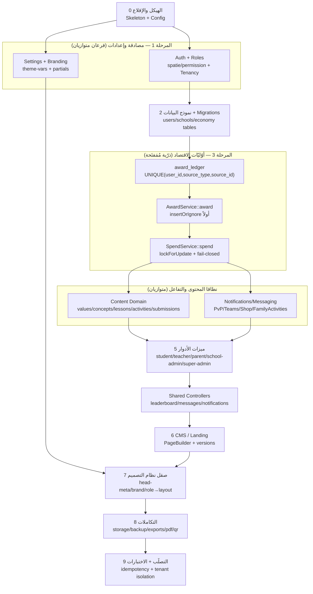

> **للبانِي (AI):** ابنِ بترتيب الأسهم؛ لا تبدأ أي ميزة دور تمنح/تخصم قيمة قبل اكتمال `award_ledger → AwardService → SpendService` (المسار الوحيد، مفتاح المَفتَحة `UNIQUE(user_id,source_type,source_id)`). الإعدادات/العلامة تتوازى مع المصادقة، والمحتوى يتوازى مع المراسلة، لكن `DataModel` بوّابة FK واحدة قبل الاقتصاد، والتصلّب/العزل آخر بوّابة قبل التسليم.

هذا الجزء يُحدِّد العقد المُلزِم لترتيب بناء منصة «وحي / قيمّ» من الصفر، وخريطة الاعتماديات بين أنظمتها الفرعية، واستراتيجية الاختبار، وخطّ التكامل المستمر (CI)، وقوائم القبول النهائية، وجدول «المزالق المعروفة = قواعد مُلزِمة» المُستخلَص من المراجعات الجنائية الأربع. أيّ خرق لترتيب البناء أو لإحدى بوابات الجودة يُعَدّ تسليماً غير مكتمل ويُمنع دمجه.

### 13.0 المبادئ الحاكمة (Binding Doctrine)

- **يجب** أن يُبنى النظام طبقةً فوق طبقة بترتيب الاعتماديات المُحدَّد أدناه؛ **يُمنع** بناء أي ميزة دور (per-role feature) قبل اكتمال أوّليّات الاقتصاد (`AwardService`/`SpendService`) ونموذج البيانات الذي تعتمد عليه.
- **إلزامي**: كل تحويل نقاط/XP/عملات يمرّ عبر أوّليّة ذرّية واحدة مُمَفتَحة (idempotent) مدعومة بقيد `UNIQUE(user_id, source_type, source_id)` على جدول `award_ledger`. **يُمنع** وجود أي مسار جانبي لمنح أو خصم قيمة خارج هاتين الأوّليّتين.
- **إلزامي**: كل تعديل في المخطط (migration) قابل للعكس (`down()`)، مُجرَّب على نسخة DB، ومُعتمَد صراحةً عبر بوّابات القرار (G1–G6). **يُمنع** التطبيق التلقائي.
- **إلزامي**: الحالة المُجمَّدة (Frozen State) — إصلاحات الاقتصاد (Batch 2)، وعزل المستأجِر/الفِرَق IDOR (Batch 3)، وتصلّب المصادقة (Batch 4 / cluster-06) — تُعاد في البناء بحالتها النهائية المُصلَّحة لا بسلوكها قبل الإصلاح.

---

### 13.1 تسلسل البناء المُرتَّب بالاعتماديات (Build Order)

يُنفَّذ البناء على عشر مراحل متتالية. كل مرحلة لها **بوّابة خروج** (Exit Gate) لا يُسمح بتجاوزها قبل تحقُّق معاييرها.

#### المرحلة 0 — الهيكل العظمي والإقلاع (Foundation: Skeleton)

| العنصر | الوصف | بوّابة الخروج |
|---|---|---|
| `composer.json` / `package.json` | Laravel 12 على الهيكل النحيل، PHP `^8.2`، الحِزَم المُثبَّتة بالإصدارات المُحدَّدة، `autoload.files` يضمّ `app/Helpers/SettingsHelper.php` | `composer install` و`npm install` ينجحان |
| `bootstrap/app.php` | `withRouting(web, api apiPrefix='api', console, health '/up')`؛ `trustProxies(at:'*')`؛ `validateCsrfTokens(except:[])`؛ ترتيب الـ middleware للويب والـ API؛ aliases `role`/`school.access`/`force-2fa`؛ `withExceptions` (رسالة 500 عامّة لطلبات JSON) | `php artisan route:list` ينجح |
| `bootstrap/providers.php` | مزوّدان فقط: `AppServiceProvider`, `AuthServiceProvider` | — |
| `config/*` | اللغة `ar`، fallback `ar`، faker `ar_SA`، المنطقة `Asia/Riyadh`؛ drivers session/cache/queue=`database`؛ disk `public` جذره `storage/app/public/data` | `php artisan config:cache` ينجح |
| `vite.config.js` / Tailwind v4 | المدخلات `app.css`+`app.js`، manualChunks، esbuild drop console في الإنتاج | `npm run build` ينتج `public/build/manifest.json` |
| `pint.json` / `phpstan.neon` (level 5 + baseline) / `phpunit.xml` | بوّابات الجودة جاهزة | `composer lint`/`composer analyse`/`composer test` تعمل (ولو فارغة) |

**بوّابة الخروج 0**: التطبيق يقلع، الصفحة الرئيسية الفارغة تُحمَّل، `/up` يرجع 200.

#### المرحلة 1 — المصادقة والأدوار والإعدادات (Auth + Roles + Settings)

```
users (role enum + school_id nullable + secondary_roles + active_role + 2FA + password_change_required)
schools (registration tokens + enable_* flags)
registration_requests, password_reset_tokens, spatie permission tables
settings (key/value typed + composite unique(key,user_id))
```

- **يجب** بناء `Setting` بطبقة الكاش (`setting.{key}`، 86400s)، و`SettingsHelper.php`، و`AppServiceProvider::boot` (مشاركة `$branding` عبر `getMany` داخل try/catch + skip في console).
- **يجب** بناء `AppServiceProvider`: `Gate::before` (super_admin=>true)، `Gate::define('access-admin')`، RateLimiters (`api` 60/min، `login` 5/min per email|ip + 20/min per ip)، View::composers، event listeners.
- **يجب** بناء المصادقة: `CheckRole`, `CheckSchoolAccess`, `CheckPasswordChangeRequired`, `CheckPendingSurveys`, `Force2FAForAdmins` (مُسجَّل وغير مُلحَق بأي مجموعة — WONTFIX)، `SecurityHeaders`, `SetArabicLocale`, `ApplyTheme`, `CheckMaintenanceMode`, `VerifyCsrfToken`.
- **يجب** بناء `AuthController` (تأمين login بالـ exponential lockout على `ip|sha256(email)`، 2FA، forgot/reset محايد ضدّ التعداد)، و`AuthApiController` (Sanctum + 2FA مطابق)، و`PublicRegistrationController`، و`RoleSwitchController`، و`ScopedToSchool`.
- **يجب** زرع `DefaultSettingsSeeder` (`enable_registration=1`, `enable_2fa=1`, `maintenance_mode=0`, الألوان، social_*).

**بوّابة الخروج 1**: تسجيل الدخول لكل دور يعمل، التوجيه حسب الدور يعمل، عزل المستأجِر يردّ 403 عند خرق `school_id`، اختبارات `AuthHardeningTest` و`TenantMiddlewareTest` خضراء.

#### المرحلة 2 — نموذج البيانات والـ Migrations (Data Model)

ترتيب الـ migrations إلزامي (الاعتماديات بمفاتيح أجنبية):

```
1. users + ALTERs (2FA, secondary_roles/active_role, birth_date, password_change_required, school_id FK)
2. schools, school_branches, education_levels/academic_years, school_education_level
3. classrooms, classroom_student, school_active_values
4. points, coins  →  align migration (source VARCHAR(100) + description VARCHAR(500))
5. badges, user_badges (UNIQUE user_id,badge_id), crowns (UNIQUE user_id,value_id)
6. streaks (user_id UNIQUE), activity_user_streaks (user_id UNIQUE), lesson_user_streaks (UNIQUE user_id,lesson_id) + lessons.streak_*
7. shop_items, user_purchases, user_items
8. teams, team_members, team_activities (الأعمدة الحديثة فقط: total_score/team_submission/team_file/submitted_at/teacher_feedback)
9. teacher_points (teacher_id UNIQUE), parent_points/parent_praises/parent_gifts, parent_student, school_points + schools.total_points
10. conversations/messages, notifications (UUID PK), parent_teacher_messages, bulk_messages(+recipients), pvp_challenges/pvp_matches, teacher_ratings, family_activity_submissions (status من البداية)
11. settings(+user_id), landing_content(+versions), page_builder, school_statistics_cache, contact_messages, registration_requests, activity_log
12. award_ledger  ←  الأخيرة: UNIQUE(user_id,source_type,source_id) 'award_ledger_event_unique' + INDEX(source_type,source_id)
```

**بوّابة الخروج 2**: `php artisan migrate:fresh` على MySQL ينجح، و`migrate:rollback` يعكس كل خطوة، وكل قيود `UNIQUE` المذكورة موجودة فعلياً في `information_schema`.

#### المرحلة 3 — أوّليّات الاقتصاد (Economy Primitives)

```php
// المسار الوحيد للمنح
AwardService::award(
    int $userId, string $sourceType, string $sourceId,
    int $points = 0, int $coins = 0, ?string $description = null, bool $distribute = false
): bool;
// المسار الوحيد للخصم
SpendService::spend(
    int $userId, string $sourceType, string $sourceId,
    int $cost, ?string $description = null
): array; // {success, reason, balance, duplicate}
```

- `AwardService::award`: يملك `DB::transaction` الخاصّة به؛ `insertOrIgnore` على `award_ledger` **أولاً** (0 صفوف ⇒ duplicate ⇒ `return false` بلا أي كتابة)؛ ثم `Point::create` (إن `points>0`) و`Coin::create` (transaction_type `earn`, إن `coins>0`)؛ إن `distribute` ⇒ `PointsDistributionService::distributeWithin` داخل نفس الـ tx؛ يرفض `points<=0 && coins<=0`. **يُمنع** كتابة `users.total_points`.
- `SpendService::spend`: `DB::transaction`؛ يقفل صفّ `users` بـ `lockForUpdate` (وليس `Coin SUM`)؛ يفحص `award_ledger` (موجود ⇒ duplicate success)؛ يفحص `SUM(coins) >= cost` ويفشل مغلقاً (`insufficient_balance`) بلا كتابة؛ يُدرج `award_ledger{coins:cost}` + `Coin{coins:-cost, type:spend}`. السعر دائماً مُشتقّ من الخادم (`ShopItem::findOrFail->price`).
- `User::getLevelAttribute() = intdiv(SUM(points),100)+1` هو المصدر الوحيد للمستوى (يُفضِّل alias `points_sum_points` من `withSum('points','points')`).
- نِسَب التوزيع: teacher `0.10`، parent `0.05`، school `0.02`، كلٌّ `max(1, floor(...))`.
- `Point`/`Coin` **append-only**: `abort(403)` على update/delete خارج console.

**بوّابة الخروج 3**: `EconomyIdempotencyTest` (إعادة المنح بنفس المفتاح ⇒ لا منح ثانٍ) و`SpendOverdraftTest` (الخصم لا يُنزِل الرصيد تحت الصفر) خضراء.

#### المرحلة 4 — نطاق المحتوى (Content Domain)

- القِيَم (`values`)/المفاهيم (`concepts`)/الدروس (`lessons`)/الأنشطة (`activities`)/التمارين (`exercises`)/الاستبيانات (`surveys`)/بنوك الأسئلة والأنشطة.
- **يجب** أن يقرأ كل Blade ووحدة تحكّم الأعمدة الحقيقية: التسمية `name` (لا `title`)، الأيقونة `icon` (لا `emoji`)، **لا** علاقة `meaning`/`meanings` على `Lesson`/`Concept` (استخدم `concept->value`).
- **يجب** توحيد enum أنواع الأنشطة عبر كل المتحكّمات وقوائم `<select>` وعمود DB.

**بوّابة الخروج 4**: `SchemaBladeParityTest` يجتاز (لا قراءة لعضو غير موجود في المخطط)، وكل سلاسل العلاقات القابلة لـ null في الـ blades تستخدم `?->`.

#### المرحلة 5 — ميزات الأدوار (Per-Role Features)

الترتيب: `StudentController` (التعلّم، الأنشطة، المتجر، PvP، الفِرَق) → `TeacherController` (المراجعة، الفِرَق، التمارين، التحليلات) → `SchoolAdminController` (CRUD المستخدمين، الفصول، طلبات التسجيل) → `ParentController`/`ParentDashboardController` → `Admin\*` و`SuperAdminController`.

- **يجب** أن يمرّ كل منح اقتصادي عبر `AwardService` بمفتاح مصدر مستقرّ: `activity_submission`+submissionId، `parent_praise`+id، `parent_gift`+id، `family_activity`+id، PvP payout، team grading.
- **يجب** أن تُعيد كل عملية approve/reject التفرّع على علم `reject` **قبل** أي أثر منح، مع قفل الصفّ والعودة المبكّرة إن كانت الحالة هدفاً مسبقاً (idempotent approval).
- **يجب** فلترة كل `attach/sync/team-insert` إلى `school_id` للفاعل و`role` الصحيح قبل الإدراج.

**بوّابة الخروج 5**: اختبارات الميزات لكل دور خضراء + `CrossTenantTest` (كائن أجنبي ⇒ 403/404).

#### المرحلة 6 — نظام إدارة المحتوى وصفحة الهبوط (CMS / Landing)

- `Setting`/`PageBuilder`/`LandingContent`(+versions)/`ContactController`/`Api\LandingContentController`.
- **يجب** أن يمرّ محتوى `html` فقط عبر مُعقِّم مسموح (allowlist) عند الإخراج؛ **يُمنع** الاعتماد على blocklist بـ regex.
- **يجب** أن يكون `restoreVersion` داخل transaction مع تحقُّق سلامة اللقطة؛ **يُمنع** `truncate-then-insert` أو `explode(';')`.

**بوّابة الخروج 6**: صفحة الهبوط الديناميكية تُرسَم، والتحرير الحيّ للـ super_admin يعمل، واستعادة النسخة قابلة للعكس.

#### المرحلة 7 — صقل نظام التصميم (Design System Polish)

- **يجب** إخراج جزئيّات موحَّدة: `head-meta` (charset/viewport/csrf-token/favicon/manifest/theme-color)، `theme-vars` (متغيّرات CSS من الإعدادات)، `brand`، `app-footer` — و`@include` في كل تخطيطات الأدوار العشرة.
- **يجب** أن تُرسَم العروض المشتركة (leaderboard/notifications) بالتخطيط المُشتقّ من دور الفاعل (role→layout map)؛ **يُمنع** `@extends('layouts.admin')` ثابتاً.

**بوّابة الخروج 7**: كل تخطيط يحوي `csrf-token` meta و`favicon`؛ لا فرع برمجة ثابت للعلامة التجارية؛ رفع الصورة الرمزية لا يُنتج 419.

#### المرحلة 8 — التكاملات (Integrations)

- `NotificationService` (الـ URL في معامل `action_url` لا في `data`)، البريد، Sanctum mobile API، الـ scheduler (6 مهامّ)، spatie/backup، spatie/activitylog، Excel exports (تحييد `=,+,-,@`).

**بوّابة الخروج 8**: `MobileApiTest` لكل نقطة نهاية (200 + schema) خضراء؛ الإشعارات تحمل روابطها؛ النسخ الاحتياطي يعمل بلا تنفيذ SQL من أرشيف مرفوع.

#### المرحلة 9 — التصلّب (Hardening)

- مراجعة XSS/Upload/CSRF/N+1، توحيد `media_url`، تأمين الوسائط الخاصّة خلف مسارات تنزيل محميّة، إزالة الكود الميّت والمسارات اليتيمة، `Route::resource ->except(['show'])` حيث لا `show()`.

**بوّابة الخروج 9**: كل بنود §13.6 محقَّقة، وCI أخضر بالكامل.

---

### 13.2 خريطة التكامل (Integration Map — Dependency Graph)

```
config/bootstrap (Stack)
        │
        ▼
Settings ──────────────► Theme/Branding partials ──► All Role Layouts
        │                                                   ▲
        ▼                                                   │
Auth + Roles + Tenancy (users, schools, CheckRole, CheckSchoolAccess, ScopedToSchool, Policies)
        │
        ▼
Data Model (org+social + economy tables)  ──────────► award_ledger
        │                                                   │
        ▼                                                   ▼
Economy Primitives (AwardService, SpendService, PointsDistributionService, GamificationService)
        │
        ├──────────────► Content Domain (values/concepts/lessons/activities/surveys)
        │                         │
        ▼                         ▼
Per-Role Features  ◄──── Notifications/Messaging/PvP/Teams/Shop/FamilyActivities
        │
        ▼
CMS/Landing ──► Page Builder ──► public pages
        │
        ▼
Integrations (Mobile API, Mail, Backup, ActivityLog, Excel, Scheduler)
        │
        ▼
Hardening (media_url, private media, route integrity, XSS/upload)
```

**قواعد الاعتماد المُلزِمة**:

| النظام الفرعي | يعتمد على | يُمنع أن يعتمد عليه قبل اكتماله |
|---|---|---|
| Economy Primitives | Data Model + `award_ledger` | أي ميزة دور تمنح/تخصم قيمة |
| Per-Role Features | Economy + Auth + Content | CMS/Landing |
| Leaderboard/Rank | `PointsService` + `teacher_points`/`parent_points` | يُمنع قراءة جدول الطالب لأدوار المعلّم/الوليّ |
| Notifications | `action_url` signature صحيح + علاقات حقيقية | المراسلة الجماعية بلا بوّابة دور |
| All Layouts | `head-meta` + `theme-vars` + `brand` | أي AJAX قبل وجود `csrf-token` meta |
| Mobile API | الأعمدة/العلاقات الحقيقية + اختبارات | الإطلاق بلا تغطية اختبار |

---

### 13.3 استراتيجية الاختبار (Testing Strategy)

#### 13.3.1 اختبارات الوحدة — الاقتصاد والمَفتَحة (Unit / Idempotency)

```php
// EconomyIdempotencyTest
public function test_replaying_award_does_not_double_credit(): void {
    AwardService::award($u->id, 'activity_submission', (string)$sub->id, 50, 10);
    AwardService::award($u->id, 'activity_submission', (string)$sub->id, 50, 10); // duplicate
    $this->assertSame(50, (int) Point::where('user_id',$u->id)->sum('points'));
    $this->assertSame(10, (int) Coin::where('user_id',$u->id)->sum('coins'));
    $this->assertSame(1, DB::table('award_ledger')
        ->where(['user_id'=>$u->id,'source_type'=>'activity_submission','source_id'=>(string)$sub->id])->count());
}

// SpendOverdraftTest
public function test_spend_fails_closed_when_insufficient(): void {
    AwardService::award($u->id, 'seed', '1', 0, 5);
    $r = SpendService::spend($u->id, 'reward_redemption', 'tok-1', 20);
    $this->assertFalse($r['success']);
    $this->assertSame('insufficient_balance', $r['reason']);
    $this->assertSame(5, (int) Coin::where('user_id',$u->id)->sum('coins')); // لم يُكتب شيء
}
```

**يجب** تغطية: re-grade submission، replay `submitExercise`، إعادة توزيع النقاط، إعادة دفع PvP، `gradeTeamActivity` المتزامن، level-up coins، streak bonus (المنح مسؤولية المُنادي لا نموذج الـ streak).

#### 13.3.2 اختبارات الميزة لكل دور (Feature / Per-Role)

- لكل دور (super_admin/school_admin/teacher/student/parent): دخول، لوحة، كل مسار رئيسي يرجع 200، وكل عملية كتابة تُثبِّت الحالة الصحيحة.
- **يجب** أن يتحقّق `family-activity reject` من **عدم** منح أي نقاط (status=rejected + rejection_reason)، و`approve` من منح `+20` للطالب و`+10` للوليّ مرّة واحدة.
- **يجب** أن يتحقّق daily-cap للمدح (5) والهدايا (3) داخل transaction مع `lockForUpdate`.

#### 13.3.3 اختبارات اختراق عزل المستأجِر (Tenant-Isolation Penetration)

```php
// CrossTenantTest — لكل نقطة تقبل id
public function test_teacher_cannot_act_on_foreign_school_object(): void {
    $this->actingAs($teacherSchoolA);
    foreach ($foreignIds as $route => $id) {
        $this->get(route($route, $id))->assertStatus(in: [403, 404]);
    }
}
// TeamScopingTest — leader_id/member_ids الأجنبية تُرفض 422 لا تُدرَج
// BulkBroadcastAuthTest — student/parent يُمنع من البثّ؛ school_admin محصور بـ school_id
```

#### 13.3.4 اختبارات اتّساق `DONE_STATUSES`/approved

```php
// DoneStatusConsistencyTest
public function test_approved_submission_counts_in_all_metrics(): void {
    $sub = ActivitySubmission::factory()->create(['status' => 'approved']);
    // كل استعلام تحليلات/تقرير/leaderboard/export يستخدم whereIn('status', DONE_STATUSES)
    $this->assertContains('approved', ActivitySubmission::DONE_STATUSES);
    $this->assertGreaterThan(0, $analytics->completed_count);
    // لا يُلمَس فحص 'pending' المشروع (classStats)
}
```

#### 13.3.5 اختبارات السلامة الإضافية

| الاختبار | الغرض |
|---|---|
| `RouteIntegrityTest` | كل `Route::resource` بلا `show()` يستخدم `->except(['show'])`؛ كل اسم route مُشار إليه في blade مُعرَّف |
| `SchemaBladeParityTest` | لا قراءة لعضو/علاقة غير موجودة |
| `MobileApiTest` | كل نقطة API ترجع 200 + schema (نشأت 3 أعطال 500 من غياب التغطية) |
| `XssSanitizerTest` | المحتوى المُؤلَّف يُعقَّم allowlist عند الإدخال والإخراج |
| `NotificationArgOrderTest` | الـ URL في `action_url`؛ إشعارات الوليّ تُرسَل عبر العلاقة الحقيقية |

---

### 13.4 خطّ التكامل المستمر (CI Pipeline)

```bash
# .ci — يفشل البناء عند أي خطوة حمراء
composer install --no-interaction --prefer-dist
npm ci && NODE_ENV=production npm run build

composer lint        # vendor/bin/pint --test  (يُمنع الدمج عند انحراف التنسيق)
composer analyse     # vendor/bin/phpstan analyse --memory-limit=512M (level 5 + phpstan-baseline.neon)
php artisan migrate:fresh --seed --env=testing  # MySQL، لا sqlite_master
composer test        # vendor/bin/phpunit (كل المجموعات أعلاه)
```

**قواعد مُلزِمة لـ CI**:
- **يجب** أن يكون `pint --test` و`phpstan level 5` و`phpunit` بوّابات حظر دمج (blocking).
- **يجب** أن يمرّ الكود الجديد على phpstan **نظيفاً**؛ الـ baseline يُجمِّد 391 خطأً قديماً فقط ولا يُوسَّع.
- **يُمنع** إضافة `app/Http/Kernel.php` أو `Console Kernel` (الهيكل النحيل).
- **يجب** أن تعمل migrations على MySQL (فحوص الوجود عبر `information_schema` لا `sqlite_master`).
- **يجب** تشغيل `EconomyIdempotencyTest` + `CrossTenantTest` إلزامياً بعد أي تعديل على `TeacherController` أو `routes/web.php` (ملفّات MUTEX عالية التصادم).

---

### 13.5 بوّابات القرار للمخطط (Schema Decision Gates)

| البوّابة | القرار | الحالة المُلزِمة |
|---|---|---|
| G1 | تأكيد symlink `public/storage` قبل توحيد `media_url` | يُتحقَّق بـ curl قبل أي تعديل جماعي |
| G2 | وسائط PII (تسليمات، صور دردشة، صور أنشطة عائلية) على disk خاصّ | خلف مسارات تنزيل محميّة بالملكيّة |
| G3 | `lesson_id` مطلوب أم nullable | مُعتمَد صراحةً؛ الـ blades تستخدم `?->` على السلسلة |
| G4 | إسقاط `'suspended'` من enum الحالة | `users.status` يبقى `('active','inactive')` فقط |
| G5 | إزالة خيار `school_admin` من نموذج التسجيل العامّ | مُطبَّق |
| G6 | إصلاح XSS قبل أي de-shadow للمتحكّمات | XSS أولاً |

---

### 13.6 جدول «المزالق المعروفة = قواعد مُلزِمة» (Binding Rules from Audit Lessons)

كل سطر: حادثة متكرّرة حقيقية ⟵ القاعدة التي تمنع تكرارها. **يُمنع** خرق أيّ منها.

| # | الحادثة الجذرية (Incident) | القاعدة المُلزِمة (Rule that prevents it) |
|---|---|---|
| R1 | اقتصاد يدوي غير مَفتَح: `submitReview`/`submitExercise`/PvP يعيدون المنح | **يجب** المرور عبر `AwardService`/`SpendService` بمفتاح `(user_id,source_type,source_id)` + `insertOrIgnore` + `UNIQUE`. يُمنع أي مسار منح بلا claim مسبق |
| R2 | منح مزدوج ممكن لو فات موقع نداء | **يجب** قيد `UNIQUE(user_id,source_type,source_id)` على `award_ledger` و`UNIQUE(student_id,activity_id)` على التسليمات؛ الأقفال التطبيقية وحدها غير كافية |
| R3 | تسعير من العميل (client-supplied cost) | **يجب** اشتقاق السعر من `ShopItem::findOrFail->price` خادمياً، وفحص أرضية الرصيد داخل نفس الـ tx المقفلة؛ يُمنع رصيد سالب |
| R4 | عمود مُجمَّع غير مُصان (`users.total_points` ميّت) | **يجب** قراءة الرصيد عبر `SUM`؛ يُمنع قراءة عمود لا يُكتَب كمصدر حقيقة |
| R5 | leaderboard يقرأ جدول الطالب لأدوار المعلّم/الوليّ ⇒ صفر | **يجب** التوجيه عبر `PointsService` واختيار `teacher_points`/`parent_points` حسب الدور |
| R6 | ابتلاع صامت لخطأ insert على `UNIQUE(teacher_id)` | **يجب** `updateOrCreate` + `DB::raw('points + n')`؛ يُمنع `catch` فارغ على فشل منح، ويجب rollback الوحدة كاملة |
| R7 | `exists:users,id` مأخوذ كإثبات ملكيّة (storeTeam/updateClassroom/attach) | **يجب** إعادة فلترة الـ ids إلى `school_id`+`role` للفاعل قبل أي attach/sync/insert |
| R8 | بثّ بلا بوّابة دور (BulkMessage) | **يجب** بوّابة `role:super_admin,school_admin` + حصر المستلِمين بـ `school_id` للمرسِل (إلا super_admin) |
| R9 | مُعقِّم regex blocklist (`safe_html`) قابل للتجاوز | **يجب** مُعقِّم allowlist (HTMLPurifier) عند الإدخال والإخراج؛ JS عبر `textContent`/DOMPurify لا `innerHTML` |
| R10 | رفع SVG/محتوى نشِط ⇒ XSS مخزَّن | **يجب** allowlist صارم mime+extension بأسماء عشوائية؛ يُمنع SVG للصور التحريرية/الشعار/الأيقونة |
| R11 | حقن CSV/صيغة | **يجب** تحييد `=,+,-,@` في الخلايا المُتحكَّم بها قبل التصدير |
| R12 | `where('status','completed')` يُسقِط `approved` من التحليلات | **يجب** `whereIn('status', ActivitySubmission::DONE_STATUSES)`؛ يُمنع لمس فحوص `pending` المشروعة |
| R13 | انحراف مخطط في Blade (`title`/`emoji`/`meanings`) | **يجب** قراءة `name`/`icon`/`concept->value` فقط؛ grep وإزالة العضو الشبح بعد أي إعادة تسمية |
| R14 | reject يسقط إلى approve ويمنح | **يجب** التفرّع على `reject` قبل أي منح + عمود `status`/`rejection_reason` حقيقي في `$fillable` |
| R15 | تكرار النقر يمنح مراراً (approval) | **يجب** `lockForUpdate` + العودة المبكّرة إن كانت الحالة هدفاً قبل أي منح |
| R16 | عدم تطابق form↔validator↔fillable↔column (drop صامت) | **يجب** مطابقة كل حقل؛ `$request->boolean()` للـ select لا `$request->has()` |
| R17 | enum غير محاذٍ (validator/select/DB) | **يجب** تطابق المجموعات: `classrooms.status('active','archived')`، `users.status('active','inactive')`، enum الأنشطة موحَّد |
| R18 | استعادة مُدمِّرة بلا transaction (`explode(';')`/truncate-then-insert) | **يجب** transaction + تحقُّق سلامة + أداة DB حقيقية؛ يُمنع `explode(';')` ونسخ ملفّات أرشيف إلى المسار العامّ |
| R19 | ثلاث اتّفاقيات URL للوسائط ⇒ 404 | **يجب** `media_url()` واحد + disk url واحد؛ تأكيد symlink قبل التعديل الجماعي |
| R20 | وسائط حسّاسة عامّة على `/storage/data/<path>` | **يجب** disk خاصّ خلف مسارات تنزيل محميّة بالملكيّة |
| R21 | غياب `head-meta` مشترك (419 على AJAX، لا favicon) | **يجب** جزئيّة `<head>` واحدة مُضمَّنة في كل تخطيط |
| R22 | إعدادات تُحفَظ ولا تُقرأ / علامة تجارية ثابتة | **يجب** مصدر افتراضي واحد + قراءة عبر `theme-vars`/composer؛ خيار بلا قارئ = عيب |
| R23 | تخطيط ثابت لعرض مشترك (`@extends('layouts.admin')`) | **يجب** role→layout map للعروض المشتركة |
| R24 | `Route::resource` بلا `show()` ⇒ 500 على URL مكتوب | **يجب** `->except(['show'])` أو تنفيذ `show()` + `RouteIntegrityTest` |
| R25 | سلسلة علاقة nullable في Blade ⇒ 500 | **يجب** `?->` أو `@if` على كل سلسلة nullable |
| R26 | `NotificationService` URL في `data` لا `action_url` | **يجب** الـ URL في معامل `action_url`؛ حلّ الوليّ عبر العلاقة الحقيقية |
| R27 | تسريب `$e->getMessage()` للمستخدم | **يجب** تمركز الاستثناءات في `bootstrap/app.php` برسالة عامّة + تسجيل التفصيل |
| R28 | Mobile API على أعمدة/علاقات خاطئة بلا اختبار | **يجب** الأعمدة الحقيقية (`points`/`coins`/`streak()`/`attachment`/`answer`) + تغطية اختبار لكل نقطة |
| R29 | throttle على user-id الضحيّة، تعداد المستخدمين | **يجب** throttle على `IP+hash(email)`، ردّ reset محايد، throttle على التسجيل/الدخول، كلمات مرور عشوائية للمستورَدين |
| R30 | كود/عمود ميّت ومسارات يتيمة | **يجب** صيانة العمود أو حذفه؛ إزالة الـ blades/controllers اليتيمة بعد تأكيد عدم الإشارة |
| R31 | N+1 على اللوحات والـ pollers | **يجب** `with()` + تجميعات DB + pagination + clamp للـ LIMIT المُدخَل |
| R32 | حساب مكرَّر للمستوى/العملات | **يجب** مكان واحد (`User::getLevelAttribute`/`GamificationService`)؛ يُمنع نسخ `floor(xp/100)+1` |
| R33 | migration غير معكوس / يفترض sqlite_master | **يجب** `down()` + dry-run + اعتماد + فحص MySQL-صحيح |
| R34 | `needs_revision` بدل `needs_review` يمنع إعادة التسليم | **يجب** تطابق حرفيّ مع enum؛ تمركز السلاسل كثوابت |
| R35 | UUID غير مُقتبَس في JS inline ⇒ تعطّل الأزرار | **يجب** اقتباس المُعرِّفات النصّية المُدرَجة داخل JS |
| R36 | إعادة إضافة `force-2fa` للمشرفين ⇒ قفل خارج اللوحة | **يُمنع** إلحاق `force-2fa` بمجموعة `/admin` (WONTFIX)؛ 2FA اختياري يعمل |
| R37 | حذف view `test-notifications` ⇒ عودة 500 | **يُمنع** حذفه (موجود عمداً) |

---

### 13.7 تعريف الإنجاز للتسليم (Delivery Definition-of-Done)

التسليم **يُعَدّ مكتملاً فقط** عند تحقُّق كل ما يلي مجتمعاً:

1. كل مراحل §13.1 العشر مكتملة وكل بوّابات الخروج محقَّقة.
2. CI أخضر بالكامل: `pint --test` + `phpstan level 5` (كود جديد نظيف) + `phpunit` (كل المجموعات).
3. `migrate:fresh --seed` يعمل على MySQL، و`migrate:rollback` يعكس كل خطوة.
4. كل قواعد §13.6 (R1–R37) محقَّقة بلا استثناء.
5. بوّابات القرار G1–G6 مُعتمَدة ومُطبَّقة.
6. الحالة المُجمَّدة (Batch 2/3/4) مُعاد إنتاجها بحالتها المُصلَّحة.
7. كل تخطيطات الأدوار تقرأ العلامة/الثيم من مصدر واحد وتحوي `csrf-token` meta و`favicon`.
8. لا كود ميّت ولا مسار يتيم ولا view غير مُشار إليه (عدا المُستثنى عمداً).

---

### معايير القبول (Acceptance Criteria)

- [ ] إعادة منح بنفس `(user_id, source_type, source_id)` **لا** تُنتج صفّ `Point`/`Coin` ثانياً، وقيد `award_ledger_event_unique` موجود في `information_schema`.
- [ ] `SpendService::spend` يفشل مغلقاً عند نقص الرصيد بلا أي كتابة، ولا يُنتج رصيداً سالباً تحت التزامن.
- [ ] أيّ فاعل من مدرسة A يحاول قراءة/تعديل كائن من مدرسة B يحصل على 403/404 (`CrossTenantTest` أخضر)؛ `member_ids` الأجنبية تُرفض 422.
- [ ] تسليم بحالة `approved` يُحتسَب في كل تحليلات/تقارير/leaderboard/export (`whereIn(DONE_STATUSES)`)، وفحوص `pending` المشروعة سليمة.
- [ ] `family-activity reject` يمنح صفر نقاط ويثبّت `status=rejected`+`rejection_reason`؛ و`approve` يمنح `+20/+10` مرّة واحدة فقط.
- [ ] لا تخطيط يفتقد `csrf-token` meta؛ رفع الصورة الرمزية لا يُنتج 419؛ كل وسيط يمرّ عبر `media_url()` واحد.
- [ ] كل نقطة Mobile API ترجع 200 + schema صحيح تحت `MobileApiTest`.
- [ ] `pint --test` + `phpstan level 5` (نظيف للكود الجديد) + `phpunit` كلّها خضراء في CI، و`migrate:fresh`/`rollback` يعملان على MySQL.
- [ ] لا `Route::resource` بلا `show()` يُنتج 500 (`RouteIntegrityTest` أخضر)؛ كل سلاسل العلاقات nullable في الـ blades تستخدم `?->`.
- [ ] `force-2fa` غير مُلحَق بأي مجموعة، وview `test-notifications` موجود — كلاهما عمداً.

---

## 14. المتحكّمات والمسارات المشتركة عبر الأدوار (الطبقة المُكمِّلة)

### 🗺️ المخططات المعمارية (Architecture Diagrams)

#### 🗺️ تدفّق المراسلة والبثّ الجماعي والإشعارات

يوضّح المخطط المسارات الثلاثة: المراسلة المباشرة (محادثة 1:1 + رفع صورة على القرص العام)، والبثّ الجماعي مع بوابة حصر المدرسة لمدير المدرسة (abort 403)، والإشعارات المملوكة لصاحبها مع بوابة عزل المالك على القراءة والتعديل.

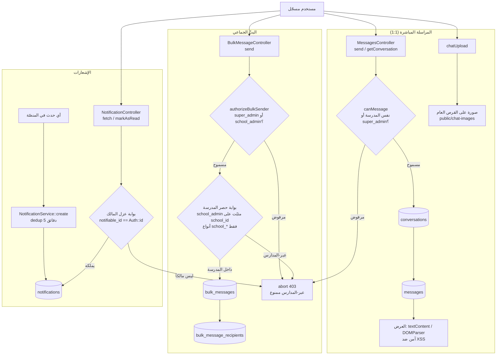

> **للبانِي (AI):** اتجاه الـFK: `messages.conversation_id -> conversations`، و`bulk_message_recipients.bulk_message_id -> bulk_messages`. بوابتا العزل إلزاميتان قبل أي قراءة/كتابة: `school_admin` يُفرَض عليه `school_id = $sender->school_id` (أنواع `school_*` حصراً وإلا abort 403)، والإشعارات مُقيَّدة دائماً بـ `notifiable_type='App\Models\User'` + `notifiable_id == Auth::id()`. ابنِ جداول الرسائل قبل المتحكّمات، وفعّل dedup الإشعارات (نفس user+type+title خلال 5 دقائق) كمفتاح idempotency.

توثّق هذه الطبقة المتحكّمات التي تُستخدَم عبر أكثر من دور (السوبر أدمن، مدير المدرسة، المعلم، ولي الأمر، الطالب) ولم تُفصَّل في الأجزاء 6–11 من حيث السلوك والتحقّق والتصريح. هذا الجزء هو **المرجع المُلزِم والوحيد** لهذه المتحكّمات، ويُلغي ويَسبِق أي إدراج للمسارات اقتصر على الاسم في الجزأين 6 و9؛ عند أي تعارض، يُعتمد ما هو هنا.

> ملاحظة بنيوية: جميع المجموعات المشتركة في `routes/web.php` (الصورة الرمزية، الرسائل الجماعية، نظام الرسائل، لوحات الصدارة) مُغلَّفة داخل `Route::middleware('auth')`، ومجموعة الإشعارات لها `middleware('auth')` صريحة. لذا يُمنع الوصول لأيّ منها دون مصادقة جلسة سارية (`web` guard).

---

### 14.1 LeaderboardController — لوحات الصدارة عبر الأدوار

`app/Http/Controllers/LeaderboardController.php`. خمس نقاط نهاية تُقدّم لوحات الصدارة لكل الفئات. كل دالة تَدعم سلوكَين: **HTML** (إرجاع `view`) و**JSON** (عند `wantsJson()` — أي طلب يحمل `Accept: application/json`/AJAX). الاستثناء: `index` تُرجِع HTML فقط دائماً.

#### خريطة النقاط

| Route name | Verb | Controller@method | Role/Auth | Notes |
|---|---|---|---|---|
| `leaderboard.index` | GET | `LeaderboardController@index` | `auth` (أي دور) | لوحة موحّدة لكل الفئات (top 10 لكلٍّ) + `userRank`؛ HTML فقط. |
| `leaderboard.students` | GET | `LeaderboardController@students` | `auth` | فئة الطلاب؛ HTML أو JSON. |
| `leaderboard.teachers` | GET | `LeaderboardController@teachers` | `auth` | فئة المعلمين؛ HTML أو JSON. |
| `leaderboard.parents` | GET | `LeaderboardController@parents` | `auth` | فئة أولياء الأمور؛ HTML أو JSON. |
| `leaderboard.schools` | GET | `LeaderboardController@schools` | `auth` | فئة المدارس؛ HTML أو JSON. |

#### نطاق كل فئة ومصدر النقاط (إلزامي)

- **الطلاب** (`getStudentLeaderboard`): نقاط من جدول `points` عبر `withSum('points as total_points', 'points')`. يُقيَّد افتراضياً بمدرسة المستخدم عندما `scope === 'school'` و`school_id` متوفّر، ويُمكن تضييقه بـ `classroom_id`. يُستثنى غير `status='active'`.
- **المعلمون** (`getTeacherLeaderboard`): النقاط **يجب** أن تأتي من `teacher_points` عبر subquery (`SUM(teacher_points.points)`)، **لا** من جدول `points` الخاص بالطلاب — وإلا تَظهر صدارة صفرية. يُضاف `students_count` عبر subquery على `classroom_student`+`classrooms`.
- **أولياء الأمور** (`getParentLeaderboard`): النقاط **يجب** أن تأتي من `parent_points` عبر subquery (`SUM(parent_points.points)`)، لا من `points`. يُضاف `children_count` عبر subquery على `parent_student`.
- **المدارس** (`getSchoolLeaderboard`): الترتيب على `total_points` المحسوب من `SUM(points.points)` لطلاب المدرسة فقط (join `points`↔`users` حيث `users.role='student'`)، مع `students_count`/`teachers_count`. يُستثنى غير `status='active'`.

#### التخزين المؤقت (Caching) — إلزامي

كل دوال الجلب تُغلَّف بـ `Cache::remember` بمدّة `CACHE_TTL = 900` ثانية (15 دقيقة). مفاتيح الكاش الحرفية:

```php
private const CACHE_TTL = 900;

'lb:students:' . md5("$limit|$schoolId|$classroomId|$scope")
'lb:teachers:' . md5("$limit|$schoolId|$scope")
'lb:parents:'  . md5("$limit|$schoolId|$scope")
'lb:schools:'  . md5("$limit|$scope")
"lb:rank:{$role}:{$userId}:" . ($schoolId ?? 'all')   // ترتيب المستخدم في فئته
"lb:school_rank:{$schoolId}"                            // ترتيب المدرسة
```

#### نموذج استجابة JSON

```json
{
  "leaderboard": [
    {
      "rank": 1,
      "id": 12,
      "name": "أحمد محمد",
      "avatar": "https://.../storage/avatars/abc.png",
      "points": 1450,
      "school": "مدرسة النور",
      "badge": { "icon": "🥇", "color": "#FFD700", "label": "الأول" }
    }
  ],
  "user_rank": { "rank": 7, "points": 320, "name": "...", "badge": { } }
}
```

> فئة المدارس تُرجِع مفتاح `school_rank` بدلاً من `user_rank`، وعناصرها تحوي `logo`/`students_count`/`teachers_count` بدل `school`. تُحسَب الرُتب على SQL (`havingRaw`/`whereRaw`) لا بتحميل كل المستخدمين في PHP.

---

### 14.2 BulkMessageController — الرسائل الجماعية (Broadcast)

`app/Http/Controllers/BulkMessageController.php`. ست نقاط نهاية لبثّ رسائل لفئات من المستخدمين واستلامها. المجموعة `messages.bulk.*` معرّفة **قبل** `messages/{userId}` لتفادي تعارض المسارات.

#### خريطة النقاط

| Route name | Verb | Controller@method | Role/Auth | Notes |
|---|---|---|---|---|
| `messages.bulk.index` | GET | `BulkMessageController@index` | `super_admin`,`school_admin` | قائمة المرسَل + إحصائيات المُرسِل. |
| `messages.bulk.create` | GET | `BulkMessageController@create` | `super_admin`,`school_admin` | نموذج الإرسال + أعداد المستلمين. |
| `messages.bulk.send` | POST | `BulkMessageController@send` | `super_admin`,`school_admin` | إنشاء البثّ وحقن المستلمين. |
| `messages.bulk.inbox` | GET | `BulkMessageController@inbox` | `auth` (أي دور) | صندوق الوارد للمستلِم. |
| `messages.bulk.read` | POST | `BulkMessageController@markAsRead` | `auth` (المالك فقط) | تعليم رسالة واردة مقروءة. |
| `messages.bulk.recipient-count` | GET | `BulkMessageController@getRecipientCount` | `super_admin`,`school_admin` | معاينة عدد المستلمين (JSON). |

#### قاعدة التصريح المُلزِمة (Binding Authorization)

`authorizeBulkSender()` تُستدعى في `index`/`create`/`send`/`getRecipientCount`، و**يجب** أن تُجهِض بـ `abort(403)` إذا لم يكن الدور `super_admin` أو `school_admin`:

```php
private function authorizeBulkSender(): \App\Models\User
{
    $user = Auth::user();
    if (! $user || ! in_array($user->role, ['super_admin', 'school_admin'], true)) {
        abort(403, 'غير مصرّح لك بإرسال الرسائل الجماعية');
    }
    return $user;
}
```

- **يُمنع** على `school_admin` بثّ رسالة عابرة للمدرسة. جمهوره **يجب** أن يقتصر على أنواع `SCHOOL_SCOPED_TYPES = ['school_teachers','school_parents','school_students','school_all']`، وأي نوع آخر يُرَدّ بـ `back()->with('error', ...)`.
- في `send` يُفرَض `school_id` فرضاً على مدرسة المُرسِل (`$validated['school_id'] = $sender->school_id;`) — فلا يُمكنه استهداف مدرسة أخرى ولو زوّر الحقل.
- إذا كان `school_admin` بلا `school_id` فإن الطلب يُجهَض بـ `abort(403)` لمنع تحوّل `where('school_id', null)` إلى `IS NULL` (استهداف كل من بلا مدرسة عبر المنصّة). كذلك في `getRecipients`: أي نوع `school_*` بلا `schoolId` يُعيد `collect()` فارغة إلزامياً.
- **حدّ معدّل**: 5 رسائل جماعية/ساعة لكل مُرسِل (مفتاح `bulk_msg:sender:{id}`)؛ التجاوز يُرَدّ برسالة خطأ.

#### قواعد التحقّق (`send`)

```php
$request->validate([
    'recipient_type' => 'required|in:teacher,parent,student,school_admin,all,school_teachers,school_parents,school_students,school_all',
    'school_id'      => 'nullable|required_if:recipient_type,school_teachers,school_parents,school_students,school_all|exists:schools,id',
    'subject'        => 'required|string|max:255',
    'message'        => 'required|string',
]);
```

#### منطق عدّ المستلمين

`getRecipients($type, $schoolId)` يبني على `User::where('status','active')`. الأنواع غير المُقيّدة (`teacher`/`parent`/`student`/`school_admin`/`all`) تستهدف الدور عبر المنصّة كاملةً (مسموح لـ `super_admin` فقط عملياً)، بينما أنواع `school_*` تُضيف `where('school_id', $schoolId)`. النوع `all`/`school_all` يستثني `super_admin` (يقتصر على `Teacher`/`Parent`/`Student`/`SchoolAdmin`). الإدراج يتم batch بـ `insert` على دفعات 500. و`getRecipientCount` يُعيد `{"count": N}` بعد تطبيق **نفس** حصر مدير المدرسة كي تتطابق المعاينة مع الإرسال الفعلي:

```json
{ "count": 128 }
```

---

### 14.3 NotificationController — الإشعارات عبر الأدوار

`app/Http/Controllers/NotificationController.php`. خمس نقاط نهاية. المجموعة `notifications.*` تحت `middleware('auth')`. النموذج `App\Models\Notification` يستخدم **UUID** كمفتاح أساسي (`$id` نصّي).

#### خريطة النقاط

| Route name | Verb | Controller@method | Role/Auth | Notes |
|---|---|---|---|---|
| `notifications.index` | GET | `NotificationController@index` | `auth` | صفحة الإشعارات (paginate 20) باختيار layout حسب الدور. |
| `notifications.fetch` | GET | `NotificationController@fetch` | `auth` | أحدث 10 إشعارات + `unread_count` (JSON). |
| `notifications.read` | POST | `NotificationController@markAsRead` | `auth` (المالك فقط) | تعليم إشعار `{id}` مقروءاً. |
| `notifications.read-all` | POST | `NotificationController@markAllAsRead` | `auth` | تعليم كل إشعارات المستخدم مقروءة. |
| `notifications.delete` | DELETE | `NotificationController@delete` | `auth` (المالك فقط) | حذف إشعار `{id}`. |

#### حصر الملكية (Notifiable Scoping) — إلزامي

كل استعلام **يجب** أن يُقيَّد بـ `notifiable_type = 'App\Models\User'` و`notifiable_id = Auth::id()`. في `markAsRead`/`delete` يُستخدم `findOrFail($id)` **بعد** هذا القيد، فيستحيل على مستخدم قراءة أو حذف إشعار مستخدم آخر (يَنتج 404):

```php
$notification = Notification::where('notifiable_type', 'App\\Models\\User')
    ->where('notifiable_id', Auth::id())
    ->findOrFail($id);
```

`index` يختار التخطيط من `layoutMap` حسب `role` (`layouts.admin`/`layouts.school-admin`/`layouts.teacher`/`layouts.parent`/`layouts.student-app`، الافتراضي `layouts.student-app`). الاستجابات (عدا `index`) JSON بصيغة `{"success": true}` أو `{"notifications": [...], "unread_count": N}`.

---

### 14.4 MessagesController — نظام الرسائل المباشر (1:1)

`app/Http/Controllers/MessagesController.php`. مراسلة فردية بين المستخدمين مع تحقّق صلاحية على كل عملية.

#### خريطة النقاط

| Route name | Verb | Controller@method | Role/Auth | Notes |
|---|---|---|---|---|
| `messages.index` | GET | `MessagesController@index` | `auth` | قائمة المحادثات + المستخدمون المتاحون (view حسب الدور). |
| `messages.conversation` | GET | `MessagesController@getConversation` | `auth` (+صلاحية المراسلة) | جلب محادثة `{userId}` وتعليمها مقروءة (JSON). |
| `messages.send` | POST | `MessagesController@send` | `auth` (+صلاحية) | إرسال رسالة (JSON). |
| `messages.unread.count` | GET | `MessagesController@unreadCount` | `auth` | عدّاد غير المقروء (JSON). |
| `messages.check.new` | GET | `MessagesController@checkNewMessages` | `auth` (+صلاحية) | الجديد في محادثة `{userId}` (JSON). |
| `messages.check.all` | GET | `MessagesController@checkAllNewMessages` | `auth` | كل المحادثات ذات جديد (JSON). |
| `messages.upload` | POST | `MessagesController@chatUpload` | `auth` | رفع صورة من محرّر الدردشة (JSON). |
| `messages.show` | GET | `MessagesController@show` | `auth` (+صلاحية) | عرض محادثة `{userId}` (HTML). |

> ترتيب التعريف مُلزِم: `/{userId}` (show) **يجب** أن يكون آخر مسار في المجموعة لأنه يلتقط أي قيمة.

#### صلاحية المراسلة

`canMessage($a, $b)` تَحكم كل عمليات الجلب/الإرسال: `super_admin` يراسل الجميع وأي أحد يردّ عليه؛ وإلا **يجب** أن يكون الطرفان في نفس `school_id` وأن يكون المستلِم ضمن `getAvailableUsers()` الخاصة بالدور. أي إخفاق يُرَدّ بـ 403 (`getConversation`/`send`/`checkNewMessages` JSON 403، و`show` `abort(403)`).

#### نقطة رفع الصور `chatUpload` — إلزامي

تُقبَل **الصور حصراً** بأنواع وحجم محدّدين، وتُخزَّن على قرص `public` ضمن مسار الوسائط القانوني `chat-images`:

```php
$request->validate([
    'file' => 'required|image|mimes:jpeg,png,jpg,gif,webp|max:5120', // 5MB
]);
$path = $request->file('file')->store('chat-images', 'public');
```

```json
{ "success": true, "url": "https://.../storage/app/public/data/chat-images/xyz.png" }
```

> أي ملف غير صورة (أو يتجاوز 5MB) **يجب** أن يُرفَض بخطأ تحقّق 422.

#### قاعدة XSS المُلزِمة (Binding)

أجسام الرسائل تُعرَض في الواجهة عبر `textContent`/`DOMParser` (نص خام)، و**يُمنع** منعاً باتاً حقنها عبر `innerHTML`. يَضمن هذا أن أي وسم HTML داخل نصّ الرسالة يُعرَض كنصّ لا كـ DOM قابل للتنفيذ. حدّ طول الرسالة `max:5000`.

---

### 14.5 ProfileController@updateAvatar — رافع الصورة الرمزية المشترك

`app/Http/Controllers/ProfileController.php`. النقطة التي تستدعيها قائمة الملف الشخصي في تخطيط **كل** دور لتغيير الصورة الرمزية.

| Route name | Verb | Controller@method | Role/Auth | Notes |
|---|---|---|---|---|
| `profile.update-avatar` | POST | `ProfileController@updateAvatar` | `auth` (أي دور) | رفع/استبدال الصورة الرمزية للمستخدم الحالي (JSON). |

السلوك المُلزِم: تحقّق `image|mimes:jpeg,png,jpg,webp|max:2048`؛ **حذف** الملف القديم من قرص `public` إن وُجد؛ تخزين الجديد في مسار `avatars` على قرص `public`؛ ثم إرجاع `avatar_url`:

```php
$request->validate([
    'avatar' => 'required|image|mimes:jpeg,png,jpg,webp|max:2048',
]);
if ($user->avatar && Storage::disk('public')->exists($user->avatar)) {
    Storage::disk('public')->delete($user->avatar);
}
$path = $request->file('avatar')->store('avatars', 'public');
$user->avatar = $path;
$user->save();
```

```json
{ "success": true, "message": "تم تحديث الصورة بنجاح", "avatar_url": "https://.../storage/avatars/abc.png" }
```

> العملية تُعدّل صورة `Auth::user()` فقط؛ لا تَقبل معرّف مستخدم آخر — فلا يمكن لمستخدم تبديل صورة غيره.

---

### 14.6 Mobile Auth API — مصادقة التطبيق المحمول (Sanctum)

`app/Http/Controllers/Api/AuthApiController.php` + `routes/api.php`. مسارات تحت بادئة `v1`. المسارات المحمية تحت `middleware('auth:sanctum')` وتُصادَق عبر `Authorization: Bearer {token}`.

| Endpoint | Verb | Controller@method | Auth | Notes |
|---|---|---|---|---|
| `/v1/login` | POST | `AuthApiController@login` | عام | إصدار توكن، أو ردّ `2fa_required`. راجع 4.10. |
| `/v1/two-factor/verify` | POST | `AuthApiController@verifyTwoFactor` | عام | تحقّق الكود وإصدار التوكن. راجع 4.10. |
| `/v1/logout` | POST | `AuthApiController@logout` | `auth:sanctum` | حذف **التوكن الحالي فقط**. |
| `/v1/profile` | GET | `AuthApiController@profile` | `auth:sanctum` | بيانات المستخدم + المدرسة + الفصول. |
| `/v1/profile` | PUT | `AuthApiController@updateProfile` | `auth:sanctum` | تعديل الاسم/الهاتف/الصورة. |
| `/v1/change-password` | POST | `AuthApiController@changePassword` | `auth:sanctum` | تغيير كلمة المرور + إبطال التوكنات الأخرى. |

> ملاحظة مسار: المسار الفعلي للتحقق الثنائي هو `/v1/two-factor/verify` (لا `/v1/verify-2fa`). مسارا `login`/`two-factor/verify` يَصدر فيهما التوكن عبر `createToken('mobile-app')->plainTextToken`؛ ولا يُصدَر توكن قبل اجتياز 2FA متى كان مفعّلاً.

#### `/v1/logout` (POST) — إلزامي حذف التوكن الحالي فقط

```php
$request->user()->currentAccessToken()->delete();
```
```json
{ "success": true, "message": "تم تسجيل الخروج بنجاح" }
```
لا يَمسّ توكنات الجلسات الأخرى للمستخدم نفسه.

#### `/v1/profile` (GET)

يُرجِع `id, name, email, role, avatar, phone, birth_date`، مع كائن `school` (أو `null`) ومصفوفة `classrooms` (`id`/`name`):

```json
{
  "success": true,
  "data": {
    "id": 1, "name": "أحمد", "email": "a@x.com", "role": "student",
    "avatar": "avatars/a.png", "phone": "0500000000", "birth_date": "2010-01-01",
    "school": { "id": 5, "name": "مدرسة النور", "logo": "logos/n.png" },
    "classrooms": [ { "id": 3, "name": "صف ١" } ]
  }
}
```

#### `/v1/profile` (PUT) — updateProfile

تحقّق وحقول قابلة للتحديث جزئياً (`sometimes`)، والصورة تُخزَّن في `avatars` على قرص `public`:

```php
$request->validate([
    'name'   => 'sometimes|string|max:255',
    'phone'  => 'sometimes|string|max:20',
    'avatar' => 'sometimes|image|max:2048',
]);
// avatar: ->store('avatars', 'public')
```
```json
{ "success": true, "message": "تم تحديث الملف الشخصي بنجاح",
  "data": { "name": "أحمد", "phone": "0500000000", "avatar": "avatars/a.png" } }
```

#### `/v1/change-password` (POST) — changePassword

```php
$request->validate([
    'current_password' => 'required',
    'new_password'     => 'required|min:8|confirmed',
]);
// خطأ كلمة المرور الحالية → 400
// النجاح: إبطال كل التوكنات الأخرى مع إبقاء التوكن الحالي
$user->tokens()->where('id', '!=', $request->user()->currentAccessToken()->id)->delete();
```
```json
{ "success": true, "message": "تم تغيير كلمة المرور بنجاح" }
```

> **إلزامي**: عند تغيير كلمة المرور تُبطَل جميع توكنات Sanctum الأخرى للمستخدم بينما يَبقى التوكن المُستخدَم في الطلب صالحاً (لمنع طرد المستخدم أثناء العملية).

---

### 14.7 Landing-block CRUD على SuperAdminController — محرّر الصفحة الرئيسية

`app/Http/Controllers/SuperAdminController.php`. مجموعة محرّر الصفحة الرئيسية تحت بادئة `admin`/الاسم `admin.` وحماية `can:access-admin` (للسوبر أدمن فعلياً). البيانات تُخزَّن في `PageBuilder` (slug = `home`) داخل العمود `json_data` (مصفوفة blocks).

| Route name | Verb | Controller@method | Payload | Notes |
|---|---|---|---|---|
| `admin.landing-page.theme` | POST | `updateLandingTheme` | حقول مفردة | يحفظ في `Setting` + `clearCache`. |
| `admin.landing-page.content` | POST | `updateLandingContent` | `json_data` (array) | يستبدل كامل المحتوى. |
| `admin.landing-page.add-block` | POST | `addLandingBlock` | `type`,`content` (array),`position?` | إضافة block واحد. |
| `admin.landing-page.update-block` | PUT | `updateLandingBlock` | `content` (array) | تحديث محتوى block `{id}`. |
| `admin.landing-page.delete-block` | DELETE | `deleteLandingBlock` | — | حذف block `{id}`. |
| `admin.landing-page.reorder-blocks` | POST | `reorderLandingBlocks` | `blocks` (array من `{id}`) | إعادة الترتيب. |
| `admin.landing-page.import-current` | POST | `importCurrentLanding` | — | استيراد الصفحة الثابتة إلى blocks. |

#### الحمولات والتحقّق (array مقابل json_data)

```php
// updateLandingTheme — حقول مفردة، تُكتب في Setting::set ثم Setting::clearCache()
['site_name','site_tagline','primary_color(max:7)','secondary_color(max:7)','font_family'] // كلها nullable

// updateLandingContent — يستبدل كامل json_data
$request->validate(['json_data' => 'required|array']);

// addLandingBlock — يُلحِق block (أو يُدرجه عند position) بمعرّف uniqid()
$request->validate([
    'type'     => 'required|string|in:hero,heading,paragraph,button,stats,features,testimonials,cta,image,spacer',
    'content'  => 'required|array',
    'position' => 'nullable|integer',
]);

// updateLandingBlock($id) — يطابق على id داخل json_data؛ 404 إن لم يوجد
$request->validate(['content' => 'required|array']);

// reorderLandingBlocks — يعيد بناء المصفوفة وفق الترتيب الجديد
$request->validate(['blocks' => 'required|array', 'blocks.*.id' => 'required|string']);
```

> الفروق المُلزِمة: `updateLandingContent` يُرسِل **كامل** `json_data` كمصفوفة واحدة، بينما `add/update-block` يُرسِلان `content` (مصفوفة لـ block واحد) فقط؛ و`updateLandingTheme` يُرسِل **حقولاً مفردة** تُكتَب في `Setting` لا في `json_data`.

#### سلوك `importCurrentLanding` — إلزامي

يُحوّل الصفحة الثابتة `landing.blade.php` إلى **blocks قابلة للتحرير** عبر `parseLandingPageToBlocks()` (hero، stats، headings، paragraphs، features…) ثم يحفظها في `json_data` للصفحة `home`، فيُتيح تحريرها لاحقاً ببقية نقاط المحرّر:

```php
$landingPage = PageBuilder::where('slug', 'home')->firstOrFail();
$blocks = $this->parseLandingPageToBlocks();
$landingPage->json_data = $blocks;
$landingPage->save();
```

كل النقاط تُرجِع JSON بصيغة `{"success": true, "message": "...", "block"|"blocks": ...}`، وعدم العثور على block في `update`/`delete` يُرَدّ بـ 404.

---

### معايير القبول (Acceptance Criteria)

- **Leaderboard — مصادر النقاط**: استجابة `leaderboard.teachers` تُشتقّ نقاطها من `teacher_points`، و`leaderboard.parents` من `parent_points`، و`leaderboard.students` من `points`، وترتيب `leaderboard.schools` من مجموع `points` لطلاب المدرسة — ولا تَظهر أي فئة بصدارة صفرية بسبب جدول نقاط خاطئ.
- **Leaderboard — JSON/HTML**: استدعاء `students`/`teachers`/`parents`/`schools` بـ `Accept: application/json` يُرجِع JSON يحوي `leaderboard` و`user_rank` (أو `school_rank` للمدارس)، وبدونه يُرجِع HTML؛ و`index` يُرجِع HTML دائماً.
- **Leaderboard — كاش**: نتائج كل فئة تُخزَّن 15 دقيقة تحت المفاتيح المذكورة (`lb:students:*` … `lb:school_rank:*`)؛ استدعاءان متتاليان لا يُولّدان استعلامين كاملين.
- **Bulk — منع العبور بين المدارس**: `school_admin` لا يستطيع بثّ رسالة تصل أي عضو خارج `school_id` الخاص به مهما زوّر `recipient_type` أو `school_id`؛ ويُجهَض الطلب إن كان بلا مدرسة (403)، وأي نوع `school_*` بلا مدرسة يُنتِج صفر مستلمين.
- **Bulk — التصريح**: أي دور عدا `super_admin`/`school_admin` يَتلقى 403 على `index`/`create`/`send`/`recipient-count`؛ و`getRecipientCount` يُعيد عدداً مطابقاً تماماً لما سيُرسَل فعلياً.
- **Bulk — حدّ المعدّل**: الرسالة الجماعية السادسة خلال ساعة من نفس المُرسِل تُرفَض.
- **Notifications — عزل الملكية**: مستخدم لا يستطيع تعليم إشعار مستخدم آخر مقروءاً ولا حذفه (يَنتج 404 لا 200)، و`read-all`/`fetch`/`index` لا تعرض ولا تُعدّل سوى إشعارات `Auth::id()`؛ المفتاح الأساسي UUID.
- **Messages — رفض غير الصور**: `chatUpload` يَرفض أي ملف غير صورة أو يتجاوز 5MB بخطأ 422، وعند النجاح يُخزّن في `chat-images` على قرص `public` ويُرجِع `url`.
- **Messages — XSS**: نصّ رسالة يحوي `<script>`/HTML يُعرَض في الواجهة كنصّ خام (`textContent`/`DOMParser`) ولا يُنفَّذ مطلقاً عبر `innerHTML`.
- **Messages — الصلاحية**: محاولة جلب/إرسال إلى مستخدم خارج نطاق الدور (وليس `super_admin`) تُرَدّ بـ 403.
- **Avatar**: `profile.update-avatar` يَقبل صورة `≤2MB` فقط، يحذف الملف القديم، يُخزّن في `avatars`/`public`، ويُرجِع `{avatar_url}`؛ ولا يُعدّل صورة أي مستخدم سوى الحالي.
- **Mobile Auth**: `/v1/logout` يحذف التوكن الحالي فقط؛ `/v1/change-password` يَرفض كلمة مرور حالية خاطئة بـ 400 ويُبطِل بنجاحه كل التوكنات الأخرى مع إبقاء توكن الطلب صالحاً؛ النقاط المحمية ترفض الطلب بلا `Bearer` صالح.
- **Landing**: `add-block` يَقبل فقط الأنواع المُدرَجة في قائمة `in:`، و`update-block`/`delete-block` يُعيدان 404 لمعرّف غير موجود، و`update-content` يَستبدل كامل `json_data`، و`import-current` يُحوّل الصفحة الثابتة إلى blocks قابلة للتحرير محفوظة على `slug=home`.
